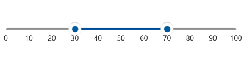
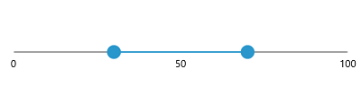
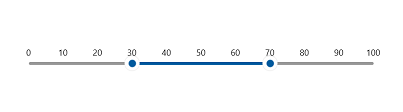
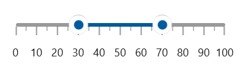
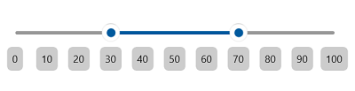
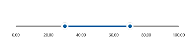

# Labels in the Range Slider

This section explains about how to add the labels in the range slider.

## Show Labels

The `ShowLabels` property is used to render the labels on `Interval`. The default value of `ShowLabels` property is false.





<slider:SfRangeSlider ShowLabels="True"
                      RangeStart="30"
                      RangeEnd="70" />





SfRangeSlider sfRangeSlider = new SfRangeSlider();
sfRangeSlider.ShowLabels = true;
sfRangeSlider.RangeStart = 30;
sfRangeSlider.RangeEnd = 70;
this.Content = sfRangeSlider;





## Maximum number of labels per 100 logical pixels

By default, a maximum of three labels are displayed for each 100 logical pixels in range slider. The maximum number of labels that should present within 100 logical pixels length can be customized using the `MaximumLabelsCount` property of the range slider. This property is applicable only for automatic range calculation and will not work if you set value for `Interval` property of a range slider.





<slider:SfRangeSlider RangeStart="30"
                      RangeEnd="70"
                      MaximumLabelsCount="1"
                      ShowLabels="True" />





SfRangeSlider sfRangeSlider = new SfRangeSlider();
sfRangeSlider.MaximumLabelsCount = 1;
sfRangeSlider.RangeStart = 30;
sfRangeSlider.RangeEnd = 70;
sfRangeSlider.ShowLabels = true;
this.Content = sfRangeSlider;





## Label Placement

The `labelPlacement` property is used to place the labels either before or after the track. The default value of the `LabelPlacement` property is `Placement.After`.





<slider:SfRangeSlider ShowLabels="True"
                      RangeStart="30"
                      RangeEnd="70"
                      LabelPlacement="Before" />





SfRangeSlider sfRangeSlider = new SfRangeSlider();
sfRangeSlider.ShowLabels = true;
sfRangeSlider.RangeStart = 30;
sfRangeSlider.RangeEnd = 70;
sfRangeSlider.LabelOffset = Placement.Before;
this.Content = sfRangeSlider;





## Label Offset

You can adjust the space between ticks and labels of the slider using the `LabelOffset` property. The default value of `LabelOffset` property is 5.





<slider:SfRangeSlider ShowTicks="True"
                      ShowLabels="True"
                      RangeStart="30"
                      RangeEnd="70"
                      LabelOffset="10" />





SfRangeSlider sfRangeSlider = new SfRangeSlider();
sfRangeSlider.ShowTicks = true;
sfRangeSlider.ShowLabels = true;
sfRangeSlider.LabelOffset = 10;
sfRangeSlider.RangeStart = 30;
sfRangeSlider.RangeEnd = 70;
this.Content = sfRangeSlider;





## Label Template

**Setting Template for Labels**

The `LabelTemplate` property allows you to define the data template for the label’s like the following code example.





<DataTemplate x:Key="TrackLabelTemplate">
    <Grid CornerRadius="5"
          Background="{ThemeResource SystemBaseLowColor}">
        <TextBlock Text="{Binding Text}"
                   Margin="6" />
    </Grid>
</DataTemplate>

<slider:SfRangeSlider ShowLabels="True"
                      LabelOffset="15"
                      LabelTemplate="{StaticResource TrackLabelTemplate}"
                      RangeStart="30"
                      RangeEnd="70" />





SfRangeSlider sfRangeSlider = new SfRangeSlider();
sfRangeSlider.ShowLabels = true;
sfRangeSlider.LabelOffset = 15;
sfRangeSlider.LabelTemplate = this.Resources["TrackLabelTemplate"] as DataTemplate;
sfRangeSlider.RangeStart = 30;
sfRangeSlider.RangeEnd = 70;
this.Content = sfRangeSlider;





N> Its DataContext is `SliderLabelInfo`.

**Setting active template for labels**

The `ActiveLabelTemplate` property allows you to define the data template for the active label’s like the following code example.





<DataTemplate x:Key="ActiveTrackLabelTemplate">
    <TextBlock Text="{Binding Text}"
               Foreground="{ThemeResource SystemAccentColor}" />
</DataTemplate>

<slider:SfRangeSlider ShowLabels="True"
                      LabelOffset="10"
                      ActiveLabelTemplate="{StaticResource ActiveTrackLabelTemplate}"
                      RangeStart="30"
                      RangeEnd="70" />





SfRangeSlider sfRangeSlider = new SfRangeSlider();
sfRangeSlider.ShowLabels = true;
sfRangeSlider.LabelOffset = 10;
sfRangeSlider.ActiveLabelTemplate = this.Resources["ActiveTrackLabelTemplate"] as DataTemplate;
sfRangeSlider.RangeStart = 30;
sfRangeSlider.RangeEnd = 70;
this.Content = sfRangeSlider;





N> Its DataContext is `SliderLabelInfo`.

**Formating Track Labels using Label Template**

By adding `Converters` in `LabelTemplate` you can customize the format the labels or display the custom text.





<DataTemplate x:Key="LabelTemplate">
    <TextBlock Text="{Binding Value,
                              Converter={StaticResource FormatStringConverter},
                              ConverterParameter='N2'}" />
</DataTemplate>

<slider:SfRangeSlider ShowLabels="True"
                      Interval="20"
                      LabelOffset="15"
                      LabelTemplate="{StaticResource LabelTemplate}"
                      RangeStart="30"
                      RangeEnd="70" />





SfRangeSlider sfRangeSlider = new SfRangeSlider();
sfRangeSlider.ShowLabels = true;
sfRangeSlider.Interval = 20;
sfRangeSlider.LabelOffset = 15;
sfRangeSlider.LabelTemplate = this.Resources["TLabelTemplate"] as DataTemplate;
sfRangeSlider.RangeStart = 30;
sfRangeSlider.RangeEnd = 70;
this.Content = sfRangeSlider;





N> Its DataContext is `SliderLabelInfo`.