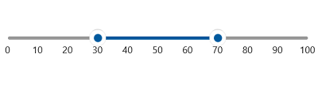
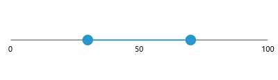
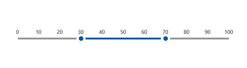
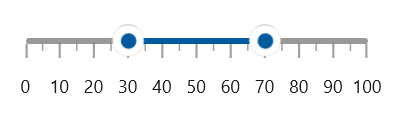
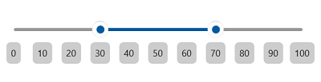
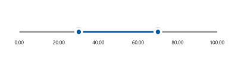

# Labels in WinUI RangeSlider

This section explains how to show labels in the range slider.

I> Refer to the [getting started](https://help.syncfusion.com/winui/rangeslider/getting-started) documentation for information on installing the NuGet package, adding namespace references, and adding the `SfRangeSlider` control to your application.

## Show Labels

The [`ShowLabels`](https://help.syncfusion.com/cr/winui/Syncfusion.UI.Xaml.Sliders.SliderBase.html#Syncfusion_UI_Xaml_Sliders_SliderBase_ShowLabels) property is used to render labels at the given [`Interval`](https://help.syncfusion.com/cr/winui/Syncfusion.UI.Xaml.Sliders.SliderBase.html#Syncfusion_UI_Xaml_Sliders_SliderBase_Interval). When the [`Interval`](https://help.syncfusion.com/cr/winui/Syncfusion.UI.Xaml.Sliders.SliderBase.html#Syncfusion_UI_Xaml_Sliders_SliderBase_Interval) property is not set, the interval is auto-calculated. The default value of the [`ShowLabels`](https://help.syncfusion.com/cr/winui/Syncfusion.UI.Xaml.Sliders.SliderBase.html#Syncfusion_UI_Xaml_Sliders_SliderBase_ShowLabels) property is false.





<slider:SfRangeSlider ShowLabels="True"
                      RangeStart="30"
                      RangeEnd="70" />





SfRangeSlider sfRangeSlider = new SfRangeSlider();
sfRangeSlider.ShowLabels = true;
sfRangeSlider.RangeStart = 30;
sfRangeSlider.RangeEnd = 70;
this.Content = sfRangeSlider;





## Maximum Number of Labels per 100 Logical Pixels

By default, a maximum of three labels are displayed for each 100 logical pixels in the range slider. The maximum number of labels that should be present within a 100-logical-pixel length can be customized using the [`MaximumLabelsCount`](https://help.syncfusion.com/cr/winui/Syncfusion.UI.Xaml.Sliders.SliderBase.html#Syncfusion_UI_Xaml_Sliders_SliderBase_MaximumLabelsCount) property of the range slider. This property is applicable only for automatic range calculation and will not work if you set a value for the [`Interval`](https://help.syncfusion.com/cr/winui/Syncfusion.UI.Xaml.Sliders.SliderBase.html#Syncfusion_UI_Xaml_Sliders_SliderBase_Interval) property of the RangeSlider.





<slider:SfRangeSlider RangeStart="30"
                      RangeEnd="70"
                      MaximumLabelsCount="1"
                      ShowLabels="True" />





SfRangeSlider sfRangeSlider = new SfRangeSlider();
sfRangeSlider.MaximumLabelsCount = 1;
sfRangeSlider.RangeStart = 30;
sfRangeSlider.RangeEnd = 70;
sfRangeSlider.ShowLabels = true;
this.Content = sfRangeSlider;





## Label Placement

The [`LabelPlacement`](https://help.syncfusion.com/cr/winui/Syncfusion.UI.Xaml.Sliders.SliderBase.html#Syncfusion_UI_Xaml_Sliders_SliderBase_LabelPlacement) property is used to place labels either before or after the track. The default value of the [`LabelPlacement`](https://help.syncfusion.com/cr/winui/Syncfusion.UI.Xaml.Sliders.SliderBase.html#Syncfusion_UI_Xaml_Sliders_SliderBase_LabelPlacement) property is [`Placement.After`](https://help.syncfusion.com/cr/winui/Syncfusion.UI.Xaml.Sliders.Placement.html#Syncfusion_UI_Xaml_Sliders_Placement_After). The available values are:

* [`Placement.Before`](https://help.syncfusion.com/cr/winui/Syncfusion.UI.Xaml.Sliders.Placement.html#Syncfusion_UI_Xaml_Sliders_Placement_Before) – Places the labels before the track.
* [`Placement.After`](https://help.syncfusion.com/cr/winui/Syncfusion.UI.Xaml.Sliders.Placement.html#Syncfusion_UI_Xaml_Sliders_Placement_After) – Places the labels after the track.





<slider:SfRangeSlider ShowLabels="True"
                      RangeStart="30"
                      RangeEnd="70"
                      LabelPlacement="Before" />





SfRangeSlider sfRangeSlider = new SfRangeSlider();
sfRangeSlider.ShowLabels = true;
sfRangeSlider.RangeStart = 30;
sfRangeSlider.RangeEnd = 70;
sfRangeSlider.LabelPlacement = Placement.Before;
this.Content = sfRangeSlider;





## Label Offset

You can adjust the space between the track (or ticks, when shown) and labels of the range slider using the [`LabelOffset`](https://help.syncfusion.com/cr/winui/Syncfusion.UI.Xaml.Sliders.SliderBase.html#Syncfusion_UI_Xaml_Sliders_SliderBase_LabelOffset) property. The default value of the [`LabelOffset`](https://help.syncfusion.com/cr/winui/Syncfusion.UI.Xaml.Sliders.SliderBase.html#Syncfusion_UI_Xaml_Sliders_SliderBase_LabelOffset) property is 5.





<slider:SfRangeSlider ShowTicks="True"
                      ShowLabels="True"
                      RangeStart="30"
                      RangeEnd="70"
                      LabelOffset="10" />





SfRangeSlider sfRangeSlider = new SfRangeSlider();
sfRangeSlider.ShowTicks = true;
sfRangeSlider.ShowLabels = true;
sfRangeSlider.LabelOffset = 10;
sfRangeSlider.RangeStart = 30;
sfRangeSlider.RangeEnd = 70;
this.Content = sfRangeSlider;





## Label Template

### Setting a Template for Labels

The [`LabelTemplate`](https://help.syncfusion.com/cr/winui/Syncfusion.UI.Xaml.Sliders.SliderBase.html#Syncfusion_UI_Xaml_Sliders_SliderBase_LabelTemplate) property allows you to define a data template for the labels, as shown in the following code sample.





<DataTemplate x:Key="TrackLabelTemplate">
    <Grid CornerRadius="5"
          Background="{ThemeResource SystemBaseLowColor}">
        <TextBlock Text="{Binding Text}"
                   Margin="6" />
    </Grid>
</DataTemplate>

<slider:SfRangeSlider ShowLabels="True"
                      LabelOffset="15"
                      LabelTemplate="{StaticResource TrackLabelTemplate}"
                      RangeStart="30"
                      RangeEnd="70" />





SfRangeSlider sfRangeSlider = new SfRangeSlider();
sfRangeSlider.ShowLabels = true;
sfRangeSlider.LabelOffset = 15;
sfRangeSlider.LabelTemplate = this.Resources["TrackLabelTemplate"] as DataTemplate;
sfRangeSlider.RangeStart = 30;
sfRangeSlider.RangeEnd = 70;
this.Content = sfRangeSlider;





N> The label template's DataContext is [`SliderLabelInfo`](https://help.syncfusion.com/cr/winui/Syncfusion.UI.Xaml.Sliders.SliderLabelInfo.html?tabs=tabid-1).

### Setting an Active Template for Labels

The [`ActiveLabelTemplate`](https://help.syncfusion.com/cr/winui/Syncfusion.UI.Xaml.Sliders.SliderBase.html#Syncfusion_UI_Xaml_Sliders_SliderBase_ActiveLabelTemplate) property allows you to define a data template for the active labels, as shown in the following code sample.





<DataTemplate x:Key="ActiveTrackLabelTemplate">
    <TextBlock Text="{Binding Text}"
               Foreground="{ThemeResource SystemAccentColor}" />
</DataTemplate>

<slider:SfRangeSlider ShowLabels="True"
                      LabelOffset="10"
                      ActiveLabelTemplate="{StaticResource ActiveTrackLabelTemplate}"
                      RangeStart="30"
                      RangeEnd="70" />





SfRangeSlider sfRangeSlider = new SfRangeSlider();
sfRangeSlider.ShowLabels = true;
sfRangeSlider.LabelOffset = 10;
sfRangeSlider.ActiveLabelTemplate = this.Resources["ActiveTrackLabelTemplate"] as DataTemplate;
sfRangeSlider.RangeStart = 30;
sfRangeSlider.RangeEnd = 70;
this.Content = sfRangeSlider;





N> The active label template's DataContext is [`SliderLabelInfo`](https://help.syncfusion.com/cr/winui/Syncfusion.UI.Xaml.Sliders.SliderLabelInfo.html?tabs=tabid-1).

### Formatting Track Labels Using a Label Template

By adding converters in the [`LabelTemplate`](https://help.syncfusion.com/cr/winui/Syncfusion.UI.Xaml.Sliders.SliderBase.html#Syncfusion_UI_Xaml_Sliders_SliderBase_LabelTemplate), you can customize the format of the track labels or display custom text.





<DataTemplate x:Key="LabelTemplate">
    <TextBlock Text="{Binding Value,
                              Converter={StaticResource FormatStringConverter},
                              ConverterParameter='N2'}" />
</DataTemplate>

<slider:SfRangeSlider ShowLabels="True"
                      Interval="20"
                      LabelOffset="15"
                      LabelTemplate="{StaticResource LabelTemplate}"
                      RangeStart="30"
                      RangeEnd="70" />





SfRangeSlider sfRangeSlider = new SfRangeSlider();
sfRangeSlider.ShowLabels = true;
sfRangeSlider.Interval = 20;
sfRangeSlider.LabelOffset = 15;
sfRangeSlider.LabelTemplate = this.Resources["LabelTemplate"] as DataTemplate;
sfRangeSlider.RangeStart = 30;
sfRangeSlider.RangeEnd = 70;
this.Content = sfRangeSlider;





N> The label template's DataContext is [`SliderLabelInfo`](https://help.syncfusion.com/cr/winui/Syncfusion.UI.Xaml.Sliders.SliderLabelInfo.html?tabs=tabid-1).
