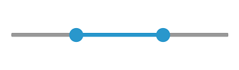
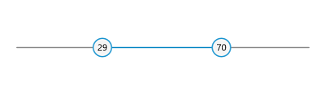

# Thumb and Thumb Overlay in WinUI RangeSlider (Range Slider)

This section explains how to customize the thumb and thumb overlay in the RangeSlider.

Thumb - It is one of the elements of RangeSlider, which is used to drag and change the selected values of the RangeSlider.
Thumb overlay - It is rendered around the thumb and it will be displayed, while interacting with thumb.

## Thumb Type

You can change the thumb type using the [`ThumbType`](https://help.syncfusion.com/cr/winui/Syncfusion.UI.Xaml.Sliders.SliderBase.html#Syncfusion_UI_Xaml_Sliders_SliderBase_ThumbType) property. The default value of [`ThumbType`](https://help.syncfusion.com/cr/winui/Syncfusion.UI.Xaml.Sliders.SliderBase.html#Syncfusion_UI_Xaml_Sliders_SliderBase_ThumbType) is [`ThumbType.Circle`](https://help.syncfusion.com/cr/winui/Syncfusion.UI.Xaml.Sliders.ThumbType.html#Syncfusion_UI_Xaml_Sliders_ThumbType_Circle).





<slider:SfRangeSlider RangeStart="30"
                      RangeEnd="70"
                      ThumbType="Oval" />





SfRangeSlider sfRangeSlider = new SfRangeSlider();
sfRangeSlider.RangeStart = 30;
sfRangeSlider.RangeEnd = 70;
sfRangeSlider.ThumbType = ThumbType.Oval;
this.Content = sfRangeSlider;





## Thumb Height and Width

You can change the thumb height and width of the range slider using the [`ThumbHeight`](https://help.syncfusion.com/cr/winui/Syncfusion.UI.Xaml.Sliders.SliderBase.html#Syncfusion_UI_Xaml_Sliders_SliderBase_ThumbHeight) and [`ThumbWidth`](https://help.syncfusion.com/cr/winui/Syncfusion.UI.Xaml.Sliders.SliderBase.html#Syncfusion_UI_Xaml_Sliders_SliderBase_ThumbWidth) properties respectively. The default values of both properties are 20.





<slider:SfRangeSlider RangeStart="30"
                      RangeEnd="70"
                      ThumbHeight="30"
                      ThumbWidth="30"
                      ActiveTrackHeight="8"
                      InactiveTrackHeight="8" />





SfRangeSlider sfRangeSlider = new SfRangeSlider();
sfRangeSlider.RangeStart = 30;
sfRangeSlider.RangeEnd = 70;
sfRangeSlider.ThumbHeight = 30;
sfRangeSlider.ThumbWidth = 30;
sfRangeSlider.ActiveTrackHeight = 8;
sfRangeSlider.InactiveTrackHeight = 8;
this.Content = sfRangeSlider;





## Thumb Background

You can change the thumb background of the range slider using the [`ThumbBackground`](https://help.syncfusion.com/cr/winui/Syncfusion.UI.Xaml.Sliders.SliderBase.html#Syncfusion_UI_Xaml_Sliders_SliderBase_ThumbBackground) property.





<slider:SfRangeSlider RangeStart="30"
                      RangeEnd="70"
                      ThumbBackground="#2A934D" />





SfRangeSlider sfRangeSlider = new SfRangeSlider();
sfRangeSlider.RangeStart = 30;
sfRangeSlider.RangeEnd = 70;
sfRangeSlider.ThumbBackground = new SolidColorBrush(ColorHelper.FromArgb(255, 42, 147, 77));;
this.Content = sfRangeSlider;





## Thumb Hover Background

You can change the thumb hover background of the range slider using the `SyncfusionSliderThumbBackgroundPointerOver` resource key.





<Page.Resources>
    <SolidColorBrush x:Key="SyncfusionSliderThumbBackgroundPointerOver">#009688</SolidColorBrush>
</Page.Resources>

<slider:SfRangeSlider RangeStart="30"
                      RangeEnd="70"
                      ThumbBackground="#33b35c" />





SfRangeSlider sfRangeSlider = new SfRangeSlider();
sfRangeSlider.RangeStart = 30;
sfRangeSlider.RangeEnd = 70;
sfRangeSlider.ThumbBackground = new SolidColorBrush(ColorHelper.FromArgb(255, 42, 147, 77));
this.Content = sfRangeSlider;





## Thumb Pressed Background

You can change the thumb pressed background of the range slider using the `SyncfusionSliderThumbBackgroundPressed` resource key.





<Page.Resources>
    <SolidColorBrush x:Key="SyncfusionSliderThumbBackgroundPointerOver">#009688</SolidColorBrush>
    <SolidColorBrush x:Key="SyncfusionSliderThumbBackgroundPressed">#288e49</SolidColorBrush>
</Page.Resources>

<slider:SfRangeSlider RangeStart="30"
                      RangeEnd="70"
                      ThumbBackground="#33b35c" />





SfRangeSlider sfRangeSlider = new SfRangeSlider();
sfRangeSlider.RangeStart = 30;
sfRangeSlider.RangeEnd = 70;
sfRangeSlider.ThumbBackground = new SolidColorBrush(ColorHelper.FromArgb(255, 42, 147, 77));
this.Content = sfRangeSlider;





## Thumb Style

The [`ThumbStyle`](https://help.syncfusion.com/cr/winui/Syncfusion.UI.Xaml.Sliders.SliderBase.html#Syncfusion_UI_Xaml_Sliders_SliderBase_ThumbStyle) property allows you to define the style for the thumb as shown in the following code example.





<coreconverters:FormatStringConverter x:Key="FormatStringConverter" />

    
<slider:SfRangeSlider RangeStart="30"
                      RangeEnd="70"
                      ShowToolTip="False"
                      ThumbHeight="30"
                      ThumbWidth="30"
                      ThumbStyle="{StaticResource thumbStyle}" />





SfRangeSlider sfSlider = new SfRangeSlider();
sfRangeSlider.RangeStart = 30;
sfRangeSlider.RangeEnd = 70;
sfRangeSlider.ShowToolTip = false;
sfRangeSlider.ThumbHeight = 30;
sfRangeSlider.ThumbHeight = 30;
sfRangeSlider.ThumbStyle = this.Resources["thumbStyle"] as Style;
this.Content = sfRangeSlider;





N> Its DataContext is current value of thumb.

## Thumb Overlay Radius

The [`ThumbOverlayRadius`](https://help.syncfusion.com/cr/winui/Syncfusion.UI.Xaml.Sliders.SliderBase.html#Syncfusion_UI_Xaml_Sliders_SliderBase_ThumbOverlayRadius) property allows you to define the radius for the overlay as shown in the following code example. The default value of [`ThumbOverlayRadius`](https://help.syncfusion.com/cr/winui/Syncfusion.UI.Xaml.Sliders.SliderBase.html#Syncfusion_UI_Xaml_Sliders_SliderBase_ThumbOverlayRadius) property is 10.





<slider:SfRangeSlider RangeStart="30"
                      RangeEnd="70"
                      ShowToolTip="False"
                      ThumbOverlayRadius="20" />





SfRangeSlider sfRangeSlider = new SfRangeSlider();
sfRangeSlider.RangeStart = 30;
sfRangeSlider.RangeEnd = 70;
sfRangeSlider.ShowToolTip = false;
sfRangeSlider.ThumbOverlayRadius = 20;
this.Content = sfRangeSlider;





## Thumb Overlay Fill

The [`ThumbOverlayFill`](https://help.syncfusion.com/cr/winui/Syncfusion.UI.Xaml.Sliders.SliderBase.html#Syncfusion_UI_Xaml_Sliders_SliderBase_ThumbOverlayFill) property allows you to define the fill color for the overlay as shown in the following code example.





<slider:SfRangeSlider RangeStart="30"
                      RangeEnd="70"
                      ThumbOverlayFill="Red" />





SfRangeSlider sfRangeSlider = new SfRangeSlider();
sfRangeSlider.RangeStart = 30;
sfRangeSlider.RangeEnd = 70;
sfRangeSlider.ThumbOverlayFill = new SolidColorBrush(Colors.Red);
this.Content = sfRangeSlider;





N> Overlay effects displayed with 0.3 opacity.

## Events

**ThumbDragStarted**

The [`ThumbDragStarted`](https://help.syncfusion.com/cr/winui/Syncfusion.UI.Xaml.Sliders.SliderBase.html#Syncfusion_UI_Xaml_Sliders_SliderBase_ThumbDragStarted) event raised when the thumb drag is started.





<slider:SfRangeSlider RangeStart="30"
                      RangeEnd="70"
                      ThumbDragStarted="SfRangeSlider_ThumbDragStarted" />





private void SfRangeSlider_ThumbDragStarted(object sender, DragStartedEventArgs e)
{
    //Perform action here.
}





**ThumbDragCompleted**

The [`ThumbDragCompleted`](https://help.syncfusion.com/cr/winui/Syncfusion.UI.Xaml.Sliders.SliderBase.html#Syncfusion_UI_Xaml_Sliders_SliderBase_ThumbDragCompleted) event raised when the thumb drag is completed.





<slider:SfRangeSlider RangeStart="30"
                      RangeEnd="70"
                      ThumbDragCompleted="SfRangeSlider_ThumbDragCompleted" />





private void SfRangeSlider_ThumbDragCompleted(object sender, DragCompletedEventArgs e)
{
    //Perform action here.
}




