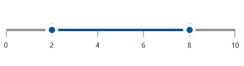
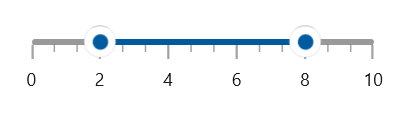
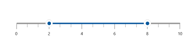
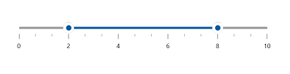
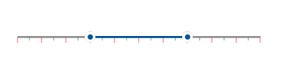

# Ticks Features in WinUI Range Slider

This section helps to learn about how to add major and minor ticks in the range slider.

## Show Major Ticks

You can enable the major ticks on the track. It is a shape which is used to represent the major interval points of the track. The default value of `ShowTicks` property is false.

For example, if `Minimum` is 0 and `Maximum` is 10 and `Interval` is 2, the range slider will render the major ticks at 0, 2, 4 and so on.





<slider:SfRangeSlider Minimum="0"
                      Maximum="10"
                      Interval="2"
                      RangeStart="2"
                      RangeEnd="8"
                      MinorTicksPerInterval="0"
                      ShowTicks="True"
                      ShowLabels="True" />





SfRangeSlider sfRangeSlider = new SfRangeSlider();
sfRangeSlider.Minimum = 0;
sfRangeSlider.Maximum = 10;
sfRangeSlider.Interval = 2;
sfRangeSlider.MinorTicksPerInterval = 0;
sfRangeSlider.RangeStart = 2;
sfRangeSlider.RangeEnd = 8;
sfRangeSlider.ShowTicks = true;
sfRangeSlider.ShowLabels = true;
this.Content = sfRangeSlider;





## Show Minor Ticks

It is used to represent the number of smaller ticks between two major ticks. For example, if min is 0 and max is 10 and interval is 2, the range slider will render the major ticks at 0, 2, 4 and so on. If `MinorTicksPerInterval` is 1, then smaller ticks will be rendered on 1, 3 and so on. The default value of `MinorTicksPerInterval` property is 1.





<slider:SfRangeSlider Minimum="0"
                      Maximum="10"
                      Interval="2"
                      RangeStart="2"
                      RangeEnd="8"
                      MinorTicksPerInterval="2"
                      ShowTicks="True"
                      ShowLabels="True" />





SfRangeSlider sfRangeSlider = new SfRangeSlider();
sfRangeSlider.Minimum = 0;
sfRangeSlider.Maximum = 10;
sfRangeSlider.Interval = 2;
sfRangeSlider.MinorTicksPerInterval = 2;
sfRangeSlider.RangeStart = 2;
sfRangeSlider.RangeEnd = 8;
sfRangeSlider.ShowTicks = true;
sfRangeSlider.ShowLabels = true;
this.Content = sfRangeSlider;





## Tick Length

You can change the major and minor ticks length of the range slider using the MajorTickLength and MinorTickLength properties respectively. The default value of MajorTickLength and MinorTickLength properties are 10 and 5 respectively.





<slider:SfRangeSlider Minimum="0"
                      Maximum="10"
                      Interval="2"
                      RangeStart="2"
                      RangeEnd="8"
                      MinorTicksPerInterval="2"
                      MajorTickLength="15"
                      MinorTickLength="10"
                      ShowTicks="True"
                      ShowLabels="True" />





SfRangeSlider sfRangeSlider = new SfRangeSlider();
sfRangeSlider.Minimum = 0;
sfRangeSlider.Maximum = 10;
sfRangeSlider.Interval = 2;
sfRangeSlider.RangeStart = 2;
sfRangeSlider.RangeEnd = 8;
sfRangeSlider.MinorTicksPerInterval = 2;
sfRangeSlider.MajorTickLength = 15;
sfRangeSlider.MinorTickLength = 10;
sfRangeSlider.ShowTicks = true;
sfRangeSlider.ShowLabels = true;
this.Content = sfRangeSlider;





## Tick Placement

The `TickPlacement` property is used to place the ticks either before or after the track. The default value of the `TickPlacement` property is `Placement.After`.





<slider:SfRangeSlider ShowTicks="True"
                      TickPlacement="Before"
                      RangeStart="30"
                      RangeEnd="70" />





SfRangeSlider sfRangeSlider = new SfRangeSlider();
sfRangeSlider.ShowTicks = true;
sfRangeSlider.TickPlacement = Placement.Before;
sfRangeSlider.RangeStart = 30;
sfRangeSlider.RangeEnd = 70;
this.Content = sfRangeSlider;





## Ticks Offset

You can adjust the space between track and ticks of the range slider using the `TickOffset` property. The default value of the `TickOffset` property is 0.





<slider:SfRangeSlider Minimum="0"
                      Maximum="10"
                      Interval="2"
                      RangeStart="2"
                      RangeEnd="8"
                      MinorTicksPerInterval="2"
                      TickOffset="10"
                      ShowTicks="True"
                      ShowLabels="True" />





SfRangeSlider sfRangeSlider = new SfRangeSlider();
sfRangeSlider.Minimum = 0;
sfRangeSlider.Maximum = 10;
sfRangeSlider.Interval = 2;
sfRangeSlider.RangeStart = 2;
sfRangeSlider.RangeEnd = 8;
sfRangeSlider.MinorTicksPerInterval = 2;
sfRangeSlider.TickOffset = 10;
sfRangeSlider.ShowTicks = true;
sfRangeSlider.ShowLabels = true;
this.Content = sfRangeSlider;





## Tick Style

**Setting Style for Major and Minor Ticks**

The `MajorTickStyle` and `MinorTickStyle` properties allows you to define the style for the major and minor tick’s respectively as shown in the following code example.





<slider:SfRangeSlider ShowTicks="True"
                      Interval="10"
                      RangeStart="30"
                      RangeEnd="70"
                      MajorTickStyle="{StaticResource MajorTickStyle}"
                      MinorTickStyle="{StaticResource MinorTickStyle}" />





SfRangeSlider sfRangeSlider = new SfRangeSlider();
sfRangeSlider.ShowTicks = true;
sfRangeSlider.Interval = 10;
sfRangeSlider.RangeStart = 30;
sfRangeSlider.RangeEnd = 70;
sfRangeSlider.MajorTickStyle = this.Resources["MajorTickStyle"] as Style;
sfRangeSlider.MinorTickStyle = this.Resources["MinorTickStyle"] as Style;
this.Content = sfRangeSlider;





**Setting Active Style for Major and Minor Ticks**

The `ActiveMajorTickStyle` and `ActiveMinorTickStyle` properties allows you to define the active style for the major and minor tick’s respectively as shown in the following code example.





<slider:SfRangeSlider ShowTicks="True"
                      Interval="5"
                      RangeStart="30"
                      RangeEnd="70"
                      ActiveMajorTickStyle="{StaticResource ActiveMajorTickStyle}"
                      ActiveMinorTickStyle="{StaticResource ActiveMinorTickStyle}" />





SfRangeSlider sfRangeSlider = new SfRangeSlider();
sfRangeSlider.ShowTicks = true;
sfRangeSlider.Interval = 5;
sfRangeSlider.RangeStart = 30;
sfRangeSlider.RangeEnd = 70;
sfRangeSlider.ActiveMajorTickStyle = this.Resources["ActiveMajorTickStyle"] as Style;
sfRangeSlider.ActiveMinorTickStyle = this.Resources["ActiveMinorTickStyle"] as Style;
this.Content = sfRangeSlider;





