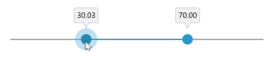
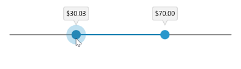
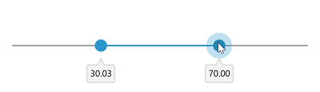
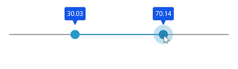
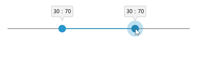

# ToolTip in WinUI RangeSlider (Range Slider)

This section explains how to add the tooltip in the RangeSlider.

## Show Tooltip

You can enable tooltip for the thumb using the [`ShowToolTip`](https://help.syncfusion.com/cr/winui/Syncfusion.UI.Xaml.Sliders.SliderBase.html#Syncfusion_UI_Xaml_Sliders_SliderBase_ShowToolTip) property of RangeSlider. It is used to indicate the current selection of the value during interaction. The default value of [`ShowToolTip`](https://help.syncfusion.com/cr/winui/Syncfusion.UI.Xaml.Sliders.SliderBase.html#Syncfusion_UI_Xaml_Sliders_SliderBase_ShowToolTip) property is true.





<slider:SfRangeSlider RangeStart="30"
                      RangeEnd="70"
                      ShowToolTip="True" />





SfRangeSlider sfRangeSlider = new SfRangeSlider();
sfRangeSlider.RangeStart = 30;
sfRangeSlider.RangeEnd = 70;
sfRangeSlider.ShowToolTip = true;
this.Content = sfRangeSlider;





## Tooltip Option

You can display tooltip for either active thumb or both thumb (RangeStart and RangeEnd) using the [`ToolTipOption`](https://help.syncfusion.com/cr/winui/Syncfusion.UI.Xaml.Sliders.SfRangeSlider.html#Syncfusion_UI_Xaml_Sliders_SfRangeSlider_ToolTipOption) property of the RangeSlider. The default value of the [`ToolTipOption`](https://help.syncfusion.com/cr/winui/Syncfusion.UI.Xaml.Sliders.SfRangeSlider.html#Syncfusion_UI_Xaml_Sliders_SfRangeSlider_ToolTipOption) property is [`ToolTipOption.BothThumb`](https://help.syncfusion.com/cr/winui/Syncfusion.UI.Xaml.Sliders.TooltipOption.html#Syncfusion_UI_Xaml_Sliders_TooltipOption_BothThumb).





<slider:SfRangeSlider RangeStart="30"
                      RangeEnd="70"
                      ToolTipOption="ActiveThumb" />





SfRangeSlider sfRangeSlider = new SfRangeSlider();
sfRangeSlider.RangeStart = 30;
sfRangeSlider.RangeEnd = 70;
sfRangeSlider.ToolTipOption = ToolTipOption.ActiveThumb;
this.Content = sfRangeSlider;





## Tooltip Text Format

The [`ToolTipFormat`](https://help.syncfusion.com/cr/winui/Syncfusion.UI.Xaml.Sliders.SliderBase.html#Syncfusion_UI_Xaml_Sliders_SliderBase_ToolTipFormat) property allows to customize the axis label with the globalized label format. The default value of [`ToolTipFormat`](https://help.syncfusion.com/cr/winui/Syncfusion.UI.Xaml.Sliders.SliderBase.html#Syncfusion_UI_Xaml_Sliders_SliderBase_ToolTipFormat) property is N2.





<slider:SfRangeSlider RangeStart="30"
                      RangeEnd="70"
                      ShowToolTip="True"
                      ToolTipFormat="c" />





SfRangeSlider sfRangeSlider = new SfRangeSlider();
sfRangeSlider.RangeStart = 30;
sfRangeSlider.RangeEnd = 70;
sfRangeSlider.ShowToolTip = true;
sfRangeSlider.ToolTipFormat = "c";
this.Content = sfRangeSlider;





## Tooltip Placement

The [`ToolTipPlacement`](https://help.syncfusion.com/cr/winui/Syncfusion.UI.Xaml.Sliders.SliderBase.html#Syncfusion_UI_Xaml_Sliders_SliderBase_ToolTipPlacement) property is used to place the tooltip either before or after the track. The default value of the [`ToolTipPlacement`](https://help.syncfusion.com/cr/winui/Syncfusion.UI.Xaml.Sliders.SliderBase.html#Syncfusion_UI_Xaml_Sliders_SliderBase_ToolTipPlacement) property is [`Placement.Before`](https://help.syncfusion.com/cr/winui/Syncfusion.UI.Xaml.Sliders.Placement.html#Syncfusion_UI_Xaml_Sliders_Placement_Before).





<slider:SfRangeSlider RangeStart="30"
                      RangeEnd="70"
                      ShowToolTip="True"
                      ToolTipPlacement="After" />





SfRangeSlider sfRangeSlider = new SfRangeSlider();
sfRangeSlider.RangeStart = 30;
sfRangeSlider.RangeEnd = 70;
sfRangeSlider.ShowToolTip = true;
sfRangeSlider.ToolTipPlacement = Placement.After;
this.Content = sfRangeSlider;





## Tooltip Style

The [`ToolTipStyle`](https://help.syncfusion.com/cr/winui/Syncfusion.UI.Xaml.Sliders.SliderBase.html#Syncfusion_UI_Xaml_Sliders_SliderBase_ToolTipStyle) property allows you to define the style for the range slider tooltip as shown in the following code example. The default value of [`ToolTipStyle`](https://help.syncfusion.com/cr/winui/Syncfusion.UI.Xaml.Sliders.SliderBase.html#Syncfusion_UI_Xaml_Sliders_SliderBase_ToolTipStyle) property is null.





<slider:SfRangeSlider RangeStart="30"
                      RangeEnd="70"
                      ShowToolTip="True"
                      ToolTipStyle="{StaticResource ToolTipStyle}" />





SfRangeSlider sfRangeSlider = new SfRangeSlider();
sfRangeSlider.RangeStart = 30;
sfRangeSlider.RangeEnd = 70;
sfRangeSlider.ShowToolTip = true;
sfRangeSlider.ToolTipStyle = this.Resources["ToolTipStyle"] as Style;
this.Content = sfRangeSlider;





## Tooltip Template

The [`ToolTipTemplate`](https://help.syncfusion.com/cr/winui/Syncfusion.UI.Xaml.Sliders.SliderBase.html#Syncfusion_UI_Xaml_Sliders_SliderBase_ToolTipTemplate) property allows you to define the data template for the range slider tooltip as shown in the following code example.





<DataTemplate x:Name="ToolTipTemplate">
    <StackPanel Orientation="Horizontal">
        <TextBlock Text="{Binding RangeStartValue}" />
        <TextBlock Text=":"
                   Margin="5,0,5,0" />
        <TextBlock Text="{Binding RangeEndValue}" />
    </StackPanel>
</DataTemplate>

<slider:SfRangeSlider RangeStart="30"
                      RangeEnd="70"
                      ShowToolTip="True"
                      ToolTipTemplate="{StaticResource ToolTipTemplate}" />





SfRangeSlider sfRangeSlider = new SfRangeSlider();
sfRangeSlider.RangeStart = 30;
sfRangeSlider.RangeEnd = 70;
sfRangeSlider.ShowToolTip = true;
sfRangeSlider.ToolTipTemplate = this.Resources["ToolTipTemplate"] as DataTemplate;
this.Content = sfRangeSlider;





N> Its DataContext is [`RangeSliderToolTipInfo`](https://help.syncfusion.com/cr/winui/Syncfusion.UI.Xaml.Sliders.RangeSliderToolTipInfo.html).
