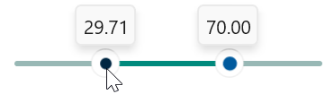

# Track Features in Syncfusion WinUI Range Slider

This section explains how to customize the track in the slider.

## Track Color

You can change the active and inactive track color of the range slider using the [`ActiveTrackFill`](https://help.syncfusion.com/cr/winui/Syncfusion.UI.Xaml.Sliders.SliderBase.html#Syncfusion_UI_Xaml_Sliders_SliderBase_ActiveTrackFill) and [`InactiveTrackFill`](https://help.syncfusion.com/cr/winui/Syncfusion.UI.Xaml.Sliders.SliderBase.html#Syncfusion_UI_Xaml_Sliders_SliderBase_InactiveTrackFill) properties respectively.

The active side of the range slider is between start and end thumbs.

The InactiveTrack of the RangeSlider visible between the [`Minimum`](https://help.syncfusion.com/cr/winui/Syncfusion.UI.Xaml.Sliders.SliderBase.html#Syncfusion_UI_Xaml_Sliders_SliderBase_Minimum) value and StartThumb, also between the EndThumb and [`Maximum`](https://help.syncfusion.com/cr/winui/Syncfusion.UI.Xaml.Sliders.SliderBase.html#Syncfusion_UI_Xaml_Sliders_SliderBase_Maximum) value.





<slider:SfRangeSlider RangeStart="30"
                      RangeEnd="70"
                      ActiveTrackFill="#009688"
                      InactiveTrackFill="#C2E6E3" />
      




SfRangeSlider sfRangeSlider = new SfRangeSlider();
sfRangeSlider.RangeStart = 30;
sfRangeSlider.RangeEnd = 70;
sfRangeSlider.ActiveTrackFill = new SolidColorBrush(ColorHelper.FromArgb(255, 0, 150, 136));
sfRangeSlider.InactiveTrackFill = new SolidColorBrush(ColorHelper.FromArgb(255, 194, 230, 227));
this.Content = sfRangeSlider;





## Track Hover Color

You can change the active and inactive track hover color of the range slider using the [`ActiveTrackHoverFill`](https://help.syncfusion.com/cr/winui/Syncfusion.UI.Xaml.Sliders.SliderBase.html#Syncfusion_UI_Xaml_Sliders_SliderBase_ActiveTrackHoverFill) and [`InactiveTrackHoverFill`](https://help.syncfusion.com/cr/winui/Syncfusion.UI.Xaml.Sliders.SliderBase.html#Syncfusion_UI_Xaml_Sliders_SliderBase_InactiveTrackHoverFill) properties respectively. This color will be applied when hovering the cursor on the RangeSlider control.





<slider:SfRangeSlider RangeStart="30"
                      RangeEnd="70"
                      ActiveTrackFill="#009688"
                      InactiveTrackFill="#C2E6E3"
                      ActiveTrackHoverFill="#009688"
                      InactiveTrackHoverFill="#C2E6E3" />





SfRangeSlider sfRangeSlider = new SfRangeSlider();
sfRangeSlider.RangeStart = 30;
sfRangeSlider.RangeEnd = 70;
sfRangeSlider.ActiveTrackFill = new SolidColorBrush(ColorHelper.FromArgb(255, 0, 150, 136));
sfRangeSlider.InactiveTrackFill = new SolidColorBrush(ColorHelper.FromArgb(255, 194, 230, 227));
sfRangeSlider.ActiveTrackHoverFill = new SolidColorBrush(ColorHelper.FromArgb(255, 41, 186, 173));
sfRangeSlider.InactiveTrackHoverFill = new SolidColorBrush(ColorHelper.FromArgb(255, 197, 222, 218));
this.Content = sfRangeSlider;





## Track Pressed Color

You can change the active and inactive track pressed color of the range slider using the [`ActiveTrackHoverFill`](https://help.syncfusion.com/cr/winui/Syncfusion.UI.Xaml.Sliders.SliderBase.html#Syncfusion_UI_Xaml_Sliders_SliderBase_ActiveTrackHoverFill) and [`InactiveTrackHoverFill`](https://help.syncfusion.com/cr/winui/Syncfusion.UI.Xaml.Sliders.SliderBase.html#Syncfusion_UI_Xaml_Sliders_SliderBase_InactiveTrackHoverFill) properties respectively. This color will be applied when pressed the cursor on the range slider control.





<slider:SfRangeSlider RangeStart="30"
                      RangeEnd="70"
                      ActiveTrackFill="#009688"
                      InactiveTrackFill="#C2E6E3"
                      ActiveTrackHoverFill="#009688"
                      InactiveTrackHoverFill="#C2E6E3"
                      ActiveTrackPressedFill="#018A7D"
                      InactiveTrackPressedFill="#98B8B5"  />





SfRangeSlider sfRangeSlider = new SfRangeSlider();
sfRangeSlider.RangeStart = 30;
sfRangeSlider.RangeEnd = 70;
sfRangeSlider.ActiveTrackFill = new SolidColorBrush(ColorHelper.FromArgb(255, 0, 150, 136));
sfRangeSlider.InactiveTrackFill = new SolidColorBrush(ColorHelper.FromArgb(255, 194, 230, 227));
sfRangeSlider.ActiveTrackHoverFill = new SolidColorBrush(ColorHelper.FromArgb(255, 41, 186, 173));
sfRangeSlider.InactiveTrackHoverFill = new SolidColorBrush(ColorHelper.FromArgb(255, 197, 222, 218));
sfRangeSlider.ActiveTrackPressedFill = new SolidColorBrush(ColorHelper.FromArgb(255, 1, 138, 125));
sfRangeSlider.InactiveTrackPressedFill = new SolidColorBrush(ColorHelper.FromArgb(255, 152, 184, 181));
this.Content = sfRangeSlider;





## Track Height

You can change the track height of the range slider using the [`ActiveTrackHeight`](https://help.syncfusion.com/cr/winui/Syncfusion.UI.Xaml.Sliders.SliderBase.html#Syncfusion_UI_Xaml_Sliders_SliderBase_ActiveTrackHeight) and [`InactiveTrackHeight`](https://help.syncfusion.com/cr/winui/Syncfusion.UI.Xaml.Sliders.SliderBase.html#Syncfusion_UI_Xaml_Sliders_SliderBase_InactiveTrackHeight) properties. The default value of the both properties are 2.





<slider:SfRangeSlider RangeStart="30"
                      RangeEnd="70"
                      ActiveTrackHeight="8"
                      InactiveTrackHeight="8"  />





SfRangeSlider sfRangeSlider = new SfRangeSlider();
sfRangeSlider.RangeStart = 30;
sfRangeSlider.RangeEnd = 70;
sfRangeSlider.ActiveTrackHeight = 8;
sfRangeSlider.InactiveTrackHeight = 8;
this.Content = sfRangeSlider;





## Track Style

You can change the track style of the range slider using the [`ActiveTrackStyle`](https://help.syncfusion.com/cr/winui/Syncfusion.UI.Xaml.Sliders.SliderBase.html#Syncfusion_UI_Xaml_Sliders_SliderBase_ActiveTrackStyle) and [`InactiveTrackStyle`](https://help.syncfusion.com/cr/winui/Syncfusion.UI.Xaml.Sliders.SliderBase.html#Syncfusion_UI_Xaml_Sliders_SliderBase_InactiveTrackStyle) properties. The default value of the both properties are null.





<Page.Resources>
    

    
</Page.Resources>
    
<slider:SfRangeSlider RangeStart="30"
                      RangeEnd="70"
                      ActiveTrackHeight="8"
                      InactiveTrackHeight="6"
                      ActiveTrackStyle="{StaticResource ActiveTrackStyle}"
                      InactiveTrackStyle="{StaticResource InactiveTrackStyle}" />





SfRangeSlider sfRangeSlider = new SfRangeSlider();
sfRangeSlider.RangeStart = 30;
sfRangeSlider.RangeEnd = 70;
sfRangeSlider.ActiveTrackHeight = 8;
sfRangeSlider.InactiveTrackHeight = 6;
sfRangeSlider.ActiveTrackStyle = this.Resources["ActiveTrackStyle"] as Style;
sfRangeSlider.InactiveTrackStyle = this.Resources["InactiveTrackStyle"] as Style;
this.Content = sfRangeSlider;





