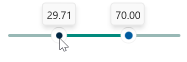

# Track in WinUI RangeSlider (Range Slider)

This section explains how to customize the track in the RangeSlider.

N> Refer to the [getting started](https://help.syncfusion.com/winui/rangeslider/getting-started) documentation for information on installing the NuGet package, adding namespace references, and adding the `SfRangeSlider` control to your application. The `ColorHelper` used in the C# examples is part of the `Syncfusion.UI.Xaml.Core` namespace.

## Track Color

You can change the active and inactive track colors of the range slider using the [`ActiveTrackFill`](https://help.syncfusion.com/cr/winui/Syncfusion.UI.Xaml.Sliders.SliderBase.html#Syncfusion_UI_Xaml_Sliders_SliderBase_ActiveTrackFill) and [`InactiveTrackFill`](https://help.syncfusion.com/cr/winui/Syncfusion.UI.Xaml.Sliders.SliderBase.html#Syncfusion_UI_Xaml_Sliders_SliderBase_InactiveTrackFill) properties respectively.

The active track is the region between the start and end thumbs. The inactive track is visible between the [`Minimum`](https://help.syncfusion.com/cr/winui/Syncfusion.UI.Xaml.Sliders.SliderBase.html#Syncfusion_UI_Xaml_Sliders_SliderBase_Minimum) value and the start thumb, and between the end thumb and the [`Maximum`](https://help.syncfusion.com/cr/winui/Syncfusion.UI.Xaml.Sliders.SliderBase.html#Syncfusion_UI_Xaml_Sliders_SliderBase_Maximum) value.





<slider:SfRangeSlider RangeStart="30"
                      RangeEnd="70"
                      ActiveTrackFill="#009688"
                      InactiveTrackFill="#C2E6E3" />





SfRangeSlider sfRangeSlider = new SfRangeSlider();
sfRangeSlider.RangeStart = 30;
sfRangeSlider.RangeEnd = 70;
sfRangeSlider.ActiveTrackFill = new SolidColorBrush(ColorHelper.FromArgb(255, 0, 150, 136));
sfRangeSlider.InactiveTrackFill = new SolidColorBrush(ColorHelper.FromArgb(255, 194, 230, 227));
this.Content = sfRangeSlider;





## Track Hover Color

You can change the active and inactive track hover colors of the range slider using the `SyncfusionSliderActiveTrackFillPointerOver` and `SyncfusionSliderInactiveTrackFillPointerOver` resource keys respectively. These colors are applied when the cursor hovers over the RangeSlider control.

N> The hover color resource keys can only be overridden in XAML resources. The C# example below shows the normal-state track colors for reference; the hover resource keys must be declared as XAML resources.





<Page.Resources>
    <SolidColorBrush x:Key="SyncfusionSliderActiveTrackFillPointerOver">#009688</SolidColorBrush>
    <SolidColorBrush x:Key="SyncfusionSliderInactiveTrackFillPointerOver">#C2E6E3</SolidColorBrush>
</Page.Resources>

<slider:SfRangeSlider RangeStart="30"
                      RangeEnd="70"
                      ActiveTrackFill="#006688"
                      InactiveTrackFill="#A2E6E3" />





SfRangeSlider sfRangeSlider = new SfRangeSlider();
sfRangeSlider.RangeStart = 30;
sfRangeSlider.RangeEnd = 70;
sfRangeSlider.ActiveTrackFill = new SolidColorBrush(ColorHelper.FromArgb(255, 0, 150, 136));
sfRangeSlider.InactiveTrackFill = new SolidColorBrush(ColorHelper.FromArgb(255, 194, 230, 227));
this.Content = sfRangeSlider;





## Track Pressed Color

You can change the active and inactive track pressed colors of the range slider using the `SyncfusionSliderActiveTrackFillPressed` and `SyncfusionSliderInactiveTrackFillPressed` resource keys respectively. These colors are applied when the cursor is pressed on the range slider control.

N> The pressed color resource keys can only be overridden in XAML resources. The C# example below shows the normal-state track colors for reference; the pressed resource keys must be declared as XAML resources.





<Page.Resources>
    <SolidColorBrush x:Key="SyncfusionSliderActiveTrackFillPointerOver">#009688</SolidColorBrush>
    <SolidColorBrush x:Key="SyncfusionSliderInactiveTrackFillPointerOver">#C2E6E3</SolidColorBrush>
    
    <SolidColorBrush x:Key="SyncfusionSliderActiveTrackFillPressed">#018A7D</SolidColorBrush>
    <SolidColorBrush x:Key="SyncfusionSliderInactiveTrackFillPressed">#98B8B5</SolidColorBrush>
</Page.Resources>

<slider:SfRangeSlider RangeStart="30"
                      RangeEnd="70"
                      ActiveTrackFill="#006688"
                      InactiveTrackFill="#A2E6E3"  />





SfRangeSlider sfRangeSlider = new SfRangeSlider();
sfRangeSlider.RangeStart = 30;
sfRangeSlider.RangeEnd = 70;
sfRangeSlider.ActiveTrackFill = new SolidColorBrush(ColorHelper.FromArgb(255, 0, 150, 136));
sfRangeSlider.InactiveTrackFill = new SolidColorBrush(ColorHelper.FromArgb(255, 194, 230, 227));
this.Content = sfRangeSlider;





## Track Height

You can change the track height of the range slider using the [`ActiveTrackHeight`](https://help.syncfusion.com/cr/winui/Syncfusion.UI.Xaml.Sliders.SliderBase.html#Syncfusion_UI_Xaml_Sliders_SliderBase_ActiveTrackHeight) and [`InactiveTrackHeight`](https://help.syncfusion.com/cr/winui/Syncfusion.UI.Xaml.Sliders.SliderBase.html#Syncfusion_UI_Xaml_Sliders_SliderBase_InactiveTrackHeight) properties. The values are measured in pixels. The default values of both properties are 2.





<slider:SfRangeSlider RangeStart="30"
                      RangeEnd="70"
                      ActiveTrackHeight="8"
                      InactiveTrackHeight="8"  />





SfRangeSlider sfRangeSlider = new SfRangeSlider();
sfRangeSlider.RangeStart = 30;
sfRangeSlider.RangeEnd = 70;
sfRangeSlider.ActiveTrackHeight = 8;
sfRangeSlider.InactiveTrackHeight = 8;
this.Content = sfRangeSlider;





## Track Style

You can change the track style of the range slider using the [`ActiveTrackStyle`](https://help.syncfusion.com/cr/winui/Syncfusion.UI.Xaml.Sliders.SliderBase.html#Syncfusion_UI_Xaml_Sliders_SliderBase_ActiveTrackStyle) and [`InactiveTrackStyle`](https://help.syncfusion.com/cr/winui/Syncfusion.UI.Xaml.Sliders.SliderBase.html#Syncfusion_UI_Xaml_Sliders_SliderBase_InactiveTrackStyle) properties. The default values of both properties are null.





<Page.Resources>
    

    
</Page.Resources>
    
<slider:SfRangeSlider RangeStart="30"
                      RangeEnd="70"
                      ActiveTrackHeight="8"
                      InactiveTrackHeight="6"
                      ActiveTrackStyle="{StaticResource ActiveTrackStyle}"
                      InactiveTrackStyle="{StaticResource InactiveTrackStyle}" />





SfRangeSlider sfRangeSlider = new SfRangeSlider();
sfRangeSlider.RangeStart = 30;
sfRangeSlider.RangeEnd = 70;
sfRangeSlider.ActiveTrackHeight = 8;
sfRangeSlider.InactiveTrackHeight = 6;
sfRangeSlider.ActiveTrackStyle = this.Resources["ActiveTrackStyle"] as Style;
sfRangeSlider.InactiveTrackStyle = this.Resources["InactiveTrackStyle"] as Style;
this.Content = sfRangeSlider;





