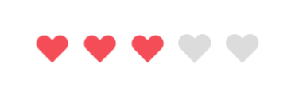
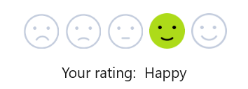

# Customization in WinUI Rating

This section explains the customization features available in the WinUI `Rating` control.

## Style

The Rating control style can be customized by using the [RatedItemStyle](https://help.syncfusion.com/cr/winui/Syncfusion.UI.Xaml.Editors.SfRating.html#Syncfusion_UI_Xaml_Editors_SfRating_RatedItemStyle) and [UnratedItemStyle](https://help.syncfusion.com/cr/winui/Syncfusion.UI.Xaml.Editors.SfRating.html#Syncfusion_UI_Xaml_Editors_SfRating_UnratedItemStyle) properties.




<ResourceDictionary>
 
 
</ResourceDictionary>

<syncfusion:SfRating Value="3"
      ItemsCount="5" RatedItemStyle={StaticResource ratedStyle}
      UnratedItemStyle={StaticResource unratedStyle}>
</syncfusion:SfRating>




//RatedItemStyle
Style style1 = new Style(typeof(Path));
Setter setter1 = new Setter();
setter1.Property = Path.FillProperty;
setter1.Value = new SolidColorBrush(Color.FromArgb(255, 255, 215, 0));
style1.Setters.Add(setter1);

Setter setter2 = new Setter();
setter2.Property = Path.StrokeProperty;
setter2.Value =new SolidColorBrush(Color.FromArgb(255, 255, 215, 0));
style1.Setters.Add(setter2);

Setter setter3 = new Setter();
setter3.Property = Path.StrokeThicknessProperty;
setter3.Value = 1;
style1.Setters.Add(setter3);

//UnratedItemStyle
Style style2 = new Style(typeof(Path));
Setter setter4 = new Setter();
setter4.Property = Path.FillProperty;
setter4.Value = new SolidColorBrush(Colors.LightGray);
style2.Setters.Add(setter4);

Setter setter5 = new Setter();
setter5.Property = Path.StrokeProperty;
setter5.Value = new SolidColorBrush(Colors.LightGray);
style2.Setters.Add(setter5);

Setter setter6 = new Setter();
setter6.Property = Path.StrokeThicknessProperty;
setter6.Value = 1;
style2.Setters.Add(setter6);

SfRating rating = new SfRating();
rating.Value = 3;
rating.ItemsCount = 5;
rating.RatedItemStyle = style1;
rating.UnratedItemStyle = style2;




## ItemSize 

The size of each rating item in the Rating control can be customized by using the [ItemSize](https://help.syncfusion.com/cr/winui/Syncfusion.UI.Xaml.Editors.SfRating.html#Syncfusion_UI_Xaml_Editors_SfRating_ItemSize) property.




<syncfusion:SfRating Value="3"
     ItemsCount="5" ItemSize="50">
</syncfusion:SfRating>




SfRating rating = new SfRating();
rating.Value = 3;
rating.ItemsCount = 5;
rating.ItemSize = 50;




## Orientation 

The Rating control provides support to display the rating items either horizontally or vertically by setting the `Orientation` property. The default value is horizontal.




<syncfusion:SfRating Value="3"
     ItemsCount="5" Orientation="Vertical">
</syncfusion:SfRating>




SfRating rating = new SfRating();
rating.Value = 3;
rating.ItemsCount = 5;
rating.Orientation = Orientation.Vertical;




## IsReadOnly

The Rating control provides support to restrict the user's selection and only allows viewing of the rating value by setting the [IsReadOnly](https://help.syncfusion.com/cr/winui/Syncfusion.UI.Xaml.Editors.SfRating.html#Syncfusion_UI_Xaml_Editors_SfRating_IsReadOnly) property value as true. The default value is `false`.




<syncfusion:SfRating Value="3"
     ItemsCount="5" IsReadOnly="True">
</syncfusion:SfRating>




SfRating rating = new SfRating();
rating.Value = 3;
rating.ItemsCount = 5;
rating.IsReadOnly = true;




## ItemTemplateSelector

The Rating control provides support to change the rating items such as images, paths, font icons, and other elements with the help of the [ItemTemplateSelector](https://help.syncfusion.com/cr/winui/Syncfusion.UI.Xaml.Editors.SfRating.html#Syncfusion_UI_Xaml_Editors_SfRating_ItemTemplateSelector) property.

### Path customization

Item template selector that uses paths to show rated and unrated items.




<ResourceDictionary>
  <ResourceDictionary.ThemeDictionaries>
    <ResourceDictionary x:Key="Light">
      <SolidColorBrush x:Key="FillColor" Color="#DCDCDC"/>
    </ResourceDictionary>
    <ResourceDictionary x:Key="Dark">
      <SolidColorBrush x:Key="FillColor" Color="#474747"/>
    </ResourceDictionary>
  </ResourceDictionary.ThemeDictionaries>
  <DataTemplate x:Key="selectedTemplate">
    <Viewbox>
      <Path Margin="4" Fill="#F44D57" Data="M16.2551 1.76462L16.2552 1.76479C16.6493 2.16617 16.9623 2.64325 17.1761 3.16901C17.3899 3.69479 17.5 4.25866 17.5 4.82833C17.5 5.39799 17.3899 5.96186 17.1761 6.48764C16.9623 7.0134 16.6493 7.49048 16.2552 7.89187L16.2551 7.89195L15.3424 8.82219L8.99977 15.2861L2.65718 8.82219L1.74439 7.89195C0.94868 7.08101 0.5 5.97917 0.5 4.82833C0.5 3.67748 0.94868 2.57564 1.74439 1.7647C2.53979 0.954092 3.61655 0.500469 4.73725 0.500469C5.85795 0.500469 6.9347 0.954092 7.7301 1.7647L8.64288 2.69495C8.73691 2.79077 8.86552 2.84476 8.99977 2.84476C9.13402 2.84476 9.26263 2.79077 9.35666 2.69495L10.2694 1.7647L10.2695 1.76462C10.6634 1.36307 11.1304 1.04504 11.6438 0.828245C12.1572 0.611455 12.7072 0.5 13.2623 0.5C13.8174 0.5 14.3674 0.611454 14.8807 0.828245C15.3941 1.04504 15.8612 1.36307 16.2551 1.76462Z"/>
    </Viewbox>
  </DataTemplate>
  <DataTemplate x:Key="unselectedTemplate">
    <Viewbox>
      <Path Margin="4" Fill="{ThemeResource FillColor}" Data="M16.612 1.41452C16.1722 0.966073 15.65 0.610337 15.0752 0.367629C14.5005 0.124922 13.8844 0 13.2623 0C12.6401 0 12.0241 0.124922 11.4493 0.367629C10.8746 0.610337 10.3524 0.966073 9.91255 1.41452L8.99977 2.34476L8.08699 1.41452C7.19858 0.509117 5.99364 0.0004693 4.73725 0.000469309C3.48085 0.000469319 2.27591 0.509117 1.38751 1.41452C0.499101 2.31992 9.36088e-09 3.5479 0 4.82833C-9.36088e-09 6.10875 0.499101 7.33674 1.38751 8.24214L2.30029 9.17238L8.99977 16L15.6992 9.17238L16.612 8.24214C17.0521 7.79391 17.4011 7.26171 17.6393 6.67596C17.8774 6.0902 18 5.46237 18 4.82833C18 4.19428 17.8774 3.56645 17.6393 2.9807C17.4011 2.39494 17.0521 1.86275 16.612 1.41452Z"/>
    </Viewbox>
  </DataTemplate>
  <local:PathDataTemplateSelector x:Key="pathTemplate"
      SelectedTemplate="{StaticResource selectedTemplate}"
      UnselectedTemplate="{StaticResource unselectedTemplate}"/>
</ResourceDictionary>

<syncfusion:SfRating Value="3" ItemsCount="5"
     ItemTemplateSelector="{StaticResource pathTemplate}">
</syncfusion:SfRating>




public class PathDataTemplateSelector : DataTemplateSelector
{
  public DataTemplate SelectedTemplate { get; set; }
  public DataTemplate UnselectedTemplate { get; set; }

   protected override DataTemplate SelectTemplateCore(object item, DependencyObject container)
  {
    SfRatingItem ratingItem = item as SfRatingItem;
    if (ratingItem == null)
        return null;
    if (ratingItem.IsSelected)
        return SelectedTemplate;
    return UnselectedTemplate;
  }
}




### Image customization

Item template selector that uses images to show rated and unrated items.




<ResourceDictionary>
  <DataTemplate x:Key="sadSelectedTemplate">
     <Grid Margin="3">
         <Image Source="/Assets/Rating/SadSelected.png"/>
     </Grid>
  </DataTemplate>
  <DataTemplate x:Key="sadUnselectedTemplate">
     <Grid Margin="3">     
         <Image Source="/Assets/Rating/SadUnselected.png"/>     
     </Grid>
  </DataTemplate>
  <DataTemplate x:Key="unhappySelectedTemplate">
     <Grid Margin="3">
         <Image Source="/Assets/Rating/UnhappySelected.png"/>
     </Grid>
  </DataTemplate>
  <DataTemplate x:Key="unhappyUnselectedTemplate">
     <Grid Margin="3">
         <Image Source="/Assets/Rating/UnhappyUnselected.png"/>
     </Grid>
  </DataTemplate>
  <DataTemplate x:Key="neutralSelectedTemplate">
     <Grid Margin="3">
         <Image Source="/Assets/Rating/NeutralSelected.png"/>
     </Grid>
  </DataTemplate>
  <DataTemplate x:Key="neutralUnselectedTemplate">
     <Grid Margin="3">
         <Image Source="/Assets/Rating/NeutralUnselected.png"/>
     </Grid>
  </DataTemplate>
  <DataTemplate x:Key="happySelectedTemplate">
     <Grid Margin="3">
         <Image Source="/Assets/Rating/HappySelected.png"/>
     </Grid>
  </DataTemplate>
  <DataTemplate x:Key="happyUnselectedTemplate">
     <Grid Margin="3">
         <Image Source="/Assets/Rating/HappyUnselected.png"/>
     </Grid>
  </DataTemplate>
  <DataTemplate x:Key="excitedSelectedTemplate">
     <Grid Margin="3">
         <Image Source="/Assets/Rating/ExcitedSelected.png"/>
     </Grid>
  </DataTemplate>
  <DataTemplate x:Key="excitedUnselectedTemplate">
     <Grid Margin="3">
         <Image Source="/Assets/Rating/ExcitedUnselected.png"/>
     </Grid>
  </DataTemplate>
  <local:ImageDataTemplateSelector x:Key="emojiTemplate"
         SadTemplate="{StaticResource sadSelectedTemplate}"                             
         SadUnselectedTemplate="{StaticResource sadUnselectedTemplate}"
         UnhappyTemplate="{StaticResource unhappySelectedTemplate}"
         UnhappyUnselectedTemplate="{StaticResource unhappyUnselectedTemplate}"
         NeutralTemplate="{StaticResource neutralSelectedTemplate}"
         NeutralUnselectedTemplate="{StaticResource neutralUnselectedTemplate}"
         HappyTemplate="{StaticResource happySelectedTemplate}"
         HappyUnselectedTemplate="{StaticResource happyUnselectedTemplate}"
         ExcitedTemplate="{StaticResource excitedSelectedTemplate}"
         ExcitedUnselectedTemplate="{StaticResource excitedUnselectedTemplate}"/>
</ResourceDictionary>
  
<syncfusion:SfRating Value="4" ItemsCount="5"
     ItemTemplateSelector="{StaticResource emojiTemplate}">
</syncfusion:SfRating>




public class ImageDataTemplateSelector : DataTemplateSelector
{
   public DataTemplate SadTemplate { get; set; }
   public DataTemplate ExcitedTemplate { get; set; }
   public DataTemplate HappyTemplate { get; set; }
   public DataTemplate NeutralTemplate { get; set; }
   public DataTemplate UnhappyTemplate { get; set; }
   public DataTemplate SadUnselectedTemplate { get; set; }
   public DataTemplate ExcitedUnselectedTemplate { get; set; }
   public DataTemplate HappyUnselectedTemplate { get; set; }
   public DataTemplate NeutralUnselectedTemplate { get; set; }
   public DataTemplate UnhappyUnselectedTemplate { get; set; }
        
   protected override DataTemplate SelectTemplateCore(object item, DependencyObject container)
  {
    SfRating rating = container as SfRating; 
    SfRatingItem ratingItem = item as SfRatingItem; 
    if(ratingItem == null)
       return null;
    if (rating.Items.IndexOf(ratingItem) + 1 == rating.Value)
    {
      if (rating.Items.IndexOf(ratingItem) == 0)
          return SadTemplate;
      if (rating.Items.IndexOf(ratingItem) == 1)
          return UnhappyTemplate;
      if (rating.Items.IndexOf(ratingItem) == 2)
          return NeutralTemplate;
      if (rating.Items.IndexOf(ratingItem) == 3)
          return HappyTemplate;
      if (rating.Items.IndexOf(ratingItem) == 4)
          return ExcitedTemplate;
    }
    else
    {
      if (rating.Items.IndexOf(ratingItem) == 0)
          return SadUnselectedTemplate;
      if (rating.Items.IndexOf(ratingItem) == 1)
          return UnhappyUnselectedTemplate;
      if (rating.Items.IndexOf(ratingItem) == 2)
          return NeutralUnselectedTemplate;
      if (rating.Items.IndexOf(ratingItem) == 3)
          return HappyUnselectedTemplate;
      if (rating.Items.IndexOf(ratingItem) == 4)
          return ExcitedUnselectedTemplate;
    }
    return null; 
  }
}




