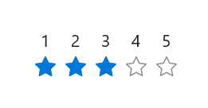

# Getting Started with WinUI Rating

This section explains the steps required to add the WinUI Rating control and covers only the basic features needed to get started with the Syncfusion `SfRating` control.

## Creating an application with WinUI Rating control

1. Create a [WinUI 3 desktop app for C#](https://learn.microsoft.com/en-us/windows/apps/winui/winui3/create-your-first-winui3-app).
2. Add the [Syncfusion.Editors.WinUI](https://www.nuget.org/packages/Syncfusion.Editors.WinUI) NuGet package.
3. Import the `Syncfusion.UI.Xaml.Editors` namespace in your XAML or C# code.
4. Initialize the [SfRating](https://help.syncfusion.com/cr/winui/Syncfusion.UI.Xaml.Editors.SfRating.html) control.

## Initialize Rating control using Items




<Window
    x:Class="GettingStarted.MainWindow"
    xmlns="http://schemas.microsoft.com/winfx/2006/xaml/presentation"
    xmlns:x="http://schemas.microsoft.com/winfx/2006/xaml"
    xmlns:local="using:GettingStarted"
    xmlns:d="http://schemas.microsoft.com/expression/blend/2008"
    xmlns:mc="http://schemas.openxmlformats.org/markup-compatibility/2006"
    xmlns:syncfusion="using:Syncfusion.UI.Xaml.Editors"
    mc:Ignorable="d">
    <Grid>
     <syncfusion:SfRating Value="3">
         <syncfusion:SfRating.Items>
            <syncfusion:SfRatingItem Content="1"/>
            <syncfusion:SfRatingItem Content="2"/>
            <syncfusion:SfRatingItem Content="3"/>
            <syncfusion:SfRatingItem Content="4"/>
            <syncfusion:SfRatingItem Content="5"/>
         </syncfusion:SfRating.Items>
     </syncfusion:SfRating>
    </Grid>
</Window>




using Syncfusion.UI.Xaml.Editors;

namespace GettingStarted
{
    public sealed partial class MainWindow : Window
    {
        public MainWindow()
        {
            this.InitializeComponent();
            SfRating rating = new SfRating();
            rating.Items.Add(new SfRatingItem() { Content = "1" });
            rating.Items.Add(new SfRatingItem() { Content = "2" });
            rating.Items.Add(new SfRatingItem() { Content = "3" });
            rating.Items.Add(new SfRatingItem() { Content = "4" });
            rating.Items.Add(new SfRatingItem() { Content = "5" });
            rating.Value = 3;
            this.Content = rating;
        }
    }
}
           



## Initialize Rating control using Items Count




<Window
    x:Class="GettingStarted.MainWindow"
    xmlns="http://schemas.microsoft.com/winfx/2006/xaml/presentation"
    xmlns:x="http://schemas.microsoft.com/winfx/2006/xaml"
    xmlns:local="using:GettingStarted"
    xmlns:d="http://schemas.microsoft.com/expression/blend/2008"
    xmlns:mc="http://schemas.openxmlformats.org/markup-compatibility/2006"
    xmlns:syncfusion="using:Syncfusion.UI.Xaml.Editors"
    mc:Ignorable="d">
    <Grid>
        <syncfusion:SfRating Value="3" ItemsCount="5">
        </syncfusion:SfRating>
    </Grid>
</Window>




namespace GettingStarted
{
    public sealed partial class MainWindow : Window
    {
        public MainWindow()
        {
            this.InitializeComponent();
            SfRating rating = new SfRating();
            rating.Value = 3;
            rating.ItemsCount = 5;
            this.Content = rating;
        }
    }
}




