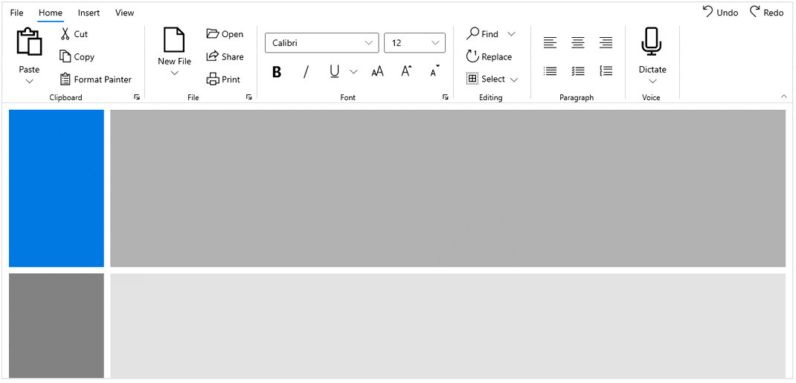
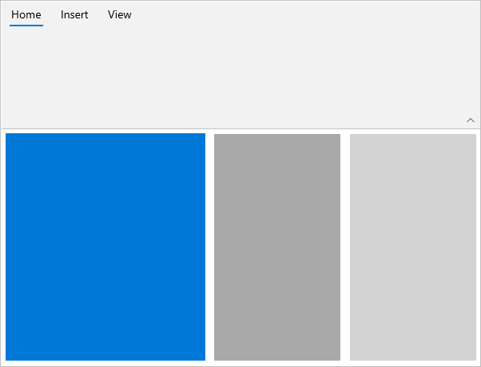
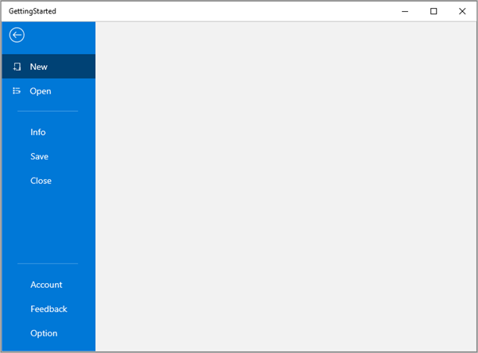
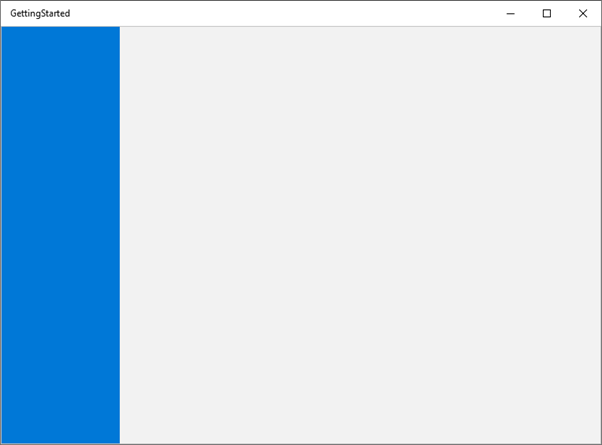
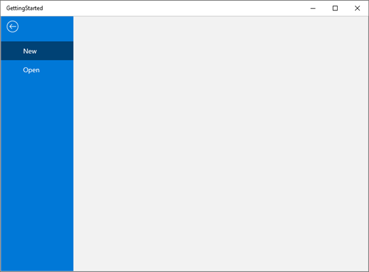
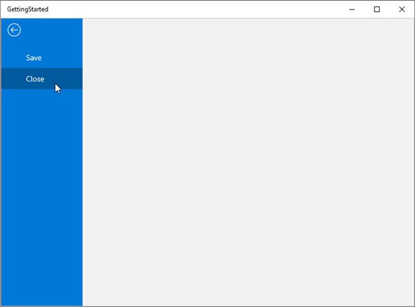
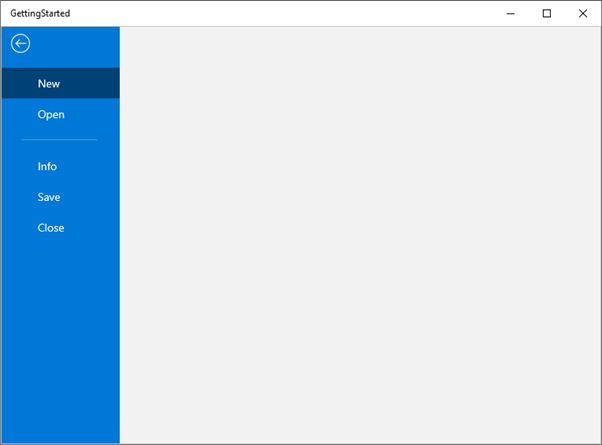
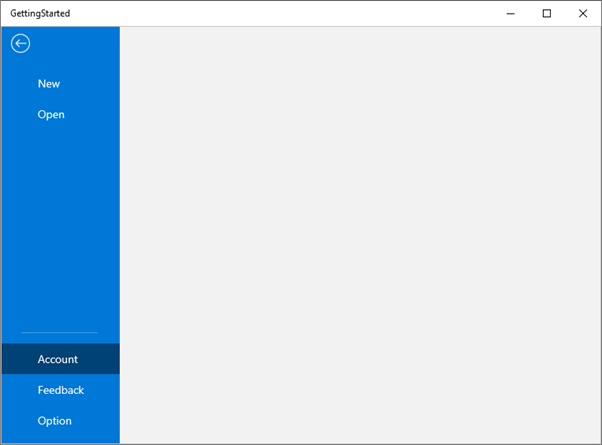
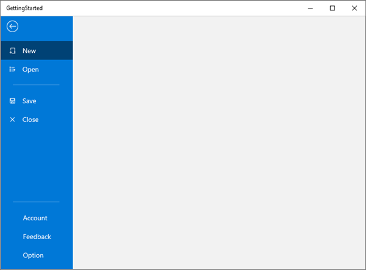

# Backstage in WinUI Ribbon (SfRibbon)

N> Refer to the [Getting Started](https://help.syncfusion.com/winui/ribbon/getting-started) documentation for information on installing the NuGet package, adding namespace references, and adding the `SfRibbon` control to your application.

The [RibbonBackstage](https://help.syncfusion.com/cr/winui/Syncfusion.UI.Xaml.Ribbon.RibbonBackstage.html) allows you to host controls to create a custom view based on the requirements of the application, and it can be added by using the `Backstage` property. Backstage appears as the first tab in the top left corner named File and opens a backstage view when the `File` menu button is clicked. The backstage view's open/close state can be controlled programmatically through the `IsBackstageOpen` property of the Ribbon.

If you want backstage to overlay a specific element (for example, the main content area), set the `Target` property of `RibbonBackstage` to that element. When `Target` is set, the backstage view is rendered over the targeted element; otherwise it overlays the Ribbon's host.



<ribbon:SfRibbon x:Name="ribbon" BackstageMenuButtonContent="File">
    <ribbon:SfRibbon.Tabs>
        <!-- Add ribbon tabs here... -->
    </ribbon:SfRibbon.Tabs>
    <ribbon:SfRibbon.Backstage>
        <ribbon:RibbonBackstage Target="{Binding ElementName=rootGrid}">
            <Grid>
                <Grid.RowDefinitions>
                    <RowDefinition Height="*" />
                    <RowDefinition Height="Auto" />
                </Grid.RowDefinitions>
                <Grid
                    Grid.Row="0"
                    Padding="0,0,0,1"
                    VerticalAlignment="Top"
                    BorderBrush="LightGray"
                    BorderThickness="0,0,0,1">
                    <Grid.RowDefinitions>
                        <RowDefinition Height="Auto" />
                        <RowDefinition Height="481" />
                    </Grid.RowDefinitions>
                    <Grid.ColumnDefinitions>
                        <ColumnDefinition />
                        <ColumnDefinition />
                    </Grid.ColumnDefinitions>
                    <TextBlock
                        Grid.Row="0"
                        Padding="15"
                        FontSize="24"
                        FontWeight="SemiBold"
                        Text="Settings" />
                    <StackPanel
                        Grid.Row="1"
                        Margin="15,15,15,0"
                        BorderBrush="LightGray"
                        BorderThickness="0,0,0,0">
                        <TextBlock
                            Padding="0,0,0,5"
                            FontSize="16"
                            Text="User Information" />
                        <TextBlock
                            Padding="0,5,0,5"
                            FontSize="14"
                            Text="Name : John" />
                        <HyperlinkButton Content="Change photo" />
                        <HyperlinkButton Content="Sign Out" />
                        <HyperlinkButton Content="Switch Account" />
                        <TextBlock Padding="0,5,0,5" Text="Theme Mode" />
                        <RadioButton Content="Light" />
                        <RadioButton Content="Dark" />
                        <RadioButton Content="Use system setting" />
                    </StackPanel>
                    <StackPanel
                        Grid.Row="1"
                        Grid.Column="1"
                        Padding="15,15,15,0"
                        BorderBrush="LightGray"
                        BorderThickness="1,0,0,0">
                        <TextBlock
                            Padding="0,0,0,5"
                            FontSize="16"
                            Text="Product Information" />
                        <HyperlinkButton Content="About product" />
                        <HyperlinkButton Content="Help" />
                        <HyperlinkButton Content="Updates" />
                    </StackPanel>
                </Grid>
                <StackPanel
                    Grid.Row="1"
                    Grid.ColumnSpan="2"
                    Padding="120,0,5,5"
                    HorizontalAlignment="Right"
                    BorderBrush="LightGray"
                    BorderThickness="0,0,0,0"
                    Orientation="Horizontal">
                    <Button
                        Margin="5"
                        Content="Options"
                        CornerRadius="0" />
                    <Button
                        Margin="5"
                        Content="Exit Backstage"
                        Click="Button_Click"
                        CornerRadius="0" />
                </StackPanel>
            </Grid>                           
        </ribbon:RibbonBackstage>
    </ribbon:SfRibbon.Backstage>                    
</ribbon:SfRibbon>


private void Button_Click(object sender, RoutedEventArgs e)
{
    this.ribbon.IsBackstageOpen = false;
}
 


## File menu (Backstage button) visibility

The Ribbon allows you to show or hide a Backstage menu button using the [ShowBackstageMenuButton](https://help.syncfusion.com/cr/winui/Syncfusion.UI.Xaml.Ribbon.SfRibbon.html#Syncfusion_UI_Xaml_Ribbon_SfRibbon_ShowBackstageMenuButton) property.



<ribbon:SfRibbon ShowBackstageMenuButton="False">
    <ribbon:SfRibbon.Tabs>
        <ribbon:RibbonTab Header="Home" />
        <ribbon:RibbonTab Header="Insert" />
        <ribbon:RibbonTab Header="View" />
    </ribbon:SfRibbon.Tabs>
    <ribbon:SfRibbon.Backstage>
        <ribbon:RibbonBackstage>
            <ribbon:BackstageView />
        </ribbon:RibbonBackstage>
    </ribbon:SfRibbon.Backstage>
</ribbon:SfRibbon> 
 


## File menu (Backstage button) text

The [BackstageMenuButtonContent](https://help.syncfusion.com/cr/winui/Syncfusion.UI.Xaml.Ribbon.SfRibbon.html#Syncfusion_UI_Xaml_Ribbon_SfRibbon_BackstageMenuButtonContent) property allows you to set the content of the Backstage menu button in the [Ribbon](https://help.syncfusion.com/cr/winui/Syncfusion.UI.Xaml.Ribbon.SfRibbon.html). The content of the property is specified as `File` by default.



<ribbon:SfRibbon BackstageMenuButtonContent="File">
    <ribbon:SfRibbon.Backstage>
        <ribbon:RibbonBackstage>
            <ribbon:BackstageView />
        </ribbon:RibbonBackstage>
    </ribbon:SfRibbon.Backstage>
</ribbon:SfRibbon>



## Backstage view

 The Ribbon provides the [BackstageView](https://help.syncfusion.com/cr/winui/Syncfusion.UI.Xaml.Ribbon.BackstageView.html) as a separate view, similar to Microsoft Outlook and Word applications, that can be hosted inside the Ribbon backstage. The backstage view contains tabs and buttons. Separators are placed between backstage view items to create groups, and they can be added using the `Items` property. The view can be placed at the top or bottom of the application via the `Placement` property of `BackstageView`.

### Supported BackstageView properties and events

The following members are commonly used when working with `BackstageView`:

| Member | Type | Description |
|---|---|---|
| `Items` | Property | Collection of items shown in the main backstage list. |
| `FooterItems` | Property | Collection of items rendered at the bottom (footer) of the backstage view. |
| `ShowBackButton` | Property | Gets or sets a value indicating whether the back button is shown. |
| `BackButtonClick` | Event | Raised when the back button is clicked. |



<ribbon:SfRibbon>
    <ribbon:SfRibbon.Tabs>
        <ribbon:RibbonTab Header="Home" />
        <ribbon:RibbonTab Header="Insert" />
        <ribbon:RibbonTab Header="View" />
        <ribbon:RibbonTab Header="Layout" />
    </ribbon:SfRibbon.Tabs>
    <ribbon:SfRibbon.Backstage>
        <ribbon:RibbonBackstage>
            <ribbon:BackstageView>
                <ribbon:BackstageView.Items>
                    <ribbon:BackstageViewTabItem Header="New" />
                    <ribbon:BackstageViewTabItem Header="Open" />
                    <ribbon:BackstageViewItemSeparator />
                    <ribbon:BackstageViewTabItem Header="Info" />
                    <ribbon:BackstageViewButtonItem Header="Save" />
                    <ribbon:BackstageViewButtonItem Header="Close" />
                </ribbon:BackstageView.Items>
            </ribbon:BackstageView>
        </ribbon:RibbonBackstage>
    </ribbon:SfRibbon.Backstage>
</ribbon:SfRibbon>
 


## Backstage view visibility

The Ribbon allows you to show or hide the backstage view using the `IsBackstageOpen` property. 

* Through property

 The visibility of the backstage view can be directly enabled or disabled by setting a value to the `IsBackstageOpen` property of the Ribbon.




<ribbon:SfRibbon x:Name="ribbon"
                 IsBackstageOpen="True">
    <ribbon:SfRibbon.Backstage>
        <ribbon:RibbonBackstage>
            <ribbon:BackstageView/>
        </ribbon:RibbonBackstage>
    </ribbon:SfRibbon.Backstage>
</ribbon:SfRibbon>



{{ codesnippet1 | OrderList_Indent_Level_1 }}

* Through back button click event

 The backstage view can be opened or closed dynamically using `BackButtonClick` event.




<ribbon:SfRibbon x:Name="ribbon">
    <ribbon:SfRibbon.Backstage>
        <ribbon:RibbonBackstage>
            <ribbon:BackstageView x:Name="backstageview"
                                  BackButtonClick="BackstageView_BackButtonClick">
            </ribbon:BackstageView>
        </ribbon:RibbonBackstage>
    </ribbon:SfRibbon.Backstage>
</ribbon:SfRibbon>
 

private void BackstageView_BackButtonClick(BackstageView sender, object args)
{
    this.ribbon.IsBackstageOpen = false;
}
 


{{ codesnippet2 | OrderList_Indent_Level_1 }}

* Through Back button command

The backstage view can be opened or closed dynamically using the `BackButtonCommand` property. The `BackButtonCommandParameter` value is passed to the command when the back button is clicked; in the example below, `"false"` indicates the backstage should close.




<ribbon:SfRibbon x:Name="ribbon">
    <ribbon:SfRibbon.Backstage>
        <ribbon:RibbonBackstage>
            <ribbon:BackstageView x:Name="backstageview"
                                  BackButtonCommand="{x:Bind ButtonCommand}"
                                  BackButtonCommandParameter="false" />
        </ribbon:RibbonBackstage>
    </ribbon:SfRibbon.Backstage>
</ribbon:SfRibbon>
 

public ICommand ButtonCommand { get; set; }
this.ButtonCommand = new DelegateCommand(ExecuteButtonCommand, CanExecuteCommand);

private bool CanExecuteCommand(object obj)
{
    return true;
}

private void ExecuteButtonCommand(object obj)
{
    this.ribbon.IsBackstageOpen = bool.Parse(obj.ToString());
}
 


{{ codesnippet3 | OrderList_Indent_Level_1 }}

## Back button visibility

The [BackstageView](https://help.syncfusion.com/cr/winui/Syncfusion.UI.Xaml.Ribbon.BackstageView.html) allows you to show or hide the back button using the `ShowBackButton` property. 



<ribbon:SfRibbon x:Name="ribbon">
    <ribbon:SfRibbon.Backstage>
        <ribbon:RibbonBackstage>
            <ribbon:BackstageView ShowBackButton="False" />
        </ribbon:RibbonBackstage>
    </ribbon:SfRibbon.Backstage>
</ribbon:SfRibbon>
 


## Backstage items

The backstage items such as [BackstageViewTabItem](https://help.syncfusion.com/cr/winui/Syncfusion.UI.Xaml.Ribbon.BackstageViewTabItem.html), [BackstageViewButtonItem](https://help.syncfusion.com/cr/winui/Syncfusion.UI.Xaml.Ribbon.BackstageViewButtonItem.html) and  [BackstageViewItemSeparator](https://help.syncfusion.com/cr/winui/Syncfusion.UI.Xaml.Ribbon.BackstageViewItemSeparator.html) can be added to the backstage view using the [Items](https://help.syncfusion.com/cr/winui/Syncfusion.UI.Xaml.Ribbon.BackstageView.html#Syncfusion_UI_Xaml_Ribbon_BackstageView_Items) or [FooterItems](https://help.syncfusion.com/cr/winui/Syncfusion.UI.Xaml.Ribbon.BackstageView.html#Syncfusion_UI_Xaml_Ribbon_BackstageView_FooterItems) property. See the following sections for details on each item type.

## Backstage tab item

The [BackstageViewTabItem](https://help.syncfusion.com/cr/winui/Syncfusion.UI.Xaml.Ribbon.BackstageViewTabItem.html) can be added to the backstage view and provides a separate view of the backstage when clicking the tab item. Use the `Header` property to provide a name to the tab. Define the content of the tab by adding child elements directly inside the `BackstageViewTabItem`.



<ribbon:SfRibbon>
    <ribbon:SfRibbon.Backstage>
        <ribbon:RibbonBackstage>
            <ribbon:BackstageView>
                <ribbon:BackstageView.Items>
                    <ribbon:BackstageViewTabItem Header="New" />                  
                    <ribbon:BackstageViewTabItem Header="Open" />                
                </ribbon:BackstageView.Items>
            </ribbon:BackstageView>
        </ribbon:RibbonBackstage>
    </ribbon:SfRibbon.Backstage>
</ribbon:SfRibbon>
 


## Backstage button item

The [BackstageViewButtonItem](https://help.syncfusion.com/cr/winui/Syncfusion.UI.Xaml.Ribbon.BackstageViewButtonItem.html) can be added to the backstage view, and it performs actions through the `Click` event. A `Command` (with `CommandParameter`) can be used instead of the `Click` event for MVVM scenarios. The display text for the button (such as "Save" and "Close") is set using the `Header` property.



<ribbon:SfRibbon x:Name="ribbon">
    <ribbon:SfRibbon.Backstage>
        <ribbon:RibbonBackstage>
            <ribbon:BackstageView>
                <ribbon:BackstageView.Items>
                    <ribbon:BackstageViewButtonItem Header="Save" />
                    <ribbon:BackstageViewButtonItem Header="Close"
                                                    Click="BackstageViewButtonItem_Click" />
                </ribbon:BackstageView.Items>
            </ribbon:BackstageView>
        </ribbon:RibbonBackstage>
    </ribbon:SfRibbon.Backstage>
</ribbon:SfRibbon>
 

private async void BackstageViewButtonItem_Click(object sender, RoutedEventArgs e)
{
    this.ribbon.IsBackstageOpen = false;
    ContentDialog contentDialog1 = new ContentDialog();
    contentDialog1.Title = "Backstage closed";
    contentDialog1.PrimaryButtonText = "Close";
    await contentDialog1.ShowAsync();
}



## Backstage separator item

The [BackstageViewItemSeparator](https://help.syncfusion.com/cr/winui/Syncfusion.UI.Xaml.Ribbon.BackstageViewItemSeparator.html) displays a line that is used to separate the backstage view items such as tabs and buttons. The separator can be added to the backstage view by the following code snippet.



<ribbon:SfRibbon x:Name="ribbon">
    <ribbon:SfRibbon.Backstage>
        <ribbon:RibbonBackstage>
            <ribbon:BackstageView>
                <ribbon:BackstageView.Items>
                    <ribbon:BackstageViewTabItem Header="New" />
                    <ribbon:BackstageViewTabItem Header="Open" />
                    <ribbon:BackstageViewItemSeparator />
                    <ribbon:BackstageViewTabItem Header="Info" />
                    <ribbon:BackstageViewButtonItem Header="Save" />
                    <ribbon:BackstageViewButtonItem Header="Close" />
                </ribbon:BackstageView.Items>
            </ribbon:BackstageView>
        </ribbon:RibbonBackstage>
    </ribbon:SfRibbon.Backstage>
</ribbon:SfRibbon>
 


## Footer items in backstage view

The [BackstageView](https://help.syncfusion.com/cr/winui/Syncfusion.UI.Xaml.Ribbon.BackstageView.html) allows you to add footer items using the `FooterItems` property, and the backstage items can be added to the footer of the backstage view by the following code snippet.



<ribbon:SfRibbon x:Name="ribbon">
    <ribbon:SfRibbon.Backstage>
        <ribbon:RibbonBackstage>
            <ribbon:BackstageView>
                <ribbon:BackstageView.Items>
                    <ribbon:BackstageViewTabItem Header="New" />
                    <ribbon:BackstageViewTabItem Header="Open" />
                </ribbon:BackstageView.Items>
                <ribbon:BackstageView.FooterItems>
                    <ribbon:BackstageViewItemSeparator />
                    <ribbon:BackstageViewTabItem Header="Account" />
                    <ribbon:BackstageViewTabItem Header="Feedback" />
                    <ribbon:BackstageViewButtonItem  Header="Option" />
                </ribbon:BackstageView.FooterItems>
            </ribbon:BackstageView>
        </ribbon:RibbonBackstage>
    </ribbon:SfRibbon.Backstage>
</ribbon:SfRibbon>
 


## Icons for backstage view items

BackstageView items such as [BackstageViewTabItem](https://help.syncfusion.com/cr/winui/Syncfusion.UI.Xaml.Ribbon.BackstageViewTabItem.html) and [BackstageViewButtonItem](https://help.syncfusion.com/cr/winui/Syncfusion.UI.Xaml.Ribbon.BackstageViewButtonItem.html) can display an icon as graphical content using the `Icon` property.



<ribbon:SfRibbon x:Name="ribbon">
    <ribbon:SfRibbon.Backstage>
        <ribbon:RibbonBackstage>
            <ribbon:BackstageView>
                <ribbon:BackstageView.Items>
                    <ribbon:BackstageViewTabItem Header="New"
                                                 Icon="NewFolder" />
                    <ribbon:BackstageViewTabItem Header="Open"
                                                 Icon="OpenWith" />
                    <ribbon:BackstageViewItemSeparator />
                    <ribbon:BackstageViewButtonItem Header="Save"
                                                    Icon="Save" />
                    <ribbon:BackstageViewButtonItem Header="Close"
                                                    Icon="Cancel" />
                </ribbon:BackstageView.Items>
                <ribbon:BackstageView.FooterItems>
                    <ribbon:BackstageViewItemSeparator />
                    <ribbon:BackstageViewTabItem Header="Account" />
                    <ribbon:BackstageViewTabItem Header="Feedback" />
                    <ribbon:BackstageViewButtonItem Header="Option" />
                </ribbon:BackstageView.FooterItems>
            </ribbon:BackstageView>
        </ribbon:RibbonBackstage>
    </ribbon:SfRibbon.Backstage>
</ribbon:SfRibbon>
 


N> Other icon element types, such as [BitmapIcon](https://docs.microsoft.com/en-us/windows/winui/api/microsoft.ui.xaml.controls.bitmapicon), [FontIcon](https://docs.microsoft.com/en-us/windows/winui/api/microsoft.ui.xaml.controls.fonticon), [PathIcon](https://docs.microsoft.com/en-us/windows/winui/api/microsoft.ui.xaml.controls.pathicon), and [SymbolIcon](https://docs.microsoft.com/en-us/windows/winui/api/microsoft.ui.xaml.controls.symbolicon), can also be assigned to the `Icon` property of the backstage view items.