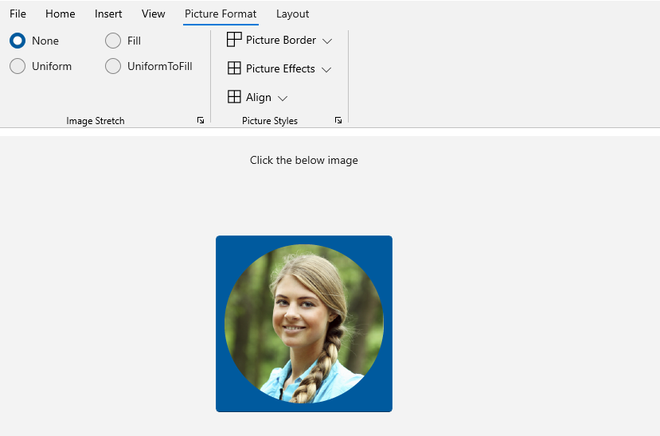
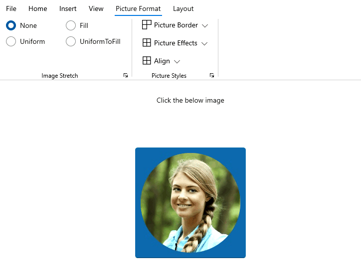
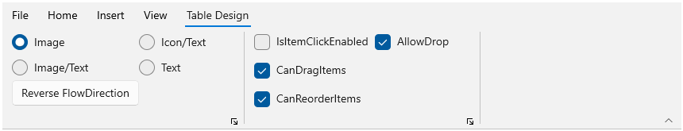
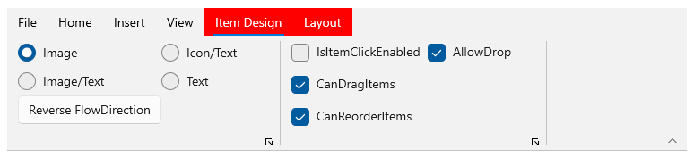

## Contextual Tab Groups

A contextual tab allows you to provide the user with UI controls within a certain context, for example, when some object in a document is selected. Contextual tabs with a similar context are organized in a contextual tab group so you can have more than one tab in a group. For instance, when the user selects an object in a document, one or more contextual tabs appear so that the user can work with that object by using controls in the contextual tabs. When the object is no more selected, the contextual tab group disappears.

## Creating Contextual Tab Group

The following code snippet shows how to add contextual tab groups and assign tabs to them through xaml. 





<ribbon:SfRibbon.ContextualTabGroups>
                            <ribbon:RibbonContextualTabGroup x:Name="ImageOptions"  Visibility="Collapsed" SelectFirstTabOnVisible="True" >
                                <ribbon:RibbonContextualTabGroup.Tabs>
                                    <ribbon:RibbonTab Header="Picture Format">
                                        <ribbon:RibbonGroup Header="Image Stretch">
                                            <ribbon:RibbonItemHost>
                                                <ribbon:RibbonItemHost.ItemTemplate>
                                                    <DataTemplate>
                                                        <Grid>
                                                            <Grid.RowDefinitions>
                                                                <RowDefinition Height="Auto"/>
                                                                <RowDefinition Height="Auto"/>
                                                                <RowDefinition Height="Auto"/>
                                                            </Grid.RowDefinitions>

                                                            <Grid.ColumnDefinitions>
                                                                <ColumnDefinition Width="Auto"/>
                                                                <ColumnDefinition Width="Auto"/>
                                                            </Grid.ColumnDefinitions>

                                                            <RadioButton x:Name="StretchNone" 
                                                                Grid.Row="0"
                                                                Grid.Column="0"
                                                                Content="None"
                                                                IsChecked="True"
                                                                GroupName="ImageStretch"/>
                                                            
                                                            <RadioButton x:Name="StretchFill"
                                                                Grid.Row="0"
                                                                Grid.Column="1"
                                                                Content="Fill" 
                                                                GroupName="ImageStretch"/>
                                                            
                                                            <RadioButton x:Name="StretchUniform" 
                                                                Grid.Row="1"
                                                                Grid.Column="0"
                                                                Content="Uniform" 
                                                                GroupName="ImageStretch"/>
                                                            
                                                            <RadioButton x:Name="StretchUniformToFill"
                                                                Grid.Row="1"
                                                                Grid.Column="1"
                                                                Content="UniformToFill"
                                                                GroupName="ImageStretch"/>
                                                        </Grid>
                                                    </DataTemplate>
                                                </ribbon:RibbonItemHost.ItemTemplate>
                                            </ribbon:RibbonItemHost>
                                        </ribbon:RibbonGroup>
                                        <ribbon:RibbonGroup Header="Picture Styles">
                                            <ribbon:RibbonDropDownButton Content="Picture Border">
                                                <ribbon:RibbonDropDownButton.Flyout>
                                                    <MenuFlyout Placement="Bottom">
                                                        <MenuFlyoutItem Text="No Outline" />
                                                        <MenuFlyoutItem Text="Weight" />
                                                        <MenuFlyoutItem Text="Dashes" />
                                                        <MenuFlyoutItem Text="Standard Colors" />
                                                    </MenuFlyout>
                                                </ribbon:RibbonDropDownButton.Flyout>
                                            </ribbon:RibbonDropDownButton>
                                            <ribbon:RibbonDropDownButton Content="Picture Effects" Icon="ViewAll">
                                                <ribbon:RibbonDropDownButton.Flyout >
                                                    <MenuFlyout Placement="Bottom"  >
                                                        <MenuFlyoutItem Text="Preset" />
                                                        <MenuFlyoutItem Text="Shadow" />
                                                        <MenuFlyoutItem Text="Reflection" />
                                                        <MenuFlyoutItem Text="Glow" />
                                                    </MenuFlyout>
                                                </ribbon:RibbonDropDownButton.Flyout>
                                            </ribbon:RibbonDropDownButton>
                                            <ribbon:RibbonDropDownButton Content="Align" Icon="ViewAll" >
                                                <ribbon:RibbonDropDownButton.Flyout>
                                                    <MenuFlyout>
                                                        <MenuFlyoutItem Text="Align Center" />
                                                        <MenuFlyoutItem Text="Align Left" />
                                                        <MenuFlyoutItem Text="Align Right" />
                                                        <MenuFlyoutItem Text="Align Top" />
                                                    </MenuFlyout>
                                                </ribbon:RibbonDropDownButton.Flyout>
                                            </ribbon:RibbonDropDownButton>
                                        </ribbon:RibbonGroup>
                                    </ribbon:RibbonTab>
                                    <ribbon:RibbonTab Header="Layout">
                                        <ribbon:RibbonGroup Header="Image" >
                                            <ribbon:RibbonItemHost>
                                                <ribbon:RibbonItemHost.ItemTemplate>
                                                    <DataTemplate>
                                                        <StackPanel Orientation="Vertical">
                                                            <ribbon:RibbonButton Content="ViewGridlines" >
                                                                <ribbon:RibbonButton.Icon>
                                                                    <SymbolIcon Symbol="List"/>
                                                                </ribbon:RibbonButton.Icon>
                                                            </ribbon:RibbonButton>
                                                            <ribbon:RibbonButton Content="Properties" >
                                                                <ribbon:RibbonButton.Icon>
                                                                    <SymbolIcon Symbol="OpenWith"/>
                                                                </ribbon:RibbonButton.Icon>
                                                            </ribbon:RibbonButton>
                                                            <ribbon:RibbonButton Content="Select" >
                                                                <ribbon:RibbonButton.Icon>
                                                                    <SymbolIcon Symbol="SelectAll"/>
                                                                </ribbon:RibbonButton.Icon>
                                                            </ribbon:RibbonButton>
                                                        </StackPanel>
                                                    </DataTemplate>
                                                </ribbon:RibbonItemHost.ItemTemplate>
                                            </ribbon:RibbonItemHost>
                                        </ribbon:RibbonGroup>
                                        <ribbon:RibbonGroup Header="Draw">
                                            <ribbon:RibbonItemHost>
                                                <ribbon:RibbonItemHost.ItemTemplate>
                                                    <DataTemplate>
                                                        <StackPanel Orientation="Vertical">
                                                            <ribbon:RibbonButton Content="Draw table" >
                                                                <ribbon:RibbonButton.Icon>
                                                                    <SymbolIcon Symbol="PreviewLink"/>
                                                                </ribbon:RibbonButton.Icon>
                                                            </ribbon:RibbonButton>
                                                            <ribbon:RibbonButton Content="Eraser" >
                                                                <ribbon:RibbonButton.Icon>
                                                                    <SymbolIcon Symbol="ClearSelection"/>
                                                                </ribbon:RibbonButton.Icon>
                                                            </ribbon:RibbonButton>
                                                        </StackPanel>
                                                    </DataTemplate>
                                                </ribbon:RibbonItemHost.ItemTemplate>
                                            </ribbon:RibbonItemHost>
                                        </ribbon:RibbonGroup>
                                    </ribbon:RibbonTab>
</ribbon:RibbonContextualTabGroup.Tabs>
</ribbon:RibbonContextualTabGroup>





## Change visibility of Contextual Tab Groups

To change the visibility of Contextual Tab Groups, Use `Visibility` property in RibbonContextualTabGroup. This RibbonContextualTabGroup will be visible when an object in the application workspace selected. When we lost the focus from that objects, Visibility will be collapsed automatically.





<ribbon:SfRibbon.ContextualTabGroups>
            <ribbon:RibbonContextualTabGroup 
                    Visibility="Visible">
                    <ribbon:RibbonTab Header="Picture Format"/>
                    <ribbon:RibbonTab Header="Layout"/>
            </ribbon:RibbonContextualTabGroup>
</ribbon:SfRibbon.ContextualTabGroups>









private void ImageOptions_Click(object sender, RoutedEventArgs e)
{
    ImageOptions.Visibility = Visibility.Collapsed;
}





## Select First Tab On Visible

When we set the `SelectFirstTabOnVisible` as true, The corresponding tab group will be selected when that group get visible.

By default, when a contextual tab group is activated, the last tab element inside will be selected. To disable this behavior you can set the SelectFirstTabOnVisible property of the RibbonContextualTabGroup to false.




<ribbon:SfRibbon.ContextualTabGroups>
            <ribbon:RibbonContextualTabGroup 
                    Visibility="Visible" 
                    SelectFirstTabOnVisible="false" >
                    <ribbon:RibbonTab Header="Picture Format"/>
                    <ribbon:RibbonTab Header="Layout"/>
            </ribbon:RibbonContextualTabGroup>
            <ribbon:RibbonContextualTabGroup 
                    Visibility="Visible" 
                    SelectFirstTabOnVisible="True">
                    <ribbon:RibbonTab Header="Table Design" />
            </ribbon:RibbonContextualTabGroup>
</ribbon:SfRibbon.ContextualTabGroups>




## Appearance of contextual tab group

We could use the `Background` or `Foreground` Properties in RibbonContextualTabGroup To improve the better Appearance for the Contextual Tab Group.





<ribbon:SfRibbon.ContextualTabGroups>
            <ribbon:RibbonContextualTabGroup 
                    Visibility="Visible" 
                    Foreground="White" Background="Red" >
                    <ribbon:RibbonTab  Header="Item Design"/>
                    <ribbon:RibbonTab Header="Layout"/>
            </ribbon:RibbonContextualTabGroup>
</ribbon:SfRibbon.ContextualTabGroups>





