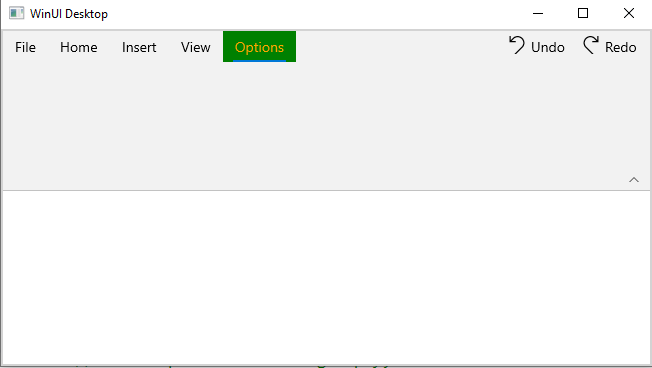
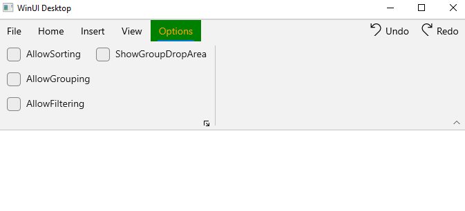
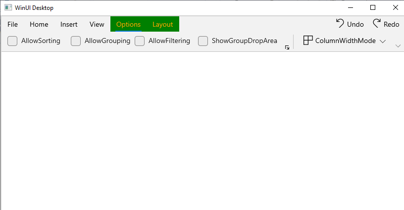
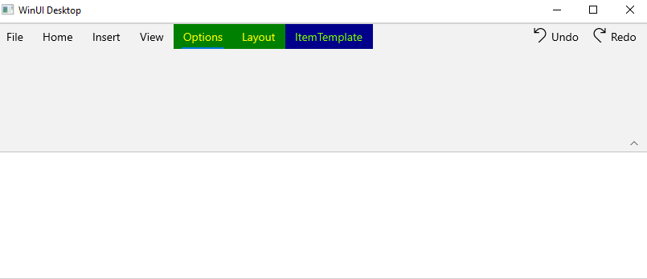
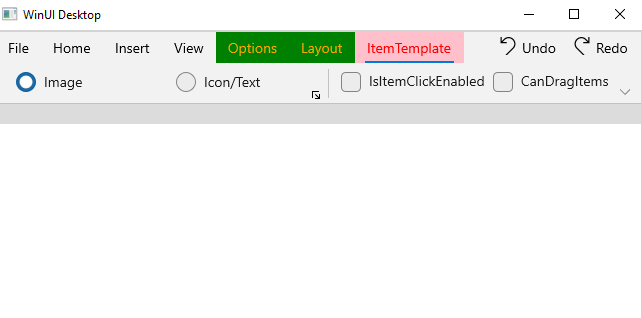
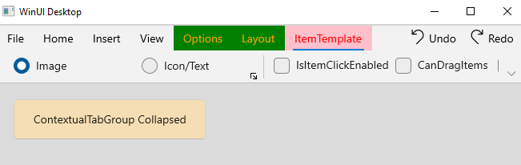
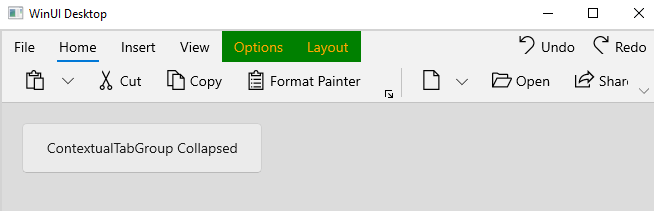
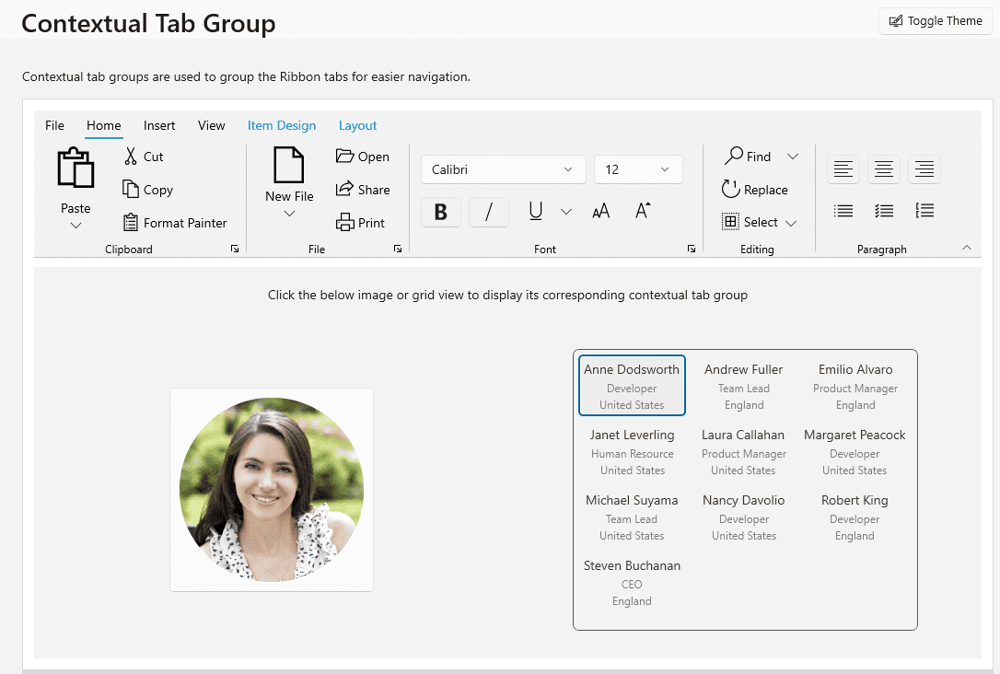

# Ribbon tab in WinUI Ribbon

The below section describes more information about [Ribbon](https://help.syncfusion.com/cr/winui/Syncfusion.UI.Xaml.Ribbon.SfRibbon.html) and its features.

## Ribbon tab selection

The `SelectedTab` property returns the value of the currently selected [RibbonTab](https://help.syncfusion.com/cr/winui/Syncfusion.UI.Xaml.Ribbon.RibbonTab.html) and the `SelectedIndex` property returns the index of the `SelectedTab` in Ribbon.




// Setting of Selected Index
<ribbon:SfRibbon SelectedIndex="2">
    <ribbon:SfRibbon.Tabs>
        <ribbon:RibbonTab Header="Home"/>
        <ribbon:RibbonTab Header="Insert" />
        <ribbon:RibbonTab Header="View" />
        <ribbon:RibbonTab Header="Layout" />
    </ribbon:SfRibbon.Tabs>
</ribbon:SfRibbon>

// Selected Tab Binding
<ribbon:SfRibbon x:Name="ribbon"
                         SelectedTab="{Binding ElementName=view}">
    <ribbon:SfRibbon.Tabs>
        <ribbon:RibbonTab Header="Home" />
            <ribbon:RibbonTab Header="Insert" />
            <ribbon:RibbonTab x:Name="view" Header="View" />
        <ribbon:RibbonTab Header="Layout" />
    </ribbon:SfRibbon.Tabs>
</ribbon:SfRibbon>
 


N> The selected index value should not exceed the child count of the `Tabs` collection in the [Ribbon](https://help.syncfusion.com/cr/winui/Syncfusion.UI.Xaml.Ribbon.SfRibbon.html).

## Grouping RibbonTabs using ContextualTabGroups

ContextualTabGroups are used to group the RibbonTabs for easy Navigation. This ContextualTabGroups appear when a user enable their context. 

## Creating ContextualTabGroups 

This ContextTabGroup can also be kept hidden and shown while required cases like in Word Document’s TABLETOOLS ContextTabGroups which gets displayed automatically, while selecting the table.  The following code snippet used to create a ContextualTabGroups


 


<ribbon:SfRibbon.ContextualTabGroups>
                <ribbon:RibbonContextualTabGroup x:Name="TableTools"
                    Foreground="Orange" Background="Green"
                    Visibility="Visible"  >
                    <ribbon:RibbonTab Header="Options" x:Name="TableTab"/>
                </ribbon:RibbonContextualTabGroup>
</ribbon:SfRibbon.ContextualTabGroups>





## Add Items to RibbonGroup using RibbonItemHost

This `RibbonItemHost` used Add the multiple items under the RibbonContextTabGroup with the RibbonGroup.




<Grid x:Name="rootGrid"
          BorderBrush="LightGray"
          BorderThickness="2">
        <Grid.DataContext>
            <local:ViewModel />
        </Grid.DataContext>
        <ribbon:SfRibbon x:Name="ribbon"
            LayoutModeOptions="Simplified"
            AllowMinimize="False"
            BackstageMenuButtonContent="File">
            <ribbon:SfRibbon.Tabs>
<ribbon:SfRibbon.ContextualTabGroups>
                <ribbon:RibbonContextualTabGroup x:Name="TableTools"
                    Foreground="Orange" Background="Green"
                    Visibility="Visible">
                    <ribbon:RibbonTab Header="Options" x:Name="TableTab">
                        <ribbon:RibbonGroup>
                            <ribbon:RibbonItemHost>
                                <ribbon:RibbonItemHost.ItemTemplate>
                                    <DataTemplate>
                                        <CheckBox x:Name="allowSort"
                                            Command="{Binding ButtonCommand}"
                                            CommandParameter="allowSort"
                                            Content="AllowSorting"
                                            IsChecked="{Binding AllowSorting, Mode=TwoWay}"/>
                                    </DataTemplate>
                                </ribbon:RibbonItemHost.ItemTemplate>
                            </ribbon:RibbonItemHost>
                            <ribbon:RibbonItemHost>
                                <ribbon:RibbonItemHost.ItemTemplate>
                                    <DataTemplate>
                                        <CheckBox x:Name="allowGroup"
                                            Content="AllowGrouping"
                                            IsChecked="{Binding AllowGrouping  ,Mode=TwoWay}"/>
                                    </DataTemplate>
                                </ribbon:RibbonItemHost.ItemTemplate>
                            </ribbon:RibbonItemHost>
                            <ribbon:RibbonItemHost>
                                <ribbon:RibbonItemHost.ItemTemplate>
                                    <DataTemplate>
                                        <CheckBox x:Name="allowFilter"
                                            Content="AllowFiltering"
                                            IsChecked="{Binding AllowFiltering ,Mode=TwoWay}"/>
                                    </DataTemplate>
                                </ribbon:RibbonItemHost.ItemTemplate>
                            </ribbon:RibbonItemHost>
                            <ribbon:RibbonItemHost>
                                <ribbon:RibbonItemHost.ItemTemplate>
                                    <DataTemplate>
                                        <CheckBox x:Name="showGroupDropArea"
                                            Content="ShowGroupDropArea"
                                            IsChecked="{Binding ShowGroupDropArea,Mode=TwoWay}"/>
                                    </DataTemplate>
                                </ribbon:RibbonItemHost.ItemTemplate>
                            </ribbon:RibbonItemHost>
                        </ribbon:RibbonGroup>
                        </ribbon:RibbonTab>
                </ribbon:RibbonContextualTabGroup>
</ribbon:SfRibbon.ContextualTabGroups>
</ribbon:SfRibbon.Tabs>
</ribbon:SfRibbon>
</Grid>





public class ViewModel : NotificationObject
    {
        public ICommand ButtonCommand { get; set; }

        public ViewModel()
        {
            this.ButtonCommand = new DelegateCommand(ExecuteButtonCommand, CanExecuteCommand);
        }

        private bool allowFiltering;

        public bool AllowFiltering
        {
            get { return allowFiltering; }
            set
            {
                allowFiltering = value;
                this.RaisePropertyChanged(nameof(AllowFiltering));
            }
        }
        private bool allowSorting = true;

        public bool AllowSorting
        {
            get
            {
                return allowSorting;
            }
            set
            {
                allowSorting = value;
                this.RaisePropertyChanged(nameof(AllowSorting));
            }
        }

        private bool showGroupDropArea;

        public bool ShowGroupDropArea
        {
            get { return showGroupDropArea; }
            set
            {
                showGroupDropArea = value;
                this.RaisePropertyChanged(nameof(ShowGroupDropArea));
            }
        }
    }




## ContextualTabGroups with Simplified Mode

When the simplified layout is enabled, the ContextTabGroup can be added and its items will be displayed in a single line as shown below. We could enable the simplified layout by setting `ActiveLayoutMode` and `LayoutModeOptions` as Simplified.





<Grid x:Name="rootGrid"
          BorderBrush="LightGray"
          BorderThickness="2">
        <Grid.DataContext>
            <local:ViewModel />
        </Grid.DataContext>
        <ribbon:SfRibbon x:Name="ribbon"
            LayoutModeOptions="Simplified"
            AllowMinimize="False"
            ActiveLayoutMode="Simplified"
            BackstageMenuButtonContent="File">
            <ribbon:SfRibbon.Tabs>
<ribbon:SfRibbon.ContextualTabGroups>
                <ribbon:RibbonContextualTabGroup x:Name="TableTools"
                    Foreground="Orange" Background="Green"
                    Visibility="Visible">
                    <ribbon:RibbonTab Header="Options" x:Name="TableTab">
                        <ribbon:RibbonGroup>
                            <ribbon:RibbonItemHost>
                                <ribbon:RibbonItemHost.ItemTemplate>
                                    <DataTemplate>
                                        <CheckBox x:Name="allowSort"
                                            Command="{Binding ButtonCommand}"
                                            CommandParameter="allowSort"
                                            Content="AllowSorting"
                                            IsChecked="{Binding AllowSorting, Mode=TwoWay}"/>
                                    </DataTemplate>
                                </ribbon:RibbonItemHost.ItemTemplate>
                            </ribbon:RibbonItemHost>
                            <ribbon:RibbonItemHost>
                                <ribbon:RibbonItemHost.ItemTemplate>
                                    <DataTemplate>
                                        <CheckBox x:Name="allowGroup"
                                            Content="AllowGrouping"
                                            IsChecked="{Binding AllowGrouping  ,Mode=TwoWay}"/>
                                    </DataTemplate>
                                </ribbon:RibbonItemHost.ItemTemplate>
                            </ribbon:RibbonItemHost>
                            <ribbon:RibbonItemHost>
                                <ribbon:RibbonItemHost.ItemTemplate>
                                    <DataTemplate>
                                        <CheckBox x:Name="allowFilter"
                                            Content="AllowFiltering"
                                            IsChecked="{Binding AllowFiltering ,Mode=TwoWay}"/>
                                    </DataTemplate>
                                </ribbon:RibbonItemHost.ItemTemplate>
                            </ribbon:RibbonItemHost>
                            <ribbon:RibbonItemHost>
                                <ribbon:RibbonItemHost.ItemTemplate>
                                    <DataTemplate>
                                        <CheckBox x:Name="showGroupDropArea"
                                            Content="ShowGroupDropArea"
                                            IsChecked="{Binding ShowGroupDropArea,Mode=TwoWay}"/>
                                    </DataTemplate>
                                </ribbon:RibbonItemHost.ItemTemplate>
                            </ribbon:RibbonItemHost>
                        </ribbon:RibbonGroup>
                        </ribbon:RibbonTab>
                </ribbon:RibbonContextualTabGroup>
</ribbon:SfRibbon.ContextualTabGroups>
</ribbon:SfRibbon.Tabs>
</ribbon:SfRibbon>
</Grid>



public MainWindow()
        {
            ribbon.LayoutModeOptions = LayoutModeOptions.Simplified;
            ribbon.ActiveLayoutMode = LayoutMode.Simplified;
        }



## Multiple RibbonContextualTabGroup

To differentiate one RibbonContextTabGroup with one another. We could use the `Background` or `Foreground` Properties in RibbonContextualTabGroup.
 




<ribbon:SfRibbon.ContextualTabGroups>
            <ribbon:RibbonContextualTabGroup x:Name="TableTools" 
                    Visibility="Visible" 
                    Foreground="Yellow" Background="Green"
                    SelectFirstTabOnVisible="True" >
                    <ribbon:RibbonTab x:Name="TableTab" Header="Options"/>
                    <ribbon:RibbonTab Header="Layout"/>
            </ribbon:RibbonContextualTabGroup>
            <ribbon:RibbonContextualTabGroup x:Name="PictureTool" 
                    Foreground="LawnGreen" Background="DarkBlue"
                    Visibility="Visible" 
                    SelectFirstTabOnVisible="True">
                    <ribbon:RibbonTab Header="ItemTemplate" />
            </ribbon:RibbonContextualTabGroup>
</ribbon:SfRibbon.ContextualTabGroups>





## RibbonContextualTabGroup with SelectFirstTabOnVisible

When we set the `SelectFirstTabOnVisible` as true, The corresponding tab group will be selected when that group get visible.




<ribbon:SfRibbon.ContextualTabGroups>
            <ribbon:RibbonContextualTabGroup x:Name="TableTools" 
                    Visibility="Visible" 
                    Foreground="Yellow" Background="Green"
                    SelectFirstTabOnVisible="false" >
                    <ribbon:RibbonTab x:Name="TableTab" Header="Options"/>
                    <ribbon:RibbonTab Header="Layout"/>
            </ribbon:RibbonContextualTabGroup>
            <ribbon:RibbonContextualTabGroup x:Name="PictureTool" 
                    Foreground="Red" Background="Pink"
                    Visibility="Visible" 
                    SelectFirstTabOnVisible="True">
                    <ribbon:RibbonTab Header="ItemTemplate" />
            </ribbon:RibbonContextualTabGroup>
</ribbon:SfRibbon.ContextualTabGroups>

 


## Changing the visibility at run time

RibbonContextualTabGroup visibility can also be changed at the runtime. To change the visibility, use `Visibility` property in RibbonContextualTabGroup.
 




<ribbon:SfRibbon.ContextualTabGroups>
            <ribbon:RibbonContextualTabGroup x:Name="TableTools" 
                    Visibility="Visible" 
                    Foreground="Yellow" Background="Green">
                    <ribbon:RibbonTab x:Name="TableTab" Header="Options"/>
                    <ribbon:RibbonTab Header="Layout"/>
            </ribbon:RibbonContextualTabGroup>
</ribbon:SfRibbon.ContextualTabGroups>


 

 




private void Button_Click(object sender, RoutedEventArgs e)
{
    TableTools.Visibility = Visibility.Collapsed;
}


 


After Button clicked, the RibbonContextualTabGroup visibility changes as follows

### Detecting selection changes in the Ribbon tab

The [SelectedTabChanged](https://help.syncfusion.com/cr/winui/Syncfusion.UI.Xaml.Ribbon.SfRibbon.html#Syncfusion_UI_Xaml_Ribbon_SfRibbon_SelectedTabChanged) event triggers when a user attempts to switch the [RibbonTab](https://help.syncfusion.com/cr/winui/Syncfusion.UI.Xaml.Ribbon.RibbonTab.html) in a Ribbon.

* The sender argument contains the [SfRibbon](https://help.syncfusion.com/cr/winui/Syncfusion.UI.Xaml.Ribbon.SfRibbon.html). This argument is of type object but can be casted to the SfRibbon type.
* The second argument is a `SelectionChangedEventArgs` that receives the old and newly selected ribbon tabs in an argument.




<ribbon:SfRibbon x:Name="ribbon"
                 SelectedTabChanged="ribbon_SelectedTabChanged">
    <ribbon:SfRibbon.Tabs>
        <ribbon:RibbonTab Header="Home" />
        <ribbon:RibbonTab Header="Insert" />
        <ribbon:RibbonTab Header="View" />
        <ribbon:RibbonTab Header="Layout" />
    </ribbon:SfRibbon.Tabs>
</ribbon:SfRibbon>

 


private void ribbon_SelectedTabChanged(object sender, SelectionChangedEventArgs e)
{
    // Write your code here
}

 


##  Ribbon Contextual tab group

Ribbon contextual tab groups are used to group the ribbon tabs for easier navigation. These contextual tab groups appear when a user enables their context. By default, these groups are collapsed, to make them visible use  `Visibility` property.  Any number of contextual tab groups can be added to the ribbon using the `ContextualTabGroups` property.




 <ribbon:SfRibbon.ContextualTabGroups>
        <ribbon:RibbonContextualTabGroup x:Name="ImageOptions">
            <ribbon:RibbonContextualTabGroup.Tabs>
                <ribbon:RibbonTab Header="Picture Format">
                    <ribbon:RibbonGroup Header="Image Stretch">
                       <ribbon:RibbonButton Content="Fill"/>
                    </ribbon:RibbonGroup>
                </ribbon:RibbonTab>
            </ribbon:RibbonContextualTabGroup.Tabs>
        </ribbon:RibbonContextualTabGroup>
        <ribbon:RibbonContextualTabGroup x:Name="TableOptions">
            <ribbon:RibbonContextualTabGroup.Tabs>
                <ribbon:RibbonTab Header="Item Design"/>
                <ribbon:RibbonTab Header="Layout"/>
        </ribbon:RibbonContextualTabGroup>
 </ribbon:SfRibbon.ContextualTabGroups>
 <ToggleButton Click="ImageButton_Click">
               <Image Source="ms-appx:///Assets/Image.png"/>
 </ToggleButton>
 <GridView ItemsSource="{Binding Employees}"
           SelectedItem="{Binding SelectedEmployee, Mode=TwoWay}"
           SelectionChanged="GridView_SelectionChanged"/>

 


        private void ImageButton_Click(object sender, RoutedEventArgs e)
        {
            this.ImageOptions.Visibility = Visibility.Visible;
            this.TableOptions.Visibility = Visibility.Collapsed;
        }
        private void Grid_PointerPressed(object sender, PointerRoutedEventArgs e)
        {
            this.ImageOptions.Visibility = Visibility.Collapsed;
             this.TableOptions.Visibility = Visibility.Collapsed;
        }
        private void GridView_SelectionChanged(object sender, SelectionChangedEventArgs e)
        {
            this.ImageOptions.Visibility = Visibility.Collapsed;
            this.TableOptions.Visibility = Visibility.Visible;
        }

 


##  Select first ribbon tab while group get selected

When the contextual tab group is visible, use the `SelectFirstTabOnVisible` property to select the first ribbon tab in the contextual tab group. If you don't need to choose the first ribbon tab, set the value to false.




   <ribbon:SfRibbon.ContextualTabGroups>
        <ribbon:RibbonContextualTabGroup x:Name="TableOptions"
                                SelectFirstTabOnVisible="True" >
            <ribbon:RibbonContextualTabGroup.Tabs>
                <ribbon:RibbonTab Header="Item Design"/>
                <ribbon:RibbonTab Header="Layout"/>
            </ribbon:RibbonContextualTabGroup.Tabs>
        </ribbon:RibbonContextualTabGroup>
        <ribbon:RibbonContextualTabGroup x:Name="TableOptions"
                                SelectFirstTabOnVisible="False">
            <ribbon:RibbonContextualTabGroup.Tabs>
                <ribbon:RibbonTab Header="Item Design"/>
                <ribbon:RibbonTab Header="Layout"/>
        </ribbon:RibbonContextualTabGroup>
    </ribbon:SfRibbon.ContextualTabGroups>

 


SelectFirstTabOnVisible="True" 

SelectFirstTabOnVisible="False" 

## Appearance of Contextual Tab Group

## Background

The background color of tab groups can be applied using `Background` property. When you change the background of a contextual tab group, it is reflected in all Ribbon tabs inside that group.




   <ribbon:SfRibbon.ContextualTabGroups>
        <ribbon:RibbonContextualTabGroup x:Name="TableOptions"
                                        Background="LightGray">
          <ribbon:RibbonContextualTabGroup.Tabs>
                <ribbon:RibbonTab Header="Item Design"/>
                <ribbon:RibbonTab Header="Layout"/>
          </ribbon:RibbonContextualTabGroup.Tabs>
        </ribbon:RibbonContextualTabGroup>
    </ribbon:SfRibbon.ContextualTabGroups>

 


## Foreground

The foreground color of tab groups can be applied using `Foreground` property. When you change the foreground of a contextual tab group, it is reflected in all tab groups inside that group.




   <ribbon:SfRibbon.ContextualTabGroups>
        <ribbon:RibbonContextualTabGroup x:Name="ImageOptions"
                                SelectFirstTabOnVisible="True"  
                                Foreground="#950245" >
            <ribbon:RibbonContextualTabGroup.Tabs>
                <ribbon:RibbonTab Header="Picture Format"/>
            </ribbon:RibbonContextualTabGroup.Tabs>
        </ribbon:RibbonContextualTabGroup>
    </ribbon:SfRibbon.ContextualTabGroups>

 


