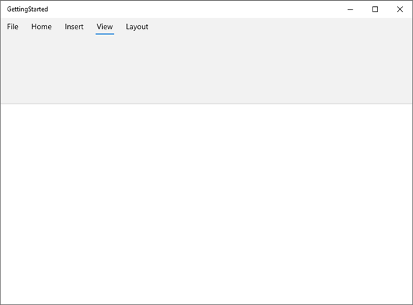
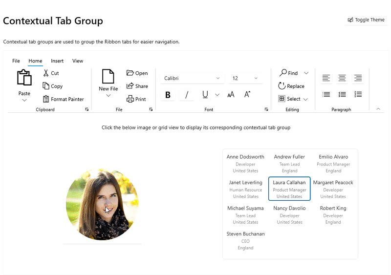
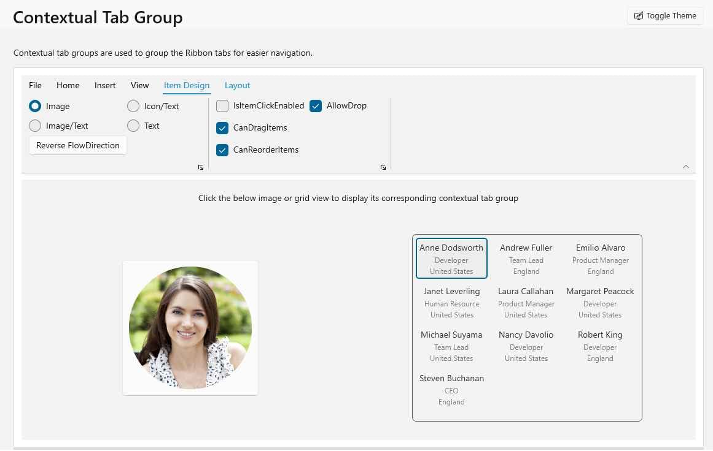
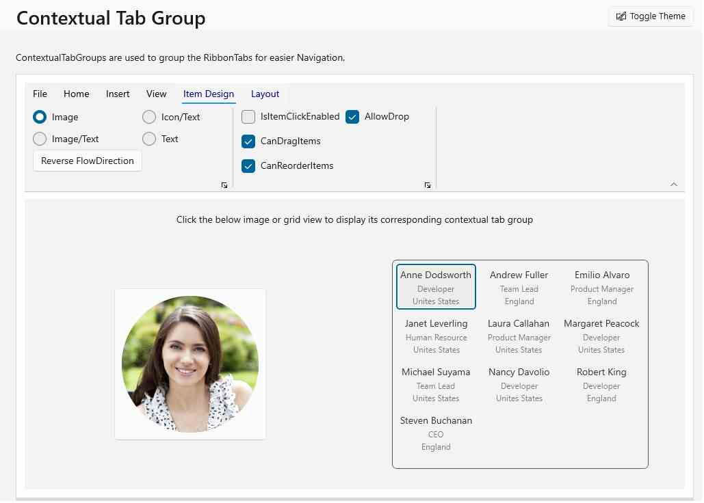

# Ribbon tab in WinUI Ribbon

The below section describes more information about [Ribbon](https://help.syncfusion.com/cr/winui/Syncfusion.UI.Xaml.Ribbon.SfRibbon.html) and its features.

## Ribbon tab selection

The `SelectedTab` property returns the value of the currently selected [RibbonTab](https://help.syncfusion.com/cr/winui/Syncfusion.UI.Xaml.Ribbon.RibbonTab.html) and the `SelectedIndex` property returns the index of the `SelectedTab` in Ribbon.




// Setting of Selected Index
<ribbon:SfRibbon SelectedIndex="2">
    <ribbon:SfRibbon.Tabs>
        <ribbon:RibbonTab Header="Home"/>
        <ribbon:RibbonTab Header="Insert" />
        <ribbon:RibbonTab Header="View" />
        <ribbon:RibbonTab Header="Layout" />
    </ribbon:SfRibbon.Tabs>
</ribbon:SfRibbon>

// Selected Tab Binding
<ribbon:SfRibbon x:Name="ribbon"
                         SelectedTab="{Binding ElementName=view}">
    <ribbon:SfRibbon.Tabs>
        <ribbon:RibbonTab Header="Home" />
            <ribbon:RibbonTab Header="Insert" />
            <ribbon:RibbonTab x:Name="view" Header="View" />
        <ribbon:RibbonTab Header="Layout" />
    </ribbon:SfRibbon.Tabs>
</ribbon:SfRibbon>
 


N> The selected index value should not exceed the child count of the `Tabs` collection in the [Ribbon](https://help.syncfusion.com/cr/winui/Syncfusion.UI.Xaml.Ribbon.SfRibbon.html).

### Detecting selection changes in the Ribbon tab

The [SelectedTabChanged](https://help.syncfusion.com/cr/winui/Syncfusion.UI.Xaml.Ribbon.SfRibbon.html#Syncfusion_UI_Xaml_Ribbon_SfRibbon_SelectedTabChanged) event triggers when a user attempts to switch the [RibbonTab](https://help.syncfusion.com/cr/winui/Syncfusion.UI.Xaml.Ribbon.RibbonTab.html) in a Ribbon.

* The sender argument contains the [SfRibbon](https://help.syncfusion.com/cr/winui/Syncfusion.UI.Xaml.Ribbon.SfRibbon.html). This argument is of type object but can be casted to the SfRibbon type.
* The second argument is a `SelectionChangedEventArgs` that receives the old and newly selected ribbon tabs in an argument.




<ribbon:SfRibbon x:Name="ribbon"
                 SelectedTabChanged="ribbon_SelectedTabChanged">
    <ribbon:SfRibbon.Tabs>
        <ribbon:RibbonTab Header="Home" />
        <ribbon:RibbonTab Header="Insert" />
        <ribbon:RibbonTab Header="View" />
        <ribbon:RibbonTab Header="Layout" />
    </ribbon:SfRibbon.Tabs>
</ribbon:SfRibbon>

 


private void ribbon_SelectedTabChanged(object sender, SelectionChangedEventArgs e)
{
    // Write your code here
}

 


##  Ribbon Contextual tab group

Ribbon contextual tab groups are used to group the ribbon tabs for easier navigation. This contextual tab groups appear when a user enables their context. 
The `Visibility` property is collapsed by default. The Visibility property becomes visible and the associated contextual tab group opens when you click the Image or Grid view.Any number of 
contextual tab group can be added to the ribbon using the `ContextualTabGroups` property.




<ribbon:SfRibbon.ContextualTabGroups>
        <ribbon:RibbonContextualTabGroup x:Name="ImageOptions"
                                Visibility="Collapsed" 
                                SelectFirstTabOnVisible="True" >
            <ribbon:RibbonContextualTabGroup.Tabs>
                <ribbon:RibbonTab Header="Picture Format">
                    <ribbon:RibbonGroup Header="Image Stretch">
                        <ribbon:RibbonItemHost>
                            <ribbon:RibbonItemHost.ItemTemplate>
                                <DataTemplate>
                                    <Grid>
                                        <RadioButton x:Name="StretchNone" 
                                                                Grid.Row="0"
                                                                Grid.Column="0"
                                                                Content="None"
                                                                IsChecked="True"
                                                               GroupName="ImageStretch"/>
                                    </Grid>
                                </DataTemplate>
                            </ribbon:RibbonItemHost.ItemTemplate>
                        </ribbon:RibbonItemHost>
                    </ribbon:RibbonGroup>
                </ribbon:RibbonTab>
            </ribbon:RibbonContextualTabGroup.Tabs>
        </ribbon:RibbonContextualTabGroup>
        <ribbon:RibbonContextualTabGroup x:Name="TableOptions"
                                Visibility="Collapsed"
                                Background="{ThemeResource SystemListMediumColor}"
                                SelectFirstTabOnVisible="True">
            <ribbon:RibbonContextualTabGroup.Tabs>
                <ribbon:RibbonTab Header="Item Design"/>    
                <ribbon:RibbonTab Header="Layout"/>
        </ribbon:RibbonContextualTabGroup>
    </ribbon:SfRibbon.ContextualTabGroups>

 


    private void ContentGridView_SelectionChanged(object sender,                 SelectionChangedEventArgs e)
        {
            this.ImageButton.IsChecked = false;
            this.ImageOptions.Visibility = Visibility.Collapsed;
            this.TableOptions.Visibility = Visibility.Visible;
            this.ContentGridView.BorderBrush = (SolidColorBrush)this.Resources["TextBoxBorderThemeBrush"];
        }
        private void ImageButton_Click(object sender, RoutedEventArgs e)
        {
            this.TableOptions.Visibility = Visibility.Collapsed;
            this.ImageButton.IsChecked = true;
            this.ImageOptions.Visibility = Visibility.Visible;
            this.ContentGridView.BorderBrush = (SolidColorBrush)this.Resources["TextBoxDisabledBorderThemeBrush"];
        }
        private void Grid_PointerPressed(object sender, PointerRoutedEventArgs e)
        {
            this.ImageButton.IsChecked = false;
            this.ImageOptions.Visibility = Visibility.Collapsed;
            this.TableOptions.Visibility = Visibility.Collapsed;
            this.ContentGridView.BorderBrush = (SolidColorBrush)this.Resources["TextBoxDisabledBorderThemeBrush"];
        }

 


##  Select first ribbon tab while group get selected

If the SelectFirstTabOnVisible property is set to true, the first tab of the contextual tab group will be selected, and the Items of the tab will be displayed.




   <ribbon:SfRibbon.ContextualTabGroups>
        <ribbon:RibbonContextualTabGroup x:Name="ImageOptions"
                                SelectFirstTabOnVisible="True" >
            <ribbon:RibbonContextualTabGroup.Tabs>
                <ribbon:RibbonTab Header="Picture Format"/>
            </ribbon:RibbonContextualTabGroup.Tabs>
        </ribbon:RibbonContextualTabGroup>
        <ribbon:RibbonContextualTabGroup x:Name="TableOptions"
                                SelectFirstTabOnVisible="True">
            <ribbon:RibbonContextualTabGroup.Tabs>
                <ribbon:RibbonTab Header="Item Design"/>
        </ribbon:RibbonContextualTabGroup>
    </ribbon:SfRibbon.ContextualTabGroups>

 


## Appearance of Contextual Tab Group

## Background
The Ribbon Contextual Tab group background color can be changed using `Background` property.




   <ribbon:SfRibbon.ContextualTabGroups>
        <ribbon:RibbonContextualTabGroup x:Name="ImageOptions"
                                        Background="LightSkyBlue" >
            <ribbon:RibbonContextualTabGroup.Tabs>
                <ribbon:RibbonTab Header="Picture Format"/>
            </ribbon:RibbonContextualTabGroup.Tabs>
        </ribbon:RibbonContextualTabGroup>
    </ribbon:SfRibbon.ContextualTabGroups>

 


## Foreground
The Ribbon Contextual Tab group foreground color can be changed using `Foreground` property.




   <ribbon:SfRibbon.ContextualTabGroups>
        <ribbon:RibbonContextualTabGroup x:Name="TableOptions"
                                SelectFirstTabOnVisible="True" Foreground="DarkBlue"
                                Background="{ThemeResource SystemAltLowColor}">
            <ribbon:RibbonContextualTabGroup.Tabs>
                <ribbon:RibbonTab Header="Item Design"/>
                 <ribbon:RibbonTab Header="Layout"/>
        </ribbon:RibbonContextualTabGroup>
    </ribbon:SfRibbon.ContextualTabGroups>

 


