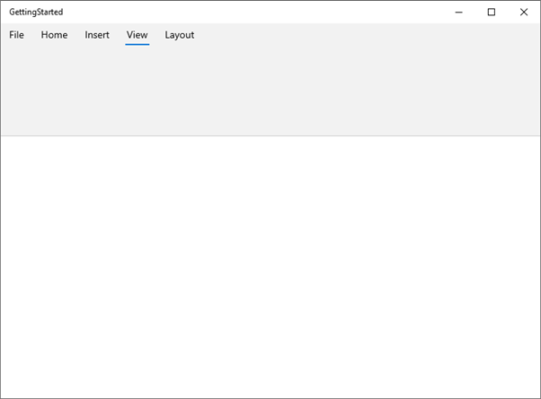
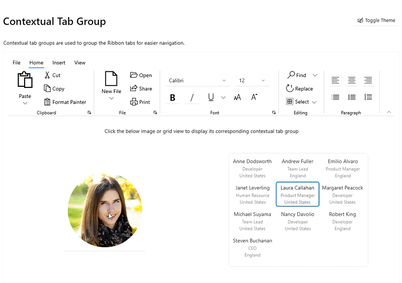
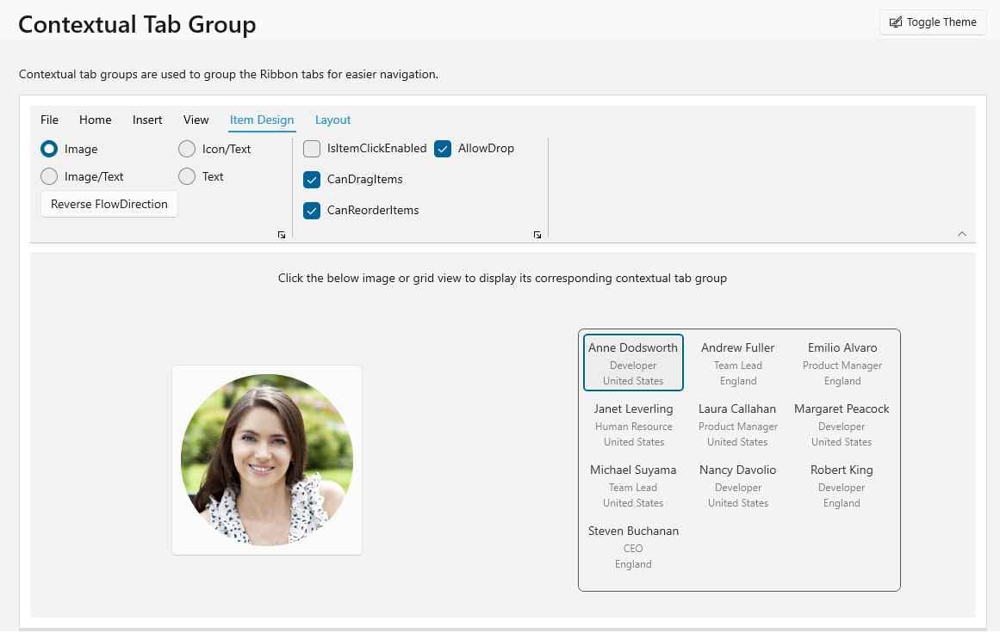
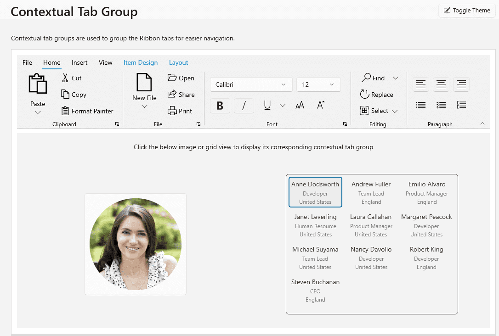
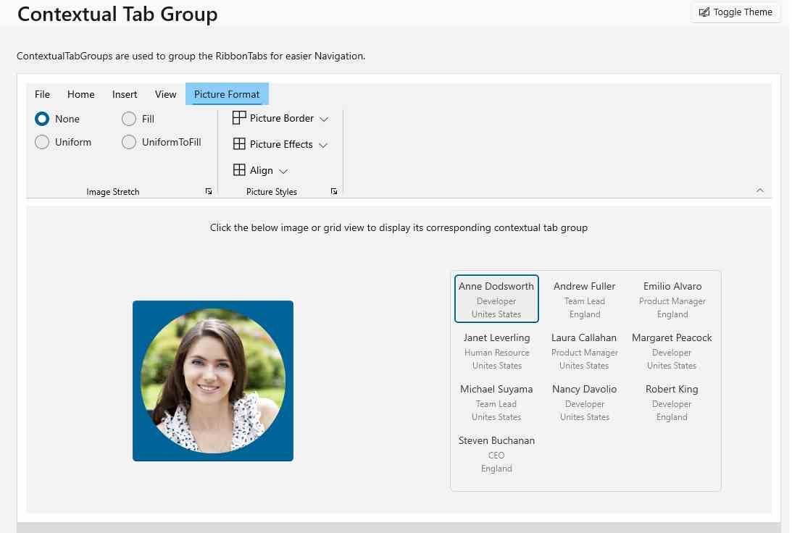
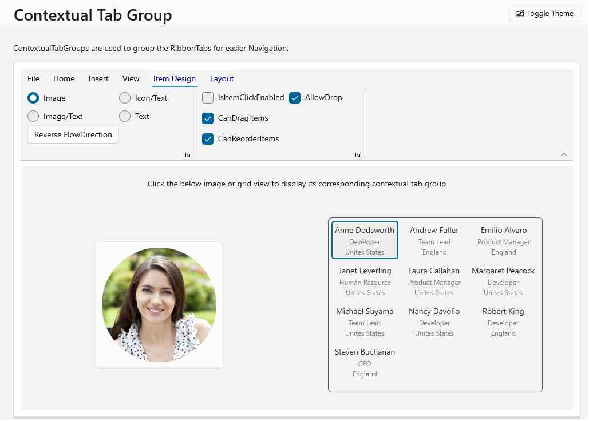

# Dealing with Ribbon in WinUI Ribbon

The following section describes the [Ribbon](https://help.syncfusion.com/cr/winui/Syncfusion.UI.Xaml.Ribbon.SfRibbon.html) and its features in detail.

## Ribbon tab selection

The `SelectedTab` property returns the currently selected [RibbonTab](https://help.syncfusion.com/cr/winui/Syncfusion.UI.Xaml.Ribbon.RibbonTab.html) and the `SelectedIndex` property returns the index of the `SelectedTab` in the Ribbon. When binding `SelectedTab`, the bound `RibbonTab` must already exist in the `Tabs` collection of the Ribbon.




<!-- Setting the SelectedIndex -->
<ribbon:SfRibbon SelectedIndex="2">
    <ribbon:SfRibbon.Tabs>
        <ribbon:RibbonTab Header="Home"/>
        <ribbon:RibbonTab Header="Insert" />
        <ribbon:RibbonTab Header="View" />
        <ribbon:RibbonTab Header="Layout" />
    </ribbon:SfRibbon.Tabs>
</ribbon:SfRibbon>

<!-- SelectedTab Binding -->
<ribbon:SfRibbon x:Name="ribbon"
                 SelectedTab="{Binding ElementName=view}">
    <ribbon:SfRibbon.Tabs>
        <ribbon:RibbonTab Header="Home" />
        <ribbon:RibbonTab Header="Insert" />
        <ribbon:RibbonTab x:Name="view" Header="View" />
        <ribbon:RibbonTab Header="Layout" />
    </ribbon:SfRibbon.Tabs>
</ribbon:SfRibbon>
 


N> The selected index value should not exceed the child count of the `Tabs` collection in the [Ribbon](https://help.syncfusion.com/cr/winui/Syncfusion.UI.Xaml.Ribbon.SfRibbon.html).

### Detecting selection changes in the Ribbon tab

The [SelectedTabChanged](https://help.syncfusion.com/cr/winui/Syncfusion.UI.Xaml.Ribbon.SfRibbon.html#Syncfusion_UI_Xaml_Ribbon_SfRibbon_SelectedTabChanged) event triggers when a user switches the [RibbonTab](https://help.syncfusion.com/cr/winui/Syncfusion.UI.Xaml.Ribbon.RibbonTab.html) in a Ribbon.

* The sender argument contains the [SfRibbon](https://help.syncfusion.com/cr/winui/Syncfusion.UI.Xaml.Ribbon.SfRibbon.html). This argument is of type object but can be cast to the SfRibbon type.
* The second argument is a `SelectionChangedEventArgs` that receives the old and newly selected ribbon tabs in an argument.




<ribbon:SfRibbon x:Name="ribbon"
                 SelectedTabChanged="ribbon_SelectedTabChanged">
    <ribbon:SfRibbon.Tabs>
        <ribbon:RibbonTab Header="Home" />
        <ribbon:RibbonTab Header="Insert" />
        <ribbon:RibbonTab Header="View" />
        <ribbon:RibbonTab Header="Layout" />
    </ribbon:SfRibbon.Tabs>
</ribbon:SfRibbon>

 


private void ribbon_SelectedTabChanged(object sender, SelectionChangedEventArgs e)
{
    // Write your code here
}

 


## Ribbon Contextual tab group

Ribbon contextual tab groups are used to group the ribbon tabs for easier navigation. These contextual tab groups appear when a user enables their context. By default, these groups are collapsed (`Visibility="Collapsed"`); to make them visible, use the `Visibility` property. Any number of contextual tab groups can be added to the ribbon using the `ContextualTabGroups` property.




 <ribbon:SfRibbon.ContextualTabGroups>
        <ribbon:RibbonContextualTabGroup x:Name="ImageOptions">
            <ribbon:RibbonContextualTabGroup.Tabs>
                <ribbon:RibbonTab Header="Picture Format">
                    <ribbon:RibbonGroup Header="Image Stretch">
                       <ribbon:RibbonButton Content="Fill"/>
                    </ribbon:RibbonGroup>
                </ribbon:RibbonTab>
            </ribbon:RibbonContextualTabGroup.Tabs>
        </ribbon:RibbonContextualTabGroup>
        <ribbon:RibbonContextualTabGroup x:Name="TableOptions">
            <ribbon:RibbonContextualTabGroup.Tabs>
                <ribbon:RibbonTab Header="Item Design"/>
                <ribbon:RibbonTab Header="Layout"/>
            </ribbon:RibbonContextualTabGroup.Tabs>
        </ribbon:RibbonContextualTabGroup>
 </ribbon:SfRibbon.ContextualTabGroups>
 <ToggleButton Click="ImageButton_Click">
               <Image Source="ms-appx:///Assets/Image.png"/>
 </ToggleButton>
 <GridView ItemsSource="{Binding Employees}"
           SelectedItem="{Binding SelectedEmployee, Mode=TwoWay}"
           SelectionChanged="GridView_SelectionChanged"/>

 


        private void ImageButton_Click(object sender, RoutedEventArgs e)
        {
            this.ImageOptions.Visibility = Visibility.Visible;
            this.TableOptions.Visibility = Visibility.Collapsed;
        }
        private void Grid_PointerPressed(object sender, PointerRoutedEventArgs e)
        {
            this.ImageOptions.Visibility = Visibility.Collapsed;
             this.TableOptions.Visibility = Visibility.Collapsed;
        }
        private void GridView_SelectionChanged(object sender, SelectionChangedEventArgs e)
        {
            this.ImageOptions.Visibility = Visibility.Collapsed;
            this.TableOptions.Visibility = Visibility.Visible;
        }

 


## Select first ribbon tab when group is selected

When the contextual tab group is visible, use the `SelectFirstTabOnVisible` property to select the first ribbon tab in the contextual tab group. If you don't need to select the first ribbon tab, set the value to `False`.




   <ribbon:SfRibbon.ContextualTabGroups>
        <ribbon:RibbonContextualTabGroup x:Name="ImageOptions"
                                SelectFirstTabOnVisible="True" >
            <ribbon:RibbonContextualTabGroup.Tabs>
                <ribbon:RibbonTab Header="Item Design"/>
                <ribbon:RibbonTab Header="Layout"/>
            </ribbon:RibbonContextualTabGroup.Tabs>
        </ribbon:RibbonContextualTabGroup>
        <ribbon:RibbonContextualTabGroup x:Name="TableOptions"
                                SelectFirstTabOnVisible="False">
            <ribbon:RibbonContextualTabGroup.Tabs>
                <ribbon:RibbonTab Header="Item Design"/>
                <ribbon:RibbonTab Header="Layout"/>
            </ribbon:RibbonContextualTabGroup.Tabs>
        </ribbon:RibbonContextualTabGroup>
    </ribbon:SfRibbon.ContextualTabGroups>

 


`SelectFirstTabOnVisible="True"`:

`SelectFirstTabOnVisible="False"`:

## Appearance of Contextual Tab Group

### Background

The background color of tab groups can be applied using the `Background` property. When you change the background of a contextual tab group, it is reflected in all Ribbon tabs inside that group.




   <ribbon:SfRibbon.ContextualTabGroups>
        <ribbon:RibbonContextualTabGroup x:Name="TableOptions"
                                        Background="LightGray">
          <ribbon:RibbonContextualTabGroup.Tabs>
                <ribbon:RibbonTab Header="Item Design"/>
                <ribbon:RibbonTab Header="Layout"/>
          </ribbon:RibbonContextualTabGroup.Tabs>
        </ribbon:RibbonContextualTabGroup>
    </ribbon:SfRibbon.ContextualTabGroups>

 


## Foreground

The foreground color of tab groups can be applied using the `Foreground` property. When you change the foreground of a contextual tab group, it is reflected in all Ribbon tabs inside that group.




   <ribbon:SfRibbon.ContextualTabGroups>
        <ribbon:RibbonContextualTabGroup x:Name="ImageOptions"
                                SelectFirstTabOnVisible="True"  
                                Foreground="#950245" >
            <ribbon:RibbonContextualTabGroup.Tabs>
                <ribbon:RibbonTab Header="Picture Format"/>
            </ribbon:RibbonContextualTabGroup.Tabs>
        </ribbon:RibbonContextualTabGroup>
    </ribbon:SfRibbon.ContextualTabGroups>

 


