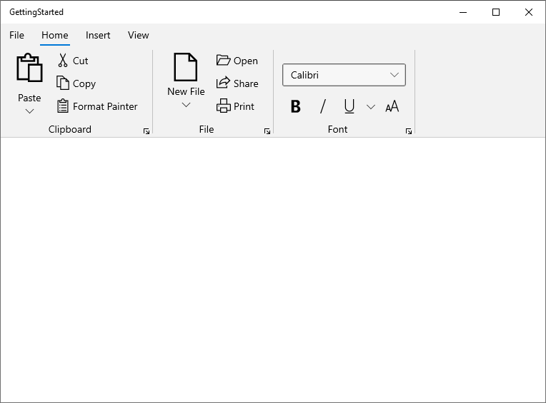

# Dealing with Ribbon Items in WinUI Ribbon

The below section describes more information about Ribbon items and its features.

## Changing size of the Ribbon items

The size of the Ribbon items such as [RibbonButton](https://help.syncfusion.com/cr/winui/Syncfusion.UI.Xaml.Ribbon.RibbonButton.html), [RibbonDropDownButton](https://help.syncfusion.com/cr/winui/Syncfusion.UI.Xaml.Ribbon.RibbonDropDownButton.html), [RibbonSplitButton](https://help.syncfusion.com/cr/winui/Syncfusion.UI.Xaml.Ribbon.RibbonSplitButton.html), RibbonGallery and [RibbonItemHost](https://help.syncfusion.com/cr/winui/Syncfusion.UI.Xaml.Ribbon.RibbonItemHost.html) controls can be changed using `SizeMode` property.

`SizeMode` is an Enum type property used to arrange Ribbon items inside a RibbonGroup with Small, Normal and Large sizes. 

* **Small** : Displays only the image.
* **Normal** : Displays an image along with the text in horizontal alignment.
* **Large** : Displays an image along with the text in vertical alignment.



<ribbon:SfRibbon x:Name="ribbon"
                 BackstageMenuButtonContent="File">
    <ribbon:SfRibbon.Tabs>
        <ribbon:RibbonTab Header="Home">
            <ribbon:RibbonGroup Header="Clipboard">
                <ribbon:RibbonSplitButton x:Name="pasteButton"
                                          Icon="Paste"
                                          Content="Paste"
                                          SizeMode="Large">
                    <ribbon:RibbonSplitButton.Flyout>
                        <MenuFlyout>
                            <MenuFlyoutItem Text="Paste" />
                            <MenuFlyoutItem Text="Paste Special" />
                            <MenuFlyoutItem Text="Set Default Paste" />
                        </MenuFlyout>
                    </ribbon:RibbonSplitButton.Flyout>
                </ribbon:RibbonSplitButton>
                <ribbon:RibbonButton x:Name="cutButton"
                                     Icon="Cut"
                                     Content="Cut"
                                     SizeMode="Normal" />
                <ribbon:RibbonButton x:Name="copyButton"
                                     Icon="Copy"
                                     Content="Copy"
                                     SizeMode="Normal" />
                <ribbon:RibbonButton x:Name="formatPainterButton"
                                     Content="Format Painter"
                                     SizeMode="Normal">
                    <ribbon:RibbonButton.Icon>
                        <FontIcon Glyph="&#xF0E3;" />
                    </ribbon:RibbonButton.Icon>
                </ribbon:RibbonButton>
            </ribbon:RibbonGroup>
            <ribbon:RibbonGroup Header="File">
                <ribbon:RibbonDropDownButton x:Name="newFileButton"
                                             Content="New File"
                                             SizeMode="Large">
                    <ribbon:RibbonDropDownButton.Icon>
                        <FontIcon Glyph="&#xE7C3;" />
                    </ribbon:RibbonDropDownButton.Icon>
                    <ribbon:RibbonDropDownButton.Flyout>
                        <MenuFlyout>
                            <MenuFlyoutItem Text="Empty File" />
                            <MenuFlyoutItem Text="Template File" />
                        </MenuFlyout>
                    </ribbon:RibbonDropDownButton.Flyout>
                </ribbon:RibbonDropDownButton>
                <ribbon:RibbonButton x:Name="openButton"
                                     Content="Open"
                                     SizeMode="Normal">
                    <ribbon:RibbonButton.Icon>
                        <FontIcon FontFamily="Segoe MDL2 Assets"
                                  Glyph="&#xED25;" />
                    </ribbon:RibbonButton.Icon>
                </ribbon:RibbonButton>
                <ribbon:RibbonButton x:Name="shareButton"
                                     Icon="Share"
                                     Content="Share"
                                     SizeMode="Normal" />
                <ribbon:RibbonButton x:Name="printButton"
                                     Icon="Print"
                                     Content="Print"
                                     SizeMode="Normal" />
            </ribbon:RibbonGroup>
            <ribbon:RibbonGroup Header="Font">
                <ribbon:RibbonItemHost Margin="0,12,0,0">
                    <ribbon:RibbonItemHost.ItemTemplate>
                        <ComboBox x:Name="FontComboBox"
                                  PlaceholderText="Select Font"
                                  PlaceholderForeground="#A2A2A2"
                                  Width="173">
                            <ComboBoxItem Content="Calibri"
                                          IsSelected="True" />
                            <ComboBoxItem Content="Arial" />
                            <ComboBoxItem Content="Segoe UI" />
                        </ComboBox>
                    </ribbon:RibbonItemHost.ItemTemplate>
                </ribbon:RibbonItemHost>
                <ribbon:RibbonItemHost Margin="0,12,0,0">
                    <ribbon:RibbonItemHost.ItemTemplate>
                        <StackPanel Orientation="Horizontal">
                            <ToggleButton x:Name="Bold"
                                          Background="{ThemeResource SystemChromeLowColor}">
                                <ToggleButton.Content>
                                    <SymbolIcon Symbol="Bold" />
                                </ToggleButton.Content>
                            </ToggleButton>
                            <ToggleButton x:Name="Italic"
                                          Background="{ThemeResource SystemChromeLowColor}">
                                <ToggleButton.Content>
                                    <SymbolIcon Symbol="Italic" />
                                </ToggleButton.Content>
                            </ToggleButton>
                            <ribbon:RibbonSplitButton x:Name="underlineButton"
                                                      SizeMode="Small"
                                                      Icon="Underline"
                                                      Content="Underline">
                                <ribbon:RibbonSplitButton.Flyout>
                                    <MenuFlyout>
                                        <MenuFlyoutItem Text="Underline" />
                                        <MenuFlyoutItem Text="Double underline" />
                                        <MenuFlyoutItem Text="Thick underline" />
                                        <MenuFlyoutItem Text="Dotted underline" />
                                    </MenuFlyout>
                                </ribbon:RibbonSplitButton.Flyout>
                            </ribbon:RibbonSplitButton>
                            <ribbon:RibbonButton x:Name="fontSizeButton"
                                                 Icon="FontSize"
                                                 SizeMode="Small"
                                                 Content="FontSize" />
                        </StackPanel>
                    </ribbon:RibbonItemHost.ItemTemplate>
                </ribbon:RibbonItemHost>
            </ribbon:RibbonGroup>
        </ribbon:RibbonTab>
        <ribbon:RibbonTab Header="Insert" />
        <ribbon:RibbonTab Header="View" />
    </ribbon:SfRibbon.Tabs>
</ribbon:SfRibbon>
 


## Launcher button in RibbonGroup 

The Launcher button is like a normal button, and you can also use it to add additional features and options in that section of the RibbonGroup.

### Launcher button click event

The [RibbonGroup](https://help.syncfusion.com/cr/winui/Syncfusion.UI.Xaml.Ribbon.RibbonGroup.html) provides a `LauncherButtonClick` event to notify you when the launcher button is clicked.




<ribbon:SfRibbon>
    <ribbon:SfRibbon.Tabs>
        <ribbon:RibbonTab Header="Home">
            <ribbon:RibbonGroup LauncherButtonClick="RibbonGroup_LauncherButtonClick"
                                Header="Clipboard">
                <ribbon:RibbonDropDownButton Icon="Paste"
                                             SizeMode="Large"
                                             Content="Paste" />
            </ribbon:RibbonGroup>
            <ribbon:RibbonGroup Header="File" />
            <ribbon:RibbonGroup Header="Font" />
        </ribbon:RibbonTab>
        <ribbon:RibbonTab Header="Insert" />
        <ribbon:RibbonTab Header="View" />
        <ribbon:RibbonTab Header="Layout" />
    </ribbon:SfRibbon.Tabs>
</ribbon:SfRibbon>

 


private async void RibbonGroup_LauncherButtonClick(RibbonGroup sender, object args)
{
     // Write your code here...
}




### Add command to Ribbon Launcher button

The command for the Launcher button in a [RibbonGroup](https://help.syncfusion.com/cr/winui/Syncfusion.UI.Xaml.Ribbon.RibbonGroup.html) can be set using the `LauncherButtonCommand` property. The following example of the code is the same.




<ribbon:SfRibbon.Tabs>
    <ribbon:RibbonTab Header="Home">
        <ribbon:RibbonGroup LauncherButtonCommand="{Binding LauncherButtonCommand, Mode=TwoWay}" 
                            Header="Clipboard">
            <ribbon:RibbonDropDownButton Icon="Paste"
                                         SizeMode="Large"
                                         Content="Paste" />
        </ribbon:RibbonGroup>
        <ribbon:RibbonGroup Header="File" />
        <ribbon:RibbonGroup Header="Font" />
    </ribbon:RibbonTab>
    <ribbon:RibbonTab Header="Insert" />
    <ribbon:RibbonTab Header="View" />
    <ribbon:RibbonTab Header="Layout" />
</ribbon:SfRibbon.Tabs>

 


public ICommand LauncherButtonCommand { get; set; }

 this.LauncherButtonCommand = new DelegateCommand(ExecuteLauncherButtonCommand, CanExecuteCommand);

private void ExecuteLauncherButtonCommand(object obj)
{
    // Write your code here...
}

private bool CanExecuteCommand(object parameter)
{
    return true;
}




### Hide Launcher button

The [RibbonGroup](https://help.syncfusion.com/cr/winui/Syncfusion.UI.Xaml.Ribbon.RibbonGroup.html) allows you to show or hide the launcher button by using `ShowLauncherButton` property. By default, visibility of the launcher button is enabled as true.




<ribbon:SfRibbon>
    <ribbon:SfRibbon.Tabs>
        <ribbon:RibbonTab Header="Home">
            <ribbon:RibbonGroup ShowLauncherButton="False"
                                Header="Clipboard">
                <ribbon:RibbonDropDownButton Icon="Paste"
                                             SizeMode="Large"
                                             Content="Paste" />
            </ribbon:RibbonGroup>
            <ribbon:RibbonGroup Header="File" />
            <ribbon:RibbonGroup Header="Font" />
        </ribbon:RibbonTab>
        <ribbon:RibbonTab Header="Insert" />
        <ribbon:RibbonTab Header="View" />
        <ribbon:RibbonTab Header="Layout" />
    </ribbon:SfRibbon.Tabs>
</ribbon:SfRibbon>

 


