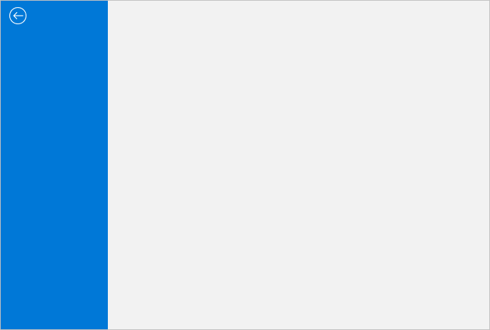
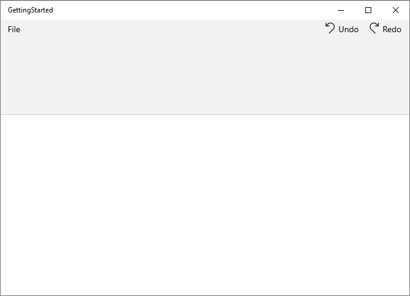

# Getting started with WinUI Ribbon (SfRibbon)

This section explains the steps required to add the Ribbon control and its elements such as ribbon tabs, built in ribbon items, custom ribbon items, right pane, backstage and its items. This section covers only basic features needed to get started with Syncfusion ribbon control.

## Creating an application with WinUI Ribbon

1. Create a simple project using the instructions given in the [Getting Started with your first WinUI app](https://docs.microsoft.com/en-us/windows/apps/winui/winui3/get-started-winui3-for-uwp) documentation.

2.	Add reference to [Syncfusion.Ribbon.WinUI](https://www.nuget.org/packages/Syncfusion.Ribbon.WinUI) NuGet.

3.	Import the control namespace `Syncfusion.UI.Xaml.Ribbon` in XAML or C# code.

4.	Initialize the SfRibbon control. 




<Page
    x:Class="GettingStarted.MainPage"
    xmlns="http://schemas.microsoft.com/winfx/2006/xaml/presentation"
    xmlns:x="http://schemas.microsoft.com/winfx/2006/xaml"
    xmlns:local="using:GettingStarted"
    xmlns:d="http://schemas.microsoft.com/expression/blend/2008"
    xmlns:mc="http://schemas.openxmlformats.org/markup-compatibility/2006"
    xmlns:ribbon="using:Syncfusion.UI.Xaml.Ribbon"
    mc:Ignorable="d"
    Background="{ThemeResource ApplicationPageBackgroundThemeBrush}">
     
    <Grid x:Name="rootGrid">
        <ribbon:SfRibbon x:Name=”sfRibbon”/>
    </Grid>

</Page>



using Syncfusion.UI.Xaml.Ribbon;
namespace GettingStarted
{
    /// 

    /// An empty page that can be used on its own or navigated to within a Frame.
    /// 

    public sealed partial class MainPage : Page
    {
        public MainPage()
        {
            this.InitializeComponent();
            SfRibbon sfRibbon = new SfRibbon();
            rootGrid.Children.Add(sfRibbon);
        }
    }
}



## Add Title to the Ribbon

The title of the ribbon provides an information to the user about the ribbon application and can be set using the `Title` property. 




<ribbon:SfRibbon x:Name="sfRibbon"
                         Title="Application1- Ribbon" />




SfRibbon sfRibbon = new SfRibbon();
sfRibbon.Title = "Application1 - Ribbon";
this.rootGrid.Children.Add(sfRibbon);

       


## Add RibbonTab to the ribbon ##

Any number of tab elements can be added to the ribbon using the `Tabs` property, and you can use the `Header` property to name the tab.




<Grid x:Name="rootGrid">
    <ribbon:SfRibbon x:Name="sfRibbon">
        <ribbon:SfRibbon.Tabs>
            <ribbon:RibbonTab Header="Home" />
            <ribbon:RibbonTab Header="Insert" />
            <ribbon:RibbonTab Header="View" />
            <ribbon:RibbonTab Header="Layout" />
        </ribbon:SfRibbon.Tabs>
    </ribbon:SfRibbon>
</Grid>



SfRibbon sfRibbon = new SfRibbon();
RibbonTab homeTab = new RibbonTab() { Header = "Home" };
RibbonTab insertTab = new RibbonTab() { Header = "Insert" };
RibbonTab viewTab = new RibbonTab() { Header = "View" };
RibbonTab layoutTab = new RibbonTab() { Header = "Layout" };
sfRibbon.Tabs.Add(homeTab);
sfRibbon.Tabs.Add(insertTab);
sfRibbon.Tabs.Add(viewTab);
sfRibbon.Tabs.Add(layoutTab);
this.rootGrid.Children.Add(sfRibbon);



## Add RibbonGroup ##

Any number of `RibbonGroup` can be added to the ribbon, and the group allows you to add built-in ribbon items such as `RibbonButton`, `RibbonDropDownButton` and `RibbonSplitButton`, as well as other controls such as checkbox, combobox and radio button etc., can also be added.




<Grid x:Name="rootGrid">
    <ribbon:SfRibbon x:Name="sfRibbon">
        <ribbon:SfRibbon.Tabs>
            <ribbon:RibbonTab Header="Home">
                <ribbon:RibbonGroup Header="Clipboard" />
                <ribbon:RibbonGroup Header="File" />
                <ribbon:RibbonGroup Header="Font" />
                <ribbon:RibbonGroup Header="Editing" />
                <ribbon:RibbonGroup Header="Paragraph" />
                <ribbon:RibbonGroup Header="Voice" />
            </ribbon:RibbonTab>
            <ribbon:RibbonTab Header="Insert" />
            <ribbon:RibbonTab Header="View" />
            <ribbon:RibbonTab Header="Layout" />
        </ribbon:SfRibbon.Tabs>
    </ribbon:SfRibbon>
</Grid>



SfRibbon sfRibbon = new SfRibbon();
RibbonTab homeTab = new RibbonTab() { Header = "Home" };
RibbonTab insertTab = new RibbonTab() { Header = "Insert" };
RibbonTab viewTab = new RibbonTab() { Header = "View" };
RibbonTab layoutTab = new RibbonTab() { Header = "Layout" };

RibbonGroup clipboardGroup = new RibbonGroup() { Header = "Clipboard" };
RibbonGroup fileGroup = new RibbonGroup() { Header = "File" };
RibbonGroup fontGroup = new RibbonGroup() { Header = "Font" };
RibbonGroup editingGroup = new RibbonGroup() { Header = "Editing" };
RibbonGroup paragraphGroup = new RibbonGroup() { Header = "Paragraph" };
RibbonGroup voiceGroup = new RibbonGroup() { Header = "Voice" };

homeTab.Items.Add(clipboardGroup);
homeTab.Items.Add(fileGroup);
homeTab.Items.Add(fontGroup);
homeTab.Items.Add(editingGroup);
homeTab.Items.Add(paragraphGroup);
homeTab.Items.Add(voiceGroup);

sfRibbon.Tabs.Add(homeTab);
sfRibbon.Tabs.Add(insertTab);
sfRibbon.Tabs.Add(viewTab);
sfRibbon.Tabs.Add(layoutTab);
this.rootGrid.Children.Add(sfRibbon);



## Add RibbonButton ##

The `RibbonButton` represents a normal button and can be added to a ribbon group with different sizes using the `SizeMode` property.You can also use the `Content` and `Icon` properties to provide the name with the icon to the button.



<Grid x:Name="rootGrid">
    <ribbon:SfRibbon x:Name="sfRibbon">
        <ribbon:SfRibbon.Tabs>
            <ribbon:RibbonTab Header="Home">
                <ribbon:RibbonGroup Header="Clipboard">
                    <ribbon:RibbonButton Icon="Cut"
                                        Content="Cut"
                                        SizeMode="Normal" />
                    <ribbon:RibbonButton Icon="Copy"
                                    Content="Copy"
                                    SizeMode="Normal" />
                    <ribbon:RibbonButton Content="Format Painter"
                                    SizeMode="Normal">
                        <ribbon:RibbonButton.Icon>
                        <FontIcon Glyph="&#xF0E3;" />
                        </ribbon:RibbonButton.Icon>
                    </ribbon:RibbonButton>
                </ribbon:RibbonGroup>
            </ribbon:RibbonTab>
            <ribbon:RibbonTab Header="Insert" />
            <ribbon:RibbonTab Header="View" />
            <ribbon:RibbonTab Header="Layout" />
            </ribbon:SfRibbon.Tabs>
    </ribbon:SfRibbon>
</Grid>


SfRibbon sfRibbon = new SfRibbon();
RibbonTab homeTab = new RibbonTab() { Header = "Home" };
RibbonTab insertTab = new RibbonTab() { Header = "Insert" };
RibbonTab viewTab = new RibbonTab() { Header = "View" };
RibbonTab layoutTab = new RibbonTab() { Header = "Layout" };

RibbonGroup clipboardGroup = new RibbonGroup() { Header = "Clipboard" };
RibbonGroup fileGroup = new RibbonGroup() { Header = "File" };
RibbonGroup fontGroup = new RibbonGroup() { Header = "Font" };
RibbonGroup editingGroup = new RibbonGroup() { Header = "Editing" };
RibbonGroup paragraphGroup = new RibbonGroup() { Header = "Paragraph" };
RibbonGroup voiceGroup = new RibbonGroup() { Header = "Voice" };

RibbonButton cutButton =new RibbonButton() { Content = "Cut", SizeMode =            SizeMode.Normal, Icon = new SymbolIcon(Symbol.Cut) };
RibbonButton copyButton = new RibbonButton() { Content = "Copy", SizeMode =         SizeMode.Normal, Icon = new SymbolIcon(Symbol.Copy) };
RibbonButton formatPainterButton = new RibbonButton() { Content = "FormatPainter",  SizeMode = SizeMode.Normal, Icon = new FontIcon() { Glyph = "&#xF0E3;" } };

clipboardGroup.Items.Add(cutButton);
clipboardGroup.Items.Add(copyButton);
clipboardGroup.Items.Add(formatPainterButton);

homeTab.Items.Add(clipboardGroup);
homeTab.Items.Add(fileGroup);
homeTab.Items.Add(fontGroup);
homeTab.Items.Add(editingGroup);
homeTab.Items.Add(paragraphGroup);
homeTab.Items.Add(voiceGroup);

sfRibbon.Tabs.Add(homeTab);
sfRibbon.Tabs.Add(insertTab);
sfRibbon.Tabs.Add(viewTab);
sfRibbon.Tabs.Add(layoutTab);
this.rootGrid.Children.Add(sfRibbon);



## Add RibbonDropDown ##

The `RibbonDropDownButton` represents a normal button that displays the drop-down menu items when clicked. It allows you to configure a button with different sizes within a group using the `SizeMode` property and to set content with an icon using the `Content` and `Icon` properties. You can also populate the drop-down values using the `Flyout` control on the button.



<Grid x:Name="rootGrid">
    <ribbon:SfRibbon x:Name="sfRibbon">
        <ribbon:SfRibbon.Tabs>
            <ribbon:RibbonTab Header="Home">                     
                <ribbon:RibbonGroup Header="File">
                    <ribbon:RibbonDropDownButton Content="New File"
                                                     SizeMode="Large"
                                                     Icon="File">
                        <ribbon:RibbonDropDownButton.Icon>
                                <FontIcon Glyph="&#xE7C3;" />
                        </ribbon:RibbonDropDownButton.Icon>
                        <ribbon:RibbonDropDownButton.Flyout>
                            <MenuFlyout>
                                    <MenuFlyoutItem Text="Empty File" />
                                    <MenuFlyoutItem Text="Template File" />
                            </MenuFlyout>
                        </ribbon:RibbonDropDownButton.Flyout>
                    </ribbon:RibbonDropDownButton>
                </ribbon:RibbonGroup>    
            </ribbon:RibbonTab>
            <ribbon:RibbonTab Header="Insert" />
            <ribbon:RibbonTab Header="View" />
            <ribbon:RibbonTab Header="Layout" /> 
        </ribbon:SfRibbon.Tabs>
    </ribbon:SfRibbon>
</Grid>
   

 SfRibbon sfRibbon = new SfRibbon();

RibbonTab homeTab = new RibbonTab() { Header = "Home" };
RibbonTab insertTab = new RibbonTab() { Header = "Insert" };
RibbonTab viewTab = new RibbonTab() { Header = "View" };
RibbonTab layoutTab = new RibbonTab() { Header = "Layout" };

RibbonDropDownButton newFileButton = new RibbonDropDownButton() { Content = "New File", SizeMode = SizeMode.Large, Icon = new FontIcon() { Glyph = "&#xE7C3;" } };

MenuFlyout flyout = new MenuFlyout();
MenuFlyoutItem emptyFileMenuFlyoutItem = new MenuFlyoutItem() { Text="Empty File"};
MenuFlyoutItem templateFileMenuFlyoutItem = new MenuFlyoutItem() { Text = "Template File" };
flyout.Items.Add(emptyFileMenuFlyoutItem);
flyout.Items.Add(templateFileMenuFlyoutItem);

newFileButton.Flyout = flyout;
fileGroup.Items.Add(newFileButton);

sfRibbon.Tabs.Add(homeTab);
sfRibbon.Tabs.Add(insertTab);
sfRibbon.Tabs.Add(viewTab);
sfRibbon.Tabs.Add(layoutTab);

this.rootGrid.Children.Add(sfRibbon);



## Add RibbonSplitButton ##

The `RibbonSplitButton` represents a combined control that has a primary button that responds to a `Click` event, and a secondary button acts like a drop-down menu with a list of values. It allows you to configure a button with different sizes within a group using the `SizeMode` property and to set content with an icon using the `Content` and `Icon` properties.You can also populate the drop-down values using the `Flyout` control on the button.



<Grid x:Name="rootGrid">
<ribbon:SfRibbon x:Name="sfRibbon">
    <ribbon:SfRibbon.Tabs>
        <ribbon:RibbonTab Header="Home">                    
            <ribbon:RibbonGroup Header="Voice">
                <ribbon:RibbonSplitButton Icon="Microphone"
                                        Content="Dictate"
                                        SizeMode="Large">
                    <ribbon:RibbonSplitButton.Flyout>
                        <MenuFlyout>
                            <MenuFlyoutItem Text="Chinese" />
                            <MenuFlyoutItem Text="English" />
                            <MenuFlyoutItem Text="French" />
                            <MenuFlyoutItem Text="German" />
                        </MenuFlyout>
                    </ribbon:RibbonSplitButton.Flyout>
                </ribbon:RibbonSplitButton>
            </ribbon:RibbonGroup>
        </ribbon:RibbonTab>
        <ribbon:RibbonTab Header="Insert" />
        <ribbon:RibbonTab Header="View" />
        <ribbon:RibbonTab Header="Layout" /> 
        </ribbon:SfRibbon.Tabs>
    </ribbon:SfRibbon>
</Grid>
   

SfRibbon sfRibbon = new SfRibbon();
RibbonTab homeTab = new RibbonTab() { Header = "Home" };
RibbonTab insertTab = new RibbonTab() { Header = "Insert" };
RibbonTab viewTab = new RibbonTab() { Header = "View" };
RibbonTab layoutTab = new RibbonTab() { Header = "Layout" };

RibbonGroup voiceGroup = new RibbonGroup() { Header = "Voice" };

RibbonSplitButton splitButton = new RibbonSplitButton() { Content = "Dictate", SizeMode = SizeMode.Large, Icon = new SymbolIcon(Symbol.Microphone) };

MenuFlyout flyout = new MenuFlyout();
MenuFlyoutItem chineseMenuFlyoutItem = new MenuFlyoutItem() { Text = "Chinese" };
MenuFlyoutItem englishMenuFlyoutItem = new MenuFlyoutItem() { Text = "English" };
MenuFlyoutItem frenchMenuFlyoutItem = new MenuFlyoutItem() { Text = "French" };
MenuFlyoutItem germanMenuFlyoutItem = new MenuFlyoutItem() { Text = "German" };

flyout.Items.Add(chineseMenuFlyoutItem);
flyout.Items.Add(englishMenuFlyoutItem);
flyout.Items.Add(frenchMenuFlyoutItem);
flyout.Items.Add(germanMenuFlyoutItem);

splitButton.Flyout = flyout;
voiceGroup.Items.Add(splitButton);

homeTab.Items.Add(voiceGroup);

sfRibbon.Tabs.Add(homeTab);
sfRibbon.Tabs.Add(insertTab);
sfRibbon.Tabs.Add(viewTab);
sfRibbon.Tabs.Add(layoutTab);
this.rootGrid.Children.Add(sfRibbon);




## Host a custom ribbon items to the group ##

You can host other controls such as checkbox, radio button and combobox etc., to a ribbon group using the `ItemTemplate` property of `RibbonItemHost`.



<Grid x:Name="rootGrid">
    <ribbon:SfRibbon x:Name="sfRibbon">
        <ribbon:RibbonTab Header="View">
            <ribbon:RibbonGroup Header="Views" >
                <ribbon:RibbonItemHost>
                    <ribbon:RibbonItemHost.ItemTemplate>
                        <CheckBox Content="Ruler" IsChecked="true"/>
                    </ribbon:RibbonItemHost.ItemTemplate>
                </ribbon:RibbonItemHost>
                <ribbon:RibbonItemHost>
                    <ribbon:RibbonItemHost.ItemTemplate>
                        <CheckBox Content="Gridlines" IsChecked="true"/>
                    </ribbon:RibbonItemHost.ItemTemplate>
                </ribbon:RibbonItemHost>
                <ribbon:RibbonItemHost>
                    <ribbon:RibbonItemHost.ItemTemplate>
                        <CheckBox Content="Navigation Pane" />
                    </ribbon:RibbonItemHost.ItemTemplate>
                </ribbon:RibbonItemHost>
             </ribbon:RibbonGroup>
            </ribbon:RibbonTab>
        </ribbon:SfRibbon.Tabs>
    </ribbon:SfRibbon>
</Grid>
   

SfRibbon sfRibbon = new SfRibbon();
RibbonTab viewTab = new RibbonTab() { Header = "View" };
RibbonGroup viewsGroup = new RibbonGroup() { Header = "Views" };

CheckBox rulerCheckBox = new CheckBox() { IsChecked = true, Content = "Ruler" };
CheckBox gridLinesCheckBox = new CheckBox() { IsChecked = true, Content = "Gridlines" };
CheckBox navPaneCheckBox = new CheckBox() { Content = "Navigation Pane" };

RibbonItemHost customItem1 = new RibbonItemHost();
customItem1.ItemTemplate = rulerCheckBox;

RibbonItemHost customItem2 = new RibbonItemHost();
customItem2.ItemTemplate = gridLinesCheckBox;

RibbonItemHost customItem3 = new RibbonItemHost();
customItem3.ItemTemplate = navPaneCheckBox;

viewsGroup.Items.Add(customItem1);
viewsGroup.Items.Add(customItem2);
viewsGroup.Items.Add(customItem3);
viewTab.Items.Add(viewsGroup);
sfRibbon.Tabs.Add(viewTab);
this.rootGrid.Children.Add(sfRibbon);




## Add Ribbon Backstage to the ribbon ##

The Ribbon backstage provides a separate view to the ribbon and can be added by using the `Backstage` property of ribbon control. Backstage appears as the first tab in the top left corner named File and opens a backstage view when you click the `File` menu. You can also host a `BackstageView` inside the ribbon for the following code snippet.



<Grid x:Name="rootGrid">
    <ribbon:SfRibbon x:Name="sfRibbon">
        <ribbon:SfRibbon.Backstage>
            <ribbon:RibbonBackstage>
                 <ribbon:BackstageView/>
            </ribbon:RibbonBackstage>
        </ribbon:SfRibbon.Backstage>
    </ribbon:SfRibbon>
</Grid>
   

SfRibbon sfRibbon = new SfRibbon();
RibbonBackstage ribbonBackstage = new RibbonBackstage();
BackstageView backstageView = new BackstageView();
ribbonBackstage.Content = backstageView;
sfRibbon.Backstage = ribbonBackstage;
 this.rootGrid.Children.Add(sfRibbon);



## Add Backstage items to the BackStageView ##

The BackstageView allows you to add a number of items such as `BackstageViewTabItem`, `BackstageViewItemSeparator` and `BackstageViewButtonItem` to a view using the `Items` property. You can also add backstage items to the footer of backstage view by using the `FooterItems` property.



<Grid x:Name="rootGrid">
    <ribbon:SfRibbon x:Name="sfRibbon">
        <ribbon:SfRibbon.Backstage>
            <ribbon:RibbonBackstage>
                <ribbon:BackstageView>
                    <ribbon:BackstageView.Items>
                        <ribbon:BackstageViewTabItem Header="New" Icon="NewFolder" />
                        <ribbon:BackstageViewTabItem Header="Open" Icon="OpenWith" /> 
                        <ribbon:BackstageViewItemSeparator />
                        <ribbon:BackstageViewTabItem Header="Info" />
                        <ribbon:BackstageViewButtonItem Header="Save" />
                        <ribbon:BackstageViewButtonItem Header="Close" />
                    </ribbon:BackstageView.Items>
                    <ribbon:BackstageView.FooterItems>
                        <ribbon:BackstageViewItemSeparator />
                        <ribbon:BackstageViewTabItem Header="Account" />
                        <ribbon:BackstageViewTabItem Header="FeedBack" />
                        <ribbon:BackstageViewButtonItem  Header="Option" />
                    </ribbon:BackstageView.FooterItems>
                </ribbon:BackstageView>
            </ribbon:RibbonBackstage>
        </ribbon:SfRibbon.Backstage>
    </ribbon:SfRibbon>
</Grid>
   

SfRibbon sfRibbon = new SfRibbon();

RibbonBackstage ribbonBackstage = new RibbonBackstage();
BackstageView backstageView = new BackstageView();

BackstageViewButtonItem newTab = new BackstageViewButtonItem() { Content = "New", Icon = new SymbolIcon(Symbol.NewFolder) };
BackstageViewButtonItem openTab = new BackstageViewButtonItem() { Content = "Open", Icon = new SymbolIcon(Symbol.OpenWith) };
BackstageViewItemSeparator separator1 = new BackstageViewItemSeparator();
BackstageViewButtonItem saveButton = new BackstageViewButtonItem() { Content = "Save" };
BackstageViewButtonItem closeButton = new BackstageViewButtonItem() { Content = "Close" };

//Footer items
BackstageViewItemSeparator footerseparator = new BackstageViewItemSeparator();
BackstageViewButtonItem accountTab = new BackstageViewButtonItem() { Content = "New" };
BackstageViewButtonItem feedbackTab = new BackstageViewButtonItem() { Content = "Open"};
BackstageViewButtonItem optionButton = new BackstageViewButtonItem() { Content = "Option" };

//Add backstage items to backstage view
backstageView.Items.Add(newTab);
backstageView.Items.Add(openTab);
backstageView.Items.Add(separator1);
backstageView.Items.Add(saveButton);
backstageView.Items.Add(closeButton);

//Add backstage items to backstage view
backstageView.FooterItems.Add(footerseparator);
backstageView.FooterItems.Add(accountTab);
backstageView.FooterItems.Add(feedbackTab);
backstageView.FooterItems.Add(optionButton);

ribbonBackstage.Content = backstageView;
sfRibbon.Backstage = ribbonBackstage;
this.rootGrid.Children.Add(sfRibbon);




## Add RightPane to the ribbon ##

The Right pane allows you to add a custom panel with ribbon items on the right side of the ribbon. For example below, added a stack panel as a custom panel with ribbon buttons inside the right pane.



<Grid x:Name="rootGrid">
    <syncfusion:SfRibbon x:Name="sfRibbon">
        <syncfusion:SfRibbon.RightPane>
            <StackPanel Orientation="Horizontal">
                <syncfusion:RibbonButton Icon="Undo" Content="Undo" />
                <syncfusion:RibbonButton Icon="Redo" Content="Redo" />
            </StackPanel>
        </syncfusion:SfRibbon.RightPane>
    </syncfusion:SfRibbon>
</Grid>
   

SfRibbon sfRibbon = new SfRibbon();

StackPanel customPanel = new StackPanel() { Orientation = Orientation.Horizontal };
RibbonButton undoButton = new RibbonButton() { Content = "Undo", Icon = new SymbolIcon(Symbol.Undo) };
RibbonButton redoButton = new RibbonButton() { Content = "Redo", Icon = new SymbolIcon(Symbol.Redo) };

customPanel.Children.Add(undoButton);
customPanel.Children.Add(redoButton);

sfRibbon.RightPane = customPanel;
this.rootGrid.Children.Add(sfRibbon);



