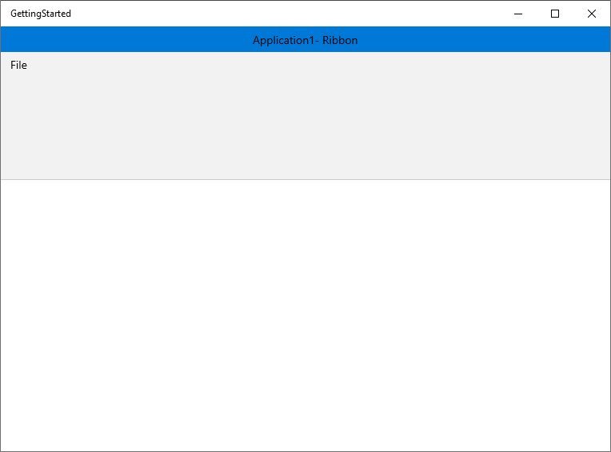
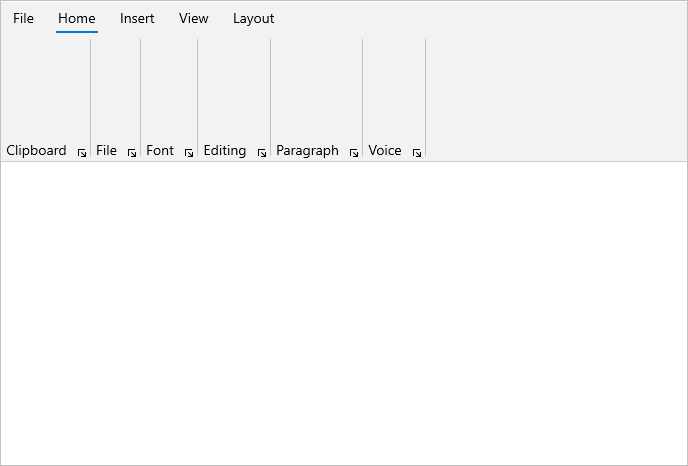
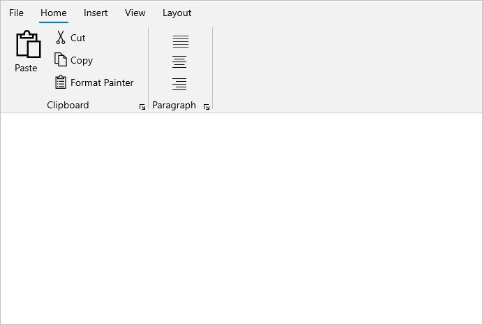
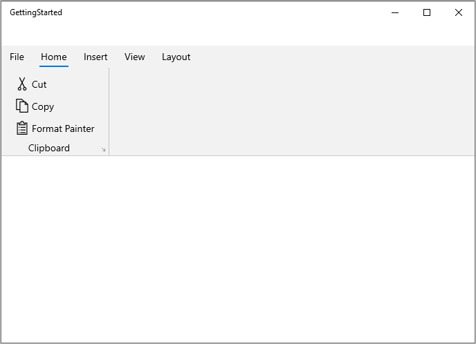
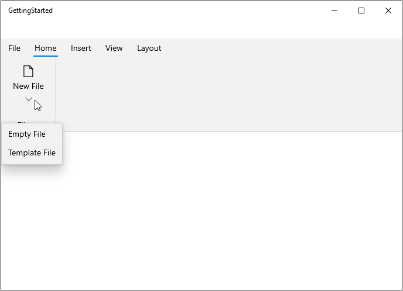
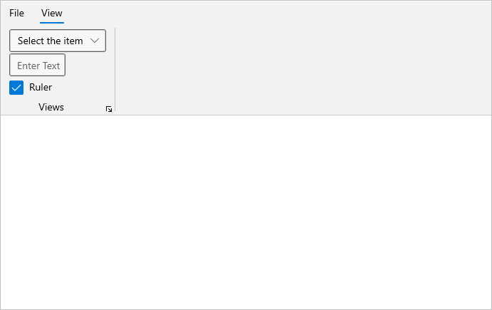
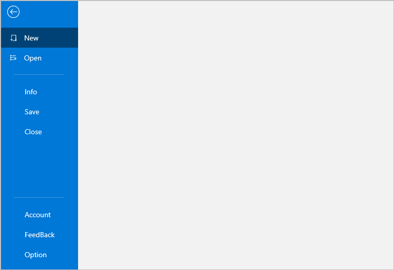
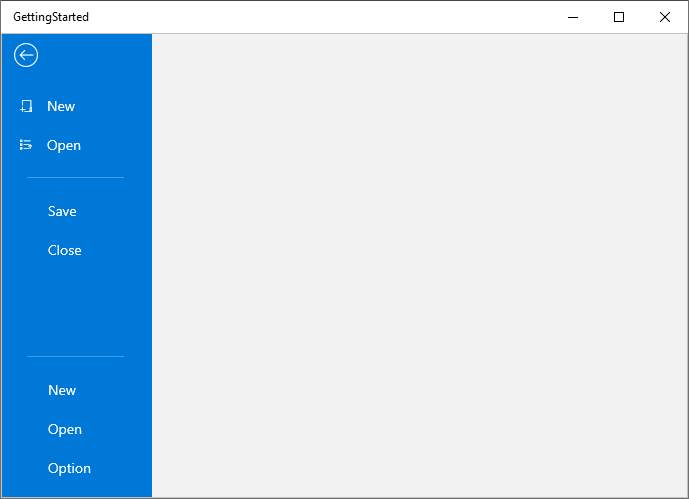

# Getting started with WinUI Ribbon (SfRibbon)

This section explains the steps required to add the Ribbon control and its elements such as ribbon tabs, ribbon groups, built in ribbon items, custom ribbon items, right pane, backstage and its items. This section covers the basic features needed to get started with Syncfusion ribbon control.

## Creating an application with WinUI Ribbon

1. Create a simple project using the instructions given in the [Getting Started with your first WinUI app](https://docs.microsoft.com/en-us/windows/apps/winui/winui3/get-started-winui3-for-uwp) documentation.

2.	Add reference to [Syncfusion.Ribbon.WinUI](https://www.nuget.org/packages/Syncfusion.Ribbon.WinUI) NuGet.

3.	Import the control namespace `Syncfusion.UI.Xaml.Ribbon` in XAML or C# code.

4.	Initialize the [SfRibbon]((https://help.syncfusion.com/cr/winui/Syncfusion.UI.Xaml.Ribbon.SfRibbon.html)) control. 




<Page
    x:Class="GettingStarted.MainPage"
    xmlns="http://schemas.microsoft.com/winfx/2006/xaml/presentation"
    xmlns:x="http://schemas.microsoft.com/winfx/2006/xaml"
    xmlns:local="using:GettingStarted"
    xmlns:d="http://schemas.microsoft.com/expression/blend/2008"
    xmlns:mc="http://schemas.openxmlformats.org/markup-compatibility/2006"
    xmlns:ribbon="using:Syncfusion.UI.Xaml.Ribbon"
    mc:Ignorable="d"
    Background="{ThemeResource ApplicationPageBackgroundThemeBrush}">
     
    <Grid x:Name="rootGrid">
        <ribbon:SfRibbon x:Name=”sfRibbon”/>
    </Grid>

</Page>



using Syncfusion.UI.Xaml.Ribbon;
namespace GettingStarted
{
    public sealed partial class MainPage : Page
    {
        public MainPage()
        {
            this.InitializeComponent();
            SfRibbon sfRibbon = new SfRibbon();
            rootGrid.Children.Add(sfRibbon);
        }
    }
}



## Add RibbonTab to the ribbon ##

We can categorize the command using the [RibbonTab](https://help.syncfusion.com/cr/winui/Syncfusion.UI.Xaml.Ribbon.RibbonTab.html). Any number of tab elements can be added to the ribbon using the [Tabs](https://help.syncfusion.com/cr/winui/Syncfusion.UI.Xaml.Ribbon.SfRibbon.html#Syncfusion_UI_Xaml_Ribbon_SfRibbon_Tabs) property, and you can use the `Header` property to name the tab.




<Grid x:Name="rootGrid">
    <ribbon:SfRibbon x:Name="sfRibbon">
        <ribbon:SfRibbon.Tabs>
            <ribbon:RibbonTab Header="Home" />
            <ribbon:RibbonTab Header="Insert" />
            <ribbon:RibbonTab Header="View" />
            <ribbon:RibbonTab Header="Layout" />
        </ribbon:SfRibbon.Tabs>
    </ribbon:SfRibbon>
</Grid>



SfRibbon sfRibbon = new SfRibbon();
RibbonTab homeTab = new RibbonTab() { Header = "Home" };
RibbonTab insertTab = new RibbonTab() { Header = "Insert" };
RibbonTab viewTab = new RibbonTab() { Header = "View" };
RibbonTab layoutTab = new RibbonTab() { Header = "Layout" };
sfRibbon.Tabs.Add(homeTab);
sfRibbon.Tabs.Add(insertTab);
sfRibbon.Tabs.Add(viewTab);
sfRibbon.Tabs.Add(layoutTab);
this.rootGrid.Children.Add(sfRibbon);



## Add RibbonGroup ##

We can group the commands in the ribbon tab using a [RibbonGroup](https://help.syncfusion.com/cr/winui/Syncfusion.UI.Xaml.Ribbon.RibbonGroup.html) and it allows you to add built-in ribbon items such as [RibbonButton](https://help.syncfusion.com/cr/winui/Syncfusion.UI.Xaml.Ribbon.RibbonButton.html), [RibbonDropDownButton](https://help.syncfusion.com/cr/winui/Syncfusion.UI.Xaml.Ribbon.RibbonDropDownButton.html) and [RibbonSplitButton](https://help.syncfusion.com/cr/winui/Syncfusion.UI.Xaml.Ribbon.RibbonSplitButton.html), as well as other controls such as checkbox, combobox and radio button etc., can also be added.




<Grid x:Name="rootGrid">
    <ribbon:SfRibbon x:Name="sfRibbon">
        <ribbon:SfRibbon.Tabs>
            <ribbon:RibbonTab Header="Home">
                <ribbon:RibbonGroup Header="Clipboard" />
                <ribbon:RibbonGroup Header="File" />
                <ribbon:RibbonGroup Header="Font" />
                <ribbon:RibbonGroup Header="Editing" />
                <ribbon:RibbonGroup Header="Paragraph" />
                <ribbon:RibbonGroup Header="Voice" />
            </ribbon:RibbonTab>
            <ribbon:RibbonTab Header="Insert" />
            <ribbon:RibbonTab Header="View" />
            <ribbon:RibbonTab Header="Layout" />
        </ribbon:SfRibbon.Tabs>
    </ribbon:SfRibbon>
</Grid>



SfRibbon sfRibbon = new SfRibbon();
RibbonTab homeTab = new RibbonTab() { Header = "Home" };
RibbonTab insertTab = new RibbonTab() { Header = "Insert" };
RibbonTab viewTab = new RibbonTab() { Header = "View" };
RibbonTab layoutTab = new RibbonTab() { Header = "Layout" };

RibbonGroup clipboardGroup = new RibbonGroup() { Header = "Clipboard" };
RibbonGroup fileGroup = new RibbonGroup() { Header = "File" };
RibbonGroup fontGroup = new RibbonGroup() { Header = "Font" };
RibbonGroup editingGroup = new RibbonGroup() { Header = "Editing" };
RibbonGroup paragraphGroup = new RibbonGroup() { Header = "Paragraph" };
RibbonGroup voiceGroup = new RibbonGroup() { Header = "Voice" };

homeTab.Items.Add(clipboardGroup);
homeTab.Items.Add(fileGroup);
homeTab.Items.Add(fontGroup);
homeTab.Items.Add(editingGroup);
homeTab.Items.Add(paragraphGroup);
homeTab.Items.Add(voiceGroup);

sfRibbon.Tabs.Add(homeTab);
sfRibbon.Tabs.Add(insertTab);
sfRibbon.Tabs.Add(viewTab);
sfRibbon.Tabs.Add(layoutTab);
this.rootGrid.Children.Add(sfRibbon);



## Add RibbonButton ##

The [RibbonButton](https://help.syncfusion.com/cr/winui/Syncfusion.UI.Xaml.Ribbon.RibbonButton.html) represents a normal button and can be added to a ribbon group with different sizes using the `SizeMode` property.You can use the `Content` and `Icon` properties to set the label and icon to the button.



<ribbon:SfRibbon x:Name="sfRibbon"
                 SelectedIndex="1">
    <ribbon:SfRibbon.Tabs>
        <ribbon:RibbonTab Header="Home" />
        <ribbon:RibbonTab Header="Insert">
            <ribbon:RibbonGroup Header="Illustrations">
                <ribbon:RibbonButton Content="Pictures"
                                     SizeMode="Large">
                    <ribbon:RibbonButton.Icon>
                        <SymbolIcon Symbol="Pictures" />
                    </ribbon:RibbonButton.Icon>
                </ribbon:RibbonButton>
                <ribbon:RibbonButton Content="Shapes"
                                     SizeMode="Normal">
                    <ribbon:RibbonButton.Icon>
                        <FontIcon Glyph="&#xF158;" />
                    </ribbon:RibbonButton.Icon>
                </ribbon:RibbonButton>
                <ribbon:RibbonButton Content="Icons"
                                     SizeMode="Normal">
                    <ribbon:RibbonButton.Icon>
                        <FontIcon Glyph="&#xECAA;" />
                    </ribbon:RibbonButton.Icon>
                </ribbon:RibbonButton>
                <ribbon:RibbonButton Icon="DisconnectDrive"
                                     Content="3D Models"
                                     SizeMode="Normal" />
                <ribbon:RibbonButton SizeMode="Small">
                    <ribbon:RibbonButton.Icon>
                        <BitmapIcon UriSource="ms-appx:///Assets/Bookmarks.png" />
                    </ribbon:RibbonButton.Icon>
                </ribbon:RibbonButton>
                <ribbon:RibbonButton Icon="Character"
                                     SizeMode="Small" />
                <ribbon:RibbonButton Icon="FullScreen"
                                     SizeMode="Small" />
            </ribbon:RibbonGroup>
        </ribbon:RibbonTab> 
        <ribbon:RibbonTab Header="View" />
        <ribbon:RibbonTab Header="Layout" />
    </ribbon:SfRibbon.Tabs>
</ribbon:SfRibbon>



SfRibbon sfRibbon = new SfRibbon();
sfRibbon.SelectedIndex = 1;

RibbonTab homeTab = new RibbonTab() { Header = "Home" };
RibbonTab insertTab = new RibbonTab() { Header = "Insert" };
RibbonTab viewTab = new RibbonTab() { Header = "View" };
RibbonTab layoutTab = new RibbonTab() { Header = "Layout" };

RibbonGroup illustrationsGroup = new RibbonGroup() { Header = "Illustrations" };

RibbonButton pictureButton = new RibbonButton() { Content = "Picures" , SizeMode= SizeMode.Large, Icon = new SymbolIcon(Symbol.Pictures)};

RibbonButton shapesButton = new RibbonButton() { Content = "Shapes" , SizeMode= SizeMode.Normal, Icon = new FontIcon() { Glyph= "\xF158" } };
RibbonButton iconsButton = new RibbonButton() { Content = "Icons" , SizeMode= SizeMode.Normal, Icon = new FontIcon() { Glyph= "\xECAA" } };            
RibbonButton disconnectDriveButton = new RibbonButton() { Content = "3D Models" , SizeMode= SizeMode.Small, Icon = new SymbolIcon(Symbol.DisconnectDrive)  };

RibbonButton bookmarksButton = new RibbonButton() { SizeMode = SizeMode.Small, Icon = new BitmapIcon() { UriSource = new Uri("msappx:///Assets/Bookmarks.png") } };
RibbonButton characterButton = new RibbonButton() {   SizeMode= SizeMode.Small, Icon = new SymbolIcon(Symbol.Character) };
RibbonButton fullScreenButton = new RibbonButton() { SizeMode = SizeMode.Small, Icon = new SymbolIcon(Symbol.FullScreen) };

illustrationsGroup.Items.Add(pictureButton);
illustrationsGroup.Items.Add(shapesButton);
illustrationsGroup.Items.Add(iconsButton);
illustrationsGroup.Items.Add(disconnectDriveButton);
illustrationsGroup.Items.Add(bookmarksButton);
illustrationsGroup.Items.Add(characterButton);
illustrationsGroup.Items.Add(fullScreenButton);

insertTab.Items.Add(illustrationsGroup);

sfRibbon.Tabs.Add(homeTab);
sfRibbon.Tabs.Add(insertTab);
sfRibbon.Tabs.Add(viewTab);
sfRibbon.Tabs.Add(layoutTab);

this.rootGrid.Children.Add(sfRibbon);



## Add RibbonDropDown ##

The [RibbonDropDownButton](https://help.syncfusion.com/cr/winui/Syncfusion.UI.Xaml.Ribbon.RibbonDropDownButton.html) represents a dropdown button that displays the drop-down menu items when clicked. It allows you to arrange a button with different sizes within a ribbon group using the `SizeMode` property. You can use the `Content` and `Icon` properties to set the label and icon to the button, and you can populate the drop-down menu items using using the `Flyout` control in the button.



<Grid x:Name="rootGrid">
    <ribbon:SfRibbon x:Name="sfRibbon">
        <ribbon:SfRibbon.Tabs>
            <ribbon:RibbonTab Header="Home">
                <ribbon:RibbonGroup Header="File">
                    <ribbon:RibbonDropDownButton Content="New File"
                                                     SizeMode="Large">
                        <ribbon:RibbonDropDownButton.Icon>
                                <FontIcon FontFamily="Segoe MDL2 Assets" Glyph="&#xE7C3;" />
                        </ribbon:RibbonDropDownButton.Icon>
                        <ribbon:RibbonDropDownButton.Flyout>
                            <MenuFlyout>
                                    <MenuFlyoutItem Text="Empty File" />
                                    <MenuFlyoutItem Text="Template File" />
                            </MenuFlyout>
                        </ribbon:RibbonDropDownButton.Flyout>
                    </ribbon:RibbonDropDownButton>
                </ribbon:RibbonGroup>    
            </ribbon:RibbonTab>
            <ribbon:RibbonTab Header="Insert" />
            <ribbon:RibbonTab Header="View" />
            <ribbon:RibbonTab Header="Layout" /> 
        </ribbon:SfRibbon.Tabs>
    </ribbon:SfRibbon>
</Grid>
   

SfRibbon sfRibbon = new SfRibbon();

RibbonTab homeTab = new RibbonTab() { Header = "Home" };
RibbonTab insertTab = new RibbonTab() { Header = "Insert" };
RibbonTab viewTab = new RibbonTab() { Header = "View" };
RibbonTab layoutTab = new RibbonTab() { Header = "Layout" };

RibbonGroup fileGroup = new RibbonGroup() { Header = "File" };

RibbonDropDownButton newFileButton = new RibbonDropDownButton() { Content = "New File", SizeMode = SizeMode.Large, Icon = new FontIcon() { Glyph = "\xE7C3", FontFamily = new FontFamily("Segoe MDL2 Assets") } };

MenuFlyout flyout = new MenuFlyout();
MenuFlyoutItem emptyFileMenuFlyoutItem = new MenuFlyoutItem() { Text = "Empty File" };
MenuFlyoutItem templateFileMenuFlyoutItem = new MenuFlyoutItem() { Text = "Template File" };
flyout.Items.Add(emptyFileMenuFlyoutItem);
flyout.Items.Add(templateFileMenuFlyoutItem);

newFileButton.Flyout = flyout;
fileGroup.Items.Add(newFileButton);
homeTab.Items.Add(fileGroup);

sfRibbon.Tabs.Add(homeTab);
sfRibbon.Tabs.Add(insertTab);
sfRibbon.Tabs.Add(viewTab);
sfRibbon.Tabs.Add(layoutTab);

this.rootGrid.Children.Add(sfRibbon);



## Add RibbonSplitButton ##

The [RibbonSplitButton](https://help.syncfusion.com/cr/winui/Syncfusion.UI.Xaml.Ribbon.RibbonSplitButton.html) represents a combined control that has a primary button that responds to a `Click` event, and a secondary button acts like a drop-down menu with a list of values. It allows you to arrange a button with different sizes within a ribbon group using the `SizeMode` property. You can use the `Content` and `Icon` properties to set the label and icon to the button, and you can populate the drop-down menu items using the `Flyout` control in the button.



<Grid x:Name="rootGrid">
    <ribbon:SfRibbon x:Name="sfRibbon">
        <ribbon:SfRibbon.Tabs>
            <ribbon:RibbonTab Header="Home">
                <ribbon:RibbonGroup Header="Voice">
                    <ribbon:RibbonSplitButton Icon="Microphone"
                                        Content="Dictate"
                                        SizeMode="Large">
                        <ribbon:RibbonSplitButton.Flyout>
                            <MenuFlyout>
                                <MenuFlyoutItem Text="Chinese" />
                                <MenuFlyoutItem Text="English" />
                                <MenuFlyoutItem Text="French" />
                                <MenuFlyoutItem Text="German" />
                            </MenuFlyout>
                        </ribbon:RibbonSplitButton.Flyout>
                    </ribbon:RibbonSplitButton>
                </ribbon:RibbonGroup>
            </ribbon:RibbonTab>
            <ribbon:RibbonTab Header="Insert" />
            <ribbon:RibbonTab Header="View" />
            <ribbon:RibbonTab Header="Layout" /> 
        </ribbon:SfRibbon.Tabs>
    </ribbon:SfRibbon>
</Grid>
   

SfRibbon sfRibbon = new SfRibbon();
RibbonTab homeTab = new RibbonTab() { Header = "Home" };
RibbonTab insertTab = new RibbonTab() { Header = "Insert" };
RibbonTab viewTab = new RibbonTab() { Header = "View" };
RibbonTab layoutTab = new RibbonTab() { Header = "Layout" };

RibbonGroup voiceGroup = new RibbonGroup() { Header = "Voice" };

RibbonSplitButton splitButton = new RibbonSplitButton() { Content = "Dictate", SizeMode = SizeMode.Large, Icon = new SymbolIcon(Symbol.Microphone) };

MenuFlyout flyout = new MenuFlyout();
MenuFlyoutItem chineseMenuFlyoutItem = new MenuFlyoutItem() { Text = "Chinese" };
MenuFlyoutItem englishMenuFlyoutItem = new MenuFlyoutItem() { Text = "English" };
MenuFlyoutItem frenchMenuFlyoutItem = new MenuFlyoutItem() { Text = "French" };
MenuFlyoutItem germanMenuFlyoutItem = new MenuFlyoutItem() { Text = "German" };

flyout.Items.Add(chineseMenuFlyoutItem);
flyout.Items.Add(englishMenuFlyoutItem);
flyout.Items.Add(frenchMenuFlyoutItem);
flyout.Items.Add(germanMenuFlyoutItem);

splitButton.Flyout = flyout;
voiceGroup.Items.Add(splitButton);

homeTab.Items.Add(voiceGroup);

sfRibbon.Tabs.Add(homeTab);
sfRibbon.Tabs.Add(insertTab);
sfRibbon.Tabs.Add(viewTab);
sfRibbon.Tabs.Add(layoutTab);
this.rootGrid.Children.Add(sfRibbon);




## Host a custom ribbon items to the group ##

You can host other controls such as checkbox, radio button and combobox etc., to a ribbon group using the `ItemTemplate` property of [RibbonItemHost](https://help.syncfusion.com/cr/winui/Syncfusion.UI.Xaml.Ribbon.RibbonItemHost.html).



<ribbon:SfRibbon x:Name="sfRibbon">
    <ribbon:SfRibbon.Tabs>
        <ribbon:RibbonTab Header="Home">
            <ribbon:RibbonGroup Header="Font">
                <ribbon:RibbonItemHost Margin="0,12,0,0">
                    <ribbon:RibbonItemHost.ItemTemplate>
                        <StackPanel Orientation="Horizontal">
                            <ComboBox x:Name="FontComboBox"
                                      Width="120"
                                      PlaceholderText="Select Font"
                                      PlaceholderForeground="#A2A2A2">
                                <ComboBoxItem Content="Calibri"
                                              IsSelected="True" />
                                <ComboBoxItem Content="Arial" />
                                <ComboBoxItem Content="Segoe UI" />
                            </ComboBox>
                            <ComboBox Margin="3,0"
                                      x:Name="FontSizeComboBox"
                                      PlaceholderText="Select Font Size"
                                      PlaceholderForeground="#A2A2A2">
                                <ComboBoxItem Content="11"
                                              IsSelected="True" />
                                <ComboBoxItem Content="12" />
                            </ComboBox>
                        </StackPanel>
                    </ribbon:RibbonItemHost.ItemTemplate>
                </ribbon:RibbonItemHost>
                <ribbon:RibbonItemHost Margin="0,12,0,0">
                    <ribbon:RibbonItemHost.ItemTemplate>
                        <StackPanel Orientation="Horizontal">
                            <ToggleButton x:Name="Bold"
                                          Background="{ThemeResource SystemChromeLowColor}">
                                <ToggleButton.Content>
                                    <SymbolIcon Symbol="Bold" />
                                </ToggleButton.Content>
                            </ToggleButton>
                            <ToggleButton x:Name="Italic"
                                          Background="{ThemeResource SystemChromeLowColor}">
                                <ToggleButton.Content>
                                    <SymbolIcon Symbol="Italic" />
                                </ToggleButton.Content>
                            </ToggleButton>
                            <ribbon:RibbonSplitButton x:Name="underlineButton"
                                                      SizeMode="Small"
                                                      Icon="Underline"
                                                      Content="Underline">
                                <ribbon:RibbonSplitButton.Flyout>
                                    <MenuFlyout>
                                        <MenuFlyoutItem Text="Underline" />
                                        <MenuFlyoutItem Text="Double underline" />
                                        <MenuFlyoutItem Text="Thick underline" />
                                        <MenuFlyoutItem Text="Dotted underline" />
                                    </MenuFlyout>
                                </ribbon:RibbonSplitButton.Flyout>
                            </ribbon:RibbonSplitButton>
                            <ribbon:RibbonButton x:Name="fontSizeButton"
                                                 Icon="FontSize"
                                                 SizeMode="Small"
                                                 Content="FontSize" />
                        </StackPanel>
                    </ribbon:RibbonItemHost.ItemTemplate>
                </ribbon:RibbonItemHost>
            </ribbon:RibbonGroup>
        </ribbon:RibbonTab>
    </ribbon:SfRibbon.Tabs>
</ribbon:SfRibbon>




## Add RibbonBackstage to the ribbon ##

The [RibbonBackstage](https://help.syncfusion.com/cr/winui/Syncfusion.UI.Xaml.Ribbon.RibbonBackstage.html) provides a separate view to the ribbon and can be added by using the `Backstage` property of ribbon control. You can view the ribbon backstage by clicking the backstage menu button named as `File` by default, which is placed before the ribbon tabs.



<ribbon:SfRibbon x:Name="sfRibbon">
    <ribbon:SfRibbon.Backstage>
        <ribbon:RibbonBackstage>
            <Grid>
                <Grid.RowDefinitions>
                    <RowDefinition Height="*" />
                    <RowDefinition Height="Auto" />
                </Grid.RowDefinitions>
                <Grid Grid.Row="0"
                      Padding="0,0,0,1"
                      VerticalAlignment="Top"
                      BorderBrush="LightGray"
                      BorderThickness="0,0,0,1">
                    <Grid.RowDefinitions>
                        <RowDefinition Height="Auto" />
                        <RowDefinition Height="481" />
                    </Grid.RowDefinitions>
                    <Grid.ColumnDefinitions>
                        <ColumnDefinition />
                        <ColumnDefinition />
                    </Grid.ColumnDefinitions>
                    <TextBlock Grid.Row="0"
                               Padding="15"
                               FontSize="24"
                               FontWeight="SemiBold"
                               Text="Settings" />
                    <StackPanel Grid.Row="1"
                                Margin="15,15,15,0"
                                BorderBrush="LightGray"
                                BorderThickness="0,0,0,0">
                        <TextBlock Padding="0,0,0,5"
                                   FontSize="16"
                                   Text="User Information" />
                        <TextBlock Padding="0,5,0,5"
                                   FontSize="14"
                                   Text="Name : John" />
                        <HyperlinkButton Content="Change photo" />
                        <HyperlinkButton Content="Sign Out" />
                        <HyperlinkButton Content="Switch Account" />
                        <TextBlock Padding="0,5,0,5"
                                   Text="Theme Mode" />
                        <RadioButton Content="Light" />
                        <RadioButton Content="Dark" />
                        <RadioButton Content="Use system setting" />
                    </StackPanel>
                    <StackPanel Grid.Row="1"
                                Grid.Column="1"
                                Padding="15,15,15,0"
                                BorderBrush="LightGray"
                                BorderThickness="1,0,0,0">
                        <TextBlock Padding="0,0,0,5"
                                   FontSize="16"
                                   Text="Product Information" />
                        <HyperlinkButton Content="About product" />
                        <HyperlinkButton Content="Help" />
                        <HyperlinkButton Content="Updates" />
                    </StackPanel>
                </Grid>
                <StackPanel Grid.Row="1"
                            Grid.ColumnSpan="2"
                            Padding="120,0,5,5"
                            HorizontalAlignment="Right"
                            BorderBrush="LightGray"
                            BorderThickness="0,0,0,0"
                            Orientation="Horizontal">
                    <Button Margin="5"
                            Content="Options"
                            CornerRadius="0" />
                    <Button Margin="5"
                            Content="Exit Backstage"
                            CornerRadius="0" />
                </StackPanel>
            </Grid>
        </ribbon:RibbonBackstage>
    </ribbon:SfRibbon.Backstage>
</ribbon:SfRibbon>



## Add BackstageView to the ribbon backstage ##

You can host [BackstageView](https://help.syncfusion.com/cr/winui/Syncfusion.UI.Xaml.Ribbon.BackstageView.html) inside the ribbon backstage and use it to manage the settings and options for your application in a separate backstage view.



<Grid x:Name="rootGrid">
    <ribbon:SfRibbon x:Name="sfRibbon">
        <ribbon:SfRibbon.Backstage>
            <ribbon:RibbonBackstage>
                 <ribbon:BackstageView/>
            </ribbon:RibbonBackstage>
        </ribbon:SfRibbon.Backstage>
    </ribbon:SfRibbon>
</Grid>
 

SfRibbon sfRibbon = new SfRibbon();
RibbonBackstage ribbonBackstage = new RibbonBackstage();
BackstageView backstageView = new BackstageView();
ribbonBackstage.Content = backstageView;
sfRibbon.Backstage = ribbonBackstage;
this.rootGrid.Children.Add(sfRibbon);
 


## Add Backstage items to the BackStageView ##

The backstage items such as [BackstageViewTabItem](https://help.syncfusion.com/cr/winui/Syncfusion.UI.Xaml.Ribbon.BackstageViewTabItem.html), [BackstageViewItemSeparator](https://help.syncfusion.com/cr/winui/Syncfusion.UI.Xaml.Ribbon.BackstageViewItemSeparator.html) and [BackstageViewButtonItem](https://help.syncfusion.com/cr/winui/Syncfusion.UI.Xaml.Ribbon.BackstageViewButtonItem.html) can be added to the top of the backstage view using the [Items](https://help.syncfusion.com/cr/winui/Syncfusion.UI.Xaml.Ribbon.BackstageView.html#Syncfusion_UI_Xaml_Ribbon_BackstageView_Items) property. You can also add backstage items to the bottom of the backstage view using the [FooterItems](https://help.syncfusion.com/cr/winui/Syncfusion.UI.Xaml.Ribbon.BackstageView.html#Syncfusion_UI_Xaml_Ribbon_BackstageView_FooterItems) property.



<Grid x:Name="rootGrid">
    <ribbon:SfRibbon x:Name="sfRibbon">
        <ribbon:SfRibbon.Backstage>
            <ribbon:RibbonBackstage>
                <ribbon:BackstageView>
                    <ribbon:BackstageView.Items>
                        <ribbon:BackstageViewTabItem Header="New" Icon="NewFolder" />
                        <ribbon:BackstageViewTabItem Header="Open" Icon="OpenWith" /> 
                        <ribbon:BackstageViewItemSeparator />
                        <ribbon:BackstageViewTabItem Header="Info" />
                        <ribbon:BackstageViewButtonItem Header="Save" />
                        <ribbon:BackstageViewButtonItem Header="Close" />
                    </ribbon:BackstageView.Items>
                    <ribbon:BackstageView.FooterItems>
                        <ribbon:BackstageViewItemSeparator />
                        <ribbon:BackstageViewTabItem Header="Account" />
                        <ribbon:BackstageViewTabItem Header="FeedBack" />
                        <ribbon:BackstageViewButtonItem  Header="Option" />
                    </ribbon:BackstageView.FooterItems>
                </ribbon:BackstageView>
            </ribbon:RibbonBackstage>
        </ribbon:SfRibbon.Backstage>
    </ribbon:SfRibbon>
</Grid>
   

SfRibbon sfRibbon = new SfRibbon();

RibbonBackstage ribbonBackstage = new RibbonBackstage();
BackstageView backstageView = new BackstageView();

BackstageViewButtonItem newTab = new BackstageViewButtonItem() { Content = "New", Icon = new SymbolIcon(Symbol.NewFolder) };
BackstageViewButtonItem openTab = new BackstageViewButtonItem() { Content = "Open", Icon = new SymbolIcon(Symbol.OpenWith) };
BackstageViewItemSeparator separator1 = new BackstageViewItemSeparator();
BackstageViewButtonItem saveButton = new BackstageViewButtonItem() { Content = "Save" };
BackstageViewButtonItem closeButton = new BackstageViewButtonItem() { Content = "Close" };

//Footer items
BackstageViewItemSeparator footerseparator = new BackstageViewItemSeparator();
BackstageViewButtonItem accountTab = new BackstageViewButtonItem() { Content = "New" };
BackstageViewButtonItem feedbackTab = new BackstageViewButtonItem() { Content = "Open"};
BackstageViewButtonItem optionButton = new BackstageViewButtonItem() { Content = "Option" };

//Add backstage items to backstage view
backstageView.Items.Add(newTab);
backstageView.Items.Add(openTab);
backstageView.Items.Add(separator1);
backstageView.Items.Add(saveButton);
backstageView.Items.Add(closeButton);

//Add backstage items to backstage view
backstageView.FooterItems.Add(footerseparator);
backstageView.FooterItems.Add(accountTab);
backstageView.FooterItems.Add(feedbackTab);
backstageView.FooterItems.Add(optionButton);

ribbonBackstage.Content = backstageView;
sfRibbon.Backstage = ribbonBackstage;
this.rootGrid.Children.Add(sfRibbon);




## Add RightPane to the ribbon ##

The Right pane is located at the right side of the ribbon tab. Any controls can be placed inside the pane. The contents in the right pane are shown irrespective of the currently selected tab.

For example below, we added a stack panel with two ribbon buttons inside the right pane.



<Grid x:Name="rootGrid">
    <ribbon:SfRibbon x:Name="sfRibbon">       
        <ribbon:SfRibbon.RightPane>
            <StackPanel Orientation="Horizontal">
                <ribbon:RibbonButton Icon="Undo" Content="Undo" />
                <ribbon:RibbonButton Icon="Redo" Content="Redo" />
            </StackPanel>
        </ribbon:SfRibbon.RightPane>
    </ribbon:SfRibbon>
</Grid>
   

SfRibbon sfRibbon = new SfRibbon();

StackPanel customPanel = new StackPanel() { Orientation = Orientation.Horizontal };
RibbonButton undoButton = new RibbonButton() { Content = "Undo", Icon = new SymbolIcon(Symbol.Undo) };
RibbonButton redoButton = new RibbonButton() { Content = "Redo", Icon = new SymbolIcon(Symbol.Redo) };

customPanel.Children.Add(undoButton);
customPanel.Children.Add(redoButton);

sfRibbon.RightPane = customPanel;
this.rootGrid.Children.Add(sfRibbon);



