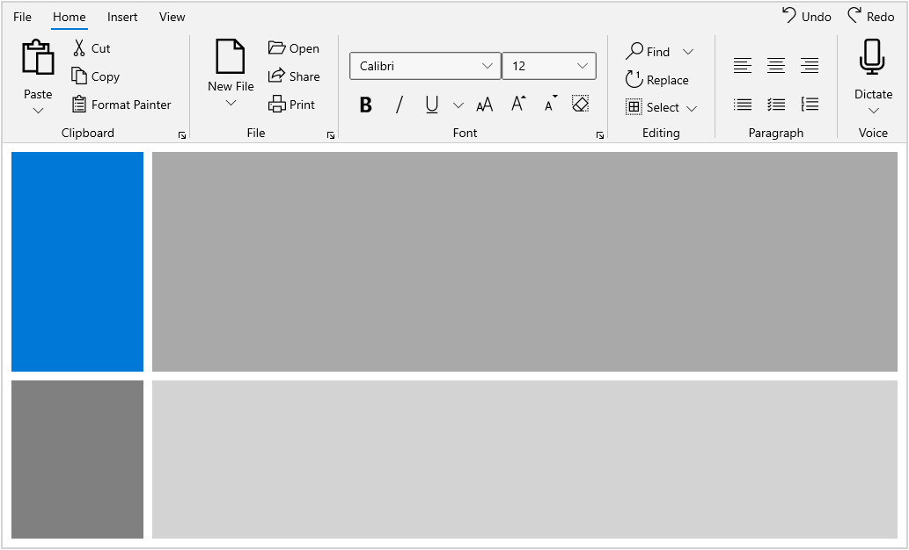
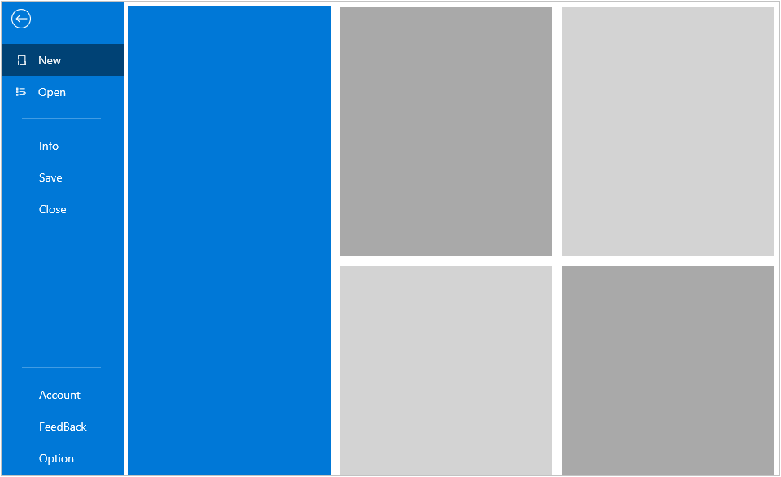

# WinUI Ribbon Overview

The Syncfusion Ribbon for WinUI is a command bar that organizes an application’s commands and tools into a series of tabs. It also supports a backstage view as like in Microsoft Office products.

## Key Features ##

* **Tab and Group:** Group and categorize the commands for your application using Ribbon Tabs and Ribbon Groups.
* **Backstage:** An additional view for user application to create custom views.
* **BackstageView:** Manage additional commands through a separate backstage view in the Ribbon.
* **Commands:** Commands can be provided as ribbon button, dropdown button, and split button Other controls can also be hosted.

 

 

