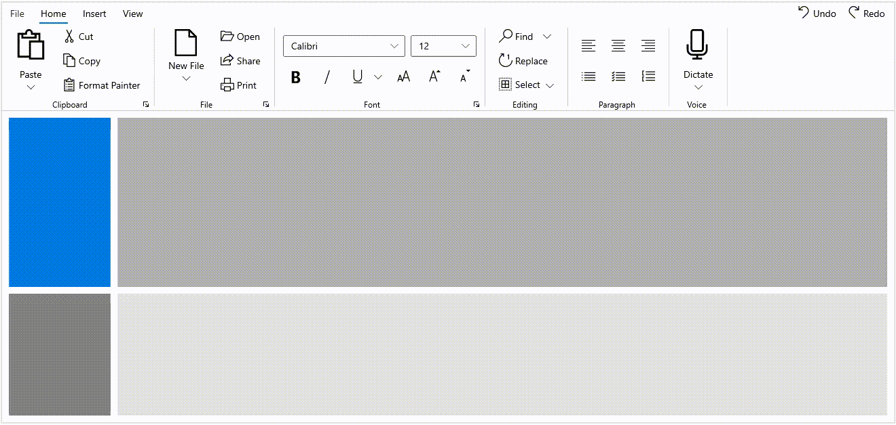

# WinUI Ribbon Overview

The Syncfusion [WinUI Ribbon](https://www.syncfusion.com/winui-controls/ribbon) is a command bar that organizes an application’s commands and tools into a series of tabs. It also supports a backstage view as like in Microsoft Office products.

## Key features 

* **Tab and Group:** Group and categorize the commands for your application using Ribbon Tabs and Ribbon Groups.
* **Backstage:** An additional view for user application to create custom views.
* **BackstageView:** Manage additional commands through a separate backstage view in the Ribbon.
* **Commands:** Commands can be provided as ribbon button, dropdown button, and split button Other controls can also be hosted.
* **Simplified Layout:** Provide a compact and simplified layout for the Ribbon by arranging the most-used commands in a single line and in less space.
* **RibbonGallery:** A simple and flexible ribbon gallery feature displays a collection of related commands similar to the gallery feature used in Microsoft Office.

 

 

