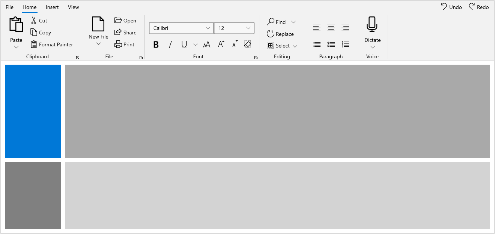
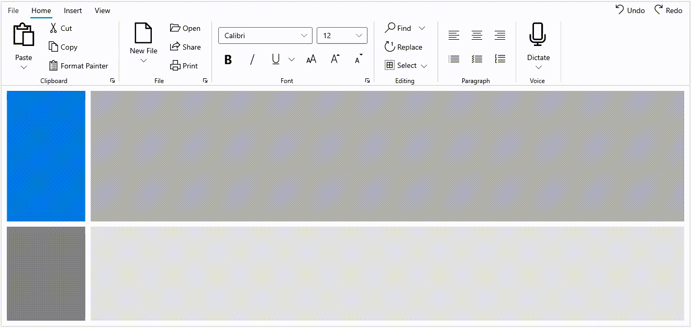

# WinUI Ribbon Overview

The Syncfusion&reg; [WinUI Ribbon](https://www.syncfusion.com/winui-controls/ribbon) is a command bar that organizes an application's commands and tools into a series of tabs. It also supports a backstage view similar to Microsoft Office products. For setup steps (NuGet package, namespaces), see [Getting Started with WinUI Ribbon](https://help.syncfusion.com/winui/ribbon/getting-started).

## Key features

* **RibbonTab and RibbonGroup:** Group and categorize the commands for the application using `RibbonTab`s and `RibbonGroup`s.
* **Backstage:** An additional view that lets you create custom views in your application.
* **BackstageView:** Manage additional commands through a separate backstage view in the Ribbon.
* **Commands:** Commands can be provided as ribbon buttons, dropdown buttons, and split buttons. Other controls can also be hosted.
* **Simplified Layout:** Provides a compact and simplified layout for the Ribbon by arranging the most-used commands in a single line and in less space. See [Simplified Layout](https://help.syncfusion.com/winui/ribbon/simplified-layout).
* **Compact Sizing:** Allows the Ribbon to be displayed in a smaller, condensed form for space-constrained scenarios. See [Compact Sizing](https://help.syncfusion.com/winui/ribbon/ribboncompactsizing).
* **Quick Access Toolbar (QAT):** Renders a set of commonly used ribbon items for quick access. See [Quick Access Toolbar](https://help.syncfusion.com/winui/ribbon/ribbon-qat).
* **KeyTips:** Supports keyboard navigation to activate ribbon elements via KeyTipService. See [Keyboard Navigation](https://help.syncfusion.com/winui/ribbon/ribbon-keytip).
* **RibbonGallery:** A simple and flexible ribbon gallery feature that displays a collection of related commands, similar to the gallery feature used in Microsoft Office. See [Ribbon Gallery](https://help.syncfusion.com/winui/ribbon/ribbongallery).

