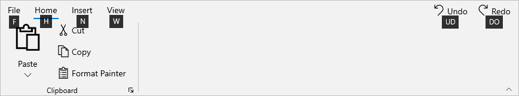
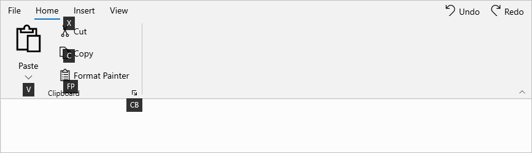
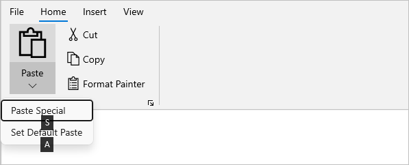
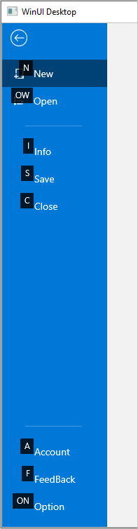

# KeyTip in WinUI Ribbon

The Syncfusion WinUI [SfRibbon](https://help.syncfusion.com/cr/winui/Syncfusion.UI.Xaml.Ribbon.SfRibbon.html) supports the keyboard navigation to activate the ribbon elements using KeyTip and it can be enabled by setting the `KeyTipService.EnableKeyTip` attached property as `True` to the ribbon control. 

The ribbon KeyTip can be activated through the keyboard by pressing the `Alt` or `F10` keys, and the KeyTip for the ribbon elements will be displayed.




<ribbon:SfRibbon 
        ribbon:KeyTipService.EnableKeyTip="True" />




When a control's KeyTip is activated, the following control action is executed:

* A ribbon tab’s KeyTip will select the tab.
* A ribbon gallery control's KeyTip will open the gallery.
* A backstage menu button KeyTip will open the ribbon backstage.
* Using a ribbon button and launcher button KeyTips will execute the button's command or Click event.
* Using the KeyTip of a RibbonDropDownButton and RibbonSplitButton will open the button's drop-down content.

## Creating KeyTip for ribbon

The `KeyTipService` in a ribbon represents the service that provides the attached properties to enable and manage the KeyTips to the ribbon control.

The KeyTip can be attached to the ribbon elements by using the `KeyTipService.AccessText` attached property. 

### Launcher button KeyTip

The KeyTip for the launcher button can be attached by using the `KeyTipService.LauncherButtonAccessText` attached property in a ribbon group.




<ribbon:SfRibbon ribbon:KeyTipService.EnableKeyTip="True">
    <ribbon:SfRibbon.Tabs>
        <ribbon:RibbonTab Header="Home" ribbon:KeyTipService.AccessText="H">
            <ribbon:RibbonGroup Header="Clipboard"
                                ribbon:KeyTipService.LauncherButtonAccessText="CB"
                                LauncherButtonClick="RibbonGroup_LauncherButtonClick">
                <ribbon:RibbonSplitButton Command="{Binding ButtonCommand}"
                                          CommandParameter="Paste"
                                          Content="Paste"
                                          DisplayOptions="Normal,Simplified"
                                          Icon="Paste"
                                          ribbon:KeyTipService.AccessText ="V"
                                          SizeMode="Large">
                    <ribbon:RibbonSplitButton.Flyout>
                        <MenuFlyout>
                            <MenuFlyoutItem Command="{Binding ButtonCommand}"
                                            CommandParameter="Paste -&gt;Paste Special"
                                            Text="Paste Special" 
                                            ribbon:KeyTipService.AccessText="S"/>
                            <MenuFlyoutItem Command="{Binding ButtonCommand}"
                                            CommandParameter="Paste -&gt; Set Default Paste"
                                            Text="Set Default Paste" 
                                            ribbon:KeyTipService.AccessText="A"/>
                        </MenuFlyout>
                    </ribbon:RibbonSplitButton.Flyout>
                </ribbon:RibbonSplitButton>
                <ribbon:RibbonButton Click="RibbonButton_Click"
                                         Content="Cut"
                                         DisplayOptions="Normal,Overflow"
                                         Icon="Cut"
                                         SizeMode="Normal"                                                             
                                         ribbon:KeyTipService.AccessText="X"/>
                <ribbon:RibbonButton Command="{Binding ButtonCommand}"
                                         CommandParameter="Copy"
                                         Content="Copy"
                                         DisplayOptions="Normal,Overflow"
                                         Icon="Copy"
                                         SizeMode="Normal" 
                                         ribbon:KeyTipService.AccessText="C"/>
                <ribbon:RibbonButton Command="{Binding ButtonCommand}"
                                         CommandParameter="Format Painter"
                                         Content="Format Painter"
                                         DisplayOptions="Normal,Simplified"
                                         SizeMode="Normal"
                                         ribbon:KeyTipService.AccessText="FP">
                        <ribbon:RibbonButton.Icon>
                            <FontIcon Glyph="&#xF0E3;" />
                        </ribbon:RibbonButton.Icon>
                </ribbon:RibbonButton>
            </ribbon:RibbonGroup>                
        </ribbon:RibbonTab>
        <ribbon:RibbonTab Header="Insert" 
                              ribbon:KeyTipService.AccessText="N"/>
        <ribbon:RibbonTab Header="View" 
                              ribbon:KeyTipService.AccessText="W"/>
    </ribbon:SfRibbon.Tabs>
    <ribbon:SfRibbon.RightPane>
        <StackPanel Orientation="Horizontal">
            <ribbon:RibbonButton Command="{Binding ButtonCommand}"
                                 CommandParameter="Undo"
                                 Content="Undo"
                                 Icon="Undo" 
                                 ribbon:KeyTipService.AccessText="UD"/>
            <ribbon:RibbonButton Command="{Binding ButtonCommand}"
                                 CommandParameter="Redo"
                                 Content="Redo"
                                 Icon="Redo" 
                                 ribbon:KeyTipService.AccessText="DO"/>
        </StackPanel>
    </ribbon:SfRibbon.RightPane>
</ribbon:SfRibbon>


using Syncfusion.UI.Xaml.Ribbon;

// Attach access text to the tab
RibbonTab homeTab = new RibbonTab();
homeTab.Header = "Home";
KeyTipService.SetAccessText(homeTab, "H");

// Attach access text to the button
RibbonButton copyButton = new RibbonButton();
copyButton.Content = "Copy";
copyButton.SizeMode = SizeMode.Normal;
copyButton.Icon = new SymbolIcon(Symbol.Copy);
KeyTipService.SetAccessText(copyButton, "C");

// Attach access text to the launcher button
RibbonGroup clipboardGroup = new RibbonGroup();
clipboardGroup.Header = "Clipboard";
KeyTipService.SetLauncherButtonAccessText(clipboardGroup, "FB");




## Backstage KeyTip

The KeyTip for the backstage menu button can be set in RibbonBackstage using the `KeyTipService.AccessText` attached property. The same property can be used to set the KeyTips of backstage items such as backstage button items and tab items.




<ribbon:SfRibbon.Backstage>
    <ribbon:RibbonBackstage ribbon:KeyTipService.AccessText="F" 
                            Target="{Binding ElementName=rootGrid}">
        <ribbon:BackstageView>
            <ribbon:BackstageView.Items>
                <ribbon:BackstageViewTabItem Header="New"
                                              Icon="NewFolder"
                                              ribbon:KeyTipService.AccessText="N"/>
                <ribbon:BackstageViewTabItem Header="Open"
                                             Icon="OpenWith"
                                             ribbon:KeyTipService.AccessText="OW"/>
                <ribbon:BackstageViewItemSeparator />
                <ribbon:BackstageViewTabItem Header="Info"
                                             ribbon:KeyTipService.AccessText="I"/>
                <ribbon:BackstageViewButtonItem Command="{Binding SaveCommand}"
                                                CommandParameter="{Binding ElementName=simplifiedRibbon}"
                                                Header="Save" 
                                                ribbon:KeyTipService.AccessText="S"/>
                <ribbon:BackstageViewButtonItem Command="{Binding CloseButtonCommand}"
                                                CommandParameter="{Binding ElementName=simplifiedRibbon}"
                                                Header="Close" 
                                                ribbon:KeyTipService.AccessText="C"/>
                </ribbon:BackstageView.Items>
                <ribbon:BackstageView.FooterItems>
                    <ribbon:BackstageViewItemSeparator />
                    <ribbon:BackstageViewTabItem Header="Account"
                                                 ribbon:KeyTipService.AccessText="A"/>
                    <ribbon:BackstageViewTabItem Header="FeedBack"
                                                 ribbon:KeyTipService.AccessText="F"/> 
                    <ribbon:BackstageViewButtonItem Command="{Binding OptionCommand}"
                                                    CommandParameter="{Binding ElementName=simplifiedRibbon}"
                                                    Header="Option" 
                                                    ribbon:KeyTipService.AccessText="ON"/>
                    </ribbon:BackstageView.FooterItems>
                </ribbon:BackstageView>
    </ribbon:RibbonBackstage>
</ribbon:SfRibbon.Backstage>



using Syncfusion.UI.Xaml.Ribbon;

// Attach access text to the backstage menu button
RibbonBackstage ribbonBackstage = new RibbonBackstage();
KeyTipService.SetAccessText(ribbonBackstage, "F");

// Attach access text to the backstage view tab item
BackstageViewTabItem newTabItem = new BackstageViewTabItem();
newTabItem.Content = "New";
newTabItem.Icon = new SymbolIcon(Symbol.NewFolder);
KeyTipService.SetAccessText(newTabItem, "N");

// Attach access text to the backstage view button
BackstageViewButtonItem closeButton = new BackstageViewButtonItem();
closeButton.Content = "Close";
closeButton.Icon = new SymbolIcon(Symbol.Clear);
KeyTipService.SetAccessText(closeButton, "C");




## Rules for defining KeyTips

*	The KeyTip access text to the ribbon elements can have a maximum of three letters. A deviation from the text count (>3)        results in an exception.

*	Avoid using the same KeyTip access text setting on multiple elements. 

    For example, when you attach the access text H, H or HF, HF in the same layer, the first H KeyTip associated element in the layer is activated while the other H or HF associated element is ignored.

*	Furthermore, do not use the same first letter for the single and double access text elements.

    For example, if you attach the access text F, FP and FPF to the two elements and then press the F key, only the F KeyTip associated element will be activated, while the FP, FPF associated elements will be ignored.

N> The KeyTip action cannot be activated for ribbon disabled elements, but we can set access text to the disabled elements and have the KeyTip appear disabled.

