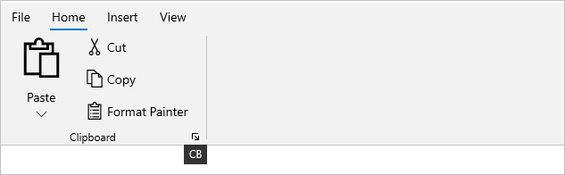

# Keyboard Navigation in WinUI Ribbon

The Syncfusion WinUI [SfRibbon](https://help.syncfusion.com/cr/winui/Syncfusion.UI.Xaml.Ribbon.SfRibbon.html) supports the keyboard navigation to activate the ribbon elements via KeyTipService, which represents the service that provides the attached properties to enable and manage the KeyTips to the ribbon control. 

KeyTips, also known as access keys or accelerators, are shortcut key combinations that are used to activate the ribbon's tabs and buttons, as well as the Backstage file menu.

The key tip service can be enabled to the ribbon by setting the attached property `KeyTipService.EnableKeyTip` to `True`.

The ribbon key tip service can be activated through the keyboard by pressing the `Alt` or `F10` keys, and the KeyTip for the ribbon elements will be displayed.




<ribbon:SfRibbon 
        ribbon:KeyTipService.EnableKeyTip="True" />




When a control's access text is activated, the following control action is executed:

* The access text of a ribbon tab selects the tab.
* The access text of a ribbon gallery control opens the gallery.
* The backstage menu button's access text opens the ribbon backstage.
* When the ribbon button or launcher button access text is activated, the command or Click event is executed.
* The access text of the RibbonDropDownButton and RibbonSplitButton opens the drop-down content of the button.

## Creating key tip for ribbon

The access text can be attached to the ribbon elements by using the `KeyTipService.AccessText` attached property. 

* Ribbon tab access text can be defined in the [RibbonTab](https://help.syncfusion.com/cr/winui/Syncfusion.UI.Xaml.Ribbon.RibbonTab.html) class. 
* Access text for ribbon items such as ribbon buttons, drop-down buttons, and split buttons can be set in the corresponding control class.




<ribbon:SfRibbon ribbon:KeyTipService.EnableKeyTip="True">
    <ribbon:SfRibbon.Tabs>
        <ribbon:RibbonTab Header="Home" ribbon:KeyTipService.AccessText="H">
            <ribbon:RibbonGroup Header="Clipboard">
                <ribbon:RibbonSplitButton Command="{Binding ButtonCommand}"
                                          CommandParameter="Paste"
                                          Content="Paste"
                                          DisplayOptions="Normal,Simplified"
                                          Icon="Paste"
                                          ribbon:KeyTipService.AccessText ="V"
                                          SizeMode="Large">
                    <ribbon:RibbonSplitButton.Flyout>
                        <MenuFlyout>
                            <MenuFlyoutItem Command="{Binding ButtonCommand}"
                                            CommandParameter="Paste -&gt;Paste Special"
                                            Text="Paste Special" 
                                            ribbon:KeyTipService.AccessText="S"/>
                            <MenuFlyoutItem Command="{Binding ButtonCommand}"
                                            CommandParameter="Paste -&gt; Set Default Paste"
                                            Text="Set Default Paste" 
                                            ribbon:KeyTipService.AccessText="A"/>
                        </MenuFlyout>
                    </ribbon:RibbonSplitButton.Flyout>
                </ribbon:RibbonSplitButton>
                <ribbon:RibbonButton Click="RibbonButton_Click"
                                         Content="Cut"
                                         DisplayOptions="Normal,Overflow"
                                         Icon="Cut"
                                         SizeMode="Normal"                                                             
                                         ribbon:KeyTipService.AccessText="X"/>
                <ribbon:RibbonButton Command="{Binding ButtonCommand}"
                                         CommandParameter="Copy"
                                         Content="Copy"
                                         DisplayOptions="Normal,Overflow"
                                         Icon="Copy"
                                         SizeMode="Normal" 
                                         ribbon:KeyTipService.AccessText="C"/>
                <ribbon:RibbonButton Command="{Binding ButtonCommand}"
                                         CommandParameter="Format Painter"
                                         Content="Format Painter"
                                         DisplayOptions="Normal,Simplified"
                                         SizeMode="Normal"
                                         ribbon:KeyTipService.AccessText="FP">
                        <ribbon:RibbonButton.Icon>
                            <FontIcon Glyph="&#xF0E3;" />
                        </ribbon:RibbonButton.Icon>
                </ribbon:RibbonButton>
            </ribbon:RibbonGroup>                
        </ribbon:RibbonTab>
        <ribbon:RibbonTab Header="Insert" 
                              ribbon:KeyTipService.AccessText="N"/>
        <ribbon:RibbonTab Header="View" 
                              ribbon:KeyTipService.AccessText="W"/>
    </ribbon:SfRibbon.Tabs>
    <ribbon:SfRibbon.RightPane>
        <StackPanel Orientation="Horizontal">
            <ribbon:RibbonButton Command="{Binding ButtonCommand}"
                                 CommandParameter="Undo"
                                 Content="Undo"
                                 Icon="Undo" 
                                 ribbon:KeyTipService.AccessText="UD"/>
            <ribbon:RibbonButton Command="{Binding ButtonCommand}"
                                 CommandParameter="Redo"
                                 Content="Redo"
                                 Icon="Redo" 
                                 ribbon:KeyTipService.AccessText="DO"/>
        </StackPanel>
    </ribbon:SfRibbon.RightPane>
</ribbon:SfRibbon>



### Launcher button key tip

The access text for the launcher button can be attached by using the `KeyTipService.LauncherButtonAccessText` attached property in a ribbon group.




<ribbon:RibbonGroup Header="Clipboard"
                    ribbon:KeyTipService.LauncherButtonAccessText="CB"
                    LauncherButtonClick="RibbonGroup_LauncherButtonClick">
                ...
</ribbon:RibbonGroup> 
       



## Backstage key tip

The access text for the backstage menu button can be set in [RibbonBackstage](https://help.syncfusion.com/cr/winui/Syncfusion.UI.Xaml.Ribbon.RibbonBackstage.html) using the `KeyTipService.AccessText` attached property. 

The same property can be used to set the access text for backstage items such as backstage button items and tab items.




<ribbon:SfRibbon.Backstage>
    <ribbon:RibbonBackstage ribbon:KeyTipService.AccessText="F" 
                            Target="{Binding ElementName=rootGrid}">
        <ribbon:BackstageView>
            <ribbon:BackstageView.Items>
                <ribbon:BackstageViewTabItem Header="New"
                                              Icon="NewFolder"
                                              ribbon:KeyTipService.AccessText="N"/>
                <ribbon:BackstageViewTabItem Header="Open"
                                             Icon="OpenWith"
                                             ribbon:KeyTipService.AccessText="OW"/>
                <ribbon:BackstageViewItemSeparator />
                <ribbon:BackstageViewTabItem Header="Info"
                                             ribbon:KeyTipService.AccessText="I"/>
                <ribbon:BackstageViewButtonItem Command="{Binding SaveCommand}"
                                                CommandParameter="{Binding ElementName=simplifiedRibbon}"
                                                Header="Save" 
                                                ribbon:KeyTipService.AccessText="S"/>
                <ribbon:BackstageViewButtonItem Command="{Binding CloseButtonCommand}"
                                                CommandParameter="{Binding ElementName=simplifiedRibbon}"
                                                Header="Close" 
                                                ribbon:KeyTipService.AccessText="C"/>
                </ribbon:BackstageView.Items>
                <ribbon:BackstageView.FooterItems>
                    <ribbon:BackstageViewItemSeparator />
                    <ribbon:BackstageViewTabItem Header="Account"
                                                 ribbon:KeyTipService.AccessText="A"/>
                    <ribbon:BackstageViewTabItem Header="FeedBack"
                                                 ribbon:KeyTipService.AccessText="F"/> 
                    <ribbon:BackstageViewButtonItem Command="{Binding OptionCommand}"
                                                    CommandParameter="{Binding ElementName=simplifiedRibbon}"
                                                    Header="Option" 
                                                    ribbon:KeyTipService.AccessText="ON"/>
                    </ribbon:BackstageView.FooterItems>
                </ribbon:BackstageView>
    </ribbon:RibbonBackstage>
</ribbon:SfRibbon.Backstage>




## Rules for defining key tips

*	The access text to the ribbon elements can have a maximum of three letters. A deviation from the text count (>3)        results in an exception.

*	Avoid using the same key tip access text setting on multiple elements. 

    For example, when you attach the access text H, H or HF, HF in the same layer, the first H key tip associated element in the layer is activated while the other H or HF associated element is ignored.

*	Furthermore, do not use the same first letter for the single and double access text elements.

    For example, if you attach the access text F, FP and FPF to the two elements and then press the F key, only the F key tip associated element will be activated, while the FP, FPF associated elements will be ignored.

N> The key tip action cannot be executed for ribbon disabled elements, but we can set access text to the disabled elements and have the key tip appear disabled.

