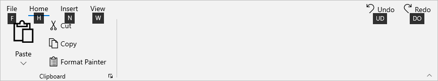
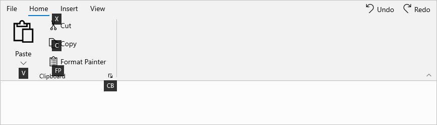
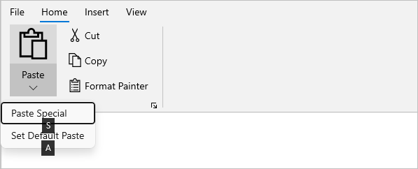
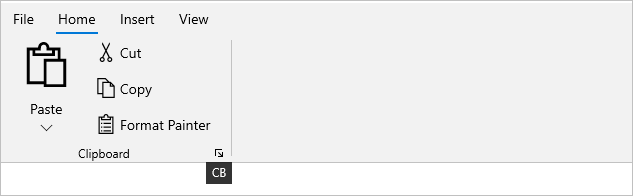
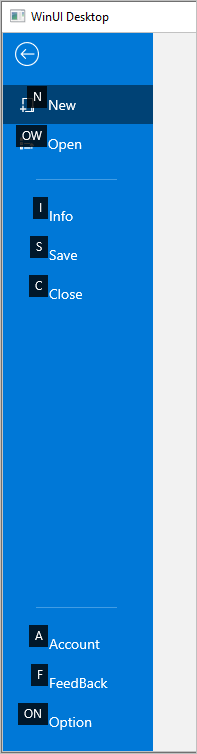

# Keyboard Navigation in WinUI Ribbon

The Syncfusion&reg; WinUI [SfRibbon](https://help.syncfusion.com/cr/winui/Syncfusion.UI.Xaml.Ribbon.SfRibbon.html) supports keyboard navigation to activate the ribbon elements via [KeyTipService](https://help.syncfusion.com/cr/winui/Syncfusion.UI.Xaml.Ribbon.KeyTipService.html), which represents the service that provides the attached properties to enable and manage the KeyTips on the ribbon control. 

KeyTips, also known as access keys or accelerators, are shortcut key combinations that are used to activate the ribbon's tabs and buttons, as well as the Backstage file menu.

The KeyTip service can be enabled on the ribbon by setting the attached property `KeyTipService.EnableKeyTip` to `True`. By default, `KeyTipService.EnableKeyTip` is `False`.

The ribbon KeyTip service can be activated through the keyboard by pressing the `Alt` or `F10` keys, and the KeyTip for the ribbon elements will be displayed.




<ribbon:SfRibbon 
        ribbon:KeyTipService.EnableKeyTip="True" />




When a control's access text is activated, the following control action is executed:

* The access text of a ribbon tab selects the tab.
* The access text of a ribbon gallery control opens the gallery.
* The backstage menu button's access text opens the ribbon backstage.
* When the ribbon button or launcher button access text is activated, the command or Click event is executed.
* The access text of the RibbonDropDownButton and RibbonSplitButton opens the drop-down content of the button.

## Creating key tip for ribbon

The access text can be set on the ribbon elements by using the `KeyTipService.AccessText` attached property. 

* Ribbon tab access text can be set on the [RibbonTab](https://help.syncfusion.com/cr/winui/Syncfusion.UI.Xaml.Ribbon.RibbonTab.html) class. 
* Access text for ribbon items such as ribbon buttons, drop-down buttons, split buttons, `RibbonToggleButton`, `RibbonGallery`, and `RibbonItemHost` can be set on the corresponding control class.




<ribbon:SfRibbon ribbon:KeyTipService.EnableKeyTip="True">
    <ribbon:SfRibbon.Tabs>
        <ribbon:RibbonTab Header="Home" ribbon:KeyTipService.AccessText="H">
            <ribbon:RibbonGroup Header="Clipboard">
                <ribbon:RibbonSplitButton Command="{Binding ButtonCommand}"
                                          CommandParameter="Paste"
                                          Content="Paste"
                                          DisplayOptions="Normal,Simplified"
                                          Icon="Paste"
                                          ribbon:KeyTipService.AccessText ="V"
                                          AllowedSizeModes="Large">
                    <ribbon:RibbonSplitButton.Flyout>
                        <MenuFlyout>
                            <MenuFlyoutItem Command="{Binding ButtonCommand}"
                                            CommandParameter="Paste -&gt;Paste Special"
                                            Text="Paste Special" 
                                            ribbon:KeyTipService.AccessText="S"/>
                            <MenuFlyoutItem Command="{Binding ButtonCommand}"
                                            CommandParameter="Paste -&gt; Set Default Paste"
                                            Text="Set Default Paste" 
                                            ribbon:KeyTipService.AccessText="A"/>
                        </MenuFlyout>
                    </ribbon:RibbonSplitButton.Flyout>
                </ribbon:RibbonSplitButton>
                <ribbon:RibbonButton Click="RibbonButton_Click"
                                         Content="Cut"
                                         DisplayOptions="Normal,Overflow"
                                         Icon="Cut"
                                         AllowedSizeModes="Normal"                                                             
                                         ribbon:KeyTipService.AccessText="X"/>
                <ribbon:RibbonButton Command="{Binding ButtonCommand}"
                                         CommandParameter="Copy"
                                         Content="Copy"
                                         DisplayOptions="Normal,Overflow"
                                         Icon="Copy"
                                         AllowedSizeModes="Normal" 
                                         ribbon:KeyTipService.AccessText="C"/>
                <ribbon:RibbonButton Command="{Binding ButtonCommand}"
                                         CommandParameter="Format Painter"
                                         Content="Format Painter"
                                         DisplayOptions="Normal,Simplified"
                                         AllowedSizeModes="Normal"
                                         ribbon:KeyTipService.AccessText="FP">
                        <ribbon:RibbonButton.Icon>
                            <FontIcon Glyph="&#xF0E3;" />
                        </ribbon:RibbonButton.Icon>
                </ribbon:RibbonButton>
            </ribbon:RibbonGroup>                
        </ribbon:RibbonTab>
        <ribbon:RibbonTab Header="Insert" 
                              ribbon:KeyTipService.AccessText="N"/>
        <ribbon:RibbonTab Header="View" 
                              ribbon:KeyTipService.AccessText="W"/>
    </ribbon:SfRibbon.Tabs>
    <ribbon:SfRibbon.RightPane>
        <StackPanel Orientation="Horizontal">
            <ribbon:RibbonButton Command="{Binding ButtonCommand}"
                                 CommandParameter="Undo"
                                 Content="Undo"
                                 Icon="Undo" 
                                 ribbon:KeyTipService.AccessText="UD"/>
            <ribbon:RibbonButton Command="{Binding ButtonCommand}"
                                 CommandParameter="Redo"
                                 Content="Redo"
                                 Icon="Redo" 
                                 ribbon:KeyTipService.AccessText="DO"/>
        </StackPanel>
    </ribbon:SfRibbon.RightPane>
</ribbon:SfRibbon>



### Launcher button key tip

The access text for the launcher button can be set by using the `KeyTipService.LauncherButtonAccessText` attached property in a ribbon group.




<ribbon:RibbonGroup Header="Clipboard"
                    ribbon:KeyTipService.LauncherButtonAccessText="CB"
                    LauncherButtonClick="RibbonGroup_LauncherButtonClick">
                ...
</ribbon:RibbonGroup> 
       



## Backstage key tip

The access text for the backstage menu button can be set on [RibbonBackstage](https://help.syncfusion.com/cr/winui/Syncfusion.UI.Xaml.Ribbon.RibbonBackstage.html) using the `KeyTipService.AccessText` attached property. 

The same property can be used to set the access text for backstage items such as backstage button items and tab items. The `Target` property of `RibbonBackstage` specifies the element over which the backstage view is rendered; see [Backstage](https://help.syncfusion.com/winui/ribbon/backstage) for details.




<ribbon:SfRibbon.Backstage>
    <ribbon:RibbonBackstage ribbon:KeyTipService.AccessText="F" 
                            Target="{Binding ElementName=rootGrid}">
        <ribbon:BackstageView>
            <ribbon:BackstageView.Items>
                <ribbon:BackstageViewTabItem Header="New"
                                              Icon="NewFolder"
                                              ribbon:KeyTipService.AccessText="N"/>
                <ribbon:BackstageViewTabItem Header="Open"
                                             Icon="OpenWith"
                                             ribbon:KeyTipService.AccessText="OW"/>
                <ribbon:BackstageViewItemSeparator />
                <ribbon:BackstageViewTabItem Header="Info"
                                             ribbon:KeyTipService.AccessText="I"/>
                <ribbon:BackstageViewButtonItem Command="{Binding SaveCommand}"
                                                CommandParameter="{Binding ElementName=simplifiedRibbon}"
                                                Header="Save" 
                                                ribbon:KeyTipService.AccessText="S"/>
                <ribbon:BackstageViewButtonItem Command="{Binding CloseButtonCommand}"
                                                CommandParameter="{Binding ElementName=simplifiedRibbon}"
                                                Header="Close" 
                                                ribbon:KeyTipService.AccessText="C"/>
                </ribbon:BackstageView.Items>
                <ribbon:BackstageView.FooterItems>
                    <ribbon:BackstageViewItemSeparator />
                    <ribbon:BackstageViewTabItem Header="Account"
                                                 ribbon:KeyTipService.AccessText="A"/>
                    <ribbon:BackstageViewTabItem Header="FeedBack"
                                                 ribbon:KeyTipService.AccessText="F"/> 
                    <ribbon:BackstageViewButtonItem Command="{Binding OptionCommand}"
                                                    CommandParameter="{Binding ElementName=simplifiedRibbon}"
                                                    Header="Option" 
                                                    ribbon:KeyTipService.AccessText="ON"/>
                    </ribbon:BackstageView.FooterItems>
                </ribbon:BackstageView>
    </ribbon:RibbonBackstage>
</ribbon:SfRibbon.Backstage>




## Rules for defining key tips

* The access text on the ribbon elements can have a maximum of three letters. A key tip with more than three characters results in an exception.

* Avoid using the same key tip access text on multiple elements within the same layer. 

    For example, when you set the access text `H` on two elements, or `HF` on two elements in the same layer, the first `H`-associated element in the layer is activated, while the other `H`-associated element is ignored.

* Do not use the same first letter for single- and multi-character access text elements.

    For example, if you set the access text `F` on one element and `FP` or `FPF` on another element in the same layer, only the `F`-associated element will be activated when the `F` key is pressed, while the `FP`/`FPF`-associated elements will be ignored.

N> The key tip action cannot be executed for disabled ribbon elements, but access text can still be set on disabled elements. The key tip will appear visually disabled.

