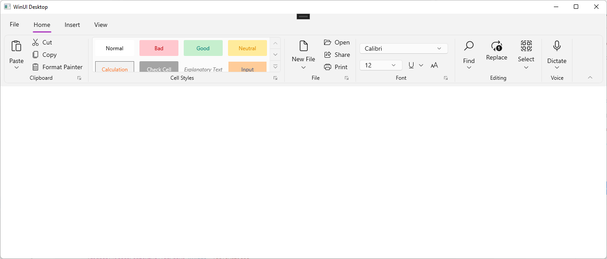

# Compact Sizing in WinUI Ribbon

There are two types of spacing support for WinUI Ribbon control.
1. [Standard](https://docs.microsoft.com/en-us/windows/apps/design/style/spacing#fluent-standard-sizing) - to accommodate both touch and pointer input.
2. [Compact](https://docs.microsoft.com/en-us/windows/apps/design/style/spacing#fluent-compact-sizing) - designed primarily to accommodate pointer input.

The Compact sizing feature in the Ribbon control allows you to display the ribbon in a smaller, more condensed form. This can be useful for scenarios where you need to save space on the user interface or make the ribbon more accessible on smaller screens.

## Applying compact sizing for Ribbon control

Compact sizing is implemented through a unique resource dictionary that can be specified in your application at either the page level or a specific layout. The resource dictionary is available in the WinUI Nuget package.

The following examples show how the Compact style can be applied for the window and an individual Grid control.

### Window level




<Window.Resources>
      <ResourceDictionary Source="ms-appx:///Microsoft.UI.Xaml/DensityStyles/Compact.xaml" />
      <ResourceDictionary Source="ms-appx:///Syncfusion.Core.WinUI/Themes/DensityStyles/Compact.xaml" />
</Window.Resources>




### Grid level




<Grid>
    <Grid.Resources>
        <ResourceDictionary Source="ms-appx:///Microsoft.UI.Xaml/DensityStyles/Compact.xaml" />
        <ResourceDictionary Source="ms-appx:///Syncfusion.Core.WinUI/Themes/DensityStyles/Compact.xaml" />
    </Grid.Resources>
</Grid>




## Compact Sizing applied areas in Ribbon control

When Compact styling is applied, elements such as buttons and other controls may be displayed at a smaller size, and layout elements such as height, width and spacing  may be rearranged to take up less space.

* RibbonButton.
* RibbonDropDownButton.
* RibbonSplitButton.
* RibbonComboBox.
* RibbonGallery.
* Spacing between buttons in RibbonGroup.
* RibbonTabContentAreaHeight.

