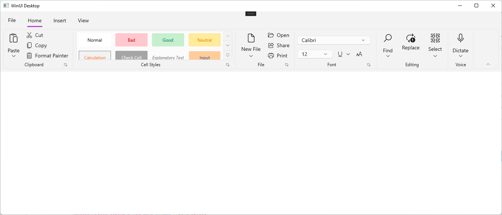

# Compact Sizing in WinUI Ribbon

The WinUI Ribbon control supports two types of spacing:

1. [Standard](https://learn.microsoft.com/en-us/windows/apps/design/style/spacing#fluent-standard-sizing) - Accommodates both touch and pointer input.
2. [Compact](https://learn.microsoft.com/en-us/windows/apps/design/style/spacing#fluent-compact-sizing) - Designed primarily to accommodate pointer input.

The default spacing mode is **Standard**.

The Compact sizing feature in the Ribbon control allows you to display the ribbon in a smaller, more condensed form. This can be useful for scenarios where you need to save space on the user interface or make the ribbon more accessible on smaller screens.

For setup prerequisites (NuGet packages, namespaces), see [Getting Started with WinUI Ribbon](https://help.syncfusion.com/winui/ribbon/getting-started).

## Applying compact sizing for the Ribbon control

Compact sizing is implemented through resource dictionaries that can be specified in your application at either the page level or a specific layout. Two resource dictionaries are required: one from the `Microsoft.UI.Xaml` NuGet package (for WinUI controls) and one from the `Syncfusion.Core.WinUI` NuGet package (for Syncfusion controls). Both `Microsoft.UI.Xaml` and `Syncfusion.Core.WinUI` NuGet packages must be referenced in your project for these resource dictionaries to be available.

The following examples show how the Compact style can be applied to the window or an individual `Grid` control.

### Window level




<Window.Resources>
      <ResourceDictionary Source="ms-appx:///Microsoft.UI.Xaml/DensityStyles/Compact.xaml" />
      <ResourceDictionary Source="ms-appx:///Syncfusion.Core.WinUI/Themes/DensityStyles/Compact.xaml" />
</Window.Resources>




### Grid level




<Grid>
    <Grid.Resources>
        <ResourceDictionary Source="ms-appx:///Microsoft.UI.Xaml/DensityStyles/Compact.xaml" />
        <ResourceDictionary Source="ms-appx:///Syncfusion.Core.WinUI/Themes/DensityStyles/Compact.xaml" />
    </Grid.Resources>
</Grid>




## Areas affected by Compact Sizing in the Ribbon control

When Compact styling is applied, elements such as buttons and other controls are displayed at a smaller size, and layout properties such as height, width, and spacing are rearranged to take up less space. The following ribbon elements are affected:

* `RibbonButton`
* `RibbonDropDownButton`
* `RibbonSplitButton`
* `RibbonComboBox`
* `RibbonGallery`
* Spacing between buttons in `RibbonGroup`
* `RibbonTabContentAreaHeight`

