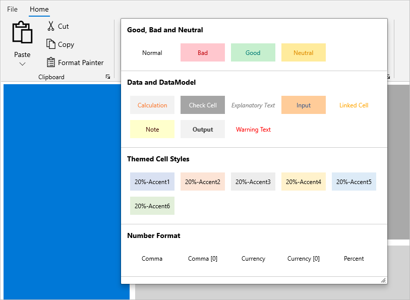
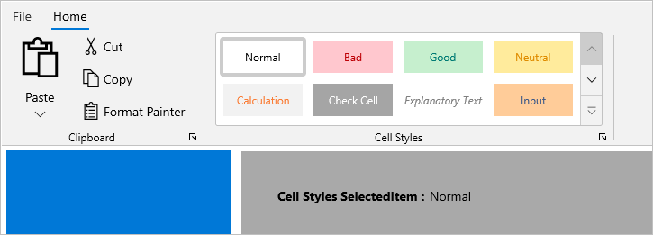
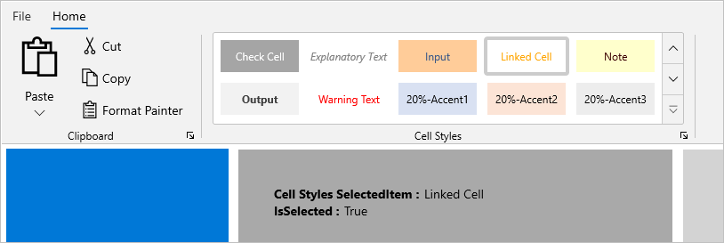
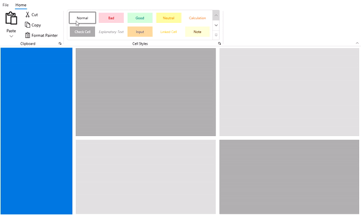
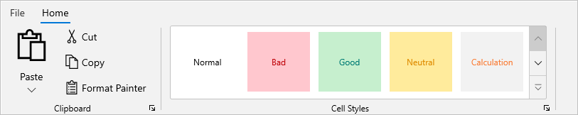
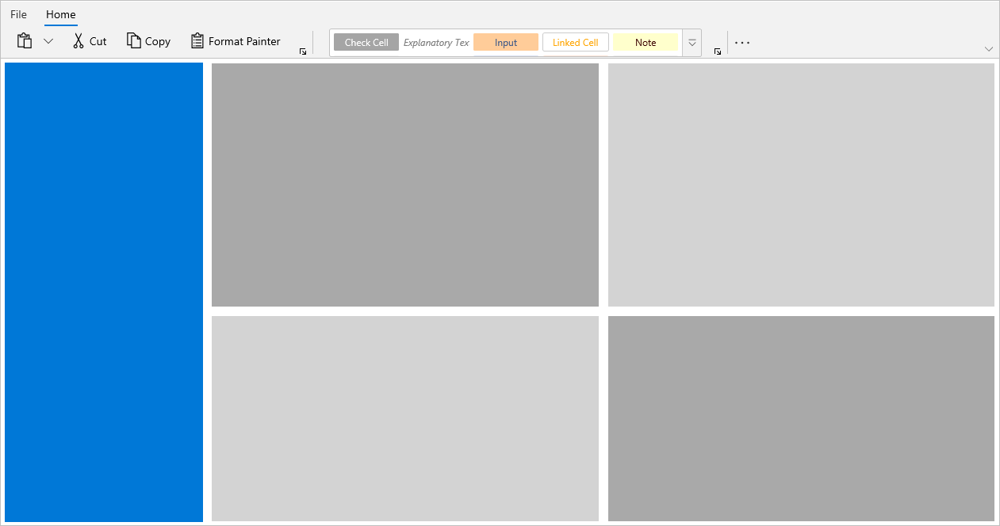

# RibbonGallery with WinUI Ribbon (SfRibbon)

The [RibbonGallery](https://help.syncfusion.com/cr/winui/Syncfusion.UI.Xaml.Ribbon.RibbonGallery.html) displays a list of scrollable gallery items or commands in a visually rich format that can be organized as multiple subsets of categorized items in a Ribbon control.

## Add gallery item

The [RibbonGalleryItem](https://help.syncfusion.com/cr/winui/Syncfusion.UI.Xaml.Ribbon.RibbonGalleryItem.html) can be added by using the `Items` property of the RibbonGallery control. The RibbonGallery allows you to view all gallery items in a Popup by clicking the expand button in a control.



<ribbon:RibbonGroup Header="Cell Styles">
    <ribbon:RibbonGallery ItemHeight="48"
                          ItemWidth="100">
        <ribbon:RibbonGallery.Items>
            <ribbon:RibbonGalleryItem HorizontalContentAlignment="Center"
                                      VerticalContentAlignment="Center"
                                      Background="White"
                                      Content="Normal"
                                      Foreground="Black" />
            <ribbon:RibbonGalleryItem HorizontalContentAlignment="Center"
                                      VerticalContentAlignment="Center"
                                      Background="#ffc7ce"
                                      Content="Bad"
                                      Foreground="#be0006" />
            <ribbon:RibbonGalleryItem HorizontalContentAlignment="Center"
                                      VerticalContentAlignment="Center"
                                      Background="#c6efce"
                                      Content="Good"
                                      Foreground="#007b74" />
            <ribbon:RibbonGalleryItem HorizontalContentAlignment="Center"
                                      VerticalContentAlignment="Center"
                                      Background="#ffeb9c"
                                      Content="Neutral"
                                      Foreground="#df8c00" />
            <ribbon:RibbonGalleryItem Content="Calculation"
                                      Background="#f2f2f2"
                                      HorizontalContentAlignment="Center"
                                      VerticalContentAlignment="Center"
                                      Foreground="#fa7d36" />
            <ribbon:RibbonGalleryItem HorizontalContentAlignment="Center"
                                      VerticalContentAlignment="Center"
                                      Background="#a5a5a5"
                                      Content="Check Cell"
                                      Foreground="White" />
            <ribbon:RibbonGalleryItem HorizontalContentAlignment="Center"
                                      VerticalContentAlignment="Center"
                                      Foreground="#7f7f7f"
                                      Content="Explanatory Text"
                                      FontStyle="Italic" />
            <ribbon:RibbonGalleryItem Content="Input"
                                      HorizontalContentAlignment="Center"
                                      VerticalContentAlignment="Center"
                                      Foreground="#3f5a88"
                                      Background="#ffcc99" />
            <ribbon:RibbonGalleryItem HorizontalContentAlignment="Center"
                                      VerticalContentAlignment="Center"
                                      Content="Linked Cell"
                                      Foreground="Orange" />
            <ribbon:RibbonGalleryItem  Background="#ffffcc"
                                       Content="Note"
                                       HorizontalContentAlignment="Center"
                                       VerticalContentAlignment="Center"
                                       Foreground="#3a0000" />
            <ribbon:RibbonGalleryItem Content="Output"
                                      Background="#f2f2f2"
                                      FontWeight="Bold"
                                      Foreground="#3f3f3f"
                                      HorizontalContentAlignment="Center"
                                      VerticalContentAlignment="Center" />
            <ribbon:RibbonGalleryItem HorizontalContentAlignment="Center"
                                      VerticalContentAlignment="Center"
                                      Content="Warning Text"
                                      Foreground="Red" />
        </ribbon:RibbonGallery.Items>
    </ribbon:RibbonGallery>
</ribbon:RibbonGroup>



## Group Gallery Item

The [RibbonGallery](https://help.syncfusion.com/cr/winui/Syncfusion.UI.Xaml.Ribbon.RibbonGallery.html) includes built-in grouping support, allowing you to organize gallery items in a gallery popup based on the `GroupName` property value. By clicking the expand button in a RibbonGallery, you can view the entire gallery (either grouped or non-grouped) items in a resizable popup view. You can view all of the gallery items in a RibbonGallery view by using the scroll up and down buttons.



<ribbon:RibbonGallery ItemHeight="48"
                      ItemWidth="100">
    <ribbon:RibbonGallery.Items>
        <ribbon:RibbonGalleryItem HorizontalContentAlignment="Center"
                                  VerticalContentAlignment="Center"
                                  Background="White"
                                  GroupName="Good, Bad and Neutral"
                                  Content="Normal"
                                  Foreground="Black" />
        <ribbon:RibbonGalleryItem HorizontalContentAlignment="Center"
                                  VerticalContentAlignment="Center"
                                  Background="#ffc7ce"
                                  Content="Bad"
                                  GroupName="Good, Bad and Neutral"
                                  Foreground="#be0006" />
        <ribbon:RibbonGalleryItem HorizontalContentAlignment="Center"
                                  VerticalContentAlignment="Center"
                                  Background="#c6efce"
                                  Content="Good"
                                  GroupName="Good, Bad and Neutral"
                                  Foreground="#007b74" />
        <ribbon:RibbonGalleryItem HorizontalContentAlignment="Center"
                                  VerticalContentAlignment="Center"
                                  Background="#ffeb9c"
                                  Content="Neutral"
                                  GroupName="Good, Bad and Neutral"
                                  Foreground="#df8c00" />
        <ribbon:RibbonGalleryItem Content="Calculation"
                                  Background="#f2f2f2"
                                  GroupName="Data and DataModel"
                                  HorizontalContentAlignment="Center"
                                  VerticalContentAlignment="Center"
                                  Foreground="#fa7d36" />
        <ribbon:RibbonGalleryItem HorizontalContentAlignment="Center"
                                  VerticalContentAlignment="Center"
                                  Background="#a5a5a5"
                                  Content="Check Cell"
                                  GroupName="Data and DataModel"
                                  Foreground="White" />
        <ribbon:RibbonGalleryItem HorizontalContentAlignment="Center"
                                  VerticalContentAlignment="Center"
                                  Foreground="#7f7f7f"
                                  GroupName="Data and DataModel"
                                  Content="Explanatory Text"
                                  FontStyle="Italic" />
        <ribbon:RibbonGalleryItem Content="Input"
                                  GroupName="Data and DataModel"
                                  HorizontalContentAlignment="Center"
                                  VerticalContentAlignment="Center"
                                  Foreground="#3f5a88"
                                  Background="#ffcc99" />
        <ribbon:RibbonGalleryItem HorizontalContentAlignment="Center"
                                  VerticalContentAlignment="Center"
                                  Content="Linked Cell"
                                  GroupName="Data and DataModel"
                                  Foreground="Orange" />
        <ribbon:RibbonGalleryItem  Background="#ffffcc"
                                   Content="Note"
                                   GroupName="Data and DataModel"
                                   HorizontalContentAlignment="Center"
                                   VerticalContentAlignment="Center"
                                   Foreground="#3a0000" />
        <ribbon:RibbonGalleryItem Content="Output"
                                  Background="#f2f2f2"
                                  GroupName="Data and DataModel"
                                  FontWeight="Bold"
                                  Foreground="#3f3f3f"
                                  HorizontalContentAlignment="Center"
                                  VerticalContentAlignment="Center" />
        <ribbon:RibbonGalleryItem HorizontalContentAlignment="Center"
                                  VerticalContentAlignment="Center"
                                  Content="Warning Text"
                                  GroupName="Data and DataModel"
                                  Foreground="Red" />
        <ribbon:RibbonGalleryItem HorizontalContentAlignment="Center"
                                  VerticalContentAlignment="Center"
                                  Background="#d9e1f2"
                                  Content="20%-Accent1"
                                  Foreground="#000000"
                                  GroupName="Themed Cell Styles" />
        <ribbon:RibbonGalleryItem HorizontalContentAlignment="Center"
                                  VerticalContentAlignment="Center"
                                  Background="#fce4d6"
                                  Content="20%-Accent2"
                                  Foreground="#000000"
                                  GroupName="Themed Cell Styles" />
        <ribbon:RibbonGalleryItem HorizontalContentAlignment="Center"
                                  VerticalContentAlignment="Center"
                                  Background="#ededed"
                                  Content="20%-Accent3"
                                  Foreground="#000000"
                                  GroupName="Themed Cell Styles" />
        <ribbon:RibbonGalleryItem HorizontalContentAlignment="Center"
                                  VerticalContentAlignment="Center"
                                  Background="#fff2cc"
                                  Content="20%-Accent4"
                                  Foreground="#000000"
                                  GroupName="Themed Cell Styles" />
        <ribbon:RibbonGalleryItem HorizontalContentAlignment="Center"
                                  VerticalContentAlignment="Center"
                                  Background="#ddebf7"
                                  Content="20%-Accent5"
                                  Foreground="#000000"
                                  GroupName="Themed Cell Styles" />
        <ribbon:RibbonGalleryItem HorizontalContentAlignment="Center"
                                  VerticalContentAlignment="Center"
                                  Background="#e2efda"
                                  Content="20%-Accent6"
                                  Foreground="#000000"
                                  GroupName="Themed Cell Styles" />
        <ribbon:RibbonGalleryItem HorizontalContentAlignment="Center"
                                  VerticalContentAlignment="Center"
                                  Content="Comma"
                                  GroupName="Number Format" />
        <ribbon:RibbonGalleryItem HorizontalContentAlignment="Center"
                                  VerticalContentAlignment="Center"
                                  Content="Comma [0]"
                                  GroupName="Number Format" />
        <ribbon:RibbonGalleryItem HorizontalContentAlignment="Center"
                                  VerticalContentAlignment="Center"
                                  Content="Currency"
                                  GroupName="Number Format" />
        <ribbon:RibbonGalleryItem HorizontalContentAlignment="Center"
                                  VerticalContentAlignment="Center"
                                  Content="Currency [0]"
                                  GroupName="Number Format" />
        <ribbon:RibbonGalleryItem HorizontalContentAlignment="Center"
                                  VerticalContentAlignment="Center"
                                  Content="Percent"
                                  GroupName="Number Format" />
    </ribbon:RibbonGallery.Items>
</ribbon:RibbonGallery>



## Selection

The `SelectedItem` property specifies the currently selected gallery item in a RibbonGallery.



<ribbon:RibbonGallery ItemHeight="96"    
                      MaxColumnCount="4"
                      SelectionChanged="RibbonGallery_SelectionChanged"
                      SelectedItem="{Binding SelectedItem, Mode=TwoWay}"
                      ItemWidth="100">
    <ribbon:RibbonGallery.Items>
       //Add gallery items here...
    </ribbon:RibbonGallery.Items>
</ribbon:RibbonGallery>


private void RibbonGallery_SelectionChanged(object sender, SelectionChangedEventArgs e)
{
    // Write your code here
}



The `IsSelected` property returns true or false to the gallery item, indicating whether or not an item is currently selected. The property value associated with an item can be obtained from the `SelectionChanged` event.



private void RibbonGallery_SelectionChanged(object sender, SelectionChangedEventArgs e)
{
    if((e.AddedItems[0] as RibbonGalleryItem).IsSelected)
    {
         // Write code here if selected
    }             
}



The `SelectsOnInvoked` property indicates whether or not a gallery item is selected when it is invoked. You cannot interact with any gallery item if `SelectsOnInvoked` is set to false.



<ribbon:RibbonGallery ItemHeight="48" 
                      ItemWidth="100">
    <ribbon:RibbonGallery.Items>
        <ribbon:RibbonGalleryItem SelectsOnInvoked="False"
                          HorizontalContentAlignment="Center"
                          VerticalContentAlignment="Center"
                          Background="White"
                          GroupName="Good, Bad and Neutral"
                          Content="Normal"
                          Foreground="Black" />
        // Add more items here...
    </ribbon:RibbonGallery.Items>
</ribbon:RibbonGallery>



### Detecting selection changes in ribbon gallery

The `SelectionChanged` event occurs when a gallery item is clicked or the selected item changes in a RibbonGallery.The SelectionChanged event handler receives two arguments:

* The sender argument contains the `RibbonGallery`. This argument is of type object but can be cast to the RibbonGallery type.
* The second argument is a `SelectionChangedEventArgs` that receives the old and newly selected gallery items in an argument.

## Customize the gallery item

Gallery items width and height can be changed using the `ItemWidth` and `ItemHeight` properties of RibbonGallery.



<ribbon:RibbonGallery ItemHeight="96" 
                      ItemWidth="100">
    <ribbon:RibbonGallery.Items>
        // Add gallery items here...                             
    </ribbon:RibbonGallery.Items>
</ribbon:RibbonGallery>



The `MaxColumnCount` in a RibbonGallery allows you to wrap the maximum number of gallery items in a column view. The default value is 5, which is a special value that indicates maximum.



<ribbon:RibbonGallery ItemHeight="48" 
                      MaxColumnCount="4"
                      ItemWidth="100">
    <ribbon:RibbonGallery.Items>
        //Add gallery items here...                              
    </ribbon:RibbonGallery.Items>
</ribbon:RibbonGallery>



## Ribbon galley in simplified layout

The `DisplayOptions` property in a RibbonGallery is an Enum type property that allows you to display a RibbonGallery in a specific layout based on `LayoutModeOptions` such as Normal, Simplified state of Ribbon. The `DisplayOptions` property are set to Normal and Simplified mode by default.

The image below shows how the RibbonGallery can be displayed in a Simplified mode of Ribbon's LayoutModeOptions when DisplayOptions is set to `Simplified`.



<ribbon:RibbonGallery ItemHeight="48" 
                      MaxColumnCount="4"
                      DisplayOptions="Simplified"
                      ItemWidth="100">
    <ribbon:RibbonGallery.Items>
        //Add gallery items here...                              
    </ribbon:RibbonGallery.Items>
</ribbon:RibbonGallery>



## Populate ribbon gallery with MVVM

The RibbonGallery provides MVVM that supports data binding and manual data populating.

The following example demonstrates how data items are populated using the `ItemsSource` property and data items are wrapped using the `ItemTemplate` property. The `ItemContainerStyle` property allows you to override the container style in a RibbonGallery.




<DataTemplate x:Name="RibbonGalleryItemTemplate"
              x:DataType="local:FontStyleInfo">
    <StackPanel>
        <TextBlock Margin="{x:Bind Margin}"
                   HorizontalAlignment="Center"
                   VerticalAlignment="Center"
                   FontSize="{x:Bind FontSize}"
                   FontStyle="{x:Bind FontStyle}"
                   FontWeight="{x:Bind FontWeight}"
                   Text="{x:Bind FontText}"
                   TextTrimming="Clip" />
        <TextBlock Margin="2,0,2,0"
                   HorizontalAlignment="Center"
                   VerticalAlignment="Bottom"
                   FontWeight="Light"
                   Text="{x:Bind FontDescription}"
                   TextTrimming="CharacterEllipsis" />
    </StackPanel>
</DataTemplate>

<ribbon:RibbonGroup Header="Font Styles"> 
    <ribbon:RibbonGallery ItemHeight="56"
                              ItemTemplate="{StaticResource RibbonGalleryItemTemplate}"
                              ItemsSource="{Binding FontStyleCollection}" 
                              SelectedItem="{Binding SelectedItem, Mode=TwoWay}" />
</ribbon:RibbonGroup>


this.fontStyleCollection = new List<FontStyleInfo>();
this.fontStyleCollection = GetFontStyleCollection();

private List<FontStyleInfo> fontStyleCollection;

public List<FontStyleInfo> FontStyleCollection
{
    get { return fontStyleCollection; }
    set { fontStyleCollection = value; }
}

private List<FontStyleInfo> GetFontStyleCollection()
{
    fontStyleCollection.Add(new FontStyleInfo() { FontText = "AaBbCcDd", FontDescription = "Normal" , FontWeight = FontWeights.Normal});
    fontStyleCollection.Add(new FontStyleInfo() { FontText = "AaBbCcDd", FontDescription = "No Spacing", FontWeight = FontWeights.Normal });
    fontStyleCollection.Add(new FontStyleInfo() { FontText = "AaBbCcDd", FontDescription = "Heading 1", FontSize = 17 });
    fontStyleCollection.Add(new FontStyleInfo() { FontText = "AaBbCcDd", FontDescription = "Heading 2" });
    fontStyleCollection.Add(new FontStyleInfo() { FontText = "AaB", FontDescription = "Title", FontWeight = FontWeights.SemiBold, FontSize = 26, Margin = new Microsoft.UI.Xaml.Thickness() { Left = 0, Top = -10, Right = 2, Bottom = 0 } });
    fontStyleCollection.Add(new FontStyleInfo() { FontText = "AaBbCcDd", FontDescription = "Subtile"  });
    fontStyleCollection.Add(new FontStyleInfo() { FontText = "AaBbCcDd", FontDescription = "Subtle Emphasis" , FontStyle = FontStyle.Italic });
    fontStyleCollection.Add(new FontStyleInfo() { FontText = "AaBbCcDd", FontDescription = "Emphasis"  });
    fontStyleCollection.Add(new FontStyleInfo() { FontText = "AaBbCcDd", FontDescription = "Intense Emphasis", FontStyle = FontStyle.Italic });
    fontStyleCollection.Add(new FontStyleInfo() { FontText = "AaBbCcDd", FontDescription = "Strong", FontWeight = FontWeights.Bold });
    fontStyleCollection.Add(new FontStyleInfo() { FontText = "AaBbCcDd", FontDescription = "Quote", FontStyle = FontStyle.Italic  });
    fontStyleCollection.Add(new FontStyleInfo() { FontText = "AaBbCcDd", FontDescription = "Intense Quote" });
    fontStyleCollection.Add(new FontStyleInfo() { FontText = "AaBbCcDd", FontDescription = "Subtle Referrence"  });
    fontStyleCollection.Add(new FontStyleInfo() { FontText = "AaBbCcDd", FontDescription = "Intense Referrence"  });
    fontStyleCollection.Add(new FontStyleInfo() { FontText = "AaBbCcDd", FontDescription = "Book Title", FontStyle = FontStyle.Italic, FontWeight = FontWeights.Bold });
    fontStyleCollection.Add(new FontStyleInfo() { FontText = "AaBbCcDd", FontDescription = "List Paragraph" });
    
    return fontStyleCollection;
}




