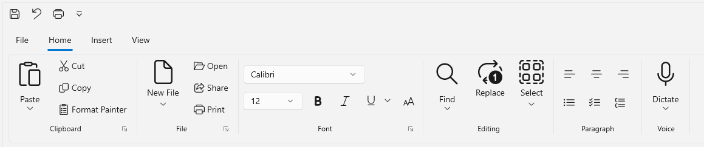
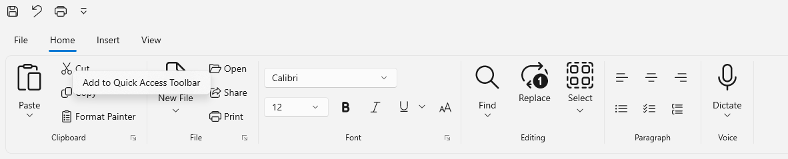
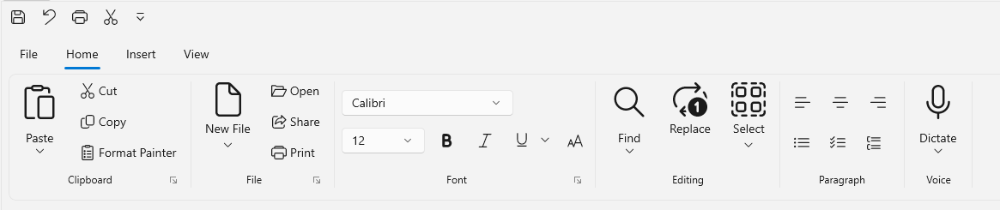
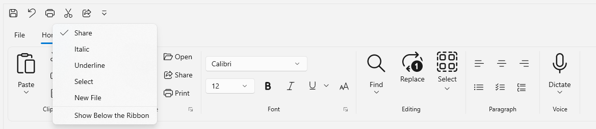
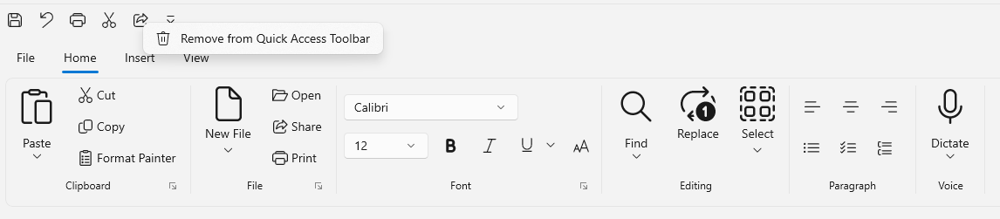
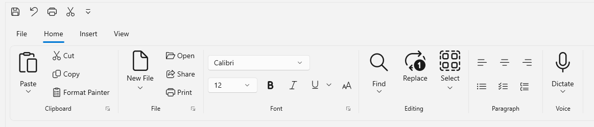
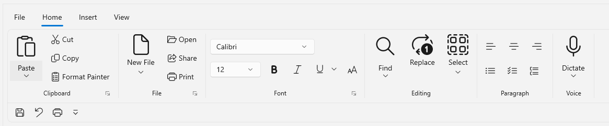
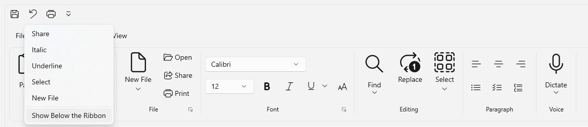

# Quick Access Toolbar in WinUI Ribbon

The Quick Access Toolbar (QAT) is used to render a set of ribbon items that are commonly used in applications. It renders at the top-left corner of a window or ribbon to make it more accessible. Users can place it above or below the ribbon, remove commands from it, or add commands to it.

## Adding Quick Access Toolbar in Ribbon 

To add Quick Access Toolbar in Ribbon control, set the `QuickAccessToolBar` property of Ribbon. The below code shows how to add the `Quick Access Toolbar` in Ribbon.



<ribbon:SfRibbon x:Name="ribbon" >
       <ribbon:SfRibbon.QuickAccessToolBar>
             <ribbon:QuickAccessToolBar />
       </ribbon:SfRibbon.QuickAccessToolBar>
       ...
</ribbon:SfRibbon>



## Adding items in Quick Access Toolbar

Ribbon items can be added in the Quick Access Toolbar (QAT) by following below ways:

 * Adding items through Code.
 * Adding items using ContextMenu.
 * Adding items using QAT MenuItems.

 N> Currently, Ribbon Gallery and RibbonItemHost are not supported as a QAT add-in.

 ### Adding items through Code

To add the ribbon items in Quick Access Toolbar (QAT) through code behind, you need to populate the QuickAccessToolbar `Items` collection. The below code shows how to add the ribbon items in `Quick Access Toolbar` of Ribbon.



<ribbon:SfRibbon x:Name="ribbon" >
    <ribbon:SfRibbon.QuickAccessToolBar>
         <ribbon:QuickAccessToolBar>
              <ribbon:RibbonButton x:Name="SaveButton"
                                   Content="Save"
                                   Icon="Save"
                                   Command="{Binding ButtonCommand}"
                                   CommandParameter="Save"/>
              <ribbon:RibbonButton x:Name="undoButton"
                                   Content="Undo"
                                   Icon="Undo"
                                   Command="{Binding ButtonCommand}"
                                   CommandParameter="Undo"/>
              <ribbon:RibbonButton x:Name="printButton"
                                   Content="Print"
                                   Icon="Print"
                                   Command="{Binding ButtonCommand}"
                                   CommandParameter="Print"/>                       
          </ribbon:QuickAccessToolBar>
    </ribbon:SfRibbon.QuickAccessToolBar>
    ...
</ribbon:SfRibbon> 



### Adding items using ContextMenu

To add the ribbon items to the Quick Access Toolbar (QAT) through context menu, right-click the required ribbon item and select `Add to Quick Access Toolbar`. The respective item will be added to the QAT. 

### Adding items using QAT MenuItems

The Ribbon also supports adding items to the QAT Menu items. To add items to the drop-down menu of the Quick Access Toolbar, use the `MenuItems` property of the Quick Access Toolbar. Items can be added to the Quick Access Toolbar (QAT) by making the selection.



<ribbon:SfRibbon x:Name="ribbon">
    <ribbon:SfRibbon.QuickAccessToolBar>
       <ribbon:QuickAccessToolBar>
          <ribbon:RibbonButton x:Name="SaveButton"
                               Content="Save"
                               Icon="Save"
                               Command="{Binding ButtonCommand}"
                               CommandParameter="Save"/>
          <ribbon:RibbonButton x:Name="undoButton"
                               Content="Undo"
                               Icon="Undo"
                               Command="{Binding ButtonCommand}"
                               CommandParameter="Undo"/>
          <ribbon:RibbonButton x:Name="printButton"
                               Content="Print"
                               Icon="Print"
                               Command="{Binding ButtonCommand}"
                               CommandParameter="Print"/>
          <ribbon:QuickAccessToolBar.MenuItems>
              <ribbon:RibbonButton  x:Name="Share"     
                                    Icon="Share"
                                    Content="Share"/>
              <ribbon:RibbonToggleButton Content="Italic"/>
              <ribbon:RibbonSplitButton Content="Underline"/>
              <ribbon:RibbonDropDownButton  Content="Select"/>
              <ribbon:RibbonDropDownButton Content="New File"/>
          </ribbon:QuickAccessToolBar.MenuItems>
      </ribbon:QuickAccessToolBar>        
   </ribbon:SfRibbon.QuickAccessToolBar>
   ...
</ribbon:SfRibbon>



N> To avoid adding duplicate items in QAT, set Content property for ribbon items.

## Removing QAT items

To remove an items from Quick Access Toolbar (QAT), right-click the required QAT item and select `Remove from Quick Access Toolbar` option. 

## Change Position of Quick Access Toolbar

The position of Quick Access Toolbar (QAT) can be changed by using it `Position` property.

The Position enumeration comprises of following values: .

* **Above the Ribbon** - Displays the Quick Access Toolbar above the ribbon. 
* **Below the Ribbon** - Displays the Quick Access Toolbar below the ribbon.
* **Hide** - Hide the Quick Access Toolbar in the ribbon.

The default value is **Above the Ribbon**. The below code shows how to change the position of `Quick Access Toolbar` in Ribbon.



<ribbon:SfRibbon x:Name="ribbon">
   <ribbon:SfRibbon.QuickAccessToolBar>
      <ribbon:QuickAccessToolBar Position="BelowRibbon">
          <ribbon:RibbonButton x:Name="SaveButton"
                               Content="Save"
                               Icon="Save"
                               Command="{Binding ButtonCommand}"
                               CommandParameter="Save"/>
          <ribbon:RibbonButton x:Name="undoButton"
                               Content="Undo"
                               Icon="Undo"
                               Command="{Binding ButtonCommand}"
                               CommandParameter="Undo"/>
          <ribbon:RibbonButton x:Name="printButton"
                               Content="Print"
                               Icon="Print"
                               Command="{Binding ButtonCommand}"
                               CommandParameter="Print"/>                       
       </ribbon:QuickAccessToolBar>
    </ribbon:SfRibbon.QuickAccessToolBar>
    ...
</ribbon:SfRibbon>



The position of the QAT can also be changed using its drop-down menu option.

## Command Label

WinUI Ribbon Command Label illustrates the implementation of MS Word. When the QAT is positioned below the Ribbon, it supports command labels at runtime. To show or hide the command label for QAT items, click `Show Command Labels` or `Hide Command Labels` in the Context menu

