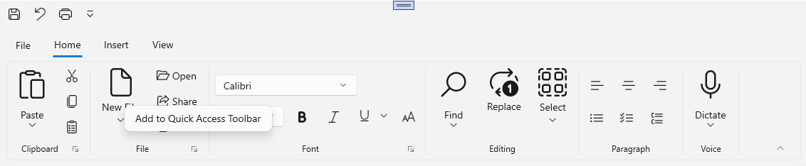
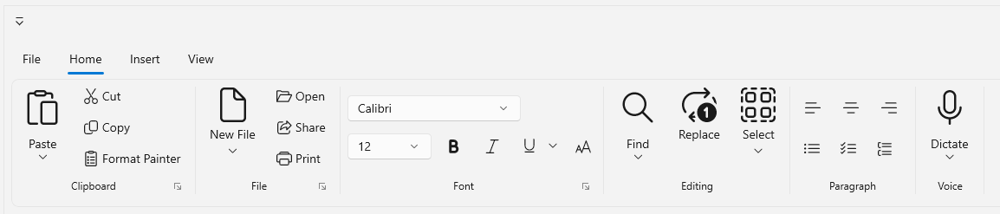
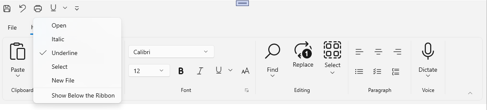
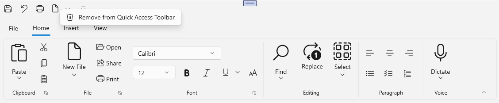
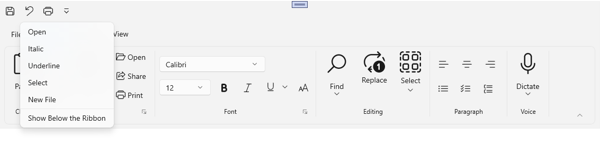
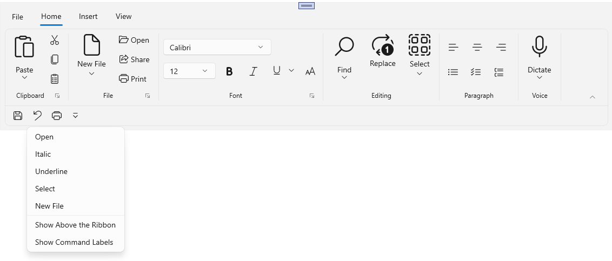
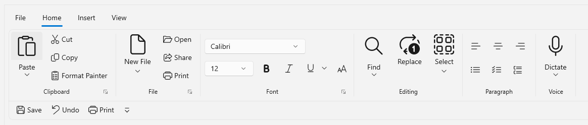
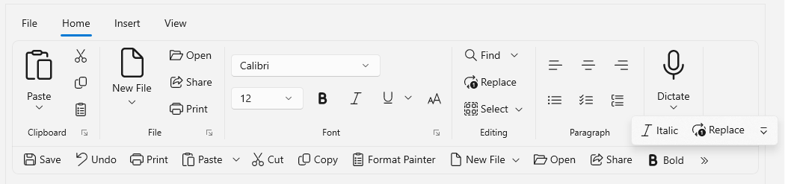

# Quick Access Toolbar in WinUI Ribbon

The Quick Access Toolbar (QAT) is used to render a set of ribbon items that are commonly used in applications. It renders at the top-left corner of a window or ribbon to make it more accessible. Users can place it above or below the ribbon, remove commands from it, or add commands to it.

## Adding Quick Access Toolbar in Ribbon 

To add Quick Access Toolbar in Ribbon control, set the QuickAccessToolBar property of Ribbon. The below code shows how to add the `Quick Access Toolbar` in Ribbon.




 <ribbon:SfRibbon x:Name="ribbon" >
            <ribbon:SfRibbon.QuickAccessToolBar>
                <ribbon:QuickAccessToolBar />
            </ribbon:SfRibbon.QuickAccessToolBar>
</ribbon:SfRibbon>




## Adding items in Quick Access Toolbar

Ribbon items can be added in the Quick Access Toolbar (QAT) by following below ways:

 * Adding items through ContextMenu.
 * Adding items through Code.
 * Adding items using QAT MenuItems.

 N> Currently, Ribbon Gallery is not supported as a QAT add-in.

### Add items through ContextMenu

To add an item to the Quick Access Toolbar (QAT), right-click the required ribbon item and select `Add to Quick Access Toolbar`. The respective item will then be added to the QAT. 

### Adding items through Code

To add the ribbon items in Ribbon Quick Access Toolbar through code behind, you need to populate the QuickAccessToolbar `Items` collection. The below code shows how to add the ribbon items in `Quick Access Toolbar` of Ribbon.




 <ribbon:SfRibbon x:Name="ribbon" >
            <ribbon:SfRibbon.QuickAccessToolBar>
                <ribbon:QuickAccessToolBar Position="AboveRibbon">
                    <ribbon:RibbonButton x:Name="SaveButton"
                                         Content="Save"
                                         Icon="Save"
                                         Command="{Binding ButtonCommand}"
                                         CommandParameter="Save"/>
                    <ribbon:RibbonButton x:Name="undoButton"
                                         Content="Undo"
                                         Icon="Undo"
                                         Command="{Binding ButtonCommand}"
                                         CommandParameter="Undo"/>
                    <ribbon:RibbonButton x:Name="printButton"
                                         Content="Print"
                                         Icon="Print"
                                         Command="{Binding ButtonCommand}"
                                         CommandParameter="Print"/>                       
                </ribbon:QuickAccessToolBar>
            </ribbon:SfRibbon.QuickAccessToolBar>
</ribbon:SfRibbon>




### Adding items using QAT MenuItems

The Ribbon also supports adding items to the QAT Menu items. To add items to the drop-down menu of the Quick Access Toolbar, use the `MenuItems` property of the Quick Access Toolbar. Items can be added to the QAT by making the selection.

In 'MenuItems', define the ribbon items that are either already contain in the Ribbon Tabs or not in the Ribbon Tabs. If the item is not in the Ribbon Tab, specify all the required properties. Otherwise, providing the 'Content' is sufficient.




<ribbon:SfRibbon.QuickAccessToolBar>
                    <ribbon:QuickAccessToolBar Position="AboveRibbon">
                        <ribbon:RibbonButton x:Name="SaveButton"
                                             Content="Save"
                                             Icon="Save"
                                             Command="{Binding ButtonCommand}"
                                             CommandParameter="Save"/>
                        <ribbon:RibbonButton x:Name="undoButton"
                                             Content="Undo"
                                             Icon="Undo"
                                             Command="{Binding ButtonCommand}"
                                             CommandParameter="Undo"/>
                        <ribbon:RibbonButton x:Name="printButton"
                                             Content="Print"
                                             Icon="Print"
                                             Command="{Binding ButtonCommand}"
                                             CommandParameter="Print"/>
                        <ribbon:QuickAccessToolBar.MenuItems>
                            <ribbon:RibbonButton  x:Name="openButton1"    
                                              Icon="Bold"
                                              Content="Open"/>
                            <ribbon:RibbonToggleButton x:Name="Italic1"
                                                   Content="Italic"
                                                   Icon="Italic"/>
                            <ribbon:RibbonSplitButton x:Name="Underline"                                                 
                                                  Content="Underline"
                                                  Icon="Underline">
                                <ribbon:RibbonSplitButton.Flyout>
                                    <MenuFlyout>
                                        <MenuFlyoutItem Text="Underline" />
                                        <MenuFlyoutItem Text="Double underline" />
                                        <MenuFlyoutItem Text="Thick underline" />
                                        <MenuFlyoutItem Text="Dotted underline" />
                                    </MenuFlyout>
                                </ribbon:RibbonSplitButton.Flyout>
                            </ribbon:RibbonSplitButton>
                            <ribbon:RibbonDropDownButton  Content="Select"
                                                      Icon="SelectAll" >
                                <ribbon:RibbonDropDownButton.Flyout>
                                    <MenuFlyout>
                                        <MenuFlyoutItem  Icon="SelectAll"
                                                     Text="Select All" />
                                        <MenuFlyoutItem  Icon="SelectAll"
                                                     Text="Select Objects" />
                                        <MenuFlyoutItem  Icon="ClearSelection"
                                                     Text="Selection Pane" />
                                    </MenuFlyout>
                                </ribbon:RibbonDropDownButton.Flyout>
                            </ribbon:RibbonDropDownButton>
                            <ribbon:RibbonDropDownButton Content="New File"
                                                     AllowedSizeModes="Large">
                                <ribbon:RibbonDropDownButton.Icon>
                                    <FontIcon Glyph="&#xE7C3;" />
                                </ribbon:RibbonDropDownButton.Icon>
                                <ribbon:RibbonDropDownButton.Flyout>
                                    <MenuFlyout>
                                        <MenuFlyoutItem  Text="Empty File" />
                                        <MenuFlyoutItem  Text="Template File" />
                                    </MenuFlyout>
                                </ribbon:RibbonDropDownButton.Flyout>
                            </ribbon:RibbonDropDownButton>
                        </ribbon:QuickAccessToolBar.MenuItems>
                    </ribbon:QuickAccessToolBar>
</ribbon:SfRibbon.QuickAccessToolBar>




N> QAT items are unique, so when adding them through MenuItems or through code, it's important to provide Content to avoid duplicates.

## Removing QAT items

To remove a QAT item, right-click on the item in the QAT and select `Remove from Quick Access Toolbar`. 

## Position of Quick Access Toolbar

The Quick Access Toolbar supports the following position:
* Above the Ribbon
* Below the Ribbon
* Hide

The position of the QAT can be dynamically adjusted either above or below the ribbon. The default position is above the ribbon.




<ribbon:SfRibbon x:Name="ribbon" >
            <ribbon:SfRibbon.QuickAccessToolBar>
                <ribbon:QuickAccessToolBar Position="AboveRibbon">
                    <ribbon:RibbonButton x:Name="SaveButton"
                                         Content="Save"
                                         Icon="Save"
                                         Command="{Binding ButtonCommand}"
                                         CommandParameter="Save"/>
                    <ribbon:RibbonButton x:Name="undoButton"
                                         Content="Undo"
                                         Icon="Undo"
                                         Command="{Binding ButtonCommand}"
                                         CommandParameter="Undo"/>
                    <ribbon:RibbonButton x:Name="printButton"
                                         Content="Print"
                                         Icon="Print"
                                         Command="{Binding ButtonCommand}"
                                         CommandParameter="Print"/>                       
                </ribbon:QuickAccessToolBar>
            </ribbon:SfRibbon.QuickAccessToolBar>
</ribbon:SfRibbon>




QAT in above Ribbon

QAT in below Ribbon

### Hide Quick Access Toolbar

To hide Quick Access Toolbar, set the Position as "Hide".

## Command Label

When the QAT is positioned below the Ribbon, it supports command labels. To show or hide the command label for QAT items, click `Show Command Labels` or `Hide Command Labels` in the QAT Drop Down.

Show Command Labels

Hide Command Labels

## Overflow in QAT

When the Quick Access Toolbar (QAT) panel contains an excessive number of items, it may exceed the available space within the QAT panel's size. In such cases, these additional items will be displayed within an Overflow button.

