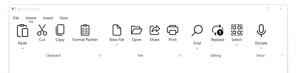
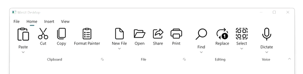

# Ribbon Resizing in WinUI Ribbon Control

The Syncfusion WinUI SfRibbon supports expanding/collapsing the ribbon elements to the available space while resizing the control. It performs expand operation while the control size is increased and performs collapse operation while the control size decreased. It allows resizing ribbon elements for both normal and simplified layouts. By default, the ribbon elements are resized based on group size. Also, we have an option to resize the ribbon elements in the custom order.

We can specify the ribbon elements size using `AllowedSizeModes` property. It is a flagged enum to arrange the ribbon elements in varied sizes depending on available space. It has values Small, Normal, and Large to specify the size of the ribbon elements. As it is a flagged enum, we can give the combination of values to the AllowedSizeModes property. The default value is `Small, Normal, Large`.

## Default Resizing

It resizes the ribbon elements based on the ribbon group size. It takes smallest group for expanding ribbon elements and takes largest group for collapsing ribbon elements.



<ribbon:SfRibbon>
    <ribbon:SfRibbon.Tabs>
        <ribbon:RibbonTab Header="Home">
            <ribbon:RibbonGroup Header="Clipboard">
                <ribbon:RibbonSplitButton 
                    Content="Paste" 
                    Icon="Paste"
                    AllowedSizeModes="Large"/>
                <ribbon:RibbonButton 
                    Content="Cut"
                    Icon="Cut"/>
                <ribbon:RibbonButton 
                    Content="Copy"
                    Icon="Copy"/>
                // Add more elements here...
            </ribbon:RibbonGroup>
            <ribbon:RibbonGroup Header="File">
                <ribbon:RibbonDropDownButton 
                    Content="New File"
                    AllowedSizeModes="Large"/>
                <ribbon:RibbonButton 
                    Content="Open"/>
                <ribbon:RibbonButton 
                    Content="Share"
                    Icon="Share"/>
                // Add more elements here...
            </ribbon:RibbonGroup>
            // Add more groups here...
        </ribbon:RibbonTab>
        // Add more tabs here...
    </ribbon:SfRibbon.Tabs>
</ribbon:SfRibbon>



## Custom resizing

It resizes the ribbon elements based on the ribbon group priority. It takes the highest priority group for expanding ribbon elements and collapses the elements in reverse order. We can specify the resizing order by using the `Priority` property in RibbonGroup.



<ribbon:SfRibbon>
    <ribbon:SfRibbon.Tabs>
        <ribbon:RibbonTab Header="Home">
            <ribbon:RibbonGroup Header="Clipboard" Priority="1">
                <ribbon:RibbonSplitButton 
                    Content="Paste" 
                    Icon="Paste"
                    AllowedSizeModes="Large"/>
                <ribbon:RibbonButton 
                    Content="Cut"
                    Icon="Cut"/>
                <ribbon:RibbonButton 
                    Content="Copy"
                    Icon="Copy"/>
                // Add more elements here...
            </ribbon:RibbonGroup>
            <ribbon:RibbonGroup Header="File" Priority="2">
                <ribbon:RibbonDropDownButton 
                    Content="New File"
                    AllowedSizeModes="Large"/>
                <ribbon:RibbonButton 
                    Content="Open"/>
                <ribbon:RibbonButton 
                    Content="Share"
                    Icon="Share"/>
                // Add more elements here...
            </ribbon:RibbonGroup>
            // Add more groups here...
        </ribbon:RibbonTab>
        // Add more tabs here...
    </ribbon:SfRibbon.Tabs>
</ribbon:SfRibbon>



