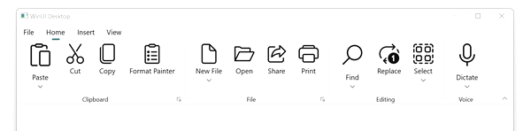
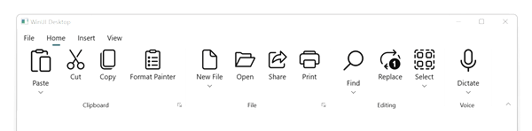

# Ribbon Resizing in WinUI Ribbon Control

The Syncfusion&reg; WinUI SfRibbon supports expanding and collapsing the ribbon elements to the available space while resizing the control. It performs an expand operation when the control size increases and a collapse operation when the control size decreases. It allows resizing ribbon elements for both normal and simplified layouts. By default, the ribbon elements are resized based on group size. There is also an option to resize the ribbon elements in a custom order.

You can specify the ribbon elements' size using the `AllowedSizeModes` property. It is a flags enum used to arrange the ribbon elements in varied sizes depending on the available space. It has the values `Small`, `Normal`, and `Large` to specify the size of the ribbon elements. As it is a flags enum, you can give a combination of values to the `AllowedSizeModes` property. The default value is `Small, Normal, Large`.

## Default Resizing

This mode resizes the ribbon elements based on the ribbon group size. It takes the smallest group for expanding ribbon elements and the largest group for collapsing ribbon elements.



<ribbon:SfRibbon>
    <ribbon:SfRibbon.Tabs>
        <ribbon:RibbonTab Header="Home">
            <ribbon:RibbonGroup Header="Clipboard">
                <ribbon:RibbonSplitButton 
                    Content="Paste" 
                    Icon="Paste"
                    AllowedSizeModes="Large"/>
                <ribbon:RibbonButton 
                    Content="Cut"
                    Icon="Cut"/>
                <ribbon:RibbonButton 
                    Content="Copy"
                    Icon="Copy"/>
                <!-- Add more elements here... -->
            </ribbon:RibbonGroup>
            <ribbon:RibbonGroup Header="File">
                <ribbon:RibbonDropDownButton 
                    Content="New File"
                    AllowedSizeModes="Large"/>
                <ribbon:RibbonButton 
                    Content="Open"/>
                <ribbon:RibbonButton 
                    Content="Share"
                    Icon="Share"/>
                <!-- Add more elements here... -->
            </ribbon:RibbonGroup>
            <!-- Add more groups here... -->
        </ribbon:RibbonTab>
        <!-- Add more tabs here... -->
    </ribbon:SfRibbon.Tabs>
</ribbon:SfRibbon>



## Custom resizing

This mode resizes the ribbon elements based on the ribbon group priority. It takes the highest-priority group for expanding ribbon elements and collapses the elements in reverse order of priority. You can specify the resizing order by using the `Priority` property on the `RibbonGroup` (an `int` value; lower numbers indicate higher priority).



<ribbon:SfRibbon>
    <ribbon:SfRibbon.Tabs>
        <ribbon:RibbonTab Header="Home">
            <ribbon:RibbonGroup Header="Clipboard" Priority="1">
                <ribbon:RibbonSplitButton 
                    Content="Paste" 
                    Icon="Paste"
                    AllowedSizeModes="Large"/>
                <ribbon:RibbonButton 
                    Content="Cut"
                    Icon="Cut"/>
                <ribbon:RibbonButton 
                    Content="Copy"
                    Icon="Copy"/>
                <!-- Add more elements here... -->
            </ribbon:RibbonGroup>
            <ribbon:RibbonGroup Header="File" Priority="2">
                <ribbon:RibbonDropDownButton 
                    Content="New File"
                    AllowedSizeModes="Large"/>
                <ribbon:RibbonButton 
                    Content="Open"/>
                <ribbon:RibbonButton 
                    Content="Share"
                    Icon="Share"/>
                <!-- Add more elements here... -->
            </ribbon:RibbonGroup>
            <!-- Add more groups here... -->
        </ribbon:RibbonTab>
        <!-- Add more tabs here... -->
    </ribbon:SfRibbon.Tabs>
</ribbon:SfRibbon>



