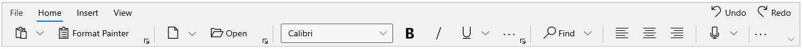
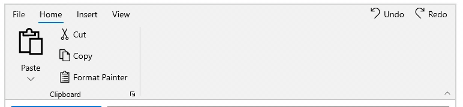
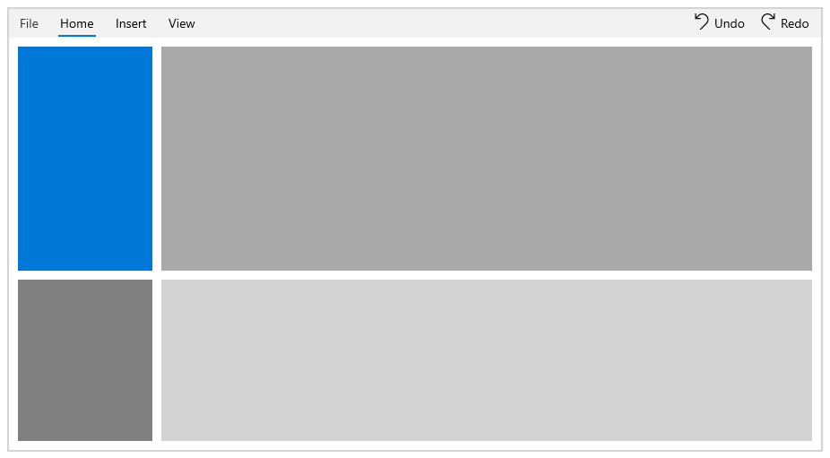

# Simplified layout in WinUI Ribbon

The Syncfusion Ribbon provides a compact and simplified layout by arranging the most-used commands in a single line, occupying less space. We can also quickly navigate to other commonly used commands in the overflow menu, and switch to normal mode using the built-in toggle button. This section explains in detail about the simplified layout.

## Enabling Simplified layout

The `LayoutModeOptions` enumeration property provides an option to enable Simplified layout in Ribbon control. The `LayoutModeOptions` is of flag enumeration type that contains the following values.

* Normal - The Ribbon items are arranged in the standard layout.
* Simplified - The Ribbon items are arranged in the single line layout.

It also contains the following combination like:

* Normal, Simplified - The Ribbon items are arranged both in Normal and Simplified layout. This is the default value.

To load the Ribbon control in simplified layout, `ActiveLayoutMode` enumeration property can be used. It contains the following values.

* Normal - Display the Ribbon in standard layout at startup. This is the default value.
* Simplified - Display the Ribbon in single line  layout at startup.




    <Page
        <Grid x:Name="rootGrid">
            <ribbon:SfRibbon x:Name="sfRibbon"
                             ActiveLayoutMode="Simplified"
                             LayoutModeOptions="Simplified">
            </ribbon:SfRibbon>
        </Grid>
    </Page>




    public sealed partial class MainPage : Page
    {
        public MainPage()
        {
            this.InitializeComponent();
            SfRibbon sfRibbon = new SfRibbon();
            sfRibbon.LayoutModeOptions = LayoutModeOptions.Simplified;
            sfRibbon.ActiveLayoutMode = LayoutMode.Simplified;
            rootGrid.Children.Add(sfRibbon);
        }
    }




## Switching between normal and simplified layouts

The Ribbon control allows to switch between simplified and normal layouts at runtime using the toggle button located in the lower right corner of the Ribbon. To enable this option, set the `LayoutModeOptions` to "Normal,Simplified" as given in the below layout.




    <Page
        <Grid x:Name="rootGrid">
             <ribbon:SfRibbon x:Name="sfRibbon"
                              LayoutModeOptions="Normal,Simplified">
             </ribbon:SfRibbon>
        </Grid>
    </Page>




    public sealed partial class MainPage : Page
    {
        public MainPage()
        {
            this.InitializeComponent();
            SfRibbon sfRibbon = new SfRibbon();
            sfRibbon.LayoutModeOptions = LayoutModeOptions.Normal | LayoutModeOptions.Simplified;
            rootGrid.Children.Add(sfRibbon);
        }
    }


}

## Visibility of Ribbon items between normal and simplified layouts

The Ribbon items can be set common between different layouts or can be made visible only in a particular layout using the `DisplayOptions` property. By default, items will be displayed in both normal and simplified layout. The DisplayMode is of flag enumeration type that contains the following values.

* Normal - The item will be displayed only in the normal layout.
* Simplified - The item will be displayed only in the simplified layout.
* OverflowMenu - The item will be displayed only inside the overflow menu when simplified layout is enabled.

Also, the DisplayMode property allows the following value combinations as well.

* Normal, Simplified – The item will be displayed in both normal and simplified layout.
* Normal, OverflowMenu – The item will be displayed in both normal layout and inside overflow menu during simplified layout.
* Simplified, OverflowMenu – The item will be displayed in simplified layout.
* Normal, Simplified, OverflowMenu – The item will be displayed in both normal and simplified layout.




    <Page
    
        <!--This item will be displayed in normal and simplified layout-->
        <ribbon:RibbonSplitButton Command="{Binding ButtonCommand}"
                              CommandParameter="Paste"
                              Content="Paste"
                              DisplayOptions="Normal,Simplified"
                              Icon="Paste"
                              SizeMode="Large">
        </ribbon:RibbonSplitButton>
        <!--This item will be displayed in normal layout and inside overflow menu during simplified Layout-->
        <ribbon:RibbonButton Command="{Binding ButtonCommand}"
                         CommandParameter="Cut"
                         Content="Cut"
                         DisplayOptions="Normal,Overflow"
                         Icon="Cut"
                         SizeMode="Normal" />                                                      
        <!--This item will be displayed only in simplified layout-->
        <ribbon:RibbonButton Command="{Binding ButtonCommand}"
                         CommandParameter="Copy"
                         Content="Copy"
                         DisplayOptions="Simplified"
                         Icon="Copy"
                         SizeMode="Normal" />
        <!--This item will be displayed only in normal layout-->
        <ribbon:RibbonButton Command="{Binding ButtonCommand}"
                         CommandParameter="Format Painter"
                         Content="Format Painter"
                         DisplayOptions="Normal"
                         SizeMode="Normal"/>                                    
    </Page>





    //This item will be displayed in normal and simplified layout
    RibbonSplitButton pasteButton = new RibbonSplitButton();
    pasteButton.Content = "Paste";
    pasteButton.Icon = new SymbolIcon(Symbol.Paste);
    pasteButton.DisplayOptions = DisplayOptions.Normal | DisplayOptions.Simplified;
    
    //This item will be displayed in normal layout and inside overflow menu during simplified Layout
    RibbonButton cutButton = new RibbonButton();
    cutButton.Content = "Cut";
    cutButton.Icon = new SymbolIcon(Symbol.Cut);
    cutButton.DisplayOptions = DisplayOptions.Normal | DisplayOptions.Overflow;

    //This item will be displayed only in simplified layout-->
    RibbonButton copyButton = new RibbonButton();
    copyButton.Content = "Copy";
    copyButton.Icon = new SymbolIcon(Symbol.Copy);
    copyButton.DisplayOptions = DisplayOptions.Simplified;
    
    //This item will be displayed only in normal layout-->
    RibbonButton formatButton = new RibbonButton();
    formatButton.Content = "Cut";
    formatButton.Icon = new SymbolIcon(Symbol.SyncFolder);
    formatButton.DisplayOptions = DisplayOptions.Normal;

}

}

## Customizing Overflow menu

Overflow menu can be enabled either at the end of each `RibbonGroup` or placed at the end of content area. This can be customized using `OverflowItemDisplayMode` property. It contains two values,

* TabLevel - Group the overflow menu at the end of content area. This is the default value.
* GroupLevel - Group the overflow menu at the end of `RibbonGroup`.




    <Page
         <ribbon:RibbonGroup Header="Font" 
                         OverflowItemDisplayMode="GroupLevel" />                                
    </Page>





    RibbonGroup ribbonGroup = new RibbonGroup();
    ribbonGroup.Header = "Font";
    ribbonGroup.OverflowItemDisplayMode = OverFlowItemDisplayMode.GroupLevel;
 



## Display mode  

Syncfusion Ribbon control provides a minimized and adorner state. By enabling `AllowMinimize` property we can toggle between normal and minimized state. 




    <Page
        <ribbon:SfRibbon x:Name="ribbon"
                         AllowMinimize="True">
        </ribbon>                             
    </Page>





    public sealed partial class MainPage : Page
    {
        public MainPage()
        {
            this.InitializeComponent();
            SfRibbon sfRibbon = new SfRibbon();
            sfRibbon.AllowMinimize = true;
            rootGrid.Children.Add(sfRibbon);
        }
    }
 



### Switching between normal and minimized state

The Ribbon control allows to switch between normal and minimized state at runtime using the toggle button located in the lower right corner of the Ribbon. We can also switch by double clicking on the `RibbonTab`. By single click on `RibbonTab`, it enters to adorner state.

>N When simplified mode is enabled, toggle button is used to switch between normal and simplified layout. In that case, we can use the `RibbonTab` double click option to enter in minimized state. 

### Loading in Minimized state

The Ribbon control allows to load in minimized state by using `IsMinimized` property. By enabling this property, we can load the Ribbon in minimized state. 




    <Page
        <ribbon:SfRibbon x:Name="ribbon"
                         AllowMinimize="True"
                         IsMinimized = "True">
        </ribbon>                             
    </Page>





    public sealed partial class MainPage : Page
    {
        public MainPage()
        {
            this.InitializeComponent();
            SfRibbon sfRibbon = new SfRibbon();
            sfRibbon.AllowMinimize = true;
            sfRibbon.IsMinimized = true;
            rootGrid.Children.Add(sfRibbon);
        }
    }
 



