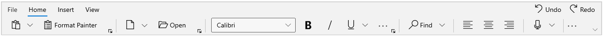
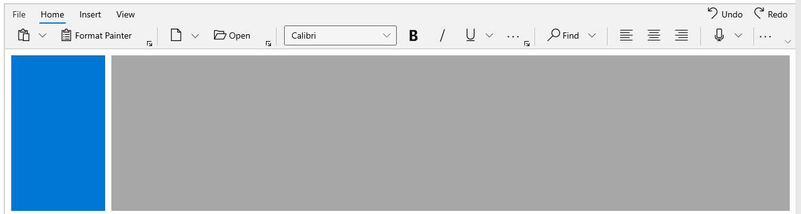
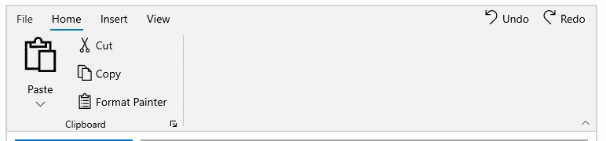
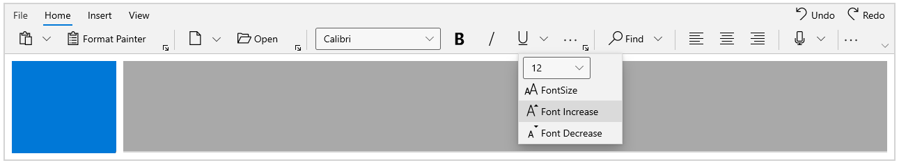
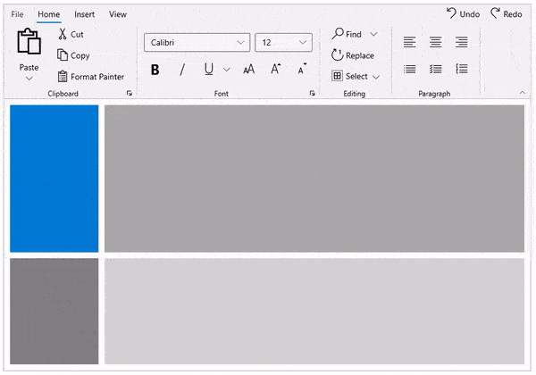
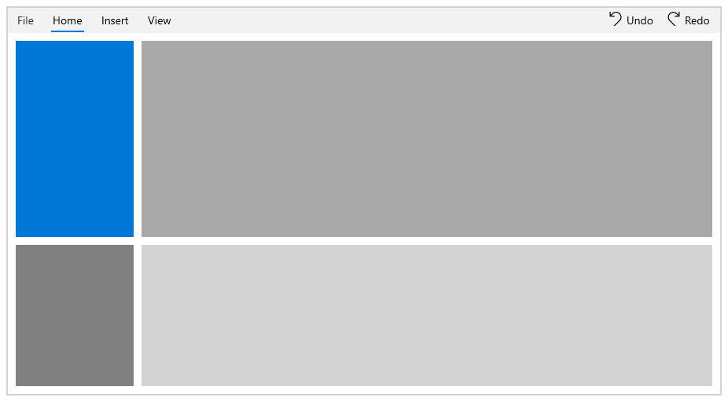

# Simplified Layout in WinUI Ribbon Control

The Syncfusion&reg; Ribbon provides a compact and simplified layout by arranging the most-used commands in a single line, occupying less space. Quickly navigate to other commonly used commands in the overflow menu, and then switch to normal mode using the built-in toggle button. This section explains the simplified layout in detail.

## Enabling simplified layout

The `LayoutModeOptions` enumeration property provides an option to enable the Simplified layout in the Ribbon control. The `LayoutModeOptions` is a flags enumeration type that contains the following values:

* Normal - The Ribbon items are arranged in the standard layout.
* Simplified - The Ribbon items are arranged in the single-line layout.

It also supports the following combination:

* Normal, Simplified - The Ribbon items are arranged in both Normal and Simplified layouts. This is the default value.

To load the Ribbon control in the simplified layout, the `ActiveLayoutMode` enumeration property can be used. It contains the following values:

* Normal - Displays the Ribbon in the standard layout at startup. This is the default value.
* Simplified - Displays the Ribbon in the single-line layout at startup.




<Page
    <Grid x:Name="rootGrid">
        <ribbon:SfRibbon x:Name="sfRibbon"
                            ActiveLayoutMode="Simplified"
                            LayoutModeOptions="Simplified">
        </ribbon:SfRibbon>
    </Grid>
</Page>




public sealed partial class MainPage : Page
{
    public MainPage()
    {
        this.InitializeComponent();
        SfRibbon sfRibbon = new SfRibbon();
        sfRibbon.LayoutModeOptions = LayoutModeOptions.Simplified;
        sfRibbon.ActiveLayoutMode = LayoutMode.Simplified;
        rootGrid.Children.Add(sfRibbon);
    }
}




## Switching between normal and simplified layouts

The Ribbon control allows you to switch between simplified and normal layouts at runtime using the toggle button located in the lower right corner of the Ribbon. To enable this option, set the `LayoutModeOptions` to `Normal,Simplified` as shown below.




<Page
    <Grid x:Name="rootGrid">
            <ribbon:SfRibbon x:Name="sfRibbon"
                            LayoutModeOptions="Normal,Simplified">
            </ribbon:SfRibbon>
    </Grid>
</Page>




public sealed partial class MainPage : Page
{
    public MainPage()
    {
        this.InitializeComponent();
        SfRibbon sfRibbon = new SfRibbon();
        sfRibbon.LayoutModeOptions = LayoutModeOptions.Normal | LayoutModeOptions.Simplified;
        rootGrid.Children.Add(sfRibbon);
    }
}




## Visibility of ribbon items between normal and simplified layouts

The Ribbon items can be set commonly between different layouts or can be made visible only in a particular layout using the `DisplayOptions` property. By default, items are displayed in both normal and simplified layouts. The `DisplayOptions` property is a flags enumeration type that contains the following values:

* Normal - The item will be displayed only in the normal layout.
* Simplified - The item will be displayed only in the simplified layout.
* OverflowMenu - The item will be displayed only inside the overflow menu when the simplified layout is enabled.

The `DisplayOptions` property also allows the following value combinations:

* Normal, Simplified – The item will be displayed in both normal and simplified layouts.
* Normal, OverflowMenu – The item will be displayed in the normal layout and inside the overflow menu during the simplified layout.
* Simplified, OverflowMenu – The item will be displayed in the simplified layout and inside the overflow menu.
* Normal, Simplified, OverflowMenu – The item will be displayed in both normal and simplified layouts and inside the overflow menu.




<Page
    <!--This item will be displayed in normal and simplified layout-->
    <ribbon:RibbonSplitButton Command="{Binding ButtonCommand}"
                            CommandParameter="Paste"
                            Content="Paste"
                            DisplayOptions="Normal,Simplified"
                            Icon="Paste"
                            AllowedSizeModes="Large">
    </ribbon:RibbonSplitButton>
    <!--This item will be displayed in normal layout and inside overflow menu during simplified Layout-->
    <ribbon:RibbonButton Command="{Binding ButtonCommand}"
                        CommandParameter="Cut"
                        Content="Cut"
                        DisplayOptions="Normal,Overflow"
                        Icon="Cut"
                        AllowedSizeModes="Normal" />                                                      
    <!--This item will be displayed only in simplified layout-->
    <ribbon:RibbonButton Command="{Binding ButtonCommand}"
                        CommandParameter="Copy"
                        Content="Copy"
                        DisplayOptions="Simplified"
                        Icon="Copy"
                        AllowedSizeModes="Normal" />
    <!--This item will be displayed only in normal layout-->
    <ribbon:RibbonButton Command="{Binding ButtonCommand}"
                        CommandParameter="Format Painter"
                        Content="Format Painter"
                        DisplayOptions="Normal"
                        AllowedSizeModes="Normal"/>                                    
</Page>





//This item will be displayed in normal and simplified layout
RibbonSplitButton pasteButton = new RibbonSplitButton();
pasteButton.Content = "Paste";
pasteButton.Icon = new SymbolIcon(Symbol.Paste);
pasteButton.DisplayOptions = DisplayOptions.Normal | DisplayOptions.Simplified;

//This item will be displayed in normal layout and inside overflow menu during simplified Layout
RibbonButton cutButton = new RibbonButton();
cutButton.Content = "Cut";
cutButton.Icon = new SymbolIcon(Symbol.Cut);
cutButton.DisplayOptions = DisplayOptions.Normal | DisplayOptions.Overflow;

//This item will be displayed only in simplified layout-->
RibbonButton copyButton = new RibbonButton();
copyButton.Content = "Copy";
copyButton.Icon = new SymbolIcon(Symbol.Copy);
copyButton.DisplayOptions = DisplayOptions.Simplified;

//This item will be displayed only in normal layout
RibbonButton formatButton = new RibbonButton();
formatButton.Content = "Format Painter";
formatButton.Icon = new SymbolIcon(Symbol.SyncFolder);
formatButton.DisplayOptions = DisplayOptions.Normal;



## Customizing overflow menu

The overflow menu can be enabled either at the end of each `RibbonGroup` or placed at the end of the content area. This can be customized using the `OverflowItemDisplayMode` property. It contains the following values:

* TabLevel - Groups the overflow menu at the end of the content area. This is the default value.
* GroupLevel - Groups the overflow menu at the end of the `RibbonGroup`.




<Page
    <ribbon:RibbonGroup Header="Font" 
                        OverflowItemDisplayMode="GroupLevel" />                                
</Page>





RibbonGroup ribbonGroup = new RibbonGroup();
ribbonGroup.Header = "Font";
ribbonGroup.OverflowItemDisplayMode = OverFlowItemDisplayMode.GroupLevel;
 



## Minimized and adorner state

Syncfusion&reg; Ribbon control provides a minimized and adorner state. Enable the `AllowMinimize` property to toggle between normal and minimized state. By default, `AllowMinimize` is `False`.




<Page
    <ribbon:SfRibbon x:Name="ribbon"
                        AllowMinimize="True">
    </ribbon>                             
</Page>





public sealed partial class MainPage : Page
{
    public MainPage()
    {
        this.InitializeComponent();
        SfRibbon sfRibbon = new SfRibbon();
        sfRibbon.AllowMinimize = true;
        rootGrid.Children.Add(sfRibbon);
    }
}
 



### Switching between normal and minimized state

The Ribbon control allows you to switch between normal and minimized state at runtime using the toggle button located in the lower right corner of the Ribbon. To switch, double-click on the `RibbonTab`. To enter the adorner state, single-click on the `RibbonTab`.

N> When simplified mode is enabled, the toggle button is used to switch between normal and simplified layout. In that case, use the `RibbonTab` double-click option to enter the minimized state.

### Loading in minimized state

The Ribbon control allows you to load in the minimized state by using the `IsMinimized` property. By enabling this property, the Ribbon is loaded in the minimized state. By default, `IsMinimized` is `False`.




<Page
    <ribbon:SfRibbon x:Name="ribbon"
                        AllowMinimize="True"
                        IsMinimized = "True">
    </ribbon>                             
</Page>





public sealed partial class MainPage : Page
{
    public MainPage()
    {
        this.InitializeComponent();
        SfRibbon sfRibbon = new SfRibbon();
        sfRibbon.AllowMinimize = true;
        sfRibbon.IsMinimized = true;
        rootGrid.Children.Add(sfRibbon);
    }
}
 



