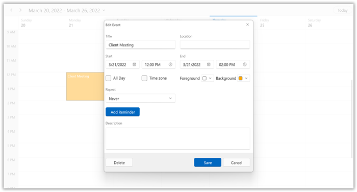
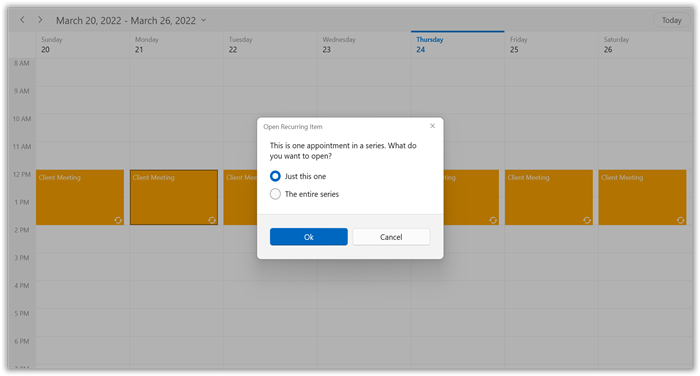
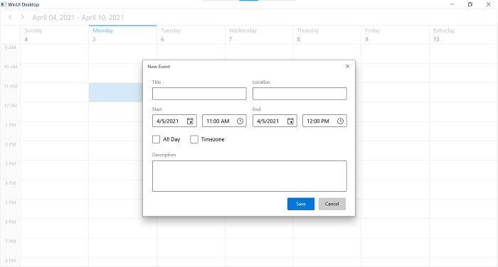
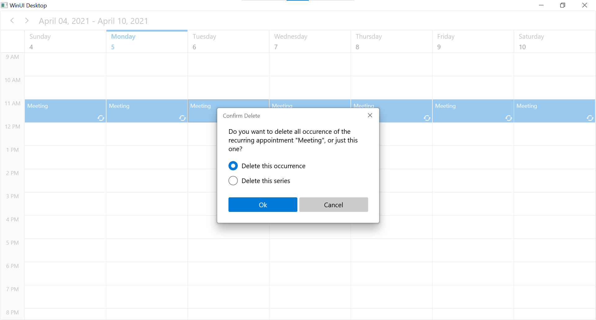

# Appointment Editing | CRUD operations in WinUI Scheduler (SfScheduler)

This section explains how to handle appointment editing in WinUI scheduler and also explains about the appointment resizing.

## Creating appointments

The Scheduler supports adding new appointment by using [Appointment Editor](https://help.syncfusion.com/cr/winui/Syncfusion.UI.Xaml.Scheduler.SchedulerAppointmentEditorView.html) UI dialog. You can open this editor dialog by double-clicking on a time cell.

## Editing appointment

The Scheduler supports editing the existing appointments by using the [Appointment Editor](https://help.syncfusion.com/cr/winui/Syncfusion.UI.Xaml.Scheduler.SchedulerAppointmentEditorView.html) UI dialog. You can open this dialog by double-clicking on the appointment.

You can edit the appointments in the appointment editor dialog. These changes will be saved back in the appointment and mapped data object when using data binding.

### Edit recurring appointment

The Scheduler supports editing the recurrence appointment. The following editor dialog will appear when you edit the recurrence appointment to select whether to edit only the particular occurrence or recurrence series.

You can also handle the opening of recurrence popup editor dialog using [RecurringAppointmentEditMode](https://help.syncfusion.com/cr/winui/Syncfusion.UI.Xaml.Scheduler.RecurringAppointmentEditMode.html) property in [AppointmentEditorOpeningEventArgs](https://help.syncfusion.com/cr/winui/Syncfusion.UI.Xaml.Scheduler.AppointmentEditorOpeningEventArgs.html) by handling [AppointmentEditorOpening](https://help.syncfusion.com/cr/winui/Syncfusion.UI.Xaml.Scheduler.SfScheduler.html#Syncfusion_UI_Xaml_Scheduler_SfScheduler_AppointmentEditorOpening) event.

### AppointmentEditorOpening event

When you open the appointment editor UI dialog to add or update appointment, then Scheduler notifies the [AppointmentEditorOpening](https://help.syncfusion.com/cr/winui/Syncfusion.UI.Xaml.Scheduler.SfScheduler.html#Syncfusion_UI_Xaml_Scheduler_SfScheduler_AppointmentEditorOpening) event.

The [AppointmentEditorOpeningEventArgs](https://help.syncfusion.com/cr/winui/Syncfusion.UI.Xaml.Scheduler.AppointmentEditorOpeningEventArgs.html) has following members which provides the information for the [AppointmentEditorOpening](https://help.syncfusion.com/cr/winui/Syncfusion.UI.Xaml.Scheduler.SfScheduler.html#Syncfusion_UI_Xaml_Scheduler_SfScheduler_AppointmentEditorOpening) event.

[Appointment](https://help.syncfusion.com/cr/winui/Syncfusion.UI.Xaml.Scheduler.AppointmentEditorOpeningEventArgs.html#Syncfusion_UI_Xaml_Scheduler_AppointmentEditorOpeningEventArgs_Appointment): Gets the selected appointment details which are being updated. It will be null when adding a new appointment using the appointment editor.

[DateTime](https://help.syncfusion.com/cr/winui/Syncfusion.UI.Xaml.Scheduler.AppointmentEditorOpeningEventArgs.html#Syncfusion_UI_Xaml_Scheduler_AppointmentEditorOpeningEventArgs_DateTime): Get the DateTime of time slot or month cell where the user double clicked.

[AppointmentEditorOptions](https://help.syncfusion.com/cr/winui/Syncfusion.UI.Xaml.Scheduler.AppointmentEditorOptions.html): Specifies to show the editors for the `ScheduleAppointment` details in `SchedulerAppointmentEditorView` when you double click the scheduler.

`Cancel`: To avoid the default appointment editor showing by enabling this property.

[RecurrenceEditMode](https://help.syncfusion.com/cr/winui/Syncfusion.UI.Xaml.Scheduler.AppointmentEditorOpeningEventArgs.html#Syncfusion_UI_Xaml_Scheduler_AppointmentEditorOpeningEventArgs_RecurrenceEditMode): Get or Sets the edit mode to perform the edit option to edit the occurrence or series for recurrence appointment. The default value of `RecurrenceEditMode` is `User.`

* User: The default editor content dialog will appear when editing a recurrence appointment to select the edit option from the end-user itself.
* Occurrence: Edit the particular occurrence alone in a recurrence appointment. The default editor content dialog will not appear.
* Series: Edit the entire series in a recurrence appointment. The default editor content dialog will not appear.

For example, to use a custom appointment editor dialog instead of a default appointment editor content dialog, you can handle the `AppointmentEditorOpening` event.



this.Schedule.AppointmentEditorOpening += Schedule_AppointmentEditorOpening;

private void Schedule_AppointmentEditorOpening(object sender, AppointmentEditorOpeningEventArgs e)
{
    //To handle the default appointment editor content dialog by setting the e.Cancel value to true.
    e.Cancel = true;

    if (e.Appointment != null)
    {
        //Display the custom appointment editor content dialog to edit the appointment.
    }
    else
    {
        //Display the custom appointment editor content dialog to add new appointment.
    }
}



* [Resource](https://help.syncfusion.com/cr/winui/Syncfusion.UI.Xaml.Scheduler.AppointmentEditorOpeningEventArgs.html#Syncfusion_UI_Xaml_Scheduler_AppointmentEditorOpeningEventArgs_Resource): Gets the resource of an appointment under which the appointment is located.

## Visible/Collapse the built-in editors in appointment editor dialog

You can programmatically visible or collapse the editors by setting the [AppointmentEditorOptions](https://help.syncfusion.com/cr/winui/Syncfusion.UI.Xaml.Scheduler.AppointmentEditorOptions.html) property in `SchedulerAppointmentEditorView.` By default, the value of `AppointmentEditorOptions` is set to [AppointmentEditorOptions.All](https://help.syncfusion.com/cr/winui/Syncfusion.UI.Xaml.Scheduler.AppointmentEditorOptions.html#Syncfusion_UI_Xaml_Scheduler_AppointmentEditorOptions_All) in the `SchedulerAppointmentEditorView` that displays all the appointment editors. The following code shows how to collapse the [Recurrence](https://help.syncfusion.com/cr/winui/Syncfusion.UI.Xaml.Scheduler.AppointmentEditorOptions.html#Syncfusion_UI_Xaml_Scheduler_AppointmentEditorOptions_Recurrence) editor by handling the [AppointmentEditorOptions](https://help.syncfusion.com/cr/winui/Syncfusion.UI.Xaml.Scheduler.AppointmentEditorOptions.html) event.



this.Schedule.AppointmentEditorOpening += Schedule_AppointmentEditorOpening;

private void Schedule_AppointmentEditorOpening(object sender, AppointmentEditorOpeningEventArgs e)
{
    e.AppointmentEditorOptions = AppointmentEditorOptions.All |  ~AppointmentEditorOptions.Recurrence;
}



N>
* The basic editors such that `Subject`, `Location`, `Start`, and `End` of the scheduler appointment editor cannot be collapsed.

### AppointmentEditorClosing event

When you close the appointment editor content dialog after added or edited the schedule appointment, the Scheduler notifies the [AppointmentEditorClosing](https://help.syncfusion.com/cr/winui/Syncfusion.UI.Xaml.Scheduler.SfScheduler.html#Syncfusion_UI_Xaml_Scheduler_SfScheduler_AppointmentEditorClosing) event.

The [AppointmentEditorClosingEventArgs](https://help.syncfusion.com/cr/winui/Syncfusion.UI.Xaml.Scheduler.AppointmentEditorClosingEventArgs.html) has the following members who provides the information for the [AppointmentEditorClosing](https://help.syncfusion.com/cr/winui/Syncfusion.UI.Xaml.Scheduler.SfScheduler.html#Syncfusion_UI_Xaml_Scheduler_SfScheduler_AppointmentEditorClosing) event.

[Handled](https://help.syncfusion.com/cr/winui/Syncfusion.UI.Xaml.Scheduler.AppointmentEditorClosingEventArgs.html#Syncfusion_UI_Xaml_Scheduler_AppointmentEditorClosingEventArgs_Handled): Gets or sets a value that indicates whether the scheduler can update the underlying appointments collection or appointment based on the action performed in the appointment editor. If the value is true, the scheduler does not perform the action and you have to write the code in the handler and perform the action. The default value of Handled is `false.`

[Appointment](https://help.syncfusion.com/cr/winui/Syncfusion.UI.Xaml.Scheduler.AppointmentEditorClosingEventArgs.html#Syncfusion_UI_Xaml_Scheduler_AppointmentEditorClosingEventArgs_Appointment): Gets the details of updated or newly added appointment.

`Cancel`: To avoid the default appointment editor closing by enabling this property.

[Action](https://help.syncfusion.com/cr/winui/Syncfusion.UI.Xaml.Scheduler.AppointmentEditorClosingEventArgs.html#Syncfusion_UI_Xaml_Scheduler_AppointmentEditorClosingEventArgs_Action): Gets the action of appointment which is Add, Edit, Delete or Cancel.

* Add: Specifies that appointment is newly added using the appointment editor.
* Edit: Specifies that appointment is edited using the appointment editor.
* Delete: Specifies that appointment is deleted using the appointment editor.
* Cancel: Specifies that appointment editing is canceled using the appointment editor.

For example, to handle the appointment adding for today’s date, the user can handle the `AppointmentEditorClosing` event.



this.Schedule.AppointmentEditorClosing += Schedule_AppointmentEditorClosing;

private void Schedule_AppointmentEditorClosing(object sender, AppointmentEditorClosingEventArgs e)
{
    var appointment = e.Appointment as ScheduleAppointment;
    if (appointment != null)
    {
        if (appointment.StartTime.Day == DateTime.Now.Day)
            e.Handled = true;
    }
}



* [Resource](https://help.syncfusion.com/cr/winui/Syncfusion.UI.Xaml.Scheduler.AppointmentEditorClosingEventArgs.html#Syncfusion_UI_Xaml_Scheduler_AppointmentEditorClosingEventArgs_Resources): Gets the resource collection of edited appointment.

## Disable appointment editing

To disable appointment editing functionality, Set the [AppointmentEditFlag](https://help.syncfusion.com/cr/winui/Syncfusion.UI.Xaml.Scheduler.AppointmentEditFlag.html) property to `None.` In this case, you will not be able to perform add, edit, resize and drag & drop the appointments.



<scheduler:SfScheduler x:Name="Schedule"  
                       ViewType="Week"
                       AppointmentEditFlag="None">
</scheduler:SfScheduler> 



## Delete appointments

The Scheduler supports two ways to remove the selected appointment.

1. Pressing the <kbd>delete</kbd> key.
2. Using the appointment editor dialog.

### Delete recurring appointment

The Scheduler supports deleting the recurrence appointment. The following editor dialog will appear when user deletes the recurrence appointment. You can select the delete option to make the changes for occurrence or appointment series.

### AppointmentDeleting event

The Scheduler notifies the [AppointmentDeleting](https://help.syncfusion.com/cr/winui/Syncfusion.UI.Xaml.Scheduler.SfScheduler.html#Syncfusion_UI_Xaml_Scheduler_SfScheduler_AppointmentDeleting) event, when user deletes the appointment.

The [AppointmentDeletingEventArgs](https://help.syncfusion.com/cr/winui/Syncfusion.UI.Xaml.Scheduler.AppointmentDeletingEventArgs.html) has the following members who provides information for the `AppointmentDeleting` event.

[Appointment](https://help.syncfusion.com/cr/winui/Syncfusion.UI.Xaml.Scheduler.AppointmentDeletingEventArgs.html#Syncfusion_UI_Xaml_Scheduler_AppointmentDeletingEventArgs_Appointment): Gets the selected appointment to delete.

`Cancel`: To avoid appointment deleting by enabling this property.

[RecurrenceEditMode](https://help.syncfusion.com/cr/winui/Syncfusion.UI.Xaml.Scheduler.AppointmentDeletingEventArgs.html#Syncfusion_UI_Xaml_Scheduler_AppointmentDeletingEventArgs_RecurrenceEditMode): Gets or sets whether to delete series or occurrence when deleting a recurrence appointment. The default value of `RecurrenceEditMode` is set to `User`

* User: The default editor dialog will appear when deleting a recurrence appointment to select the edit option from the end-user itself.
* Occurrence: Delete the particular occurrence alone in a recurrence appointment. The default editor dialog will not appear.
* Series: Delete the entire series in a recurrence appointment. The default editor dialog will not appear.



this.Schedule.AppointmentDeleting += Schedule_AppointmentDeleting;

private void Schedule_AppointmentDeleting(object sender, AppointmentDeletingEventArgs e)
{
    //To notify when restrict appointment delete.
    e.Cancel = true;
}



## Appointment resizing

The Scheduler has support to resize the selected appointment. This support is available for all views except  the `Month` view.

N>  Due to WinUI [framework issue](https://github.com/microsoft/microsoft-ui-xaml/issues/2715), we didn't include this feature in WinUI desktop applications and this is applicable only for WinUI UWP applications.

### Disable appointment resize

The Scheduler supports disabling the appointment resizing by setting the [AppointmentEditFlag](https://help.syncfusion.com/cr/winui/Syncfusion.UI.Xaml.Scheduler.AppointmentEditFlag.html) property except [Resize](https://help.syncfusion.com/cr/winui/Syncfusion.UI.Xaml.Scheduler.AppointmentEditFlag.html#Syncfusion_UI_Xaml_Scheduler_AppointmentEditFlag_Resize). In this case, you will not be able to perform appointment resizing.



<scheduler:SfScheduler x:Name="Schedule"  
                       ViewType="Week"
                       AppointmentEditFlag="Add,DragDrop,Edit">
</scheduler:SfScheduler>


this.Schedule.AppointmentEditFlag = AppointmentEditFlag.Add | AppointmentEditFlag.DragDrop | AppointmentEditFlag.Edit;



### AppointmentResizing event

The Scheduler notifies the `AppointmentResizing` event when the user resize an appointment.

The [AppointmentResizingEventArgs](https://help.syncfusion.com/cr/winui/Syncfusion.UI.Xaml.Scheduler.AppointmentResizingEventArgs.html) has the following members who provides information for [AppointmentResizing](https://help.syncfusion.com/cr/winui/Syncfusion.UI.Xaml.Scheduler.SfScheduler.html#Syncfusion_UI_Xaml_Scheduler_SfScheduler_AppointmentResizing) event.

[Appointment](https://help.syncfusion.com/cr/winui/Syncfusion.UI.Xaml.Scheduler.AppointmentResizingEventArgs.html#Syncfusion_UI_Xaml_Scheduler_AppointmentResizingEventArgs_Appointment): Gets the appointment being resized.

[Action](https://help.syncfusion.com/cr/winui/Syncfusion.UI.Xaml.Scheduler.AppointmentResizingEventArgs.html#Syncfusion_UI_Xaml_Scheduler_AppointmentResizingEventArgs_Action): Gets the current action being performed while resizing an appointment.

* Starting: Denotes an event that occurred when the user mouse over the appointment to resize an appointment (before showing resize cursor).
* Progressing: Denotes an event that occurred when the user resizing an appointment.
* Committing: Denotes an event that occurred when user ends the resizing by releasing pointer to commit the changed to underlying appointment.
* Canceling: Denotes the event that occurred before canceling the resize operation when user press the <kbd>Esc</kbd> key when resizing operation in progress.

[StartTime](https://help.syncfusion.com/cr/winui/Syncfusion.UI.Xaml.Scheduler.AppointmentResizingEventArgs.html#Syncfusion_UI_Xaml_Scheduler_AppointmentResizingEventArgs_StartTime): Gets the updated start time of appointment in the resizing operation.

[EndTime](https://help.syncfusion.com/cr/winui/Syncfusion.UI.Xaml.Scheduler.AppointmentResizingEventArgs.html#Syncfusion_UI_Xaml_Scheduler_AppointmentResizingEventArgs_EndTime): Gets the updated end time of appointment in the resizing operation.

[CanContinueResize](https://help.syncfusion.com/cr/winui/Syncfusion.UI.Xaml.Scheduler.AppointmentResizingEventArgs.html#Syncfusion_UI_Xaml_Scheduler_AppointmentResizingEventArgs_CanContinueResize): Gets or sets a value indicating whether the resizing operation should be continued or canceled. You can set this property when Action is Starting, Progressing, Canceling.This property will not have any effect on when Action is Committing.

[CanCommit](https://help.syncfusion.com/cr/winui/Syncfusion.UI.Xaml.Scheduler.AppointmentResizingEventArgs.html#Syncfusion_UI_Xaml_Scheduler_AppointmentResizingEventArgs_CanCommit): Gets or sets a value indicating whether to update underlying appointment when resizing operation is completed. You can set this property when Action is Canceling and Committing. This property will not have any effect on when Action is Starting and Progressing.



this.Schedule.AppointmentResizing += Schedule_AppointmentResizing;

private void Schedule_AppointmentResizing(object sender, AppointmentResizingEventArgs e)
{
    //To notify when resizing the appointment. 
}



* [Resource](https://help.syncfusion.com/cr/winui/Syncfusion.UI.Xaml.Scheduler.AppointmentResizingEventArgs.html#Syncfusion_UI_Xaml_Scheduler_AppointmentResizingEventArgs_Resource): Gets the resource of an appointment under which the appointment is located.