# Day and Week Views in WinUI Scheduler (SfScheduler)

The [WinUI Scheduler](https://help.syncfusion.com/cr/winui/Syncfusion.UI.Xaml.Scheduler.SfScheduler.html) supports displaying the Day, Week, and WorkWeek views, and the current day is visible by default. The appointments on a specific day are arranged in the respective timeslots based on their duration.

## Change time duration
Customize the interval of timeslots in all the Day, Week, and WorkWeek views by using the [TimeInterval](https://help.syncfusion.com/cr/winui/Syncfusion.UI.Xaml.Scheduler.TimeSlotViewSettings.html#Syncfusion_UI_Xaml_Scheduler_TimeSlotViewSettings_TimeInterval) property of [DaysViewSettings](https://help.syncfusion.com/cr/winui/Syncfusion.UI.Xaml.Scheduler.DaysViewSettings.html).








this.Schedule.ViewType = SchedulerViewType.Week;
this.Schedule.DaysViewSettings.TimeInterval = new System.TimeSpan(0, 120, 0);



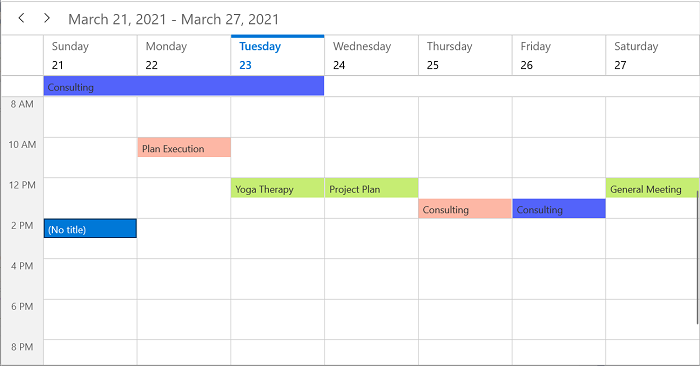

N> To modify the [TimeInterval](https://help.syncfusion.com/cr/winui/Syncfusion.UI.Xaml.Scheduler.TimeSlotViewSettings.html#Syncfusion_UI_Xaml_Scheduler_TimeSlotViewSettings_TimeInterval) value (in minutes), change the time labels format by setting the [TimeRulerFormat](https://help.syncfusion.com/cr/winui/Syncfusion.UI.Xaml.Scheduler.TimeSlotViewSettings.html#Syncfusion_UI_Xaml_Scheduler_TimeSlotViewSettings_TimeRulerFormat) value to hh:mm.

## Change time interval height

Customize the interval height of timeslots in the Day, Week, and WorkWeek views by setting the [TimeIntervalSize](https://help.syncfusion.com/cr/winui/Syncfusion.UI.Xaml.Scheduler.TimeSlotViewSettings.html#Syncfusion_UI_Xaml_Scheduler_TimeSlotViewSettings_TimeIntervalSize) property of [DaysViewSettings](https://help.syncfusion.com/cr/winui/Syncfusion.UI.Xaml.Scheduler.DaysViewSettings.html).



 <scheduler:SfScheduler x:Name="Schedule" ViewType="Week">
    <scheduler:SfScheduler.DaysViewSettings>
        <scheduler:DaysViewSettings 
            TimeIntervalSize="120"/>
        </scheduler:SfScheduler.DaysViewSettings>
</scheduler:SfScheduler>


this.Schedule.ViewType = SchedulerViewType.Week;
this.Schedule.DaysViewSettings.TimeIntervalSize = 120;



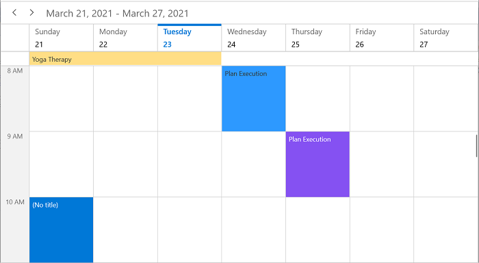

## Flexible working days 

By default, the `WinUI Scheduler` considers weekdays from Monday to Friday as working days. The days defined in the `NonWorkingDays` collection are considered as [non-working days](https://help.syncfusion.com/cr/winui/Syncfusion.UI.Xaml.Scheduler.TimeSlotViewSettings.html#Syncfusion_UI_Xaml_Scheduler_TimeSlotViewSettings_NonWorkingDays). Therefore, when weekend days are set, they are hidden from the Scheduler.

The `WorkWeek` view displays exactly the defined working days in the Scheduler control, whereas other views display all the days.



<scheduler:SfScheduler x:Name="Schedule" ViewType="Week">
    <scheduler:SfScheduler.DaysViewSettings>
        <scheduler:DaysViewSettings 
                  NonWorkingDays="Monday,Tuesday">
        </scheduler:DaysViewSettings>
    </scheduler:SfScheduler.DaysViewSettings>
</scheduler:SfScheduler>


this.scheduler.ViewType = SchedulerViewType.WorkWeek;
this.scheduler.DaysViewSettings.NonWorkingDays = new ObservableCollection<DayOfWeek>() { DayOfWeek.Monday, DayOfWeek.Tuesday };



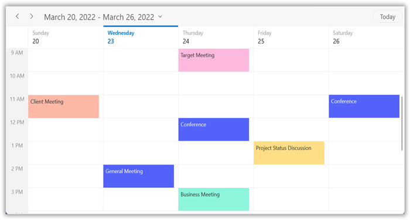

## Flexible working hours

The default values for `StartHour` and `EndHour` are 0 and 24, respectively, to show all the timeslots in the Day, Week, and WorkWeek views. Set the [StartHour](https://help.syncfusion.com/cr/winui/Syncfusion.UI.Xaml.Scheduler.TimeSlotViewSettings.html#Syncfusion_UI_Xaml_Scheduler_TimeSlotViewSettings_StartHour) and [EndHour](https://help.syncfusion.com/cr/winui/Syncfusion.UI.Xaml.Scheduler.TimeSlotViewSettings.html#Syncfusion_UI_Xaml_Scheduler_TimeSlotViewSettings_EndHour) properties of [DaysViewSettings](https://help.syncfusion.com/cr/winui/Syncfusion.UI.Xaml.Scheduler.DaysViewSettings.html) to show only the required time duration for users. Set the `StartHour` and `EndHour` values to display the required time duration in minutes.



<scheduler:SfScheduler x:Name="Schedule" ViewType="Week">
    <scheduler:SfScheduler.DaysViewSettings>
        <scheduler:DaysViewSettings 
            StartHour="8"
            EndHour="13"/>
        </scheduler:SfScheduler.DaysViewSettings>
</scheduler:SfScheduler>


this.Schedule.ViewType = SchedulerViewType.Week;
this.Schedule.DaysViewSettings.StartHour = 8;
this.Schedule.DaysViewSettings.EndHour = 13;



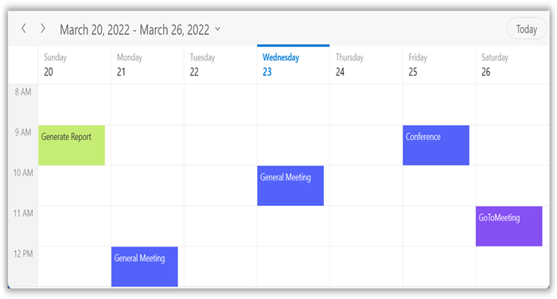

N>
* The [NonWorkingDays](https://help.syncfusion.com/cr/winui/Syncfusion.UI.Xaml.Scheduler.TimeSlotViewSettings.html#Syncfusion_UI_Xaml_Scheduler_TimeSlotViewSettings_NonWorkingDays) property is applicable only for the `WorkWeek` and `TimelineWorkWeek` views, and is not applicable for the remaining views.
* Scheduler appointments that do not fall within the `StartHour` and `EndHour` will not be visible, and if they fall partially, they will be clipped.
* You do not need to specify decimal values for `StartHour` and `EndHour` if you do not want to set the minutes.
* The number of time slots will be calculated based on total minutes of a day and time interval (total minutes of a day ((start hour - end hour) * 60) / time interval).
* If a custom `TimeInterval` is given, the number of time slots calculated based on the given `TimeInterval` should result in an integer value (total minutes % timeInterval = 0); otherwise, the next immediate time interval that results in an integer value when dividing the total minutes of a day will be considered. For example, if `TimeInterval` = 2 hours 15 minutes and total minutes = 1440 (24 hours per day), then the `TimeInterval` will be changed to `144` minutes (1440 % 144 = 0) to return an integer value for time slot rendering.
* If custom `StartHour` and `EndHour` values are given, the number of time slots calculated based on the given `StartHour` and `EndHour` should result in an integer value; otherwise, the next immediate `TimeInterval` will be considered until the result is an integer value. For example, if the `StartHour` is 9 (09:00 AM), `EndHour` is 18.25 (06:15 PM), `TimeInterval` is 30 minutes, and total minutes = 555 ((18.25 - 9) * 60), then the `TimeInterval` will be changed to `37 minutes` (555 % 37 = 0) to return the integer value for time slot rendering.

## Display spanned appointments in time slots

The `AllowSpannedAppointmentsInTimeSlots` property determines whether appointments spanning more than 24 hours are displayed in the all-day panel or directly within the timeslot cells of the `Day`, `Week`, and `WorkWeek` views. By default, these appointments are rendered in the all-day panel. Setting `AllowSpannedAppointmentsInTimeSlots` to `true` displays spanned appointments within the corresponding time-slot cells.



<scheduler:SfScheduler x:Name="Scheduler" 
                       ViewType="Week">
    <scheduler:SfScheduler.DaysViewSettings>
        <scheduler:DaysViewSettings AllowSpannedAppointmentsInTimeSlots="True"/>
    </scheduler:SfScheduler.DaysViewSettings>
</scheduler:SfScheduler>


SfScheduler scheduler = new SfScheduler();
scheduler.ViewType = SchedulerView.Week;
scheduler.DaysViewSettings.AllowSpannedAppointmentsInTimeSlots = true;
this.Content = scheduler;

 

## Special time regions

Restrict user interaction, such as selection, and highlight specific regions of time in the Day, Week, and WorkWeek views by adding the [SpecialTimeRegions](https://help.syncfusion.com/cr/winui/Syncfusion.UI.Xaml.Scheduler.TimeSlotViewSettings.html#Syncfusion_UI_Xaml_Scheduler_TimeSlotViewSettings_SpecialTimeRegions) property of SfScheduler. Set the [StartTime](https://help.syncfusion.com/cr/winui/Syncfusion.UI.Xaml.Scheduler.SpecialTimeRegion.html#Syncfusion_UI_Xaml_Scheduler_SpecialTimeRegion_StartTime) and [EndTime](https://help.syncfusion.com/cr/winui/Syncfusion.UI.Xaml.Scheduler.SpecialTimeRegion.html#Syncfusion_UI_Xaml_Scheduler_SpecialTimeRegion_EndTime) properties of [SpecialTimeRegion](https://help.syncfusion.com/cr/winui/Syncfusion.UI.Xaml.Scheduler.SpecialTimeRegion.html) to create a `SpecialTimeRegion`. Use the `TimeZone` property to set the specific timezone for the start and end time of `SpecialTimeRegion`. The `SpecialTimeRegion` will display the text or image that is set to the `Text` or `Icon` property of `SpecialTimeRegion`.

Merge adjacent regions of `SpecialTimeRegion` and show them as a single region instead of showing them separately for each day by using the [CanMergeAdjacentRegions](https://help.syncfusion.com/cr/winui/Syncfusion.UI.Xaml.Scheduler.SpecialTimeRegion.html#Syncfusion_UI_Xaml_Scheduler_SpecialTimeRegion_CanMergeAdjacentRegions) property of [SpecialTimeRegion](https://help.syncfusion.com/cr/winui/Syncfusion.UI.Xaml.Scheduler.SpecialTimeRegion.html) in the Week and WorkWeek views. By default, its value is set to `false`.

### Selection restriction in timeslots

Enable or disable the touch interaction of the `SpecialTimeRegion` by using the [CanEdit](https://help.syncfusion.com/cr/winui/Syncfusion.UI.Xaml.Scheduler.SpecialTimeRegion.html#Syncfusion_UI_Xaml_Scheduler_SpecialTimeRegion_CanEdit) property of [SpecialTimeRegion](https://help.syncfusion.com/cr/winui/Syncfusion.UI.Xaml.Scheduler.SpecialTimeRegion.html). By default, its value is set to `true`.








this.Schedule.ViewType = SchedulerViewType.Week;
this.Schedule.DaysViewSettings.SpecialTimeRegions.Add(new SpecialTimeRegion
{
    StartTime = new System.DateTime(2021, 03, 23, 13, 0, 0),
    EndTime = new System.DateTime(2021, 03, 23, 14, 0, 0),
    Text = "Lunch",
    CanEdit = false,
    Background = new SolidColorBrush(Colors.LightGray),
    Foreground = new SolidColorBrush(Colors.White)
});



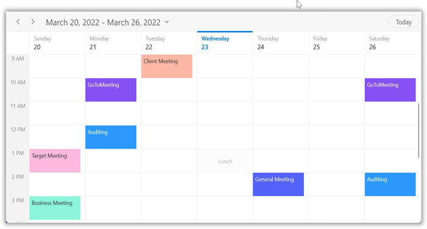

N> This property only restricts the interaction on a region; it does not restrict the following:
* Programmatic selection (if the user updates the selected date value dynamically).
* It does not clear the selection when the user selects the region and dynamically changes the [CanEdit](https://help.syncfusion.com/cr/winui/Syncfusion.UI.Xaml.Scheduler.SpecialTimeRegion.html#Syncfusion_UI_Xaml_Scheduler_SpecialTimeRegion_CanEdit) property to `false`.
* It does not restrict appointment interaction when an appointment is placed in the region.
* It does not restrict the appointment rendering on a region when the appointments are loaded from data services or added programmatically.

### Recurring time region

The recurring time region can be set on a daily, weekly, monthly, or yearly interval. Recurring special time regions can be created by setting the [RecurrenceRule](https://help.syncfusion.com/cr/winui/Syncfusion.UI.Xaml.Scheduler.SpecialTimeRegion.html#Syncfusion_UI_Xaml_Scheduler_SpecialTimeRegion_RecurrenceRule) property in [SpecialTimeRegion](https://help.syncfusion.com/cr/winui/Syncfusion.UI.Xaml.Scheduler.SpecialTimeRegion.html).

Merge the adjacent regions of `SpecialTimeRegion` and show them as a single region instead of showing them separately for each day by using the [CanMergeAdjacentRegions](https://help.syncfusion.com/cr/winui/Syncfusion.UI.Xaml.Scheduler.SpecialTimeRegion.html#Syncfusion_UI_Xaml_Scheduler_SpecialTimeRegion_CanMergeAdjacentRegions) property of [SpecialTimeRegion](https://help.syncfusion.com/cr/winui/Syncfusion.UI.Xaml.Scheduler.SpecialTimeRegion.html) in the Week and WorkWeek views. By default, its value is set to `false`.








this.Schedule.ViewType = SchedulerViewType.Week;
this.Schedule.DaysViewSettings.SpecialTimeRegions.Add(new SpecialTimeRegion
{
    StartTime = new System.DateTime(2021, 03, 21, 13, 0, 0),
    EndTime = new System.DateTime(2021, 03, 21, 14, 0, 0),
    Text = "Lunch",
    CanEdit = false,
    Background = new SolidColorBrush(Colors.LightGray),
    Foreground = new SolidColorBrush(Colors.White),
    CanMergeAdjacentRegions = true,
    RecurrenceRule = "FREQ=DAILY;INTERVAL=1"
});



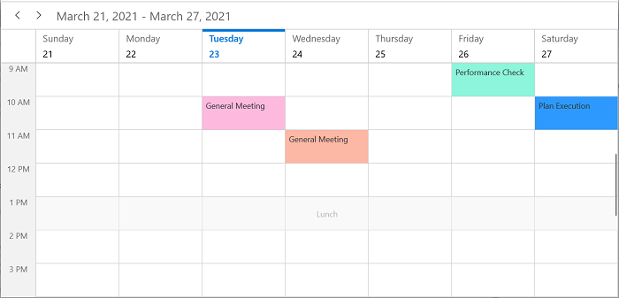

If the [CanMergeAdjacentRegions](https://help.syncfusion.com/cr/winui/Syncfusion.UI.Xaml.Scheduler.SpecialTimeRegion.html#Syncfusion_UI_Xaml_Scheduler_SpecialTimeRegion_CanMergeAdjacentRegions) of [SpecialTimeRegion](https://help.syncfusion.com/cr/winui/Syncfusion.UI.Xaml.Scheduler.SpecialTimeRegion.html) is set to `false`, the `SpecialTimeRegion` will be rendered on a date basis.

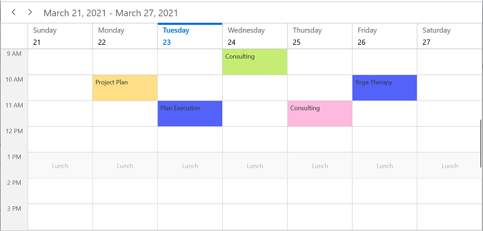

### Recurrence exception dates

Delete any occurrence that is an exception from the recurrence pattern time region by using the [RecurrenceExceptionDates](https://help.syncfusion.com/cr/winui/Syncfusion.UI.Xaml.Scheduler.SpecialTimeRegion.html#Syncfusion_UI_Xaml_Scheduler_SpecialTimeRegion_RecurrenceExceptionDates) property of [SpecialTimeRegion](https://help.syncfusion.com/cr/winui/Syncfusion.UI.Xaml.Scheduler.SpecialTimeRegion.html). The deleted occurrence date will be considered as a recurrence exception date.








this.Schedule.ViewType = SchedulerViewType.Week;
           
DateTime recurrenceExceptionDates = DateTime.Now.Date.AddDays(-1);
DateTime recurrenceExceptionDates1 = DateTime.Now.Date.AddDays(2);
this.Schedule.DaysViewSettings.SpecialTimeRegions.Add(new SpecialTimeRegion
{
    StartTime = new System.DateTime(2021, 03, 21, 13, 0, 0),
    EndTime = new System.DateTime(2021, 03, 21, 14, 0, 0),
    Text = "Lunch",
    CanEdit = false,
    RecurrenceRule = "FREQ=DAILY;INTERVAL=1",
    CanMergeAdjacentRegions = true,
    Background = new SolidColorBrush(Colors.LightGray),
    Foreground = new SolidColorBrush(Colors.White),
    RecurrenceExceptionDates = new ObservableCollection<DateTime>()
    {
        recurrenceExceptionDates,
        recurrenceExceptionDates1,
    }
});



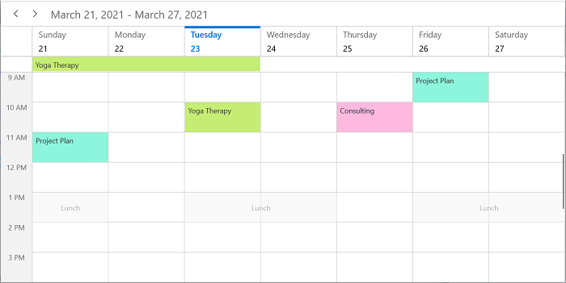

The [SpecialTimeRegion](https://help.syncfusion.com/cr/winui/Syncfusion.UI.Xaml.Scheduler.SpecialTimeRegion.html) can be rendered on a date basis by setting the value of [CanMergeAdjacentRegions](https://help.syncfusion.com/cr/winui/Syncfusion.UI.Xaml.Scheduler.SpecialTimeRegion.html#Syncfusion_UI_Xaml_Scheduler_SpecialTimeRegion_CanMergeAdjacentRegions) to `false`.

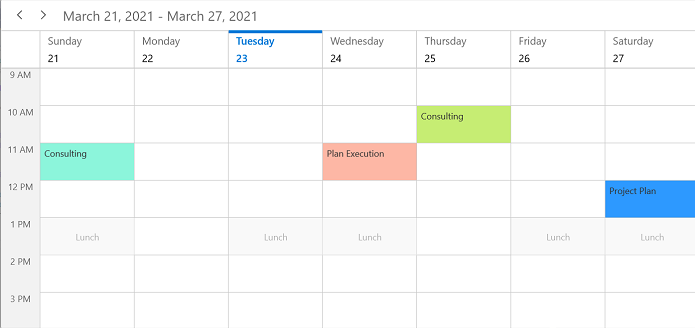

### Special time region customization

The `SpecialTimeRegion` background color can be customized by using the [Background](https://help.syncfusion.com/cr/winui/Syncfusion.UI.Xaml.Scheduler.SpecialTimeRegion.html#Syncfusion_UI_Xaml_Scheduler_SpecialTimeRegion_Background) and [SpecialTimeRegionTemplate](https://help.syncfusion.com/cr/winui/Syncfusion.UI.Xaml.Scheduler.TimeSlotViewSettings.html#Syncfusion_UI_Xaml_Scheduler_TimeSlotViewSettings_SpecialTimeRegionTemplate) properties of [SpecialTimeRegion](https://help.syncfusion.com/cr/winui/Syncfusion.UI.Xaml.Scheduler.SpecialTimeRegion.html), which is used to customize the text style and image of the `SpecialTimeRegion`.



<Grid>
    <Grid.Resources>
        <DataTemplate x:Key="specialRegionTemplate">
            <Grid Background="{Binding Background}"
            Opacity="0.5"
            HorizontalAlignment="Stretch"
            VerticalAlignment="Stretch">
            <Path x:Name="Fork" Data="M11,0 C11.553001,0 12,0.4469986 12,1 L12,15 C12,15.553001 11.553001,16 11,16 10.446999,16 10,15.553001 10,15 L10,7 9,7 C8.4469986,7 8,6.5530014 8,6 L8,3 C8,1.3429985 9.3429985,0 11,0 z M0,0 L1,0 1.2340002,4 1.7810001,4 2,0 3,0 3.2340002,4 3.7810001,4 4,0 5,0 5,4 C5,4.9660001 4.3140001,5.7727499 3.4029064,5.9593439 L3.4007993,5.9597201 3.9114671,14.517 C3.9594617,15.321 3.3195295,16 2.5136147,16 L2.5076156,16 C1.6937013,16 1.0517693,15.309 1.1107631,14.497 L1.7400641,5.9826035 1.6955509,5.9769421 C0.73587513,5.8301721 0,5.0005002 0,4 z" Fill="Black" HorizontalAlignment="Center" Height="16"  Stretch="Fill" VerticalAlignment="Center" Width="12"/>
            </Grid>
        </DataTemplate>
    </Grid.Resources>
<scheduler:SfScheduler x:Name="Schedule" ViewType="Week">
    <scheduler:SfScheduler.DaysViewSettings>
        <scheduler:DaysViewSettings  
                                SpecialTimeRegionTemplate="{StaticResource specialRegionTemplate}">
        </scheduler:DaysViewSettings>
    </scheduler:SfScheduler.DaysViewSettings>
</scheduler:SfScheduler>
</Grid>


this.Schedule.DaysViewSettings.SpecialTimeRegions.Add(new SpecialTimeRegion
{
    StartTime = new System.DateTime(2021, 03, 21, 13, 0, 0),
    EndTime = new System.DateTime(2021, 03, 21, 14, 0, 0),
    Text = "Lunch",
    CanEdit = false,
    RecurrenceRule = "FREQ=DAILY;INTERVAL=1",
    CanMergeAdjacentRegions = true,
    Background = new SolidColorBrush(Colors.LightGray),
    Foreground = new SolidColorBrush(Colors.White),
});



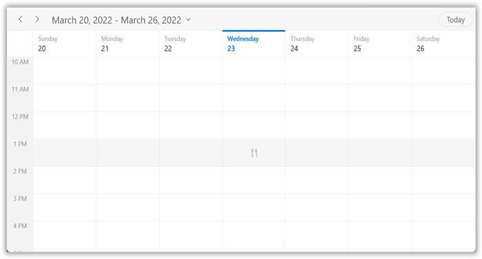

The [SpecialTimeRegion](https://help.syncfusion.com/cr/winui/Syncfusion.UI.Xaml.Scheduler.SpecialTimeRegion.html) can be customized on a date basis by setting the value of [CanMergeAdjacentRegions](https://help.syncfusion.com/cr/winui/Syncfusion.UI.Xaml.Scheduler.SpecialTimeRegion.html#Syncfusion_UI_Xaml_Scheduler_SpecialTimeRegion_CanMergeAdjacentRegions) to `false`.

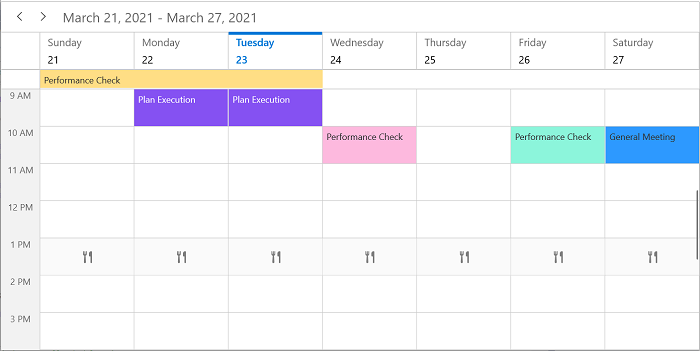

N> [View sample in GitHub](https://github.com/SyncfusionExamples/WinUI-Scheduler-Examples/tree/main/SpecialTimeRegionCustomization)

## Full screen scheduler

The WinUI Scheduler time interval height can be adjusted based on the screen height by changing the value of the [TimeIntervalSize](https://help.syncfusion.com/cr/wpf/Syncfusion.UI.Xaml.Scheduler.TimeSlotViewSettings.html#Syncfusion_UI_Xaml_Scheduler_TimeSlotViewSettings_TimeIntervalSize) property to `-1`. It will auto-fit to the screen height and width.



<scheduler:SfScheduler x:Name="Schedule" ViewType="Week">
    <scheduler:SfScheduler.DaysViewSettings>
        <scheduler:DaysViewSettings 
            TimeIntervalSize="-1"/>
    </scheduler:SfScheduler.DaysViewSettings>
</scheduler:SfScheduler>


this.Schedule.ViewType = SchedulerViewType.Week;
this.Schedule.DaysViewSettings.TimeIntervalSize = -1;



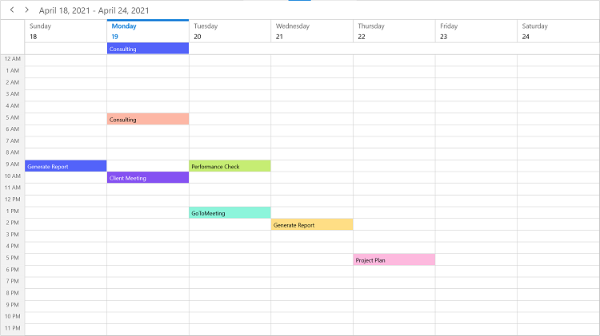

## Change time ruler width

Customize the size of the time ruler view where the labels mentioning the time are placed by using the [TimeRulerSize](https://help.syncfusion.com/cr/winui/Syncfusion.UI.Xaml.Scheduler.TimeSlotViewSettings.html#Syncfusion_UI_Xaml_Scheduler_TimeSlotViewSettings_TimeRulerSize) property of [DaysViewSettings](https://help.syncfusion.com/cr/winui/Syncfusion.UI.Xaml.Scheduler.DaysViewSettings.html).



<scheduler:SfScheduler x:Name="Schedule" ViewType="Week" >
    <scheduler:SfScheduler.DaysViewSettings>
        <scheduler:DaysViewSettings   
            TimeRulerSize="100">
        </scheduler:DaysViewSettings>
    </scheduler:SfScheduler.DaysViewSettings>
</scheduler:SfScheduler>


this.Schedule.ViewType = SchedulerViewType.Week;
this.Schedule.DaysViewSettings.TimeRulerSize = 100;



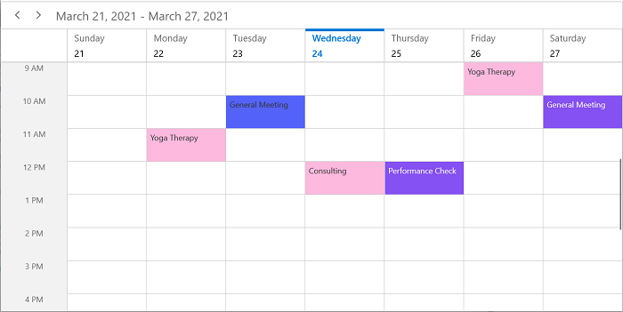

## Minimum appointment duration

The [MinimumAppointmentDuration](https://help.syncfusion.com/cr/winui/Syncfusion.UI.Xaml.Scheduler.TimeSlotViewSettings.html#Syncfusion_UI_Xaml_Scheduler_TimeSlotViewSettings_MinimumAppointmentDuration) property in [DaysViewSettings](https://help.syncfusion.com/cr/winui/Syncfusion.UI.Xaml.Scheduler.DaysViewSettings.html) is used to set an arbitrary height to appointments when they have a minimum duration in the Day, Week, and WorkWeek views, so that the subject remains readable.








this.Schedule.ViewType = SchedulerViewType.Week;
this.Schedule.DaysViewSettings.MinimumAppointmentDuration = new System.TimeSpan(0, 120, 0);



N>
* The `MinimumAppointmentDuration` value will be applied when an appointment's duration is less than `MinimumAppointmentDuration`.
* The appointment's duration value will be applied when the appointment's duration is greater than `MinimumAppointmentDuration`.
* The `TimeInterval` value will be applied when `MinimumAppointmentDuration` is greater than `TimeInterval` with a lesser appointment duration.
* All-day appointments do not support `MinimumAppointmentDuration`.

## Minimum display appointments count in all day panel

You can customize the number of appointments displayed in an all-day panel using the [MinimumAllDayAppointmentsCount](https://help.syncfusion.com/cr/winui/Syncfusion.UI.Xaml.Scheduler.DaysViewSettings.html#Syncfusion_UI_Xaml_Scheduler_DaysViewSettings_MinimumAllDayAppointmentsCount) property of `DaysViewSettings` in the Scheduler. By default, the appointment display count is 2. If an all-day panel has more than 2 appointments, two appointments will be displayed and the remaining appointments will be displayed as an appointment count.



<scheduler:SfScheduler x:Name="Schedule" ViewType="Week">
    <scheduler:SfScheduler.DaysViewSettings>
        <scheduler:DaysViewSettings 
                        MinimumAllDayAppointmentsCount="3"/>
    </scheduler:SfScheduler.DaysViewSettings>
</scheduler:SfScheduler>


this.Schedule.ViewType = SchedulerViewType.Week;
this.Schedule.DaysViewSettings.MinimumAllDayAppointmentsCount = 3;



### Customize more appointments indicator in all day panel

You can customize the default appearance of the "more appointments" indicator in an all-day panel by using the [AllDayMoreAppointmentsIndicatorTemplate](https://help.syncfusion.com/cr/winui/Syncfusion.UI.Xaml.Scheduler.DaysViewSettings.html#Syncfusion_UI_Xaml_Scheduler_DaysViewSettings_AllDayMoreAppointmentsIndicatorTemplate) property of `DaysViewSettings`.



<scheduler:SfScheduler x:Name="Schedule" ViewType="Week">
    <scheduler:SfScheduler.DaysViewSettings>
        <scheduler:DaysViewSettings>
            <scheduler:DaysViewSettings.AllDayMoreAppointmentsIndicatorTemplate>
                <DataTemplate >
                    <StackPanel Background="#EAEAEA" HorizontalAlignment="Stretch" VerticalAlignment="Stretch">
                        <TextBlock Text="{Binding}" Foreground="Black" TextAlignment="Center" VerticalAlignment="Center">
                        </TextBlock>
                    </StackPanel>
                </DataTemplate>
            </scheduler:DaysViewSettings.AllDayMoreAppointmentsIndicatorTemplate>
        </scheduler:DaysViewSettings>
    </scheduler:SfScheduler.DaysViewSettings>
</scheduler:SfScheduler>



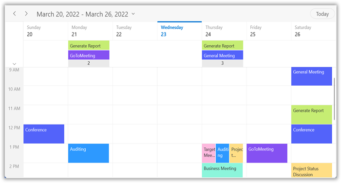

## Time ruler text formatting

Customize the format for the labels mentioning the time by setting the [TimeRulerFormat](https://help.syncfusion.com/cr/winui/Syncfusion.UI.Xaml.Scheduler.TimeSlotViewSettings.html#Syncfusion_UI_Xaml_Scheduler_TimeSlotViewSettings_TimeRulerFormat) property of [DaysViewSettings](https://help.syncfusion.com/cr/winui/Syncfusion.UI.Xaml.Scheduler.DaysViewSettings.html) in the Scheduler.








this.Schedule.ViewType = SchedulerViewType.Week;
this.Schedule.DaysViewSettings.TimeRulerFormat = "hh mm";
this.Schedule.DaysViewSettings.TimeInterval = new System.TimeSpan(0, 30, 0);



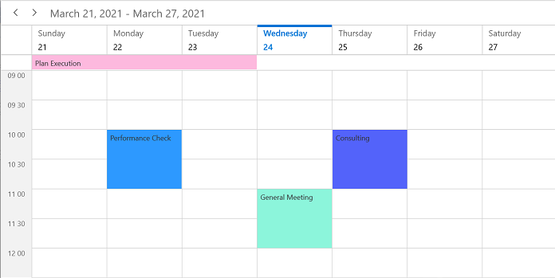

N>
* You can customize the appointment editor time format based on the Scheduler time ruler format and culture.
* By default, the Scheduler time ruler format is `h tt` and the appointment editor time picker format is `hh:mm tt`.

## View header

Customize the default appearance of the view header in the Day, Week, and WorkWeek views by setting the `ViewHeaderDateFormat`, `ViewHeaderHeight`, `ViewHeaderDayFormat`, and `ViewHeaderTemplate` of [DaysViewSettings](https://help.syncfusion.com/cr/winui/Syncfusion.UI.Xaml.Scheduler.DaysViewSettings.html).

### View header text formatting

Customize the date and day format of the ViewHeader by using the [ViewHeaderDateFormat](https://help.syncfusion.com/cr/winui/Syncfusion.UI.Xaml.Scheduler.TimeSlotViewSettings.html#Syncfusion_UI_Xaml_Scheduler_TimeSlotViewSettings_ViewHeaderDateFormat) and [ViewHeaderDayFormat](https://help.syncfusion.com/cr/winui/Syncfusion.UI.Xaml.Scheduler.ViewSettingsBase.html#Syncfusion_UI_Xaml_Scheduler_ViewSettingsBase_ViewHeaderDayFormat) properties of [DaysViewSettings](https://help.syncfusion.com/cr/winui/Syncfusion.UI.Xaml.Scheduler.DaysViewSettings.html).



<scheduler:SfScheduler x:Name="Schedule" ViewType="Week">
    <scheduler:SfScheduler.DaysViewSettings>
        <scheduler:DaysViewSettings 
            ViewHeaderDayFormat="ddd"
            ViewHeaderDateFormat="dd"/>
    </scheduler:SfScheduler.DaysViewSettings>
</scheduler:SfScheduler>


this.Schedule.ViewType = SchedulerViewType.Week;
this.Schedule.DaysViewSettings.ViewHeaderDateFormat = "dd";
this.Schedule.DaysViewSettings.ViewHeaderDayFormat = "ddd";



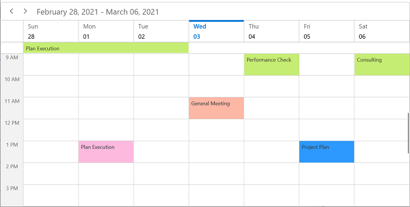

### View header height

Customize the height of the ViewHeader in the Day, Week, and WorkWeek views by setting the [ViewHeaderHeight](https://help.syncfusion.com/cr/winui/Syncfusion.UI.Xaml.Scheduler.ViewSettingsBase.html#Syncfusion_UI_Xaml_Scheduler_ViewSettingsBase_ViewHeaderHeight) property of [DaysViewSettings](https://help.syncfusion.com/cr/winui/Syncfusion.UI.Xaml.Scheduler.DaysViewSettings.html) in SfScheduler.



<scheduler:SfScheduler x:Name="Schedule" ViewType="Week">
    <scheduler:SfScheduler.DaysViewSettings>
        <scheduler:DaysViewSettings
            ViewHeaderHeight="100"/>
    </scheduler:SfScheduler.DaysViewSettings>
</scheduler:SfScheduler>


this.Schedule.ViewType = SchedulerViewType.Week;
this.Schedule.DaysViewSettings.ViewHeaderHeight = 100;



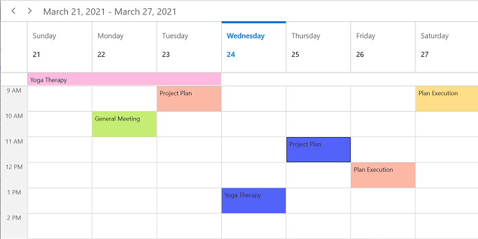

### View header appearance customization

Customize the default appearance of the view header by setting the [ViewHeaderTemplate](https://help.syncfusion.com/cr/winui/Syncfusion.UI.Xaml.Scheduler.ViewSettingsBase.html#Syncfusion_UI_Xaml_Scheduler_ViewSettingsBase_ViewHeaderTemplate) property of [DaysViewSettings](https://help.syncfusion.com/cr/winui/Syncfusion.UI.Xaml.Scheduler.DaysViewSettings.html) in SfScheduler.



<Grid>
    <Grid.Resources>
        <DataTemplate x:Key="viewHeaderTemplate">
            <StackPanel Background="Transparent"  
                Width="Auto"
                VerticalAlignment="Center" 
                HorizontalAlignment="Stretch"
                Orientation="Vertical">
            <TextBlock 
                HorizontalAlignment="Left" 
                VerticalAlignment="Center" 
                Foreground="#8551F2"
                FontFamily="Arial"
                Text="{Binding DateText}"
                FontSize="25"
                TextTrimming="CharacterEllipsis"
                TextWrapping="Wrap" />
            <TextBlock 
                HorizontalAlignment="Left" 
                VerticalAlignment="Center" 
                Foreground="#8551F2"
                FontFamily="Arial"
                Text="{Binding DayText}"
                FontSize="10"
                TextTrimming="CharacterEllipsis"
                TextWrapping="Wrap" />
        </StackPanel>
    </DataTemplate>
</Grid.Resources>
<scheduler:SfScheduler x:Name="Schedule" ViewType="Week">
    <scheduler:SfScheduler.DaysViewSettings>
        <scheduler:DaysViewSettings 
            ViewHeaderTemplate="{StaticResource viewHeaderTemplate}" />
    </scheduler:SfScheduler.DaysViewSettings>
</scheduler:SfScheduler>
</Grid>



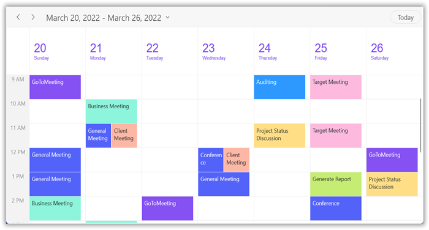

## Cell right padding

To enhance interaction with a Scheduler's appointments, you can customize the spacing between appointments and the right border of their cells by using the [CellRightPadding](https://help.syncfusion.com/cr/winui/Syncfusion.UI.Xaml.Scheduler.DaysViewSettings.html#Syncfusion_UI_Xaml_Scheduler_DaysViewSettings_CellRightPadding) property of [DaysViewSettings](https://help.syncfusion.com/cr/winui/Syncfusion.UI.Xaml.Scheduler.DaysViewSettings.html) in the [SfScheduler](https://help.syncfusion.com/cr/winui/Syncfusion.UI.Xaml.Scheduler.SfScheduler.html).



<scheduler:SfScheduler x:Name="Schedule" 
                       ViewType="Week">
    <scheduler:SfScheduler.DaysViewSettings>
        <scheduler:DaysViewSettings CellRightPadding="30"/>
    </scheduler:SfScheduler.DaysViewSettings>
</scheduler:SfScheduler>


this.Schedule.ViewType = SchedulerViewType.Week;
this.Schedule.DaysViewSettings.CellRightPadding = 30;



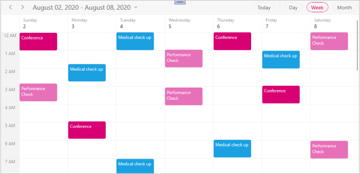

N>
* This customization applies only when the Scheduler has an appointment.
