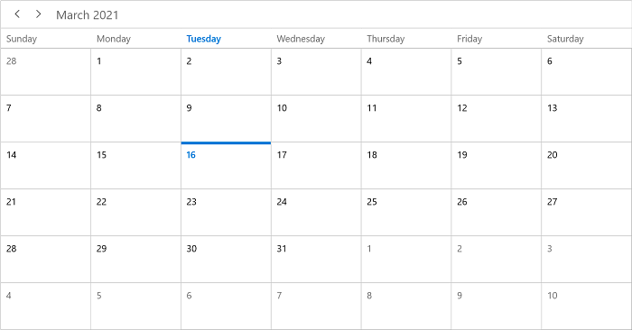
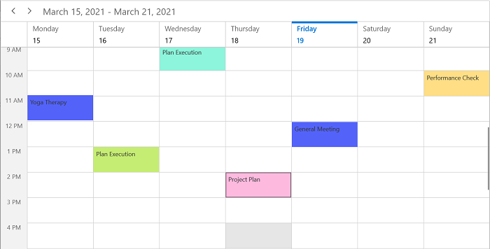
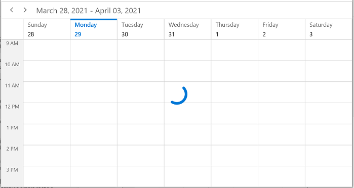

# Getting Started with WinUI Scheduler

This section provides you an overview of working with SfScheduler for WinUI and also provides a walk-through to configure the SfScheduler control in a real-time scenario.

## Creating an application with WinUI Scheduler

1. Create a [WinUI 3 desktop app for C# and .NET 5](https://docs.microsoft.com/en-us/windows/apps/winui/winui3/get-started-winui3-for-desktop) or [WinUI 3 app in UWP for C#](https://docs.microsoft.com/en-us/windows/apps/winui/winui3/get-started-winui3-for-uwp).

2. Add reference to the [Syncfusion.Scheduler.WinUI](https://www.nuget.org/packages/Syncfusion.Scheduler.WinUI) NuGet. 

3. Import the control namespace `Syncfusion.UI.Xaml.Scheduler` in XAML or C# code.

4. Initialize the SfScheduler control.



<Page
    x:Class="GettingStarted.MainPage"
    xmlns="http://schemas.microsoft.com/winfx/2006/xaml/presentation"
    xmlns:x="http://schemas.microsoft.com/winfx/2006/xaml"
    xmlns:local="using:GettingStarted"
    xmlns:d="http://schemas.microsoft.com/expression/blend/2008"
    xmlns:mc="http://schemas.openxmlformats.org/markup-compatibility/2006"
    xmlns:scheduler="using:Syncfusion.UI.Xaml.Scheduler"
    mc:Ignorable="d"
    Background="{ThemeResource ApplicationPageBackgroundThemeBrush}">

    <Grid>
        <scheduler:SfScheduler x:Name="Schedule" ViewType="Month" />
    </Grid>
</Page>



using Syncfusion.UI.Xaml.Scheduler;

namespace GettingStarted
{
    /// 

    /// An empty page that can be used on its own or navigated to within a Frame.
    /// 

    public sealed partial class MainPage : Page
    {
        public MainPage()
        {
            this.InitializeComponent();
            SfScheduler scheduler = new SfScheduler();
            this.Content = scheduler;
        }
    }
}



## Change different Scheduler Views

The [SfScheduler](https://help.syncfusion.com/cr/winui/Syncfusion.UI.Xaml.Scheduler.html) control provides eight different types of views to display dates and it can be assigned to the control by using the [ViewType](https://help.syncfusion.com/cr/winui/Syncfusion.UI.Xaml.Scheduler.SfScheduler.html#Syncfusion_UI_Xaml_Scheduler_SfScheduler_ViewType) property. By default, the control is assigned with the `Month` view. The current date will be displayed initially for all the Schedule views.



 <scheduler:SfScheduler x:Name="Schedule" ViewType="Month" />


this.Schedule.ViewType = SchedulerViewType.Month;



## Appointments

The [SfScheduler](https://help.syncfusion.com/cr/winui/Syncfusion.UI.Xaml.Scheduler.html) has a built-in capability to handle the appointment arrangement internally based on the [ScheduleAppointment](https://help.syncfusion.com/cr/winui/Syncfusion.UI.Xaml.Scheduler.ScheduleAppointment.html) collections. You need to allocate the collection generated to the Appointments property.

### Adding Appointments

The [ScheduleAppointment](https://help.syncfusion.com/cr/winui/Syncfusion.UI.Xaml.Scheduler.ScheduleAppointment.html) is a class that includes the specific scheduled appointment. It has some basic properties such as [StartTime](https://help.syncfusion.com/cr/winui/Syncfusion.UI.Xaml.Scheduler.ScheduleAppointment.html#Syncfusion_UI_Xaml_Scheduler_ScheduleAppointment_StartTime), [EndTime](https://help.syncfusion.com/cr/winui/Syncfusion.UI.Xaml.Scheduler.ScheduleAppointment.html#Syncfusion_UI_Xaml_Scheduler_ScheduleAppointment_EndTime), [Subject](https://help.syncfusion.com/cr/winui/Syncfusion.UI.Xaml.Scheduler.ScheduleAppointment.html#Syncfusion_UI_Xaml_Scheduler_ScheduleAppointment_Subject), and some additional information about the appointment can be added with [Notes](https://help.syncfusion.com/cr/winui/Syncfusion.UI.Xaml.Scheduler.ScheduleAppointment.html#Syncfusion_UI_Xaml_Scheduler_ScheduleAppointment_Notes), [Location](https://help.syncfusion.com/cr/winui/Syncfusion.UI.Xaml.Scheduler.ScheduleAppointment.html#Syncfusion_UI_Xaml_Scheduler_ScheduleAppointment_Location), and [IsAllDay](https://help.syncfusion.com/cr/winui/Syncfusion.UI.Xaml.Scheduler.ScheduleAppointment.html#Syncfusion_UI_Xaml_Scheduler_ScheduleAppointment_IsAllDay) properties.



// Creating an instance for the schedule appointment collection.
var scheduleAppointmentCollection = new ScheduleAppointmentCollection();

//Adding schedule appointment in the schedule appointment collection. 
scheduleAppointmentCollection.Add(new ScheduleAppointment()
{
    StartTime = new DateTime(2021, 03, 16, 10, 0, 0),
    EndTime = new DateTime(2021, 03, 16, 12, 0, 0),
    Subject = "Client Meeting",
    Location = "Hutchison road",
});

//Adding the schedule appointment collection to the ItemSource of SfScheduler.
Schedule.ItemsSource = scheduleAppointmentCollection;



N> [View sample in GitHub]()

### Events/Appointments data mapping

You can also map custom appointments data to our scheduler.

N> The CustomAppointment class should contain two DateTime fields and a string field as mandatory.

Here steps to render meetings using the [SfScheduler](https://help.syncfusion.com/cr/winui/Syncfusion.UI.Xaml.Scheduler.SfScheduler.html) control with respective custom data properties created in a class `Meeting.`

* [Creating custom class to map that objects with ScheduleAppointment](#creating-custom-class-to-map-that-objects-with-ScheduleAppointment)
* [Create view model](#create-view-model)
* [Mapping the data object to ScheduleAppointment](#mapping-the-data-object-to-ScheduleAppointment)
* [Bind item source for Scheduler](#binding-item-source-for-Scheduler-control)

### Creating custom class to map that object with appointment
You can create a custom class `Meeting` with mandatory fields `From,` `To,` and `EventName`.


  
    /// 
    
    /// Represents the custom data properties.    
    /// 
    
    public class Meeting 
    { 
        public string EventName { get; set; } 
        public DateTime From { get; set; } 
        public DateTime To { get; set; } 
        public bool IsAllDay { get; set; } 
        public Brush Color { get; set; } 
        public Brush ForegroundColor { get; set; } 
        public string StartTimeZone { get; set; } 
        public string EndTimeZone { get; set; } 
    }



N> You can inherit this class from the `INotifyPropertyChanged` for dynamic changes in custom data.

### Create view model

By setting `From` and `To` of Meeting class, you can schedule meetings for a specific day. You can also change the `Subject` and `color` of the appointment using the `EventName` and `Color` properties. You may define the list of custom appointments in a separate class of `ViewModel`.



public class SchedulerViewModel
{
    /// 

    /// current day meetings 
    /// 

    private List<string> currentDayMeetings;

    /// 

    /// minimum time meetings
    /// 

    private List<string> minTimeMeetings;
    
    /// 

    /// color collection
    /// 

    private List<Brush> colorCollection;

    /// 

    /// Initializes a new instance of the <see cref="ScheduleViewModel" /> class.
    /// 

     
    public SchedulerViewModel()
    {
        this.Appointments = new ObservableCollection<SchedulerModel>();
        this.InitializeDataForBookings();
        this.IntializeAppoitments();
    }

    /// 

    /// Gets or sets appointments.
    /// 

    public ObservableCollection<SchedulerModel> Appointments
    {
        get;
        set;
    }

    /// 

    /// Method for get timing range.
    /// 

    /// <returns>return time collection</returns>
    private List<Point> GettingTimeRanges()
    {
        List<Point> randomTimeCollection = new List<Point>();
        randomTimeCollection.Add(new Point(9, 11));
        randomTimeCollection.Add(new Point(12, 14));
        randomTimeCollection.Add(new Point(15, 17));

        return randomTimeCollection;
    }

    /// 

    /// Method for initialize data bookings.
    /// 

    private void InitializeDataForBookings()
    {
        this.currentDayMeetings = new List<string>();
        this.currentDayMeetings.Add("General Meeting");
        this.currentDayMeetings.Add("Plan Execution");
        this.currentDayMeetings.Add("Project Plan");
        this.currentDayMeetings.Add("Consulting");
        this.currentDayMeetings.Add("Performance Check");
        this.currentDayMeetings.Add("Yoga Therapy");
        this.currentDayMeetings.Add("Plan Execution");
        this.currentDayMeetings.Add("Project Plan");
        this.currentDayMeetings.Add("Consulting");
        this.currentDayMeetings.Add("Performance Check");

        // MinimumHeight Appointment Subjects
        this.minTimeMeetings = new List<string>();
        this.minTimeMeetings.Add("Client Metting");
        this.minTimeMeetings.Add("Birthday wish alert");

        this.colorCollection = new List<Brush>();
        this.colorCollection.Add(new SolidColorBrush(Color.FromArgb(255, 133, 81, 242)));
        this.colorCollection.Add(new SolidColorBrush(Color.FromArgb(255, 140, 245, 219)));
        this.colorCollection.Add(new SolidColorBrush(Color.FromArgb(255, 83, 99, 250)));
        this.colorCollection.Add(new SolidColorBrush(Color.FromArgb(255, 255, 222, 133)));
        this.colorCollection.Add(new SolidColorBrush(Color.FromArgb(255, 45, 153, 255)));
        this.colorCollection.Add(new SolidColorBrush(Color.FromArgb(255, 253, 183, 165)));
        this.colorCollection.Add(new SolidColorBrush(Color.FromArgb(255, 198, 237, 115)));
        this.colorCollection.Add(new SolidColorBrush(Color.FromArgb(255, 253, 185, 222)));
        this.colorCollection.Add(new SolidColorBrush(Color.FromArgb(255, 83, 99, 250)));
    }

    /// 

    /// Initialize appointments.
    /// 

    /// <param name="count">count value</param>
    private void IntializeAppoitments()
    {
        Random randomTime = new Random();
        List<Point> randomTimeCollection = this.GettingTimeRanges();

        DateTime date;
        DateTime dateFrom = DateTime.Now.AddDays(-100);
        DateTime dateTo = DateTime.Now.AddDays(100);
        var random = new Random();
        var dateCount = random.Next(4);
        DateTime dateRangeStart = DateTime.Now.AddDays(0);
        DateTime dateRangeEnd = DateTime.Now.AddDays(1);

        for (date = dateFrom; date < dateTo; date = date.AddDays(1))
        {
            if (date.Day % 7 != 0)
            {
                for (int additionalAppointmentIndex = 0; additionalAppointmentIndex < 1; additionalAppointmentIndex++)
                {
                    SchedulerModel meeting = new SchedulerModel();
                    int hour = randomTime.Next((int)randomTimeCollection[additionalAppointmentIndex].X, (int)randomTimeCollection[additionalAppointmentIndex].Y);
                    meeting.From = new DateTime(date.Year, date.Month, date.Day, hour, 0, 0);
                    meeting.To = meeting.From.AddHours(1);
                    meeting.EventName = this.currentDayMeetings[randomTime.Next(9)];
                    meeting.Color = this.colorCollection[randomTime.Next(9)];
                    meeting.ForegroundColor = GetAppointmentForeground(meeting.Color);
                    meeting.IsAllDay = false;
                    meeting.StartTimeZone = string.Empty;
                    meeting.EndTimeZone = string.Empty;
                    this.Appointments.Add(meeting);
                }
            }
            else
            {
                SchedulerModel meeting = new SchedulerModel();
                meeting.From = new DateTime(date.Year, date.Month, date.Day, randomTime.Next(9, 11), 0, 0);
                meeting.To = meeting.From.AddDays(2).AddHours(1);
                meeting.EventName = this.currentDayMeetings[randomTime.Next(9)];
                meeting.Color = this.colorCollection[randomTime.Next(9)];
                meeting.ForegroundColor = GetAppointmentForeground(meeting.Color);
                meeting.IsAllDay = true;
                meeting.StartTimeZone = string.Empty;
                meeting.EndTimeZone = string.Empty;
                this.Appointments.Add(meeting);
                }
            }

        // Minimum Height Meetings.
        DateTime minDate;
        DateTime minDateFrom = DateTime.Now.AddDays(-2);
        DateTime minDateTo = DateTime.Now.AddDays(2);

        for (minDate = minDateFrom; minDate < minDateTo; minDate = minDate.AddDays(1))
        {
            SchedulerModel meeting = new SchedulerModel();
            meeting.From = new DateTime(minDate.Year, minDate.Month, minDate.Day, randomTime.Next(9, 18), 30, 0);
            meeting.To = meeting.From;
            meeting.EventName = this.minTimeMeetings[randomTime.Next(0, 1)];
            meeting.Color = this.colorCollection[randomTime.Next(0, 2)];
            meeting.ForegroundColor = GetAppointmentForeground(meeting.Color);
            meeting.StartTimeZone = string.Empty;
            meeting.EndTimeZone = string.Empty;

            this.Appointments.Add(meeting);
        }
    }

    /// 

    /// Method to get the foreground color based on background.
    /// 

    /// <param name="backgroundColor"></param>
    /// <returns></returns>
    private Brush GetAppointmentForeground(Brush backgroundColor)
    {
        if ((backgroundColor as SolidColorBrush).Color.ToString().Equals("#FF8551F2") || (backgroundColor as SolidColorBrush).ToString().Equals("#FF5363FA") || (backgroundColor as SolidColorBrush).ToString().Equals("#FF2D99FF"))
            return new SolidColorBrush(Microsoft.UI.Colors.White);
        else
            return new SolidColorBrush(Color.FromArgb(255, 51, 51, 51));
    }
}



### Mapping the data object to ScheduleAppointment
You can map those properties of the `Meeting` class with our `SfScheduler` control by using the [AppointmentMapping](https://help.syncfusion.com/cr/winui/Syncfusion.UI.Xaml.Scheduler.AppointmentMapping.html) property.



<scheduler:SfScheduler x:Name="Schedule">
    <scheduler:SfScheduler.AppointmentMapping>
        <scheduler:AppointmentMapping
            Subject="EventName"
            StartTime="From"
            EndTime="To"
            AppointmentBackground="Color"
            Foreground="ForegroundColor"    
            IsAllDay="IsAllDay"
            StartTimeZone="StartTimeZone"
            EndTimeZone="EndTimeZone"/>
    </scheduler:SfScheduler.AppointmentMapping>
</scheduler:SfScheduler>

 
using Syncfusion.UI.Xaml.Scheduler;

AppointmentMapping appointmentMapping = new AppointmentMapping();
appointmentMapping.Subject = "EventName";
appointmentMapping.StartTime = "From";
appointmentMapping.EndTime = "To";
appointmentMapping.AppointmentBackground = "Color";
appointmentMapping.Foreground = "ForegroundColor";
appointmentMapping.IsAllDay = "IsAllDay";
appointmentMapping.StartTimeZone = "StartTimeZone";
appointmentMapping.EndTimeZone = "EndTimeZone";
Schedule.AppointmentMapping = appointmentMapping;



### Bind item source for Scheduler
Create meetings of type `ObservableCollection<Appointments>` and assign those appointments collection `Appointments` to the [ItemsSource](https://help.syncfusion.com/cr/winui/Syncfusion.UI.Xaml.Scheduler.SfScheduler.html#Syncfusion_UI_Xaml_Scheduler_SfScheduler_ItemsSource) property of `SfScheduler`.



<Page.DataContext>
    <local:SchedulerViewModel/>
</Page.DataContext>

<Grid>
    <scheduler:SfScheduler x:Name="Schedule" ItemsSource="{Binding Appointments}" ViewType="Month"/>
</Grid>


SchedulerViewModel schedulerViewModel = new SchedulerViewModel();
Schedule.ItemsSource = schedulerViewModel.Appointments;



N> [View sample in GitHub]()

## Change first day of week

The SfScheduler control will be rendered with `Sunday` as the first day of the week but you can customize it to any day by using the [FirstDayOfWeek](https://help.syncfusion.com/cr/winui/Syncfusion.UI.Xaml.Scheduler.SfScheduler.html#Syncfusion_UI_Xaml_Scheduler_SfScheduler_FirstDayOfWeek) property of `SfScheduler`.

  

<scheduler:SfScheduler x:Name="Schedule"  FirstDayOfWeek="Monday"/>


//setting first day of the week.    
Schedule.FirstDayOfWeek = DayOfWeek.Monday;   
  
  

## Show busy indicator

The `Scheduler` supports showing the busy indicator by using the [ShowBusyIndicator](https://help.syncfusion.com/cr/winui/Syncfusion.UI.Xaml.Scheduler.SfScheduler.html#Syncfusion_UI_Xaml_Scheduler_SfScheduler_ShowBusyIndicator) property. The default value is set to `false.` If the value will be set to `true` then the busy indicator will be load on view or the visible date changed.

  

<scheduler:SfScheduler x:Name="Schedule" ShowBusyIndicator="True">/> 
   

this.Schedule.ShowBusyIndicator = true;   
  
  

