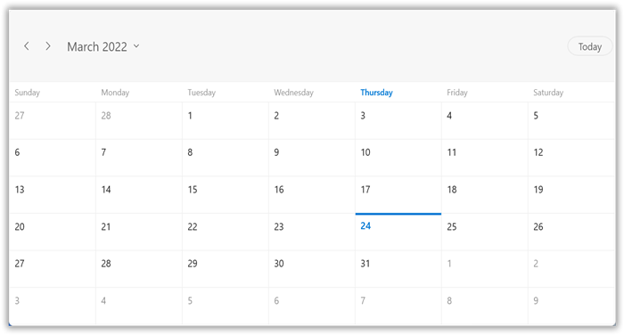
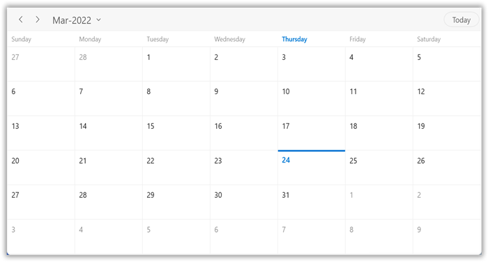
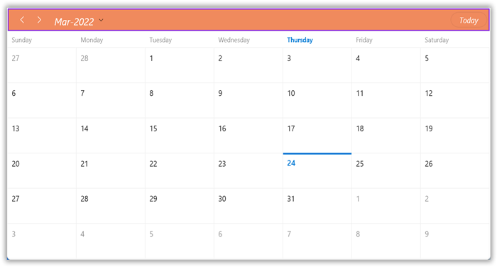
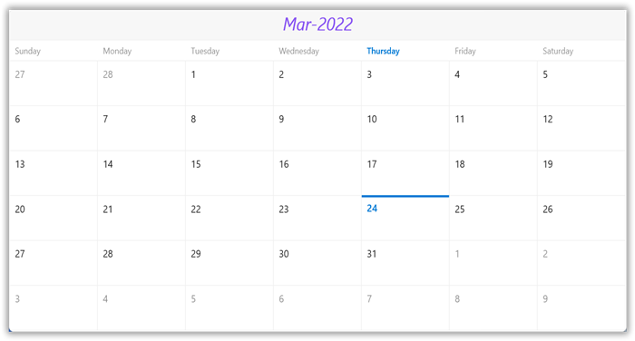

# Header in WinUI Scheduler (SfScheduler)

Change the header height, date format, and appearance of SfScheduler.

## Header height

Change the scheduler header height by using the [HeaderHeight](https://help.syncfusion.com/cr/winui/Syncfusion.UI.Xaml.Scheduler.SfScheduler.html#Syncfusion_UI_Xaml_Scheduler_SfScheduler_HeaderHeight) property of SfScheduler. By default, the header height is `50.`



<scheduler:SfScheduler x:Name="Schedule" 
                       HeaderHeight="100">
</scheduler:SfScheduler>


this.Schedule.HeaderHeight = 100;



## Header date format

Change the Scheduler header date format of scheduler by using the [HeaderDateFormat](https://help.syncfusion.com/cr/winui/Syncfusion.UI.Xaml.Scheduler.SfScheduler.html#Syncfusion_UI_Xaml_Scheduler_SfScheduler_HeaderDateFormat) property of SfScheduler. By default, the header date format is `MMMM yyyy.`



<scheduler:SfScheduler x:Name="Schedule" 
                       HeaderDateFormat="MMM-yyyy">
</scheduler:SfScheduler>


this.Schedule.HeaderDateFormat = "MMM-yyyy";



## Appearance customization

The scheduler header appearance can be achieved by using the `HeaderTemplate` property or style the header appearance using the `SchedulerHeaderControl` in the scheduler. Change the background color, textStyle, borderBrush, and more by setting the style property for `SchedulerHeaderControl.`



<Grid>
    <Grid.Resources>
        
    </Grid.Resources>

    <scheduler:SfScheduler x:Name="Schedule">
    </scheduler:SfScheduler>
</Grid>



#### Customize header appearance using DataTemplate

Customize the header appearance of scheduler by using the [HeaderTemplate](https://help.syncfusion.com/cr/winui/Syncfusion.UI.Xaml.Scheduler.SfScheduler.html#Syncfusion_UI_Xaml_Scheduler_SfScheduler_HeaderTemplate) property of SfScheduler.



<scheduler:SfScheduler x:Name="Schedule">
    <scheduler:SfScheduler.HeaderTemplate>
        <DataTemplate>
                <TextBlock FontStyle="Italic"
                           Foreground="#8551F2"
                           FontSize="25"
                           Text="{Binding}"/>
        </DataTemplate>
    </scheduler:SfScheduler.HeaderTemplate>
</scheduler:SfScheduler>



