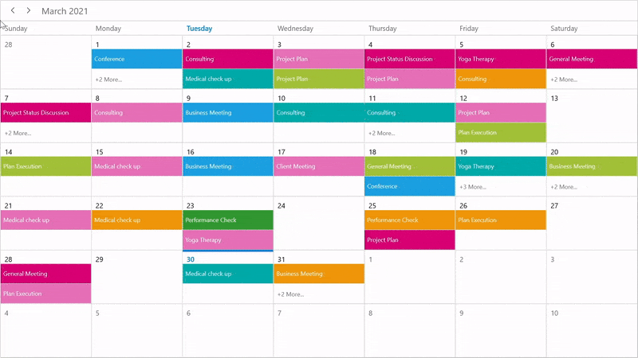
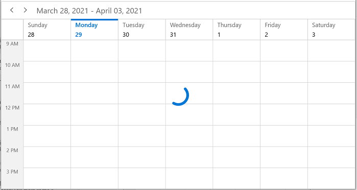

# Load On Demand in WinUI Scheduler (SfScheduler)

The Scheduler supports loading appointments on-demand with a loading indicator, and it improves the loading performance when there are appointment ranges for multiple years.

## QueryAppointments event

The [QueryAppointments](https://help.syncfusion.com/cr/winui/Syncfusion.UI.Xaml.Scheduler.SfScheduler.html#Syncfusion_UI_Xaml_Scheduler_SfScheduler_QueryAppointments) event is used to load appointments on-demand for the visible date range. Start and stop the loading indicator animation before and after the appointments are loaded, by using the [ShowBusyIndicator](https://help.syncfusion.com/cr/winui/Syncfusion.UI.Xaml.Scheduler.SfScheduler.html#Syncfusion_UI_Xaml_Scheduler_SfScheduler_ShowBusyIndicator).
The [QueryAppointmentsEventArgs](https://help.syncfusion.com/cr/winui/Syncfusion.UI.Xaml.Scheduler.QueryAppointmentsEventArgs.html) has the following members that provide information for the `QueryAppointments` event.

[VisibleDateRange](https://help.syncfusion.com/cr/winui/Syncfusion.UI.Xaml.Scheduler.DateRange.html): Gets the current visible date range of scheduler that is used to load the appointments.



<scheduler:SfScheduler x:Name="Schedule"
                       ViewType="Month" 
                       QueryAppointments="Schedule_QueryAppointments" >
</scheduler:SfScheduler>


this.Schedule.QueryAppointments += Schedule_QueryAppointments;

/// 

///  current day meetings
/// 

private List<string> currentDayMeetings;

/// 

/// color collection
/// 

private List<Brush> colorCollection;

private void Schedule_QueryAppointments(object sender, QueryAppointmentsEventArgs e)
{
    this.Schedule.ShowBusyIndicator = true;
    this.InitializeDataForBookings();
    this.Schedule.ItemsSource = this.GenerateSchedulerAppointments(e.VisibleDateRange);
    this.Schedule.ShowBusyIndicator = false;
}

private void InitializeDataForBookings()
{
    this.currentDayMeetings = new List<string>();
    this.currentDayMeetings.Add("General Meeting");
    this.currentDayMeetings.Add("Plan Execution");
    this.currentDayMeetings.Add("Project Plan");
    this.currentDayMeetings.Add("Consulting");
    this.currentDayMeetings.Add("Performance Check");
    this.currentDayMeetings.Add("Yoga Therapy");
    this.currentDayMeetings.Add("Plan Execution");
    this.currentDayMeetings.Add("Project Plan");
    this.currentDayMeetings.Add("Consulting");
    this.currentDayMeetings.Add("Performance Check");

    this.colorCollection = new List<Brush>();
    this.colorCollection.Add(new SolidColorBrush(Color.FromArgb(255, 133, 81, 242)));
    this.colorCollection.Add(new SolidColorBrush(Color.FromArgb(255, 140, 245, 219)));
    this.colorCollection.Add(new SolidColorBrush(Color.FromArgb(255, 83, 99, 250)));
    this.colorCollection.Add(new SolidColorBrush(Color.FromArgb(255, 255, 222, 133)));
    this.colorCollection.Add(new SolidColorBrush(Color.FromArgb(255, 45, 153, 255)));
    this.colorCollection.Add(new SolidColorBrush(Color.FromArgb(255, 253, 183, 165)));
    this.colorCollection.Add(new SolidColorBrush(Color.FromArgb(255, 198, 237, 115)));
    this.colorCollection.Add(new SolidColorBrush(Color.FromArgb(255, 253, 185, 222)));
    this.colorCollection.Add(new SolidColorBrush(Color.FromArgb(255, 83, 99, 250)));
}

    /// 

    /// Method to generate the schedule appointments.
    /// 

    /// <param name="dateRange">The visible date range.</param>
    /// <returns>The collection of generated appointments.</returns>
    private IEnumerable GenerateSchedulerAppointments(DateRange dateRange)
    {
        Random ran = new Random();
        int daysCount = (dateRange.ActualEndDate - dateRange.ActualStartDate).Days;
        var appointments = new ScheduleAppointmentCollection();

        for (int i = 0; i < 50; i++)
        {
            var startTime = dateRange.ActualStartDate.AddDays(ran.Next(0, daysCount + 1)).AddHours(ran.Next(0, 24));
            appointments.Add(new ScheduleAppointment
            {
                StartTime = startTime,
                EndTime = startTime.AddHours(1),
                Subject = currentDayMeetings[ran.Next(0, currentDayMeetings.Count)],
                AppointmentBackground = colorCollection[ran.Next(0, colorCollection.Count)],
            });
        }
         return appointments;
}



The [QueryAppointments](https://help.syncfusion.com/cr/winui/Syncfusion.UI.Xaml.Scheduler.SfScheduler.html#Syncfusion_UI_Xaml_Scheduler_SfScheduler_QueryAppointments) event will be raised if any of the following actions is taken.

Once the [ViewChanged](https://help.syncfusion.com/cr/winui/Syncfusion.UI.Xaml.Scheduler.SfScheduler.html#Syncfusion_UI_Xaml_Scheduler_SfScheduler_ViewChanged) event is raised, the `QueryAppointments` will be raised.

If the appointment has been added, removed, or changed (Resize, drag, and drop) in the current visible date range, then the `QueryAppointments` event will not be triggered, since the appointments for that visible date range have already been loaded.

The `QueryAppointments` event is triggered when the Schedule [ResourceCollection](https://help.syncfusion.com/cr/winui/Syncfusion.UI.Xaml.Scheduler.SfScheduler.html#Syncfusion_UI_Xaml_Scheduler_SfScheduler_ResourceCollection) is updated to load appointments based on the changed resource collection.

The `QueryAppointments` event will be triggered when the [ResourceGroupType](https://help.syncfusion.com/cr/winui/Syncfusion.UI.Xaml.Scheduler.SfScheduler.html#Syncfusion_UI_Xaml_Scheduler_SfScheduler_ResourceGroupType) is changed.

## Load on demand command

The Scheduler notifies the [LoadOnDemandCommand](https://help.syncfusion.com/cr/winui/Syncfusion.UI.Xaml.Scheduler.SfScheduler.html#Syncfusion_UI_Xaml_Scheduler_SfScheduler_LoadOnDemandCommand) when the user changes the visible date range. Get a visible date range from the [QueryAppointmentsEventArgs](https://help.syncfusion.com/cr/winui/Syncfusion.UI.Xaml.Scheduler.QueryAppointmentsEventArgs.html). The default value for this `ICommand` is `null`. The `QueryAppointmentsEventArgs` is passed as a command parameter.

Define a ViewModel class that implements a command and handle it by using the `CanExecute` and `Execute` methods to check and execute on-demand loading. In the `Execute` method, perform the following operations.

* Start and stop the loading indicator animation before and after the appointments are loaded, by using the [ShowBusyIndicator](https://help.syncfusion.com/cr/winui/Syncfusion.UI.Xaml.Scheduler.SfScheduler.html#Syncfusion_UI_Xaml_Scheduler_SfScheduler_ShowBusyIndicator).
* Once the appointment collection is obtained, load it into the scheduler `ItemsSource`.



 <scheduler:SfScheduler x:Name="Schedule"  
                        ViewType="Month"
                        ShowBusyIndicator="{Binding ShowBusyIndicator}"
                        LoadOnDemandCommand="{Binding LoadOnDemandCommand}"
                        ItemsSource="{Binding Events}">
            <scheduler:SfScheduler.DataContext>
                <local:LoadOnDemandViewModel />
            </scheduler:SfScheduler.DataContext>
</scheduler:SfScheduler>


public class LoadOnDemandViewModel : NotificationObject
{
    public DelegateCommand LoadOnDemandCommand { get; set; }
    private IEnumerable events;
    public IEnumerable Events
    {
        get { return events; }
        set
        {
            events = value;
            this.RaisePropertyChanged("Events");
        }
    }

    private bool showBusyIndicator;
    public bool ShowBusyIndicator
    {
        get { return showBusyIndicator; }
        set
        {
            showBusyIndicator = value;
            this.RaisePropertyChanged("ShowBusyIndicator");
        }
    }

    public LoadOnDemandViewModel()
    {
        this.InitializeDataForBookings();
        this.LoadOnDemandCommand = new DelegateCommand(ExecuteOnDemandLoading, CanExecuteOnDemandLoading);
    }

    public event PropertyChangedEventHandler PropertyChanged;
    public async void ExecuteOnDemandLoading(object parameter)
    {
        this.ShowBusyIndicator = true;
        await Task.Delay(1000);
        Application.Current.Resources.DispatcherQueue.TryEnqueue(() =>
        {
            this.Events = this.GenerateSchedulerAppointments((parameter as QueryAppointmentsEventArgs).VisibleDateRange);
            });
            this.ShowBusyIndicator = false;
        }

        private bool CanExecuteOnDemandLoading(object sender)
        {
            return true;
        }

    /// 

    ///  current day meetings
    /// 

    private List<string> currentDayMeetings;

    /// 

    /// color collection
    /// 

    private List<Brush> colorCollection;

    private void InitializeDataForBookings()
    {
        this.currentDayMeetings = new List<string>();
        this.currentDayMeetings.Add("General Meeting");
        this.currentDayMeetings.Add("Plan Execution");
        this.currentDayMeetings.Add("Project Plan");
        this.currentDayMeetings.Add("Consulting");
        this.currentDayMeetings.Add("Performance Check");
        this.currentDayMeetings.Add("Yoga Therapy");
        this.currentDayMeetings.Add("Plan Execution");
        this.currentDayMeetings.Add("Project Plan");
        this.currentDayMeetings.Add("Consulting");
        this.currentDayMeetings.Add("Performance Check");

        this.colorCollection = new List<Brush>();
        this.colorCollection.Add(new SolidColorBrush(Color.FromArgb(255, 133, 81, 242)));
        this.colorCollection.Add(new SolidColorBrush(Color.FromArgb(255, 140, 245, 219)));
        this.colorCollection.Add(new SolidColorBrush(Color.FromArgb(255, 83, 99, 250)));
        this.colorCollection.Add(new SolidColorBrush(Color.FromArgb(255, 255, 222, 133)));
        this.colorCollection.Add(new SolidColorBrush(Color.FromArgb(255, 45, 153, 255)));
        this.colorCollection.Add(new SolidColorBrush(Color.FromArgb(255, 253, 183, 165)));
        this.colorCollection.Add(new SolidColorBrush(Color.FromArgb(255, 198, 237, 115)));
        this.colorCollection.Add(new SolidColorBrush(Color.FromArgb(255, 253, 185, 222)));
        this.colorCollection.Add(new SolidColorBrush(Color.FromArgb(255, 83, 99, 250)));
    }

    private IEnumerable GenerateSchedulerAppointments(DateRange dateRange)
    {
        Random ran = new Random();
        int daysCount = (dateRange.ActualEndDate - dateRange.ActualStartDate).Days;
        var appointments = new ScheduleAppointmentCollection();
        for (int i = 0; i < 50; i++)
        {
            var startTime = dateRange.ActualStartDate.AddDays(ran.Next(0, daysCount + 1)).AddHours(ran.Next(0, 24)); appointments.Add(new ScheduleAppointment
            {
                StartTime = startTime,
                EndTime = startTime.AddHours(1),
                Subject = currentDayMeetings[ran.Next(0, currentDayMeetings.Count)],
                AppointmentBackground = colorCollection[ran.Next(0, colorCollection.Count)],
            });
        }
        return appointments;
    }
}



The [LoadOnDemandCommand](https://help.syncfusion.com/cr/winui/Syncfusion.UI.Xaml.Scheduler.SfScheduler.html#Syncfusion_UI_Xaml_Scheduler_SfScheduler_LoadOnDemandCommand) will be invoked if any of the following actions are taken.

* Once the ViewChanged event is raised, the `LoadOnDemandCommand` will also be raised.

* If the appointment has been added, removed, or changed (Resize, drag, and drop) in the current visible date range, then the `LoadOnDemandCommand` will not be triggered, since the appointments for that visible date range have already been loaded.

* The `LoadOnDemandCommand` is triggered when the Schedule `ResourceCollection` is updated to load the appointments based on the changed resource collection.

* The `LoadOnDemandCommand` will be triggered when the `ResourceGroupType` is changed.

## Load on demand for recurring appointment

The scheduler will add the occurrences of the recurrence series based on the visible date range. Use the [RecurrenceHelper.GetRecurrenceDateTimeCollection](https://help.syncfusion.com/cr/winui/Syncfusion.UI.Xaml.Scheduler.RecurrenceHelper.html#Syncfusion_UI_Xaml_Scheduler_RecurrenceHelper_GetRecurrenceDateTimeCollection_System_String_System_DateTime_System_Nullable_System_DateTime__System_Nullable_System_DateTime__) to compare and load the recurrence appointment on-demand in the `ItemsSource`.

The recurrence appointment should be added to the Scheduler `ItemsSource` until the date of recurrence ends.

If [RecurrenceRule](https://help.syncfusion.com/cr/winui/Syncfusion.UI.Xaml.Scheduler.ScheduleAppointment.html#Syncfusion_UI_Xaml_Scheduler_ScheduleAppointment_RecurrenceRule) is added with count or end date, use the [RecurrenceHelper.GetRecurrenceDateTimeCollection](https://help.syncfusion.com/cr/winui/Syncfusion.UI.Xaml.Scheduler.RecurrenceHelper.html#Syncfusion_UI_Xaml_Scheduler_RecurrenceHelper_GetRecurrenceDateTimeCollection_System_String_System_DateTime_System_Nullable_System_DateTime__System_Nullable_System_DateTime__) method to get the recurrence date collection and compare recursive dates in the current visible date range. Then, add the recurrence appointment in the scheduler [ItemsSource](https://help.syncfusion.com/cr/winui/Syncfusion.UI.Xaml.Scheduler.SfScheduler.html#Syncfusion_UI_Xaml_Scheduler_SfScheduler_ItemsSource) if the recursive dates are in the current visible date range.

If the `RecurrenceRule` is added without an end date, then the recurrence appointment should be added in the scheduler `ItemsSource` when all the visible dates have changed from the recurrence start date.

N> [View sample in GitHub](https://github.com/SyncfusionExamples/WinUI-Scheduler-Examples/tree/main/LoadOnDemand)

## Show busy indicator

The `Scheduler` supports showing the busy indicator by using the [ShowBusyIndicator](https://help.syncfusion.com/cr/winui/Syncfusion.UI.Xaml.Scheduler.SfScheduler.html#Syncfusion_UI_Xaml_Scheduler_SfScheduler_ShowBusyIndicator) property. The default value is set to `false`. If the value is set to `true`, then the busy indicator will be shown when the view is loaded or the visible date is changed.

  

<scheduler:SfScheduler x:Name="Schedule" 
                       ShowBusyIndicator="True">
</scheduler:SfScheduler> 
   

this.Schedule.ShowBusyIndicator = true;   
  
  

