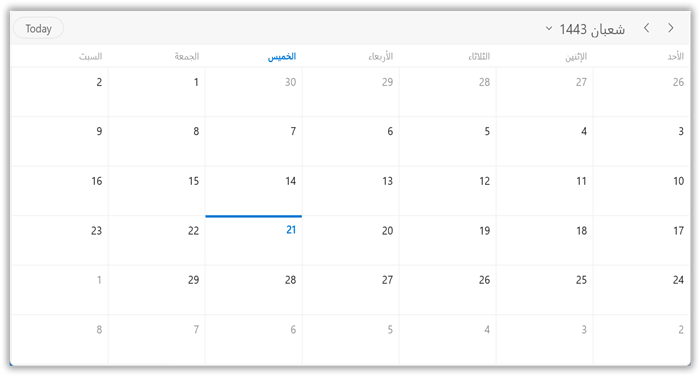

# Calendar Types in WinUI Scheduler (SfScheduler)
This section describes how to localize the scheduler control by using `Language` and `CalendarIdentifier` properties in `SfScheduler.`

## Types of Calendar
The Scheduler control supports different types of calendars such as Gregorian, Korean, Hebrew, and more. You can change the calendar types by using the `CalendarIdentifier` property in Scheduler. The default value of the `CalendarIdentifier` property is `GregorianCalendar.`

<table>
<tr>
<th>Supported Calendars</th>
<th>UnSupported Calendars</th>
</tr>
<tr>

<td>
* GregorianCalendar 
* HebrewCalendar 
* HijriCalendar 
* KoreanCalendar 
* TaiwanCalendar 
* ThaiCalendar 
* UmAlQuraCalendar 
* PersianCalendar 
* JulianCalendar 
</td>

<td>
* JapaneseCalendar 
* Lunar type calendars 
</td>
</tr>
</table>

N> 
* When the `CalendarIdentifier` and `FlowDirection` properties are set, the `FlowDirection` property is given higher precedence. If you want to override this behavior set the `FlowDirection` after `CalendarIdentifier.`
* The scheduler uses the `CalendarIdentifier` property to determine which calendar to use to localize and format the header date, view header day, and date, time ruler, and DatePicker, and TimePicker in the appointment editor.
* By default, the scheduler uses the `GregorianCalendar` for the app’s preferred language.
* If the scheduler is localized with the `CalendarIdentifier,` it will display in the app’s preferred language. For example, if you specify a `KoreanCalendar` and the app language is "en-us," the scheduler will display in English because there are translations applied for the Korean calendar.
* The Scheduler Time mode (12 hour or 24 hour) does not change depending on the calendar type; however, the time format can be changed depending on the calendar type by using [Day view time text formatting](https://help.syncfusion.com/winui/scheduler/day-week-views#time-ruler-text-formatting) and [Timeline view time text formatting](https://help.syncfusion.com/winui/scheduler/timeline-views#time-ruler-text-formatting).



<scheduler:SfScheduler x:Name="Schedule"
                       CalendarIdentifier="HijriCalendar" />


this.Schedule.CalendarIdentifier = "HijriCalendar";



### DateTime values in Calendar Types
You can give all the DateTime values such as `DisplayDate,` `SelectedDate,` `BlackoutDates,` Appointment `StartTime,` and `EndTime,` `SpecialTimeRegion` Start and End time values in two ways when the calendar identifier is specified other than `GregorianCalendar.`

* A `DateTime` instance without specifying calendar type. A scheduler will handle the `DateTime` value for the specified calendar type. For example,  DisplayDate = new DateTime(1442, 12, 2);

* A `DateTime` instance with specified calendar type. If calendar type is mentioned then the date should be respective to that calendar so that the date value will be converted to Gregorian DateTime and the scheduler will handle that DateTime. For example,  DisplayDate = new DateTime(1442, 12, 2, new HijriCalendar());



<scheduler:SfScheduler x:Name="Schedule"
                       CalendarIdentifier="HijriCalendar" />


this.Schedule.CalendarIdentifier = "HijriCalendar";
this.Schedule.DisplayDate = new DateTime(1442, 12, 2, new HijriCalendar());



N> [View sample in GitHub](https://github.com/SyncfusionExamples/WinUI-Scheduler-Examples/tree/main/CalendarTypes)

## Change the language
You can localize the scheduler using the `Language` property. The default value of Language property is `en-US`.



<scheduler:SfScheduler x:Name="Schedule"
                       Language="fr-FR" />


this.Schedule..Language = "fr-FR";

