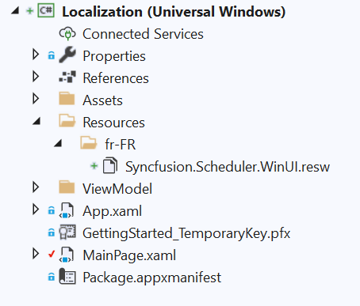
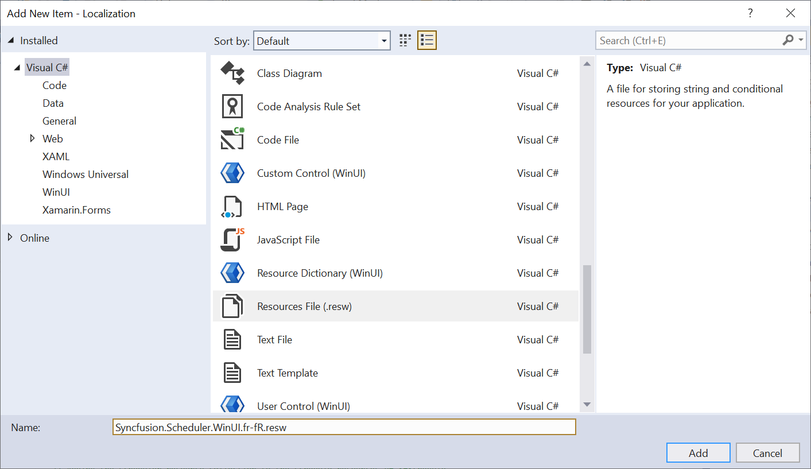
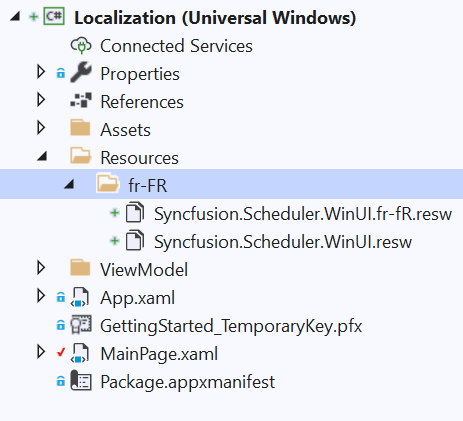
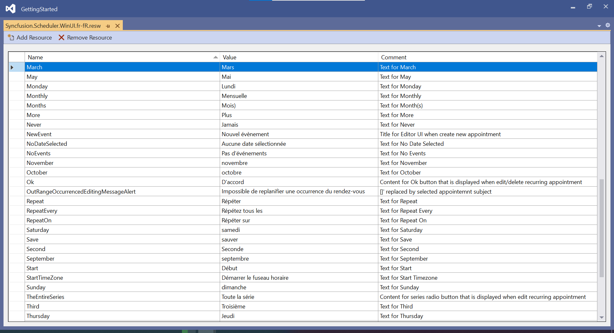
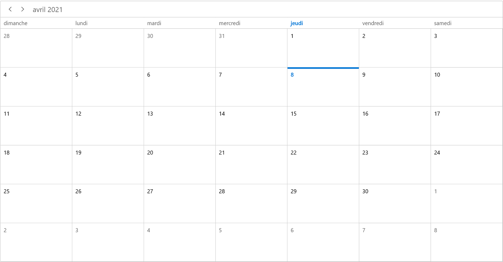

# Localization in WinUI Scheduler (SfScheduler)

Localization is the process of customizing the user interface based on a culture specific to a particular country or region in order to display regional data. The culture is represented by a unique string, for example, ―en-US ‖ for U.S. English and ― fr-FR ‖ for French (common).

Localization is the key feature that provides solutions to global customers with the help of localized resource files provided by the control. The Scheduler supports localization, and you can create a resource file for any culture to be applied in the scheduler.

## Set Current UI Culture to the Application

Application culture can be changed by setting [CurrentUICulture](https://docs.microsoft.com/en-us/dotnet/api/system.globalization.cultureinfo.currentuiculture?redirectedfrom=MSDN&view=net-5.0#System_Globalization_CultureInfo_CurrentUICulture).



public MainPage()
{
    this.InitializeComponent();
    CultureInfo.CurrentUICulture = new CultureInfo("fr-FR");
}



## Localization using Resource file

To localize the Scheduler based on `CurrentUICulture` using resource files, follow the below steps.

    1. Create new folder and named as **Resources** in your application.

    2 Add the default resource file of Scheduler into **Resources** folder.

    

3. Right-click on the Resources folder, select **Add** and then **NewItem**.

4. In Add New Item wizard, select the **Resource File** option and name the filename as **Syncfusion.Scheduler.WinUI.<culture name>.resw**. For example, you have to give name as **Syncfusion.Scheduler.WinUI.resw** for German culture.

5. The culture name that indicates the name of language and country.

6. Now, select `Add` option to add the resource file in **Resources** folder.

7. Add the Name/Value pair in Resource Designer of **Syncfusion.SfScheduler.WinUI.fr-FR.resw** file and change its corresponding value to corresponding culture.

