# Month View in WinUI Scheduler (SfScheduler)

By default, the month view of the scheduler displays the days of a specific month and current month initially. The current date color is differentiated from other dates of the current month.

## Month agenda view

The scheduler month view displays a divided agenda view that is used to show the selected date’s appointments below the month. Show the agenda view by setting the [ShowAgendaView](https://help.syncfusion.com/cr/winui/Syncfusion.UI.Xaml.Scheduler.MonthViewSettings.html#Syncfusion_UI_Xaml_Scheduler_MonthViewSettings_ShowAgendaView) property to true in the [MonthViewSettings](https://help.syncfusion.com/cr/winui/Syncfusion.UI.Xaml.Scheduler.MonthViewSettings.html).



<scheduler:SfScheduler x:Name="Schedule"
                       ViewType="Month" >
    <scheduler:SfScheduler.MonthViewSettings>
        <scheduler:MonthViewSettings 
                       ShowAgendaView="True"/>
    </scheduler:SfScheduler.MonthViewSettings>
</scheduler:SfScheduler>


this.Schedule.ViewType = SchedulerViewType.Month;
this.Schedule.MonthViewSettings.ShowAgendaView = true;



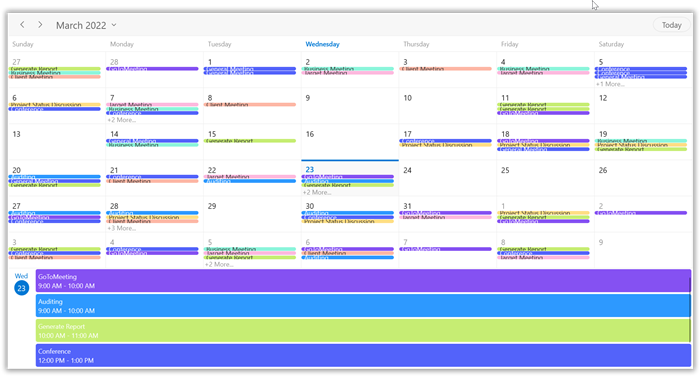

N>
* An agenda view displays the text as No Selected Date until a date is selected.
* If there is no appointment on a selected day, the agenda view displays the text as No Events.

### Agenda view height

Customize the month agenda view height from the Scheduler by using the [AgendaViewHeight](https://help.syncfusion.com/cr/winui/Syncfusion.UI.Xaml.Scheduler.MonthViewSettings.html#Syncfusion_UI_Xaml_Scheduler_MonthViewSettings_AgendaViewHeight) property of [MonthViewSettings](https://help.syncfusion.com/cr/winui/Syncfusion.UI.Xaml.Scheduler.MonthViewSettings.html). By default, the agenda view will occupy 30% of the Scheduler height.



<scheduler:SfScheduler x:Name="Schedule"
                       ViewType="Month" >
     <scheduler:SfScheduler.MonthViewSettings>
          <scheduler:MonthViewSettings 
               AppointmentDisplayMode="Indicator"
               ShowAgendaView="True"
               AgendaViewHeight="300"/>
     </scheduler:SfScheduler.MonthViewSettings>
</scheduler:SfScheduler>


this.Schedule.ViewType = SchedulerViewType.Month;
this.Schedule.MonthViewSettings.AppointmentDisplayMode = AppointmentDisplayMode.Indicator;
this.Schedule.MonthViewSettings.ShowAgendaView = true;
this.Schedule.MonthViewSettings.AgendaViewHeight = 300;



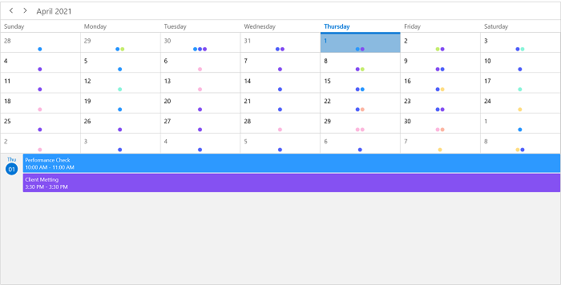

## Appointment display mode

Handle the Scheduler month view appointment display by using the [AppointmentDisplayMode](https://help.syncfusion.com/cr/winui/Syncfusion.UI.Xaml.Scheduler.MonthViewSettings.html#Syncfusion_UI_Xaml_Scheduler_MonthViewSettings_AppointmentDisplayMode) property of [MonthViewSettings](https://help.syncfusion.com/cr/winui/Syncfusion.UI.Xaml.Scheduler.MonthViewSettings.html). By default, the AppointmentDisplayMode is set to Appointment. By using the AppointmentDisplayMode, set the month view appointments display as follows.

* `None`:  Appointment will not be displayed.
* `Indicator`:  Appointment will be denoted as the circle.
* `Appointment`:  Appointment subject will be displayed in the month cell.



<scheduler:SfScheduler x:Name="Schedule"
                       ViewType="Month" >
       <scheduler:SfScheduler.MonthViewSettings>
            <scheduler:MonthViewSettings 
                       AppointmentDisplayMode="Appointment"/>
       </scheduler:SfScheduler.MonthViewSettings>
</scheduler:SfScheduler>


this.Schedule.ViewType = SchedulerViewType.Month; 
this.Schedule.MonthViewSettings.AppointmentDisplayMode = AppointmentDisplayMode.Appointment;



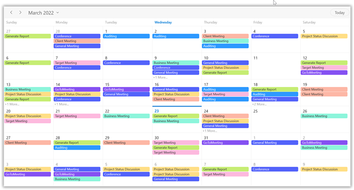

## Appointment display count

Customize the number of appointments displayed in a month cell using the [AppointmentDisplayCount](https://help.syncfusion.com/cr/winui/Syncfusion.UI.Xaml.Scheduler.MonthViewSettings.html#Syncfusion_UI_Xaml_Scheduler_MonthViewSettings_AppointmentDisplayCount) property of the [MonthViewSettings](https://help.syncfusion.com/cr/winui/Syncfusion.UI.Xaml.Scheduler.MonthViewSettings.html) in the Scheduler. By default, the appointment display count is 3, and the month cell has more than 3 appointments, 3 appointments will be displayed and the remaining appointments in the month cell will be displayed as more appointments.



 <scheduler:SfScheduler x:Name="Schedule"
                        ViewType="Month" >
     <scheduler:SfScheduler.MonthViewSettings>
          <scheduler:MonthViewSettings 
                       AppointmentDisplayMode="Indicator"  
                       AppointmentDisplayCount="4"/>
     </scheduler:SfScheduler.MonthViewSettings>
</scheduler:SfScheduler>


this.Schedule.ViewType = SchedulerViewType.Month;
this.Schedule.MonthViewSettings.AppointmentDisplayMode = AppointmentDisplayMode.Indicator;
this.Schedule.MonthViewSettings.AppointmentDisplayCount = 4;



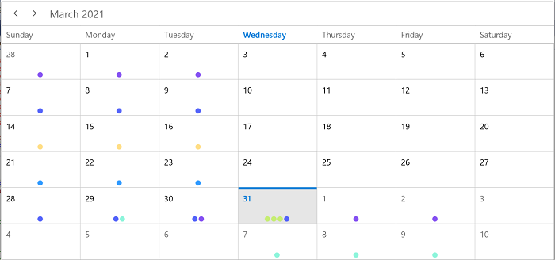

N> 
* By clicking more option, the scheduler navigates to the day view.
* Appointment height will be changed based on the `AppointmentDisplayCount` property.

## Month navigation direction

The month view of a Scheduler can be oriented in both horizontal and vertical directions. Change the direction of navigation using the [MonthNavigationDirection](https://help.syncfusion.com/cr/winui/Syncfusion.UI.Xaml.Scheduler.MonthViewSettings.html#Syncfusion_UI_Xaml_Scheduler_MonthViewSettings_MonthNavigationDirection) property of [MonthViewSettings](https://help.syncfusion.com/cr/winui/Syncfusion.UI.Xaml.Scheduler.MonthViewSettings.html). By default, the month navigation direction is set to Horizontal.



<scheduler:SfScheduler x:Name="Schedule"
                       ViewType="Month" >
     <scheduler:SfScheduler.MonthViewSettings>
          <scheduler:MonthViewSettings
                        MonthNavigationDirection="Vertical"/>
     </scheduler:SfScheduler.MonthViewSettings>
</scheduler:SfScheduler>


this.Schedule.ViewType = SchedulerViewType.Month;
this.Schedule.MonthViewSettings.MonthNavigationDirection = Orientation.Vertical;



## Date format

Customize the date format of the scheduler month view by using the [DateFormat](https://help.syncfusion.com/cr/winui/Syncfusion.UI.Xaml.Scheduler.MonthViewSettings.html#Syncfusion_UI_Xaml_Scheduler_MonthViewSettings_DateFormat) property of [MonthViewSettings](https://help.syncfusion.com/cr/winui/Syncfusion.UI.Xaml.Scheduler.MonthViewSettings.html). By default, the month date format is `d.`



<scheduler:SfScheduler x:Name="Schedule"
                       ViewType="Month" >
     <scheduler:SfScheduler.MonthViewSettings>
          <scheduler:MonthViewSettings 
                       DateFormat="dd"/>
     </scheduler:SfScheduler.MonthViewSettings>
</scheduler:SfScheduler>


this.Schedule.ViewType = SchedulerViewType.Month;
this.Schedule.MonthViewSettings.DateFormat = "dd";



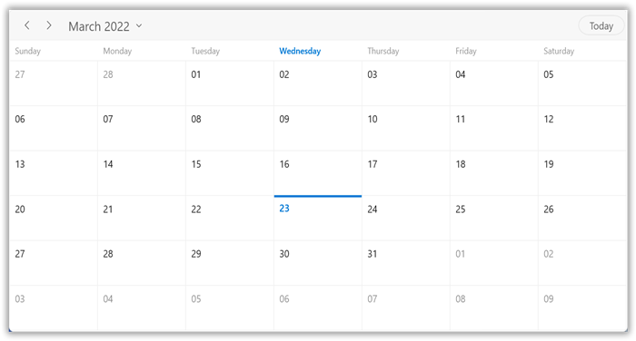

## View header

Customize the default appearance of view header in a month view by setting the  `ViewHeaderDayFormat,` `DateFormat,` `ViewHeaderHeight,` and `ViewHeaderTemplate` of `TimelineViewSettings.`

### View header text formatting

Customize the day format of the Scheduler view header by using the [ViewHeaderDayFormat](https://help.syncfusion.com/cr/winui/Syncfusion.UI.Xaml.Scheduler.ViewSettingsBase.html#Syncfusion_UI_Xaml_Scheduler_ViewSettingsBase_ViewHeaderDayFormat) property of [MonthViewSettings](https://help.syncfusion.com/cr/winui/Syncfusion.UI.Xaml.Scheduler.MonthViewSettings.html). By default, the month view header day format is `dddd.`



<scheduler:SfScheduler x:Name="Schedule"
                       ViewType="Month" >
     <scheduler:SfScheduler.MonthViewSettings>
          <scheduler:MonthViewSettings 
                       ViewHeaderDayFormat="ddd"/>
     </scheduler:SfScheduler.MonthViewSettings>
</scheduler:SfScheduler>


this.Schedule.ViewType = SchedulerViewType.Month;
this.Schedule.MonthViewSettings.ViewHeaderDayFormat = "ddd";



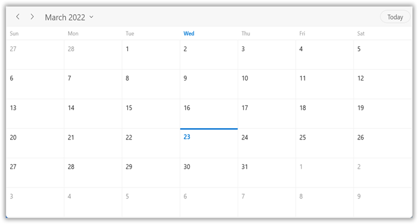

### View header height

Customize the view header height by using the [ViewHeaderHeight](https://help.syncfusion.com/cr/winui/Syncfusion.UI.Xaml.Scheduler.ViewSettingsBase.html#Syncfusion_UI_Xaml_Scheduler_ViewSettingsBase_ViewHeaderHeight) property of [MonthViewSettings](https://help.syncfusion.com/cr/winui/Syncfusion.UI.Xaml.Scheduler.MonthViewSettings.html). By default, the `ViewHeaderHeight` is `50.`



<scheduler:SfScheduler x:Name="Schedule"
                       ViewType="Month" >
     <scheduler:SfScheduler.MonthViewSettings>
          <scheduler:MonthViewSettings 
                       ViewHeaderHeight="100"/>
     </scheduler:SfScheduler.MonthViewSettings>
</scheduler:SfScheduler>


this.Schedule.ViewType = SchedulerViewType.Month;
this.Schedule.MonthViewSettings.ViewHeaderHeight = 100;



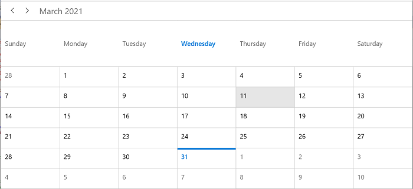

### View header appearance customization

Customize the default appearance of the month view header by using the [ViewHeaderTemplate](https://help.syncfusion.com/cr/winui/Syncfusion.UI.Xaml.Scheduler.ViewSettingsBase.html#Syncfusion_UI_Xaml_Scheduler_ViewSettingsBase_ViewHeaderTemplate) property of [MonthViewSettings](https://help.syncfusion.com/cr/winui/Syncfusion.UI.Xaml.Scheduler.MonthViewSettings.html).



<scheduler:SfScheduler x:Name="Schedule"
                       ViewType="Month" >
     <scheduler:SfScheduler.MonthViewSettings>
          <scheduler:MonthViewSettings>
               <scheduler:MonthViewSettings.ViewHeaderTemplate>
                    <DataTemplate>
                         <TextBlock FontFamily="Segoe UI"
                              FontSize="15"
                              FontStyle="Italic"
                              Foreground="#8551F2"
                              Text="{Binding DayText}"/>
                    </DataTemplate>
               </scheduler:MonthViewSettings.ViewHeaderTemplate>
          </scheduler:MonthViewSettings>
     </scheduler:SfScheduler.MonthViewSettings>
</scheduler:SfScheduler>



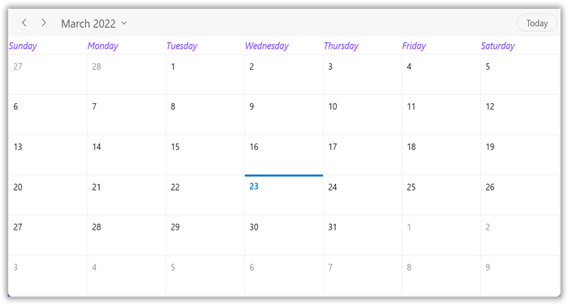

## Leading and Trailing days visibility

Customize the leading and trailing days visibility of the scheduler month view by using the [LeadingDaysVisibility](https://help.syncfusion.com/cr/winui/Syncfusion.UI.Xaml.Scheduler.MonthViewSettings.html#Syncfusion_UI_Xaml_Scheduler_MonthViewSettings_LeadingDaysVisibility) and the [TrailingDaysVisibility](https://help.syncfusion.com/cr/winui/Syncfusion.UI.Xaml.Scheduler.MonthViewSettings.html#Syncfusion_UI_Xaml_Scheduler_MonthViewSettings_TrailingDaysVisibility) properties of MonthViewSettings. By default, the `LeadingDaysVisibility` and `TrailingDaysVisibility` are Visible.



<scheduler:SfScheduler x:Name="Schedule"
                        ViewType="Month" >
     <scheduler:SfScheduler.MonthViewSettings>
          <scheduler:MonthViewSettings
               LeadingDaysVisibility="Collapsed"
               TrailingDaysVisibility="Collapsed"/>
     </scheduler:SfScheduler.MonthViewSettings>
</scheduler:SfScheduler>


this.Schedule.ViewType = SchedulerViewType.Month;
this.Schedule.MonthViewSettings.LeadingDaysVisibility = Visibility.Collapsed;
this.Schedule.MonthViewSettings.TrailingDaysVisibility = Visibility.Collapsed; 



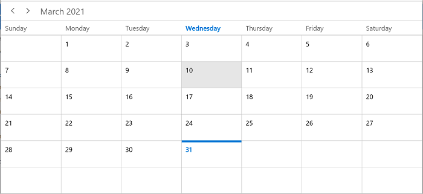

## Blackout dates

Disable the interaction for certain dates in the scheduler month view by adding those specific dates to the [BlackoutDates](https://help.syncfusion.com/cr/winui/Syncfusion.UI.Xaml.Scheduler.SfScheduler.html#Syncfusion_UI_Xaml_Scheduler_SfScheduler_BlackoutDates) collection property of the SfScheduler. Using this, allocate or restrict specific dates for the predefined events.



<scheduler:SfScheduler x:Name="Schedule"
                       ViewType="Month" >
</scheduler:SfScheduler>


this.Schedule.ViewType = SchedulerViewType.Month;
this.Schedule.BlackoutDates = GetBlackoutDates();

/// 

/// Method to get blackout date collections.
/// 

// <returns>The blackoutDateCollection.</returns>
private ObservableCollection<DateTime> GetBlackoutDates()
{
     var blackoutDateCollection = new ObservableCollection<DateTime>()
     {
          DateTime.Now.Date.AddDays(-1),
          DateTime.Now.Date.AddDays(-2),
          DateTime.Now.Date.AddDays(-3),
          DateTime.Now.Date.AddDays(1),
          DateTime.Now.Date.AddDays(2),
          DateTime.Now.Date.AddDays(3)
     };
     return blackoutDateCollection;
}



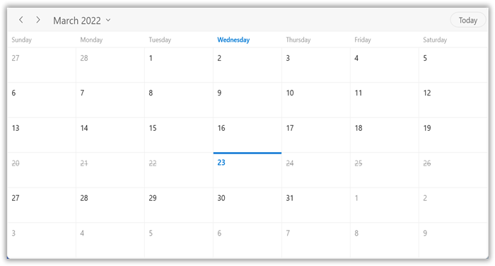

## Show week number

Display the week number of a year in the scheduler month view by setting the [ShowWeekNumber](https://help.syncfusion.com/cr/winui/Syncfusion.UI.Xaml.Scheduler.MonthViewSettings.html#Syncfusion_UI_Xaml_Scheduler_MonthViewSettings_ShowWeekNumber) property of [MonthViewSettings](https://help.syncfusion.com/cr/winui/Syncfusion.UI.Xaml.Scheduler.MonthViewSettings.html) is set to true. By default, it is set to false.



<scheduler:SfScheduler x:Name="Schedule"
                       ViewType="Month" >
     <scheduler:SfScheduler.MonthViewSettings>
          <scheduler:MonthViewSettings 
                       ShowWeekNumber="True"/>
     </scheduler:SfScheduler.MonthViewSettings>
</scheduler:SfScheduler>


this.Schedule.ViewType = SchedulerViewType.Month;
this.Schedule.MonthViewSettings.ShowWeekNumber = true;



### Customize week number template

Customize the default appearance of a week number template in the month view by using the [WeekNumberTemplate](https://help.syncfusion.com/cr/winui/Syncfusion.UI.Xaml.Scheduler.MonthViewSettings.html#Syncfusion_UI_Xaml_Scheduler_MonthViewSettings_WeekNumberTemplate) property of [MonthViewSettings](https://help.syncfusion.com/cr/winui/Syncfusion.UI.Xaml.Scheduler.MonthViewSettings.html).



<scheduler:SfScheduler x:Name="Schedule"
                       ViewType="Month" >
     <scheduler:SfScheduler.MonthViewSettings>
          <scheduler:MonthViewSettings 
                       ShowWeekNumber="True">
               <scheduler:MonthViewSettings.WeekNumberTemplate>
                    <DataTemplate>
                         <Grid >
                              <TextBlock 
                                   Foreground="#8551F2"
                                   Text="{Binding}"
                                   FontStyle="Italic"  
                                   VerticalAlignment="Top"
                                   HorizontalAlignment="Center"/>
                         </Grid>
                    </DataTemplate>
               </scheduler:MonthViewSettings.WeekNumberTemplate>
          </scheduler:MonthViewSettings>
     </scheduler:SfScheduler.MonthViewSettings>
</scheduler:SfScheduler>



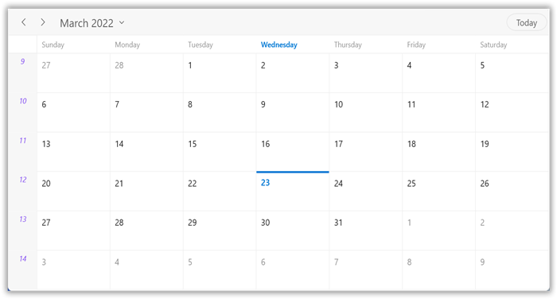

## Customize month cell appearance

The month cell appearance customization can be achieved by using the [MonthCellTemplate](https://help.syncfusion.com/cr/winui/Syncfusion.UI.Xaml.Scheduler.MonthViewSettings.html#Syncfusion_UI_Xaml_Scheduler_MonthViewSettings_MonthCellTemplate) property of [MonthViewSettings](https://help.syncfusion.com/cr/winui/Syncfusion.UI.Xaml.Scheduler.MonthViewSettings.html) in the [SfScheduler](https://help.syncfusion.com/cr/winui/Syncfusion.UI.Xaml.Scheduler.SfScheduler.html).

#### Using the DataTemplate

Customize the default appearance of the month cell by using the [MonthCellTemplate](https://help.syncfusion.com/cr/winui/Syncfusion.UI.Xaml.Scheduler.MonthViewSettings.html#Syncfusion_UI_Xaml_Scheduler_MonthViewSettings_MonthCellTemplate) property of [MonthViewSettings](https://help.syncfusion.com/cr/winui/Syncfusion.UI.Xaml.Scheduler.MonthViewSettings.html).



<scheduler:SfScheduler x:Name="Schedule"
                       ViewType="Month" >
     <scheduler:SfScheduler.MonthViewSettings>
          <scheduler:MonthViewSettings>
               <scheduler:MonthViewSettings.MonthCellTemplate>
                    <DataTemplate>
                         <Border Background="#8551F2">
                              <TextBlock 
                                   HorizontalAlignment="Center" 
                                   Foreground="White" 
                                   Text="{Binding DateTime.Day}"/>
                         </Border>
                    </DataTemplate>
               </scheduler:MonthViewSettings.MonthCellTemplate>
          </scheduler:MonthViewSettings>
     </scheduler:SfScheduler.MonthViewSettings>
</scheduler:SfScheduler>



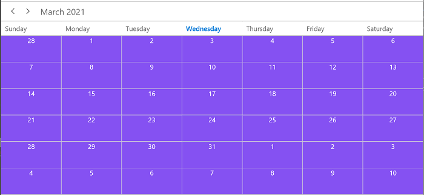

#### Using the DataTemplateSelector

Customize the default appearance of the month cell by using the [MonthCellTemplateSelector](https://help.syncfusion.com/cr/winui/Syncfusion.UI.Xaml.Scheduler.MonthViewSettings.html#Syncfusion_UI_Xaml_Scheduler_MonthViewSettings_MonthCellTemplateSelector) property of [MonthViewSettings](https://help.syncfusion.com/cr/winui/Syncfusion.UI.Xaml.Scheduler.MonthViewSettings.html).
The `DataTemplateSelector` can choose a `DataTemplate` at runtime based on the value of a data-bound to Scheduler month cell using the [MonthCellTemplate](https://help.syncfusion.com/cr/winui/Syncfusion.UI.Xaml.Scheduler.MonthViewSettings.html#Syncfusion_UI_Xaml_Scheduler_MonthViewSettings_MonthCellTemplate). It lets to choose a different data template for each month’s cell, customizing the appearance of a particular month cell based on certain conditions.



<Grid>
     <Grid.Resources>
          <local:MonthCellTemplateSelector x:Key="monthCellTemplateSelector" 
                                           NormalDayMonthCellTemplate="{StaticResource normalDayMonthCellTemplate}" CurrentDayMonthCellTemplate="{StaticResource currentDayMonthCellTemplate}" />
               <DataTemplate x:Key="normalDayMonthCellTemplate">
                    <Grid Background="#8551F2">
                         <TextBlock  
                              Foreground="White" 
                              Text="{Binding DateTime.Day}" 
                              VerticalAlignment="Center" 
                              HorizontalAlignment="Center"/>
                    </Grid>
               </DataTemplate>
               <DataTemplate x:Key="currentDayMonthCellTemplate">
                    <Grid Background="LightSkyBlue">
                         <TextBlock  
                              Foreground="White" 
                              Text="{Binding DateTime.Day}" 
                              VerticalAlignment="Center" 
                              HorizontalAlignment="Center"/>
                    </Grid>
               </DataTemplate>
     </Grid.Resources>
     <scheduler:SfScheduler x:Name="Schedule"
                            ViewType="Month" >
          <scheduler:SfScheduler.MonthViewSettings>
               <scheduler:MonthViewSettings AppointmentDisplayMode="Indicator" 
                                            MonthCellTemplateSelector="{StaticResource monthCellTemplateSelector}">
               </scheduler:MonthViewSettings>
          </scheduler:SfScheduler.MonthViewSettings>
     </scheduler:SfScheduler>
</Grid>


public class MonthCellTemplateSelector : DataTemplateSelector
{
     public MonthCellTemplateSelector()
     {
            
     }

     public DataTemplate NormalDayMonthCellTemplate { get; set; }
     public DataTemplate CurrentDayMonthCellTemplate { get; set; }

     /// 

     /// Template selection method
     /// 

     /// <param name="item">return the object</param>
     /// <param name="container">return the bindable object</param>
     /// <returns>return the template</returns>
     protected override DataTemplate SelectTemplateCore(object item, DependencyObject container)
     {
          var monthCell = container as MonthCell;
          if (monthCell != null)
          {
               if (monthCell.DateTime.Date == DateTime.Now.Date)
                    return CurrentDayMonthCellTemplate;
          }
          return NormalDayMonthCellTemplate;
     }
}



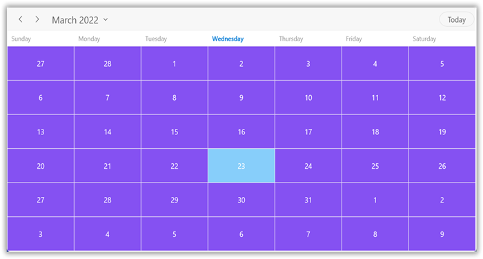

N> [View sample in GitHub](https://github.com/SyncfusionExamples/WinUI-Scheduler-Examples/tree/main/MonthCellCustomization)

## Customize month view appointments

The month view appointments appearance customization can be achieved by using the [AppointmentTemplate](https://help.syncfusion.com/cr/winui/Syncfusion.UI.Xaml.Scheduler.ViewSettingsBase.html#Syncfusion_UI_Xaml_Scheduler_ViewSettingsBase_AppointmentTemplate) property of [MonthViewSettings](https://help.syncfusion.com/cr/winui/Syncfusion.UI.Xaml.Scheduler.MonthViewSettings.html) in the [SfScheduler](https://help.syncfusion.com/cr/winui/Syncfusion.UI.Xaml.Scheduler.SfScheduler.html).

#### Using the DataTemplate

Customize the default appearance of the month cell appointment by using the [AppointmentTemplate](https://help.syncfusion.com/cr/winui/Syncfusion.UI.Xaml.Scheduler.ViewSettingsBase.html#Syncfusion_UI_Xaml_Scheduler_ViewSettingsBase_AppointmentTemplate) property of [MonthViewSettings](https://help.syncfusion.com/cr/winui/Syncfusion.UI.Xaml.Scheduler.MonthViewSettings.html).



<scheduler:SfScheduler x:Name="Schedule"
                       ViewType="Month" >
     <scheduler:SfScheduler.MonthViewSettings>
          <scheduler:MonthViewSettings>
               <scheduler:MonthViewSettings.AppointmentTemplate>
                    <DataTemplate>
                         <StackPanel Background="{Binding AppointmentBackground}"  
                              VerticalAlignment="Stretch" 
                              HorizontalAlignment="Stretch"
                              Orientation="Horizontal">
                         <TextBlock 
                              Text="{Binding Subject}" 
                              HorizontalAlignment="Stretch"
                              TextTrimming="CharacterEllipsis"
                              Foreground="{Binding Foreground}"        
                              TextWrapping="Wrap"
                              FontStyle="Italic" />
                         </StackPanel>
                    </DataTemplate>
               </scheduler:MonthViewSettings.AppointmentTemplate>
          </scheduler:MonthViewSettings>
     </scheduler:SfScheduler.MonthViewSettings>
</scheduler:SfScheduler>



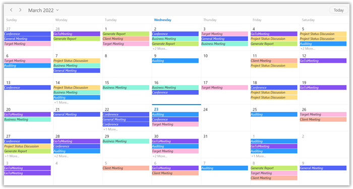

#### Using the DataTemplateSelector

Customize the default appearance of the month view appointments by using the [AppointmentTemplateSelector](https://help.syncfusion.com/cr/winui/Syncfusion.UI.Xaml.Scheduler.ViewSettingsBase.html#Syncfusion_UI_Xaml_Scheduler_ViewSettingsBase_AppointmentTemplateSelector) property of [MonthViewSetting](https://help.syncfusion.com/cr/winui/Syncfusion.UI.Xaml.Scheduler.MonthViewSettings.html).
The `DataTemplateSelector` can choose a `DataTemplate` at runtime based on the value of a data-bound to Scheduler month appointments using the `AppointmentTemplate`. It lets to choose a different data template for each month’s cell, customizing the appearance of a particular appointment based on certain conditions.



<Grid>
     <Grid.Resources>
          <local:AppointmentTemplateSelector x:Key="appointmentTemplateSelector" 
                                             DefaultAppointmentTemplate="{StaticResource defaultAppointmentTemplate}" CurrentDayAppointmentTemplate="{StaticResource currentDayAppointmentTemplate}" />
          <DataTemplate x:Key="defaultAppointmentTemplate">
               <StackPanel Background="{Binding AppointmentBackground}"  
                    VerticalAlignment="Stretch" 
                    HorizontalAlignment="Stretch"
                    Orientation="Horizontal">
                    <TextBlock  
                         Foreground="White" 
                         Text="{Binding Subject}" 
                         VerticalAlignment="Center" 
                         HorizontalAlignment="Center"/>
               </StackPanel>
          </DataTemplate>
          <DataTemplate x:Key="currentDayAppointmentTemplate">
               <StackPanel Background="{Binding AppointmentBackground}"  
                    VerticalAlignment="Stretch" 
                    HorizontalAlignment="Stretch"
                    Orientation="Horizontal">
                    <TextBlock  Foreground="Red" 
                         Text="{Binding Subject}" 
                         VerticalAlignment="Center" 
                         HorizontalAlignment="Center"/>
               </StackPanel>
          </DataTemplate>
     </Grid.Resources>
     <scheduler:SfScheduler x:Name="Schedule"
                            ViewType="Month" >
          <scheduler:SfScheduler.MonthViewSettings>
               <scheduler:MonthViewSettings 
                            AppointmentTemplateSelector="{StaticResource appointmentTemplateSelector}"/>
          </scheduler:SfScheduler.MonthViewSettings>
     </scheduler:SfScheduler>
</Grid>


public class AppointmentTemplateSelector : DataTemplateSelector
{
     public AppointmentTemplateSelector()
     {
            
     }

     public DataTemplate DefaultAppointmentTemplate { get; set; }
     public DataTemplate CurrentDayAppointmentTemplate { get; set; }

     /// 

     /// Template selection method
     /// 

     /// <param name="item">return the object</param>
     /// <param name="container">return the bindable object</param>
     /// <returns>return the template</returns>
     protected override DataTemplate SelectTemplateCore(object item, DependencyObject container)
     {
          var app = item as ScheduleAppointment;
          if (app != null)
          {
               if (app.StartTime.Date == DateTime.Today.Date)
                    return CurrentDayAppointmentTemplate;
          }
          return DefaultAppointmentTemplate;
     }
}



## Customize more appointments indicator in month cell

You can customize the default appearance of more appointments indicator in a month cell by using the [MoreAppointmentsIndicatorTemplate](https://help.syncfusion.com/cr/winui/Syncfusion.UI.Xaml.Scheduler.MonthViewSettings.html#Syncfusion_UI_Xaml_Scheduler_MonthViewSettings_MoreAppointmentsIndicatorTemplate) property of `MonthViewSettings.`



<scheduler:SfScheduler x:Name="Schedule" ViewType="Month">
    <scheduler:SfScheduler.MonthViewSettings>
          <scheduler:MonthViewSettings>
               <scheduler:MonthViewSettings.MoreAppointmentsIndicatorTemplate>
                    <DataTemplate>
                         <StackPanel Background="#EAEAEA" HorizontalAlignment="Stretch" VerticalAlignment="Stretch">
                              <TextBlock Text="{Binding}" Foreground="Black" TextAlignment="Center" VerticalAlignment="Center">
                              </TextBlock>
                         </StackPanel>
                    </DataTemplate>
               </scheduler:MonthViewSettings.MoreAppointmentsIndicatorTemplate>
          </scheduler:MonthViewSettings>
     </scheduler:SfScheduler.MonthViewSettings>
</scheduler:SfScheduler>



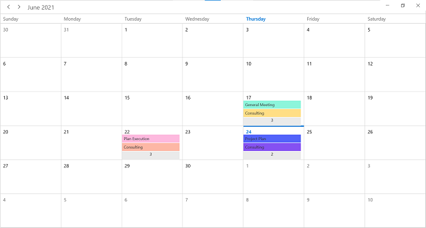