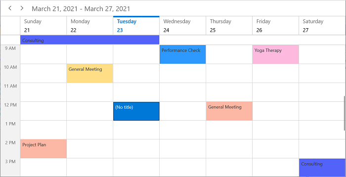
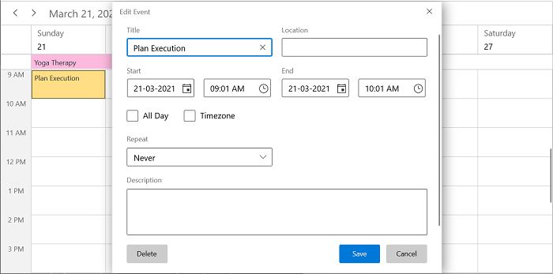

# WinUI Scheduler Overview

The Syncfusion [WinUI Scheduler](https://www.syncfusion.com/winui-controls/scheduler) displays appointments in different views and allows users to create and manage appointments. Its rich feature set includes functionalities like viewing daily/all day/spanned appointments, complete customization using the custom Templates, efficient performance, and Data binding to different sources.

## Key features

*  **Built-in Views**: The Scheduler provides eight different types of views such as Day, Week, WorkWeek, TimelineDay, TimelineWeek, TimelineWorkWeek, TimelineMonth, and Month.

* **Events**: Appointments contain information on events scheduled at specific times. In addition to default appointments, the users can use their own collections to connect a business entity to an appointment by mapping their fields such as start time, end time, subject, notes, and recurrence.

* **Recurrence Events**: Easily configure the recurring events on a daily, weekly, monthly, or yearly basis. You can also skip or change the occurrence of a recurring appointment.

* **Appointment Mapping**: The SfScheduler control supports to map any collection that implements the IEnumerable interface to populate appointments.

* **Appointment Editor**: You can easily create, edit, or delete appointments using the built-in appointment editor.

* **Timezone**: The Display appointments can be created in various time zones in the system time zone. The appointment start and end times are also automatically adjusted and displayed based on the daylight savings time.

* **First day of the week** - Customize the first day of the week as needed. The default first day is Sunday.

* **Flexible working days**: Customize the workdays in a workweek so that the remaining days will be hidden from view.

* **Appearance Customization**: Provide a unique look to your scheduler with the event appearance customization.

* **Localization**: Display the current date and time by following the globalized date and time formats, and localize all available static texts in the SfScheduler.

* **LoadOnDemand**: The SfScheduler supports loading appointments on-demand with loading indicator and it improves the loading performance when you have appointments range for multiple years.