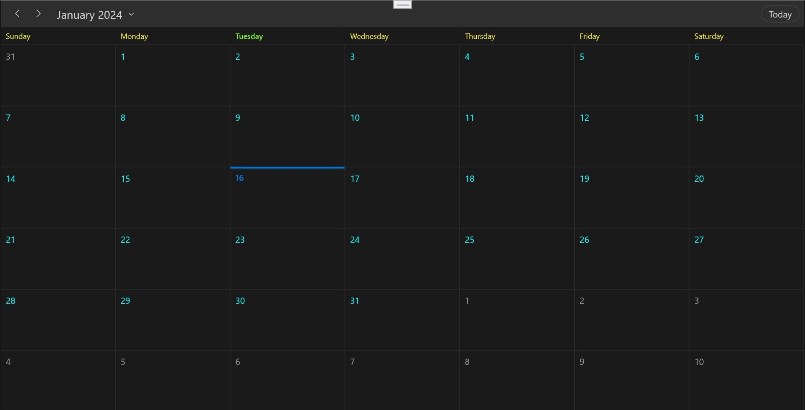

# Themes in WinUI Scheduler (SfScheduler)
 The WinUI Scheduler allows you to apply different themes to customize its appearance for a better user experience.

Refer to the following link for guidance on applying themes: [Themes for Syncfusion WinUI controls](https://help.syncfusion.com/winui/common/themes) 

You can find the scheduler keys for all themes in this [theme resource file.](https://github.com/syncfusion/winui-controls-theme-resource-files/tree/master/Syncfusion.Scheduler.WinUI)

## Customize scheduler theme appearance using ThemeResource

You can customize the default appearance of themes by overriding key values. Adjust the values of specific keys as required.




    <scheduler:SfScheduler>
        <scheduler:SfScheduler.Resources>
            <ResourceDictionary>
                <ResourceDictionary.ThemeDictionaries>                 
                    <ResourceDictionary x:Key="Dark">
                        <SolidColorBrush x:Key="SyncfusionMonthCellForeground" Color="Aqua" />
                        <SolidColorBrush x:Key="SyncfusionMonthViewHeaderForeground" Color="Yellow" />
                        <SolidColorBrush x:Key="SyncfusionTodayMonthViewHeaderForeground" Color="LawnGreen" />
                    </ResourceDictionary>               
                </ResourceDictionary.ThemeDictionaries>
            </ResourceDictionary>
        </scheduler:SfScheduler.Resources>
    </scheduler:SfScheduler>




N> The HighContrast theme settings within the scheduler will be universally applied to all pre-existing high contrast themes on the computer.
