# Timeline Views in WinUI Scheduler (SfScheduler)

The TimelineView displays the dates in the horizontal time axis with the desired day’s count. Scheduler supports displaying the `TimelineDay,` `TimelineWeek,` `TimelineWorkWeek,` and `TimelineMonth` views. See the past or future dates by scrolling to the right or left. Each view displays the events accurately across the time slots with an intuitive drag-and-drop feature. It provides the support to highlight the selected region of time slots and handle the interaction.

## Change time interval

Customize the interval of timeslots in the timeline views by using the [TimeInterval](https://help.syncfusion.com/cr/winui/Syncfusion.UI.Xaml.Scheduler.TimeSlotViewSettings.html#Syncfusion_UI_Xaml_Scheduler_TimeSlotViewSettings_TimeInterval) property of [TimelineViewSettings](https://help.syncfusion.com/cr/winui/Syncfusion.UI.Xaml.Scheduler.TimeSlotViewSettings.html). This property will be applicable to `TimelineDay,` `TimelineWeek,` and `TimelineWorkWeek` views.



this.Schedule.ViewType = SchedulerViewType.TimelineWeek;
this.Schedule.TimelineViewSettings.TimeInterval = new System.TimeSpan(0, 120, 0);



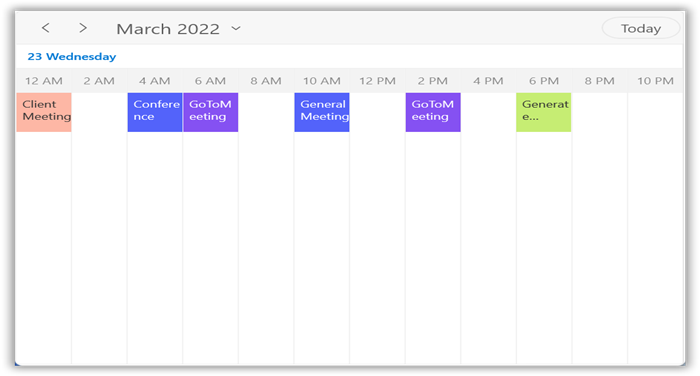

N>
If the timeInterval value is modified (in minutes), change the time labels format by setting the timeFormat value to hh:mm.

## Change time interval width

Customize the interval width of timeslots in the Timeline views by setting the [TimeIntervalSize](https://help.syncfusion.com/cr/winui/Syncfusion.UI.Xaml.Scheduler.TimeSlotViewSettings.html#Syncfusion_UI_Xaml_Scheduler_TimeSlotViewSettings_TimeIntervalSize) property of [TimelineViewSettings](https://help.syncfusion.com/cr/winui/Syncfusion.UI.Xaml.Scheduler.TimeSlotViewSettings.html). This property will be applicable to all timeline views. By default, it's value is 50 for the `TimelineDay,` `TimelineWeek,` and `TimelineWorkWeek` views and 150 for `TimelineMonth` view.



<scheduler:SfScheduler x:Name="Schedule" ViewType="TimelineWeek">
    <scheduler:SfScheduler.TimelineViewSettings>
        <scheduler:TimelineViewSettings 
            TimeIntervalSize="120"/>
    </scheduler:SfScheduler.TimelineViewSettings>
</scheduler:SfScheduler>


this.Schedule.ViewType = SchedulerViewType.TimelineWeek;
this.Schedule.TimelineViewSettings.TimeIntervalSize = 120;



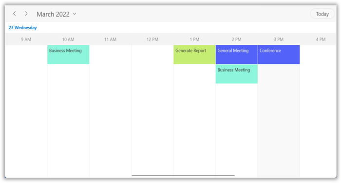

## Flexible working days

By default, the `WinUI Scheduler` considers the week days from Monday to Friday as Working days. The days which are defined in this non-working days collection are considered as [non-working days](https://help.syncfusion.com/cr/winui/Syncfusion.UI.Xaml.Scheduler.TimeSlotViewSettings.html#Syncfusion_UI_Xaml_Scheduler_TimeSlotViewSettings_NonWorkingDays). Therefore, when the weekend days are set to hide from Scheduler.

The `Timeline workweek` view displays exactly the defined working days on Scheduler control, whereas other views displays all the days.



this.Schedule.ViewType = SchedulerViewType.TimelineWorkWeek;
this.Schedule.TimelineViewSettings.NonWorkingDays = new ObservableCollection<DayOfWeek>() { DayOfWeek.Monday, DayOfWeek.Tuesday };



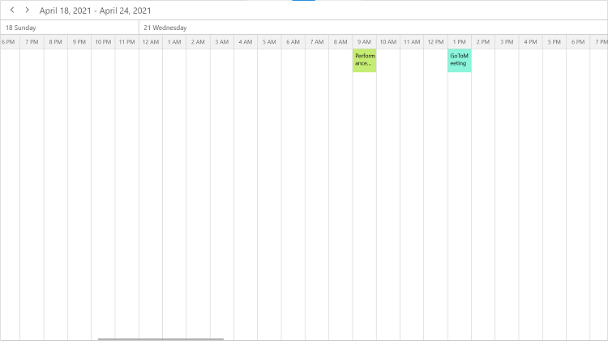

## Flexible working hours

The default values for the `StartHour` and `EndHour` are 0 and 24 to show all the time slots in a timeline view. Set the [StartHour](https://help.syncfusion.com/cr/winui/Syncfusion.UI.Xaml.Scheduler.TimeSlotViewSettings.html#Syncfusion_UI_Xaml_Scheduler_TimeSlotViewSettings_StartHour) and [EndHour](https://help.syncfusion.com/cr/winui/Syncfusion.UI.Xaml.Scheduler.TimeSlotViewSettings.html#Syncfusion_UI_Xaml_Scheduler_TimeSlotViewSettings_EndHour) properties of [TimelineViewSettings](https://help.syncfusion.com/cr/winui/Syncfusion.UI.Xaml.Scheduler.TimeSlotViewSettings.html) to show only the required time duration for users. Set the StartHour and EndHour in time duration to show the required time duration in minutes. The `StartHour` and `EndHour` properties do not apply to the `TimelineMonth` view.



<scheduler:SfScheduler x:Name="Schedule" ViewType="TimelineWeek">
    <scheduler:SfScheduler.TimelineViewSettings>
        <scheduler:TimelineViewSettings 
            StartHour="8"
            EndHour="13"/>
    </scheduler:SfScheduler.TimelineViewSettings>
</scheduler:SfScheduler>


this.Schedule.ViewType = SchedulerViewType.TimelineWeek;
this.Schedule.TimelineViewSettings.StartHour = 8;
this.Schedule.TimelineViewSettings.EndHour = 16;



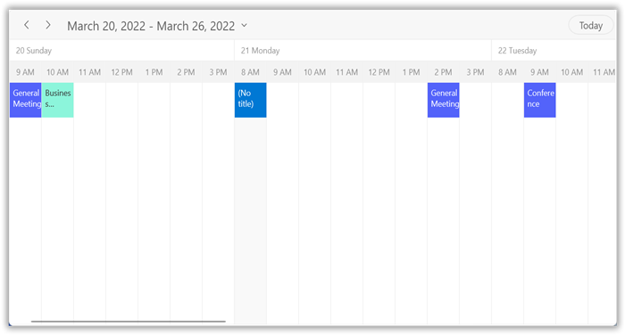

N>
* The [NonWorkingDays](https://help.syncfusion.com/cr/winui/Syncfusion.UI.Xaml.Scheduler.TimeSlotViewSettings.html#Syncfusion_UI_Xaml_Scheduler_TimeSlotViewSettings_NonWorkingDays) property will be applicable only for `workWeek` and `TimelineWorkWeek` views only, and not applicable for the remaining views.
* The Scheduler Appointments UI, which does not fall within the `StartHour` and `EndHour` will not be visible and if it falls partially, it will be clipped.
* No need to specify the decimal point values for `StartHour` and `EndHour` if you do not want to set the minutes.
* The number of time slots will be calculated based on total minutes of a day and time interval (total minutes of a day ((start hour - end hour) * 60) / time interval).
If the custom timeInterval is given, then the number of time slots calculated based on the given `TimeInterval` should result in an integer value (total minutes % timeInterval = 0). Otherwise, the next immediate time interval that results in integer value when dividing total minutes of a day will be considered. For example, if TimeInterval= 2 Hours, 15 minutes and total minutes = 1440 (24 Hours per day), then the `TimeInterval` will be changed to ‘144’ (1440%144=0) by considering (total minutes % TimeInterval = 0), it will return integer value for time slots rendering.
* If the custom `StartHour` and `EndHour` are given, then the number of time slots calculated based on given `StartHour` and `EndHour` should result in integer value, otherwise next immediate `TimeInterval` will be considered until the result is integer value. For example, if StartHour is 9 (09:00AM), EndHour is 18.25 (06:15 PM), TimeInterval is 30 minutes, and total minutes = 555 ((18.25-9)*60), then the TimeInterval will be changed to ’37 minutes’ (555%37=0) by considering (total minutes % timeInterval = 0). It will return integer value for time slots rendering.

## Change days count

Change the day’s count of timeslots in the timeline view by setting the [DaysCount](https://help.syncfusion.com/cr/winui/Syncfusion.UI.Xaml.Scheduler.TimeSlotViewSettings.html#Syncfusion_UI_Xaml_Scheduler_TimeSlotViewSettings_DaysCount) property of [TimelineViewSettings](https://help.syncfusion.com/cr/winui/Syncfusion.UI.Xaml.Scheduler.TimeSlotViewSettings.html). This property is only applicable for the `TimelineDay` view. By default, its value is set to `1.`



<scheduler:SfScheduler x:Name="Schedule" ItemsSource="{Binding Appointments}" ViewType="TimelineDay">
    <scheduler:SfScheduler.TimelineViewSettings>
        <scheduler:TimelineViewSettings 
            DaysCount="2"/>
    </scheduler:SfScheduler.TimelineViewSettings>
</scheduler:SfScheduler>


this.Schedule.ViewType = SchedulerViewType.TimelineDay;
this.Schedule.TimelineViewSettings.DaysCount = 2;



## Blackout dates

Disable the interaction for certain dates in the scheduler `TimelineMonth` view by adding those specific dates to the [BlackoutDates](https://help.syncfusion.com/cr/winui/Syncfusion.UI.Xaml.Scheduler.SfScheduler.html#Syncfusion_UI_Xaml_Scheduler_SfScheduler_BlackoutDates) collection property of SfScheduler. Using this, allocate or restrict the specific dates for predefined events. This property does not apply to the `TimelineDay,` `TimelineWeek,` and `TimelineWorkWeek` views.



this.Schedule.ViewType = SchedulerViewType.TimelineMonth;
this.Schedule.BlackoutDates = GetBlackoutDates();

/// 

/// Method to get all blackout date collections.
/// 

private ObservableCollection<DateTime> GetBlackoutDates()
{
    var blackoutDateCollection = new ObservableCollection<DateTime>()
    {
        DateTime.Now.Date.AddDays(-1),
        DateTime.Now.Date.AddDays(-3),
        DateTime.Now.Date.AddDays(-4),
        DateTime.Now.Date.AddDays(1),
        DateTime.Now.Date.AddDays(3),
        DateTime.Now.Date.AddDays(5)
    };
    return blackoutDateCollection;
}



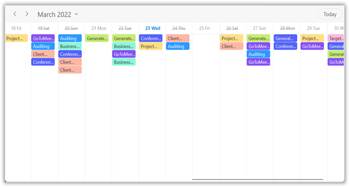

## Special time regions

Restrict the user interaction such as selection and highlights specific regions of time in the timeline views by adding the [SpecialTimeRegions](https://help.syncfusion.com/cr/winui/Syncfusion.UI.Xaml.Scheduler.TimeSlotViewSettings.html#Syncfusion_UI_Xaml_Scheduler_TimeSlotViewSettings_SpecialTimeRegions) property of SfScheduler. Set the [StartTime](https://help.syncfusion.com/cr/winui/Syncfusion.UI.Xaml.Scheduler.SpecialTimeRegion.html#Syncfusion_UI_Xaml_Scheduler_SpecialTimeRegion_StartTime) and [EndTime](https://help.syncfusion.com/cr/winui/Syncfusion.UI.Xaml.Scheduler.SpecialTimeRegion.html#Syncfusion_UI_Xaml_Scheduler_SpecialTimeRegion_EndTime) properties of [SpecialTimeRegion](https://help.syncfusion.com/cr/winui/Syncfusion.UI.Xaml.Scheduler.SpecialTimeRegion.html) to create a SpecialTimeRegion, use the timeZone property to set the specific timezone for the start and end time of the `SpecialTimeRegion.` The `SpecialTimeRegion` will display the text or image on it that set to the text or icon property of `SpecialTimeRegion.` This property will be applicable to the `TimelineDay,` `TimelineWeek,` and `TimelineWorkWeek` views.

### Selection restriction in timeslots

Enable or disable the touch interaction of SpecialTimeRegion using the [CanEdit](https://help.syncfusion.com/cr/winui/Syncfusion.UI.Xaml.Scheduler.SpecialTimeRegion.html#Syncfusion_UI_Xaml_Scheduler_SpecialTimeRegion_CanEdit) property of [SpecialTimeRegion](https://help.syncfusion.com/cr/winui/Syncfusion.UI.Xaml.Scheduler.SpecialTimeRegion.html). By default, its value is set to `true.`



this.Schedule.ViewType = SchedulerViewType.TimelineWeek;
this.Schedule.TimelineViewSettings.SpecialTimeRegions.Add(new SpecialTimeRegion
{
    StartTime = new System.DateTime(2021, 03, 26, 13, 0, 0),
    EndTime = new System.DateTime(2021, 03, 26, 14, 0, 0),
    Text = "Lunch",
    CanEdit = false,
    Background = new SolidColorBrush(Colors.LightGray),
    Foreground = new SolidColorBrush(Colors.White)
});



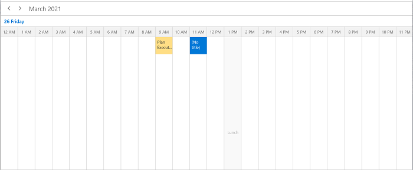

N> This property only restricts the interaction on region and it does not restrict the following:
* Programmatic selection (if the user updates the selected date value dynamically).
* Does not clear the selection when the user selects the region and dynamically changes the [CanEdit](https://help.syncfusion.com/cr/winui/Syncfusion.UI.Xaml.Scheduler.SpecialTimeRegion.html#Syncfusion_UI_Xaml_Scheduler_SpecialTimeRegion_CanEdit) property to false.
* It does not restrict the appointment interaction when the appointment is placed in the region.
* It does not restrict the appointment rendering on a region when the appointments are loaded from data services or adding programmatically.

### Recurring time region

The recurring time region on a daily, weekly, monthly, or yearly interval. The recurring special time regions can be created by setting the [RecurrenceRule](https://help.syncfusion.com/cr/winui/Syncfusion.UI.Xaml.Scheduler.SpecialTimeRegion.html#Syncfusion_UI_Xaml_Scheduler_SpecialTimeRegion_RecurrenceRule) property in [SpecialTimeRegion](https://help.syncfusion.com/cr/winui/Syncfusion.UI.Xaml.Scheduler.SpecialTimeRegion.html).



this.Schedule.ViewType = SchedulerViewType.TimelineWeek;
this.Schedule.TimelineViewSettings.SpecialTimeRegions.Add(new SpecialTimeRegion
{
    StartTime = new System.DateTime(2021, 03, 21, 13, 0, 0),
    EndTime = new System.DateTime(2021, 03, 21, 14, 0, 0),
    Text = "Lunch",
    CanEdit = false,
    Background = new SolidColorBrush(Colors.LightGray),
    Foreground = new SolidColorBrush(Colors.White),
    RecurrenceRule = "FREQ=DAILY;INTERVAL=1"
});



### Recurrence exception dates

Delete any of occurrence that is an exception from the recurrence pattern time region by using the [RecurrenceExceptionDates](https://help.syncfusion.com/cr/winui/Syncfusion.UI.Xaml.Scheduler.SpecialTimeRegion.html#Syncfusion_UI_Xaml_Scheduler_SpecialTimeRegion_RecurrenceExceptionDates) property of [SpecialTimeRegion](https://help.syncfusion.com/cr/winui/Syncfusion.UI.Xaml.Scheduler.SpecialTimeRegion.html). The deleted occurrence date will be considered as a recurrence exception date.



this.Schedule.ViewType = SchedulerViewType.TimelineWeek;
DateTime recurrenceExceptionDates = DateTime.Now.Date.AddDays(-1);
DateTime recurrenceExceptionDates1 = DateTime.Now.Date.AddDays(2);
this.Schedule.TimelineViewSettings.SpecialTimeRegions.Add(new SpecialTimeRegion
{
    StartTime = new System.DateTime(2021, 03, 26, 12, 0, 0),
    EndTime = new System.DateTime(2020, 03, 26, 13, 0, 0),
    Text = "Lunch",
    CanEdit = false,
    Background = new SolidColorBrush(Colors.LightGray),
    Foreground = new SolidColorBrush(Colors.White),
    RecurrenceRule = "FREQ=DAILY;INTERVAL=1",
    RecurrenceExceptionDates = new ObservableCollection<DateTime>()
    {
        recurrenceExceptionDates,
        recurrenceExceptionDates1,
    }
});



### Special time region customization

The `SpecialTimeRegion` background color can be customized by using the [Background](https://help.syncfusion.com/cr/winui/Syncfusion.UI.Xaml.Scheduler.SpecialTimeRegion.html#Syncfusion_UI_Xaml_Scheduler_SpecialTimeRegion_Background) and [SpecialTimeRegionTemplate](https://help.syncfusion.com/cr/winui/Syncfusion.UI.Xaml.Scheduler.TimeSlotViewSettings.html#Syncfusion_UI_Xaml_Scheduler_TimeSlotViewSettings_SpecialTimeRegionTemplate) properties of [SpecialTimeRegion](https://help.syncfusion.com/cr/winui/Syncfusion.UI.Xaml.Scheduler.SpecialTimeRegion.html) that is used to customize the text style for the image of the `SpecialTimeRegion`.



<Page.Resources>
    <DataTemplate x:Key="specialRegionTemplate">
        <Grid Background="{Binding Background}"
            Opacity="0.5"
            HorizontalAlignment="Stretch"
            VerticalAlignment="Stretch">
        <Path x:Name="Fork" Data="M11,0 C11.553001,0 12,0.4469986 12,1 L12,15 C12,15.553001 11.553001,16 11,16 10.446999,16 10,15.553001 10,15 L10,7 9,7 C8.4469986,7 8,6.5530014 8,6 L8,3 C8,1.3429985 9.3429985,0 11,0 z M0,0 L1,0 1.2340002,4 1.7810001,4 2,0 3,0 3.2340002,4 3.7810001,4 4,0 5,0 5,4 C5,4.9660001 4.3140001,5.7727499 3.4029064,5.9593439 L3.4007993,5.9597201 3.9114671,14.517 C3.9594617,15.321 3.3195295,16 2.5136147,16 L2.5076156,16 C1.6937013,16 1.0517693,15.309 1.1107631,14.497 L1.7400641,5.9826035 1.6955509,5.9769421 C0.73587513,5.8301721 0,5.0005002 0,4 z" Fill="Black" HorizontalAlignment="Center" Height="16"  Stretch="Fill" VerticalAlignment="Center" Width="12"/>
        </Grid>
    </DataTemplate>
</Page.Resources>





 <scheduler:SfScheduler x:Name="Schedule" ViewType="TimelineWeek">
    <scheduler:SfScheduler.TimelineViewSettings>
        <scheduler:TimelineViewSettings  SpecialTimeRegionTemplate="{StaticResource specialRegionTemplate}">
        </scheduler:TimelineViewSettings>
    </scheduler:SfScheduler.TimelineViewSettings>
</scheduler:SfScheduler>


this.Schedule.TimelineViewSettings.SpecialTimeRegions.Add(new SpecialTimeRegion
{
    StartTime = new System.DateTime(2021, 03, 21, 13, 0, 0),
    EndTime = new System.DateTime(2021, 03, 21, 14, 0, 0),
    Text = "Lunch",
    CanEdit = false,
    RecurrenceRule = "FREQ=DAILY;INTERVAL=1",
    CanMergeAdjacentRegions = true,
    Background = new SolidColorBrush(Colors.LightGray),
    Foreground = new SolidColorBrush(Colors.White),
});



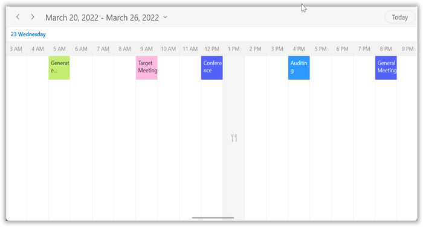

N> [View sample in GitHub](https://github.com/SyncfusionExamples/WinUI-Scheduler-Examples/tree/main/SpecialTimeRegionCustomization)

## Full screen scheduler

The WinUI scheduler time interval width can be adjusted based on the screen height by changing the value of [TimeIntervalSize](https://help.syncfusion.com/cr/wpf/Syncfusion.UI.Xaml.Scheduler.TimeSlotViewSettings.html#Syncfusion_UI_Xaml_Scheduler_TimeSlotViewSettings_TimeIntervalSize) property to `-1.` It will auto-fit to the screen width in timeline day, timeline week and timeline workweek views.



<scheduler:SfScheduler x:Name="Schedule" ViewType="TimelineWeek">
    <scheduler:SfScheduler.TimelineViewSettings>
        <scheduler:TimelineViewSettings 
            TimeIntervalSize="-1"/>
    </scheduler:SfScheduler.TimelineViewSettings>
</scheduler:SfScheduler>


this.Schedule.ViewType = SchedulerViewType.TimelineWeek;
this.Schedule.TimelineViewSettings.TimeIntervalSize = -1;



## Change time ruler size

Customize the size of the time ruler view where the labels mentioning the time are placed by using the [TimeRulerSize](https://help.syncfusion.com/cr/winui/Syncfusion.UI.Xaml.Scheduler.TimeSlotViewSettings.html#Syncfusion_UI_Xaml_Scheduler_TimeSlotViewSettings_TimeIntervalSize) property of [TimelineViewSettings](https://help.syncfusion.com/cr/winui/Syncfusion.UI.Xaml.Scheduler.TimeSlotViewSettings.html). This property will be applicable to `TimelineDay,` `TimelineWeek,` and `TimelineWorkWeek` views.



<scheduler:SfScheduler x:Name="Schedule" ViewType="TimelineWeek">
    <scheduler:SfScheduler.TimelineViewSettings>
        <scheduler:TimelineViewSettings   
            TimeRulerSize="100">
        </scheduler:TimelineViewSettings>
    </scheduler:SfScheduler.TimelineViewSettings>
</scheduler:SfScheduler>


this.Schedule.ViewType = SchedulerViewType.TimelineWeek;
this.Schedule.TimelineViewSettings.TimeRulerSize = 100;



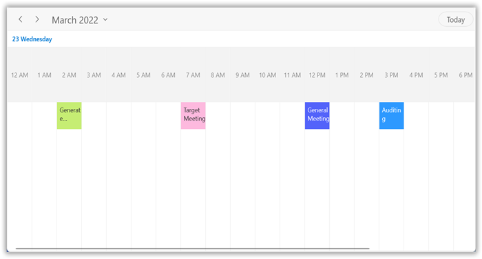

## Minimum appointment duration

The [MinimumAppointmentDuration](https://help.syncfusion.com/cr/winui/Syncfusion.UI.Xaml.Scheduler.TimeSlotViewSettings.html#Syncfusion_UI_Xaml_Scheduler_TimeSlotViewSettings_MinimumAppointmentDuration) property in the [TimelineViewSettings](https://help.syncfusion.com/cr/winui/Syncfusion.UI.Xaml.Scheduler.TimeSlotViewSettings.html) is to set an arbitrary height to appointments when it has a minimum duration in timeline view so that the subject can be readable. This property will not apply to the `TimelineMonth` view.



this.Schedule.ViewType = SchedulerViewType.TimelineWeek;
this.Schedule.TimelineViewSettings.MinimumAppointmentDuration = new System.TimeSpan(0, 120, 0);



N>
* The `MinimumAppointmentDuration` value will be set when an appointment duration value is lesser than `MinimumAppointmentDuration.`
* Appointment duration value will be set when the appointment duration value is greater than `MinimumAppointmentDuration`.
* The `TimeInterval` value will be set when the `MinimumAppointmentDuration` is greater than `TimeInterval` with lesser appointment duration.
* All-day Appointment does not support `MinimumAppointmentDuration`.

## Time ruler text formatting

Customize the format for the labels mentioning the time by setting the [TimeRulerFormat](https://help.syncfusion.com/cr/winui/Syncfusion.UI.Xaml.Scheduler.TimeSlotViewSettings.html#Syncfusion_UI_Xaml_Scheduler_TimeSlotViewSettings_TimeRulerFormat) property of [TimelineViewSettings](https://help.syncfusion.com/cr/winui/Syncfusion.UI.Xaml.Scheduler.TimeSlotViewSettings.html) in the Scheduler. This property will not apply to the `TimelineMonth` view.



this.Schedule.ViewType = SchedulerViewType.TimelineWeek;
this.Schedule.TimelineViewSettings.TimeRulerFormat = "hh mm";
this.Schedule.TimelineViewSettings.TimeInterval = new System.TimeSpan(0, 30, 0);



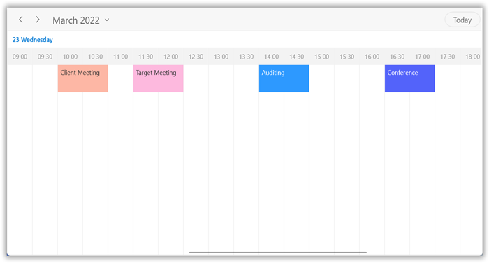

N>
* You can customize appointment editor time format based on scheduler time ruler format and culture.
* By default, the scheduler time ruler format is `hh:mm tt` and appointment editor time picker format `h tt.` 

## View header

Customize the default appearance of view header in the timeline views by setting the `ViewHeaderDateFormat,` `ViewHeaderHeight,` `ViewHeaderDayFormat,` and `ViewHeaderTemplate` of [TimelineViewSettings](https://help.syncfusion.com/cr/winui/Syncfusion.UI.Xaml.Scheduler.TimeSlotViewSettings.html).

### View header text formatting

Customize the date and day format of ViewHeader by using the [ViewHeaderDateFormat](https://help.syncfusion.com/cr/winui/Syncfusion.UI.Xaml.Scheduler.TimeSlotViewSettings.html#Syncfusion_UI_Xaml_Scheduler_TimeSlotViewSettings_ViewHeaderDateFormat) and [ViewHeaderDayFormat](https://help.syncfusion.com/cr/winui/Syncfusion.UI.Xaml.Scheduler.ViewSettingsBase.html#Syncfusion_UI_Xaml_Scheduler_ViewSettingsBase_ViewHeaderDayFormat) properties of [TimelineViewSettings](https://help.syncfusion.com/cr/winui/Syncfusion.UI.Xaml.Scheduler.TimeSlotViewSettings.html).



<scheduler:SfScheduler x:Name="Schedule" ViewType="TimelineWeek">
     <scheduler:SfScheduler.TimelineViewSettings>
        <scheduler:TimelineViewSettings 
            ViewHeaderDateFormat="dd-MMMM"/>
        </scheduler:SfScheduler.TimelineViewSettings>
    </scheduler:SfScheduler.TimelineViewSettings>
</scheduler:SfScheduler>


this.Schedule.ViewType = SchedulerViewType.TimelineWeek;
this.Schedule.TimelineViewSettings.ViewHeaderDateFormat = "dd-MMMM";



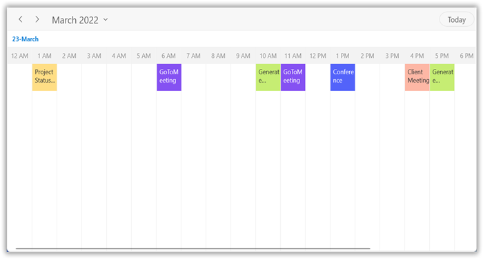

### View header height

Customize the height of the ViewHeader in timeline views by setting the [ViewHeaderHeight](https://help.syncfusion.com/cr/winui/Syncfusion.UI.Xaml.Scheduler.ViewSettingsBase.html#Syncfusion_UI_Xaml_Scheduler_ViewSettingsBase_ViewHeaderHeight) property of [TimelineViewSettings](https://help.syncfusion.com/cr/winui/Syncfusion.UI.Xaml.Scheduler.TimeSlotViewSettings.html) in SfScheduler.



<scheduler:SfScheduler x:Name="Schedule" ViewType="TimelineWeek">
    <scheduler:SfScheduler.TimelineViewSettings>
        <scheduler:TimelineViewSettings
            ViewHeaderHeight="100"/>
    </scheduler:SfScheduler.TimelineViewSettings>
</scheduler:SfScheduler>


this.Schedule.ViewType = SchedulerViewType.TimelineWeek;
this.Schedule.TimelineViewSettings.ViewHeaderHeight = 100;



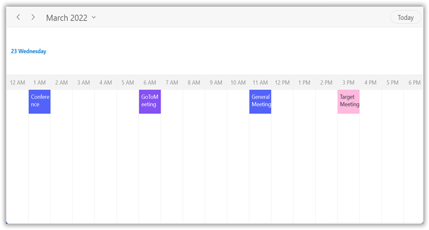

### View header appearance customization

Customize the default appearance of view header by setting the [ViewHeaderTemplate](https://help.syncfusion.com/cr/winui/Syncfusion.UI.Xaml.Scheduler.ViewSettingsBase.html#Syncfusion_UI_Xaml_Scheduler_ViewSettingsBase_ViewHeaderTemplate) property of [TimelineViewSettings](https://help.syncfusion.com/cr/winui/Syncfusion.UI.Xaml.Scheduler.TimeSlotViewSettings.html) in SfScheduler.



<Page.Resources>
    <DataTemplate x:Key="viewHeaderTemplate">
        <StackPanel Background="Transparent"  
            Width="Auto"
            VerticalAlignment="Center" 
            HorizontalAlignment="Stretch"
            Orientation="Vertical">
        <TextBlock 
            HorizontalAlignment="Left" 
            VerticalAlignment="Center" 
            Foreground="#8551F2"
            FontFamily="Arial"
            Text="{Binding DateText}"
            FontSize="25"
            TextTrimming="CharacterEllipsis"
            TextWrapping="Wrap" />
        <TextBlock 
            HorizontalAlignment="Left" 
            VerticalAlignment="Center" 
            Foreground="#8551F2"
            FontFamily="Arial"
            Text="{Binding DayText}"
            FontSize="10"
            TextTrimming="CharacterEllipsis"
            TextWrapping="Wrap" />
        </StackPanel>
    </DataTemplate>
</Page.Resources>





<scheduler:SfScheduler x:Name="Schedule" ViewType="TimelineWeek">
    <scheduler:SfScheduler.TimelineViewSettings>
        <scheduler:TimelineViewSettings 
            ViewHeaderTemplate="{StaticResource viewHeaderTemplate}" />
    </scheduler:SfScheduler.TimelineViewSettings>
</scheduler:SfScheduler>



## Appointment height

Customize the height of the appointment in `TimelineViews` using the [TimelineAppointmentHeight](https://help.syncfusion.com/cr/winui/Syncfusion.UI.Xaml.Scheduler.TimelineViewSettings.html#Syncfusion_UI_Xaml_Scheduler_TimelineViewSettings_TimelineAppointmentHeight) property of the [TimelineViewSettings](https://help.syncfusion.com/cr/winui/Syncfusion.UI.Xaml.Scheduler.TimeSlotViewSettings.html). By default, it's value is fifty for the `TimelineWeek,` `TimelineWorkWeek,` and `TimelineDay` views and twenty for the `TimelineMonth` view.



<scheduler:SfScheduler x:Name="Schedule" ViewType="TimelineWeek">
    <scheduler:SfScheduler.TimelineViewSettings>
        <scheduler:TimelineViewSettings 
            TimelineAppointmentHeight="100">
        </scheduler:TimelineViewSettings>
    </scheduler:SfScheduler.TimelineViewSettings>
</scheduler:SfScheduler>


this.Schedule.ViewType = SchedulerViewType.TimelineWeek;
this.Schedule.TimelineViewSettings.TimelineAppointmentHeight = 100;



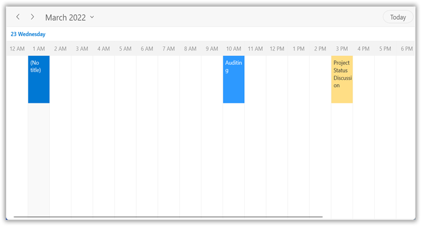