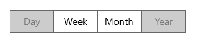

# Disable in WinUI Segmented Control

The WinUI Segmented Control provides options to disable the segmented item.

## Disable items

The Segmented Control allows you to disable the items using the [SetItemEnabled](https://help.syncfusion.com/cr/winui/Syncfusion.UI.Xaml.Editors.SfSegmentedControl.html#Syncfusion_UI_Xaml_Editors_SfSegmentedControl_SetItemEnabled_System_Int32_System_Boolean_) method. The method has following two parameters:

* `index` - The integer value indicating the index of the item.
* `isEnabled` - The boolean value indicating whether the item should be enabled or not.




<Window
    x:Class="GettingStarted.MainWindow"
    xmlns="http://schemas.microsoft.com/winfx/2006/xaml/presentation"
    xmlns:x="http://schemas.microsoft.com/winfx/2006/xaml"
    xmlns:local="using:GettingStarted"
    xmlns:d="http://schemas.microsoft.com/expression/blend/2008"
    xmlns:mc="http://schemas.openxmlformats.org/markup-compatibility/2006" 
    xmlns:syncfusion="using:Syncfusion.UI.Xaml.Editors" 
    mc:Ignorable="d">
    <Grid x:Name="rootGrid">
        <Grid.DataContext>
            <local:SegmentedViewModel/>
        </Grid.DataContext>
        <syncfusion:SfSegmentedControl x:Name="segmentedControl"
                                    HorizontalAlignment="Center"
                                    VerticalAlignment="Center"
                                    ItemsSource="{Binding Days}">
            <syncfusion:SfSegmentedControl.ItemTemplate>
                <DataTemplate>
                    <Grid>
                        <TextBlock Text="{Binding Name}"
                                   HorizontalAlignment="Center"
                                   VerticalAlignment="Center"/>
                    </Grid>
                </DataTemplate>
            </syncfusion:SfSegmentedControl.ItemTemplate>
        </syncfusion:SfSegmentedControl>
    </Grid>
</Window>


 

using Microsoft.UI.Xaml;
using Syncfusion.UI.Xaml.Editors;

public sealed partial class MainWindow : Window
{
    public MainWindow()
    {
        this.InitializeComponent();
        segmentedControl.SetItemEnabled(0, false);
        segmentedControl.SetItemEnabled(3, false);
    }
}


 

N> [View sample in GitHub](https://github.com/SyncfusionExamples/syncfusion-winui-segmentedcontrol-examples/tree/main/Samples/Disable-Items)

