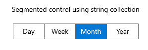

# Getting Started with WinUI Segmented Control

This section provides an overview of how to use the [WinUI Segmented Control](https://www.syncfusion.com/winui-controls/segmented-control). Walk through the entire process of creating a real-world application with this control.

## Creating an application using WinUI Segmented Control

1. Create a [WinUI 3 desktop app for C# and .NET 5](https://docs.microsoft.com/en-us/windows/apps/winui/winui3/get-started-winui3-for-desktop).

2. Add reference to [Syncfusion.Editors.WinUI](https://www.nuget.org/packages/Syncfusion.Editors.WinUI) NuGet. 

3. Import the control namespace using `Syncfusion.UI.Xaml.Editors` in XAML or C# code.

4. Initialize the [SfSegmentedControl](https://help.syncfusion.com/cr/winui/Syncfusion.UI.Xaml.Editors.SfSegmentedControl.html).




<Window
    x:Class="GettingStarted.MainWindow"
    xmlns="http://schemas.microsoft.com/winfx/2006/xaml/presentation"
    xmlns:x="http://schemas.microsoft.com/winfx/2006/xaml"
    xmlns:local="using:GettingStarted"
    xmlns:d="http://schemas.microsoft.com/expression/blend/2008"
    xmlns:mc="http://schemas.openxmlformats.org/markup-compatibility/2006" 
    xmlns:syncfusion="using:Syncfusion.UI.Xaml.Editors" 
    mc:Ignorable="d">
    <Grid x:Name="Root_Grid">
        <syncfusion:SfSegmentedControl x:Name="segmentedControl" />
    </Grid>
</Window>


 

using Microsoft.UI.Xaml;
using Syncfusion.UI.Xaml.Editors;

public sealed partial class MainWindow : Window
{
    public MainWindow()
    {
        this.InitializeComponent();
        SfSegmentedControl SegmentedControl = new SfSegmentedControl();
        Root_Grid.Children.Add(SegmentedControl);
    }
}


 

## Populating items using string collection

The Segmented control allows you to set the collection of strings as a data source using the [ItemsSource](https://help.syncfusion.com/cr/winui/Syncfusion.UI.Xaml.Editors.SfSegmentedControl.html#Syncfusion_UI_Xaml_Editors_SfSegmentedControl_ItemsSource) property.




<Window
    x:Class="GettingStarted.MainWindow"
    xmlns="http://schemas.microsoft.com/winfx/2006/xaml/presentation"
    xmlns:x="http://schemas.microsoft.com/winfx/2006/xaml"
    xmlns:local="using:GettingStarted"
    xmlns:d="http://schemas.microsoft.com/expression/blend/2008"
    xmlns:mc="http://schemas.openxmlformats.org/markup-compatibility/2006" 
    xmlns:syncfusion="using:Syncfusion.UI.Xaml.Editors" 
    mc:Ignorable="d">
    <Grid>
        <Grid.DataContext>
            <local:SegmentedViewModel/>
        </Grid.DataContext>
        <syncfusion:SfSegmentedControl x:Name="segmentedControl"
                                    HorizontalAlignment="Center"
                                    VerticalAlignment="Center"
                                    SelectedIndex="2"
                                    ItemsSource="{Binding Days}" />
    </Grid>
</Window>




public class SegmentedViewModel
{
    public SegmentedViewModel()
    {
        Days = new List<string>();
        Days.Add("Day");
        Days.Add( "Week");
        Days.Add("Month");
        Days.Add("Year");
    }

    public List<string> Days
    {
        get; set;
    }
}


 

## Populating items using business objects

Populating items to the Segmented Control by setting the collection of business objects to the [ItemsSource](https://help.syncfusion.com/cr/winui/Syncfusion.UI.Xaml.Editors.SfSegmentedControl.html#Syncfusion_UI_Xaml_Editors_SfSegmentedControl_ItemsSource) property.

### ItemTemplate

By defining the [ItemTemplate](https://help.syncfusion.com/cr/winui/Syncfusion.UI.Xaml.Editors.SfSegmentedControl.html#Syncfusion_UI_Xaml_Editors_SfSegmentedControl_ItemTemplate) of the segmented control, a custom user interface (UI) can be achieved to display each [SfSegmentedItem](https://help.syncfusion.com/cr/winui/Syncfusion.UI.Xaml.Editors.SfSegmentedItem.html).




<Window
    x:Class="GettingStarted.MainWindow"
    xmlns="http://schemas.microsoft.com/winfx/2006/xaml/presentation"
    xmlns:x="http://schemas.microsoft.com/winfx/2006/xaml"
    xmlns:local="using:GettingStarted"
    xmlns:d="http://schemas.microsoft.com/expression/blend/2008"
    xmlns:mc="http://schemas.openxmlformats.org/markup-compatibility/2006" 
    xmlns:syncfusion="using:Syncfusion.UI.Xaml.Editors" 
    mc:Ignorable="d">
    <Grid>
        <Grid.DataContext>
            <local:SegmentedViewModel/>
        </Grid.DataContext>
        <syncfusion:SfSegmentedControl x:Name="segmentedControl"
                                    HorizontalAlignment="Center"
                                    VerticalAlignment="Center"
                                    SelectedIndex="2"
                                    ItemsSource="{Binding Days}">
            <syncfusion:SfSegmentedControl.ItemTemplate>
                <DataTemplate>
                    <Grid>
                        <TextBlock Text="{Binding Name}"
                                   HorizontalAlignment="Center"
                                   VerticalAlignment="Center"/>
                    </Grid>
                </DataTemplate>
            </syncfusion:SfSegmentedControl.ItemTemplate>
        </syncfusion:SfSegmentedControl>
    </Grid>
</Window>


 

public class SegmentedViewModel
{
    public SegmentedViewModel()
    {
        Days = new List<SegmentedModel>();
        Days.Add(new SegmentedModel() { Name = "Day" });
        Days.Add(new SegmentedModel() { Name = "Week" });
        Days.Add(new SegmentedModel() { Name = "Month" });
        Days.Add(new SegmentedModel() { Name = "Year" });
    }

    public List<SegmentedModel> Days
    {
        get; set;
    }
}

public class SegmentedModel : INotifyPropertyChanged
{
    private string name;

    public string Name
    {
        get { return name; }
        set { name = value; OnPropertyChanged("Name"); }
    }

    public event PropertyChangedEventHandler PropertyChanged;

    private void OnPropertyChanged(string parameter)
    {
        PropertyChanged?.Invoke(this, new PropertyChangedEventArgs(parameter));
    }
}


 

### DisplayMemberPath

The [DisplayMemberPath](https://help.syncfusion.com/cr/winui/Syncfusion.UI.Xaml.Editors.SfSegmentedControl.html#Syncfusion_UI_Xaml_Editors_SfSegmentedControl_DisplayMemberPath) property denotes the path to a value on the source object (SfSegmentedControl.ItemsSource) that will be used as the visual representation of object. The following code sample will be used to bind the datasource to the Segmented control.




<Window
    x:Class="GettingStarted.MainWindow"
    xmlns="http://schemas.microsoft.com/winfx/2006/xaml/presentation"
    xmlns:x="http://schemas.microsoft.com/winfx/2006/xaml"
    xmlns:local="using:GettingStarted"
    xmlns:d="http://schemas.microsoft.com/expression/blend/2008"
    xmlns:mc="http://schemas.openxmlformats.org/markup-compatibility/2006" 
    xmlns:syncfusion="using:Syncfusion.UI.Xaml.Editors" 
    mc:Ignorable="d">
    <Grid>
        <Grid.DataContext>
            <local:SegmentedViewModel/>
        </Grid.DataContext>
        <syncfusion:SfSegmentedControl x:Name="segmentedControl"
                                    HorizontalAlignment="Center"
                                    VerticalAlignment="Center"
                                    SelectedIndex="2"
                                    DisplayMemberPath="Name"
                                    ItemsSource="{Binding Days}">
        </syncfusion:SfSegmentedControl>
    </Grid>
</Window>


 

public class SegmentedViewModel
{
    public SegmentedViewModel()
    {
        Days = new List<SegmentedModel>();
        Days.Add(new SegmentedModel() { Name = "Day" });
        Days.Add(new SegmentedModel() { Name = "Week" });
        Days.Add(new SegmentedModel() { Name = "Month" });
        Days.Add(new SegmentedModel() { Name = "Year" });
    }

    public List<SegmentedModel> Days
    {
        get; set;
    }
}

public class SegmentedModel : INotifyPropertyChanged
{
    private string name;

    public string Name
    {
        get { return name; }
        set { name = value; OnPropertyChanged("Name"); }
    }

    public event PropertyChangedEventHandler PropertyChanged;

    private void OnPropertyChanged(string parameter)
    {
        PropertyChanged?.Invoke(this, new PropertyChangedEventArgs(parameter));
    }
}


 

N> [View sample in GitHub](https://github.com/SyncfusionExamples/syncfusion-winui-segmentedcontrol-examples/tree/main/Samples/Getting-Started)

