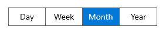

# WinUI Segmented Control Overview

The Syncfusion [WinUI Segmented Control](https://www.syncfusion.com/winui-controls/segmented-control) provides a simple way to choose from a linear set of two or more segments, each of which functions as a mutually exclusive option.

## Key features

* `Data binding`: Supports to bind both collection of strings and business objects.
* `Selection`: Supports to customize the segment background, text color, selection style, and more.
* `Animation`: Supports to enable or disable the effects of animation.
* `Customization`: Supports to customize the segments with custom UI. 
* `Disable`: Supports to disable the segment items.