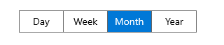
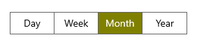
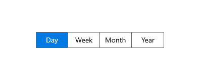
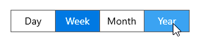
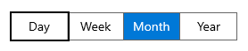

# Selection in WinUI Segmented Control

This section explains about features that aid in the selection of items, customization of the selected item, and its related operations in the Segmented control.

## Selected index

The Segmented control allows you to select the segment item based on data source index using the [SelectedIndex](https://help.syncfusion.com/cr/winui/Syncfusion.UI.Xaml.Editors.SfSegmentedControl.html#Syncfusion_UI_Xaml_Editors_SfSegmentedControl_SelectedIndex) property.




<Window
    x:Class="GettingStarted.MainWindow"
    xmlns="http://schemas.microsoft.com/winfx/2006/xaml/presentation"
    xmlns:x="http://schemas.microsoft.com/winfx/2006/xaml"
    xmlns:local="using:GettingStarted"
    xmlns:d="http://schemas.microsoft.com/expression/blend/2008"
    xmlns:mc="http://schemas.openxmlformats.org/markup-compatibility/2006" 
    xmlns:syncfusion="using:Syncfusion.UI.Xaml.Editors" 
    mc:Ignorable="d">
    <Grid x:Name="Root_Grid">
        <Grid.DataContext>
            <local:SegmentedViewModel/>
        </Grid.DataContext>
        <syncfusion:SfSegmentedControl x:Name="segmentWithSelectedIndex"
                                    Margin="0,20,0,0"              
                                    HorizontalAlignment="Center"
                                    VerticalAlignment="Center"
                                    SelectedIndex="2"
                                    ItemsSource="{Binding Days}">
                <syncfusion:SfSegmentedControl.ItemTemplate>
                    <DataTemplate>
                        <Grid>
                            <TextBlock Text="{Binding Name}"
                                   HorizontalAlignment="Center"
                                   VerticalAlignment="Center"/>
                        </Grid>
                    </DataTemplate>
                </syncfusion:SfSegmentedControl.ItemTemplate>
            </syncfusion:SfSegmentedControl>
    </Grid>
</Window>




## Selected item customization

The Segmented control allows you to customize the appearance of selected item using the [SelectedSegmentStyle](https://help.syncfusion.com/cr/winui/Syncfusion.UI.Xaml.Editors.SfSegmentedControl.html#Syncfusion_UI_Xaml_Editors_SfSegmentedControl_SelectedSegmentStyle) property. You need to provide the target types' style as [Border](https://docs.microsoft.com/en-us/uwp/api/windows.ui.xaml.controls.border).




<Window
    x:Class="GettingStarted.MainWindow"
    xmlns="http://schemas.microsoft.com/winfx/2006/xaml/presentation"
    xmlns:x="http://schemas.microsoft.com/winfx/2006/xaml"
    xmlns:local="using:GettingStarted"
    xmlns:d="http://schemas.microsoft.com/expression/blend/2008"
    xmlns:mc="http://schemas.openxmlformats.org/markup-compatibility/2006" 
    xmlns:syncfusion="using:Syncfusion.UI.Xaml.Editors" 
    mc:Ignorable="d">
    <Grid x:Name="Root_Grid">
        <Grid.DataContext>
            <local:SegmentedViewModel/>
        </Grid.DataContext>
         <Grid.Resources>
            
        </Grid.Resources>
        <syncfusion:SfSegmentedControl x:Name="segmentedControl"
                                    HorizontalAlignment="Center"
                                    VerticalAlignment="Center"
                                    SelectedIndex="2" 
                                    SelectedSegmentStyle="{StaticResource selectedItemStyle}"
                                    ItemsSource="{Binding Days}">
            <syncfusion:SfSegmentedControl.ItemTemplate>
                <DataTemplate>
                    <Grid>
                        <TextBlock Text="{Binding Name}"
                                   HorizontalAlignment="Center"
                                   VerticalAlignment="Center"/>
                    </Grid>
                </DataTemplate>
            </syncfusion:SfSegmentedControl.ItemTemplate>
        </syncfusion:SfSegmentedControl>
    </Grid>
</Window>


 

N> Users cannot change the selected item foreground using SelectedSegmentStyle.

## Animation

The Segmented control supports slide animation for selecting the item. Also, users can enable or disable the selection animation using the [SelectionAnimationType](https://help.syncfusion.com/cr/winui/Syncfusion.UI.Xaml.Editors.SfSegmentedControl.html#Syncfusion_UI_Xaml_Editors_SfSegmentedControl_SelectionAnimationType) property. The default value is [Slide](https://help.syncfusion.com/cr/winui/Syncfusion.UI.Xaml.Editors.SegmentSelectionAnimationType.html#Syncfusion_UI_Xaml_Editors_SegmentSelectionAnimationType_Slide). This property has following two values:

* `Slide` - The slide animation effect is applied while selecting the item. 
* `None` - Disables animation while selecting the item.

### Slide




<Window
    x:Class="GettingStarted.MainWindow"
    xmlns="http://schemas.microsoft.com/winfx/2006/xaml/presentation"
    xmlns:x="http://schemas.microsoft.com/winfx/2006/xaml"
    xmlns:local="using:GettingStarted"
    xmlns:d="http://schemas.microsoft.com/expression/blend/2008"
    xmlns:mc="http://schemas.openxmlformats.org/markup-compatibility/2006" 
    xmlns:syncfusion="using:Syncfusion.UI.Xaml.Editors" 
    mc:Ignorable="d">
    <Grid x:Name="Root_Grid">
        <Grid.DataContext>
            <local:SegmentedViewModel/>
        </Grid.DataContext>
        <syncfusion:SfSegmentedControl x:Name="segmentedControl"
                                    HorizontalAlignment="Center"
                                    VerticalAlignment="Center"
                                    SelectedIndex="0" 
                                    ItemsSource="{Binding Days}">
            <syncfusion:SfSegmentedControl.ItemTemplate>
                <DataTemplate>
                    <Grid>
                        <TextBlock Text="{Binding Name}"
                                   HorizontalAlignment="Center"
                                   VerticalAlignment="Center"/>
                    </Grid>
                </DataTemplate>
            </syncfusion:SfSegmentedControl.ItemTemplate>
        </syncfusion:SfSegmentedControl>
    </Grid>
</Window>


 

### None




<Window
    x:Class="GettingStarted.MainWindow"
    xmlns="http://schemas.microsoft.com/winfx/2006/xaml/presentation"
    xmlns:x="http://schemas.microsoft.com/winfx/2006/xaml"
    xmlns:local="using:GettingStarted"
    xmlns:d="http://schemas.microsoft.com/expression/blend/2008"
    xmlns:mc="http://schemas.openxmlformats.org/markup-compatibility/2006" 
    xmlns:syncfusion="using:Syncfusion.UI.Xaml.Editors" 
    mc:Ignorable="d">
    <Grid x:Name="Root_Grid">
        <Grid.DataContext>
            <local:SegmentedViewModel/>
        </Grid.DataContext>
        <syncfusion:SfSegmentedControl x:Name="segmentedControl"
                                    HorizontalAlignment="Center"
                                    VerticalAlignment="Center"
                                    SelectedIndex="0"
                                    SelectionAnimationType="None" 
                                    ItemsSource="{Binding Days}">
            <syncfusion:SfSegmentedControl.ItemTemplate>
                <DataTemplate>
                    <Grid>
                        <TextBlock Text="{Binding Name}"
                                   HorizontalAlignment="Center"
                                   VerticalAlignment="Center"/>
                    </Grid>
                </DataTemplate>
            </syncfusion:SfSegmentedControl.ItemTemplate>
        </syncfusion:SfSegmentedControl>
    </Grid>
</Window>


 

## Keyboard behaviors

<table>
<tr>
<th>
Key or KeyCombinations
</th>
<th>
Description
</th>
</tr>
<tr>
<td>
<kbd>LeftArrow</kbd>
</td>
<td>
Moves to the previous item on the segmented control's left side. It does not make any selection and only navigates to the previous item. If the focus border is on the first item, pressing <kbd>LeftArrow</kbd> does nothing.
</td>
</tr>
<tr>
<td>
<kbd>RightArrow</kbd>
</td>
<td>
Moves to the next item on the segmented control's right side. It does not make any selection and only navigates to the next item. If the focus border is on the last item, pressing <kbd>RightArrow</kbd> does nothing.
</td>
</tr>
<tr>
<td>
<kbd>Tab</kbd>
</td>
<td>
The focus border appears on the selected item when users press the <kbd>Tab</kbd> key. The focus border appears on the first item, if there is no selected item. It will leave the control after pressing the <kbd>Tab</kbd> key with focus. 
</td>
</tr>
<tr>
<td>
<kbd>Enter</kbd>
</td>
<td>
Pressing the <kbd>Enter</kbd> key when segment item in focus will make selection.
</td>
</tr>
</table>

## SelectionChanged event

The [SelectionChanged](https://help.syncfusion.com/cr/winui/Syncfusion.UI.Xaml.Editors.SfSegmentedControl.html#Syncfusion_UI_Xaml_Editors_SfSegmentedControl_SelectionChanged) event is triggered, once the selection process has been completed for the selected item in the Segmented Control. The [SegmentSelectionChangedEventArgs](https://help.syncfusion.com/cr/winui/Syncfusion.UI.Xaml.Editors.SegmentSelectionChangedEventArgs.html) has the following values, which provides information for SelectionChanged event:

* `NewValue`: Gets the new value of [SelectedItem](https://help.syncfusion.com/cr/winui/Syncfusion.UI.Xaml.Editors.SfSegmentedControl.html#Syncfusion_UI_Xaml_Editors_SfSegmentedControl_SelectedItem) that has been assigned to the SegmentedControl.
* `OldValue`: Gets the old value of [SelectedItem](https://help.syncfusion.com/cr/winui/Syncfusion.UI.Xaml.Editors.SfSegmentedControl.html#Syncfusion_UI_Xaml_Editors_SfSegmentedControl_SelectedItem) that has been assigned to the SegmentedControl.

 

segmentedControl.SelectionChanged += SegmentedControl_SelectionChanged;

private void SegmentedControl_SelectionChanged(object sender, SegmentSelectionChangedEventArgs e)
{
   var newValue = e.NewValue;
   var oldValue = e.OldValue;         
}



N> [View sample in GitHub](https://github.com/SyncfusionExamples/syncfusion-winui-segmentedcontrol-examples/tree/main/Samples/Selection-Style)

