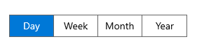

# Theme support in WinUI Segmented Control

This section explains Segmented Control's various themes and how to customize the appearance with keys.

## Set the Themes in Segmented Control

The Segmented Control provides various themes to be applied by setting the theme name in `RequestedTheme` property in the App.xaml file.

### Dark Theme




<Application
    x:Class="UI_Customization.App"
    xmlns="http://schemas.microsoft.com/winfx/2006/xaml/presentation"
    xmlns:x="http://schemas.microsoft.com/winfx/2006/xaml"
    xmlns:local="using:UI_Customization" RequestedTheme="Dark">
</Application>


 

### Light Theme




<Application
    x:Class="UI_Customization.App"
    xmlns="http://schemas.microsoft.com/winfx/2006/xaml/presentation"
    xmlns:x="http://schemas.microsoft.com/winfx/2006/xaml"
    xmlns:local="using:UI_Customization" RequestedTheme="Light">
</Application>


 

## Customization using keys

The Segmented Control can be customized using the theme keys for following interactions.

* Hover.
* Selection.
* Selected hover.
* Disable.

<table>
<tr>
<th>Key</th>
<th>Description</th>
</tr>
<tr>
<td>
SyncfusionSegmentedControlBackground
</td>
<td>
Used to set the background color of the segmented control.
</td>
</tr>
<tr>
<td>
SyncfusionSegmentedItemBackground
</td>
<td>
Used to set the background control of the segmented item.
</td>
</tr>
<tr>
<td>
SyncfusionSegmentedItemHoverBackground
</td>
<td>
Used to set the hover background color of the segmented item.
</td>
</tr>
<tr>
<td>
SyncfusionSegmentedItemSelectedHoverBackground
</td>
<td>
Used to set the selected hover background color of the segmented item.
</td>
</tr>
<tr>
<td>
SyncfusionSegmentedItemSelectedBackground
</td>
<td>
Used to set the selected background color of the segmented item.
</td>
</tr>
<tr>
<td>
SyncfusionSegmentedItemForeground
</td>
<td>
Used to set the foreground color of the segmented item.
</td>
</tr>
<tr>
<td>
SyncfusionSegmentedItemHoverForeground
</td>
<td>
Used to set the hover foreground color of the segmented item.
</td>
</tr>
<tr>
<td>
SyncfusionSegmentedItemSelectedHoverForeground
</td>
<td>
Used to set the selected hover foreground color of the segmented item.
</td>
</tr>
<tr>
<td>
SyncfusionSegmentedItemSelectedForeground
</td>
<td>
Used to set the selected foreground color of the segmented item.
</td>
</tr>
<tr>
<td>
SyncfusionSegmentedControlBorderBrush
</td>
<td>
Used to set the border color of the segmented control.
</td>
</tr>
<tr>
<td>
SyncfusionSegmentedItemDisabledBackground
</td>
<td>
Used to set the background color of the disabled item.
</td>
</tr>
<tr>
<td>
SyncfusionSegmentedItemDisabledForeground
</td>
<td>
Used to set the foreground color of the disabled item.
</td>
</tr>
</table>

The following code example illustrates how to customize the segmented control using keys.




<Window
    x:Class="GettingStarted.MainWindow"
    xmlns="http://schemas.microsoft.com/winfx/2006/xaml/presentation"
    xmlns:x="http://schemas.microsoft.com/winfx/2006/xaml"
    xmlns:local="using:GettingStarted"
    xmlns:d="http://schemas.microsoft.com/expression/blend/2008"
    xmlns:mc="http://schemas.openxmlformats.org/markup-compatibility/2006" 
    xmlns:syncfusion="using:Syncfusion.UI.Xaml.Editors" 
    mc:Ignorable="d">
    <Grid x:Name="rootGrid">
        <Grid.DataContext>
            <local:SegmentedViewModel/>
        </Grid.DataContext>
        <syncfusion:SfSegmentedControl x:Name="segmentedControl"
                                    HorizontalAlignment="Center"
                                    VerticalAlignment="Center"
                                    SelectedIndex="2"
                                    DisplayMemberPath="Name" 
                                    ItemsSource="{Binding ShirtModels}">
            <syncfusion:SfSegmentedControl.Resources>
                <ResourceDictionary>
                    <ResourceDictionary.ThemeDictionaries>
                        <ResourceDictionary x:Key="Light">
                            <SolidColorBrush x:Key="SyncfusionSegmentedControlBackground" Color="#F2F2F2"/>
                            <SolidColorBrush x:Key="SyncfusionSegmentedItemBackground" Color="#F2F2F2"/>
                            <SolidColorBrush x:Key="SyncfusionSegmentedItemSelectedBackground" Color="#6C58EA"/>
                            <SolidColorBrush x:Key="SyncfusionSegmentedItemHoverBackground" Color="#E8E4FF"/>
                            <SolidColorBrush x:Key="SyncfusionSegmentedItemSelectedHoverBackground" Color="#E8E4FF"/>
                            <SolidColorBrush x:Key="SyncfusionSegmentedItemForeground" Color="Black"/>
                            <SolidColorBrush x:Key="SyncfusionSegmentedItemHoverForeground" Color="Black"/>
                            <SolidColorBrush x:Key="SyncfusionSegmentedItemSelectedHoverForeground" Color="Black"/>
                            <SolidColorBrush x:Key="SyncfusionSegmentedItemSelectedForeground" Color="White"/>
                            <SolidColorBrush x:Key="SyncfusionSegmentedControlBorderBrush" Color="#D9D9D9"/>
                        </ResourceDictionary>
                        <ResourceDictionary x:Key="Dark">
                            <SolidColorBrush x:Key="SyncfusionSegmentedControlBackground" Color="#414141"/>
                            <SolidColorBrush x:Key="SyncfusionSegmentedItemBackground" Color="#414141"/>
                            <SolidColorBrush x:Key="SyncfusionSegmentedItemSelectedBackground" Color="#08B2A8"/>
                            <SolidColorBrush x:Key="SyncfusionSegmentedItemHoverBackground" Color="#365856"/>
                            <SolidColorBrush x:Key="SyncfusionSegmentedItemSelectedHoverBackground" Color="#365856"/>
                            <SolidColorBrush x:Key="SyncfusionSegmentedItemForeground" Color="White"/>
                            <SolidColorBrush x:Key="SyncfusionSegmentedItemHoverForeground" Color="White"/>
                            <SolidColorBrush x:Key="SyncfusionSegmentedItemSelectedHoverForeground" Color="White"/>
                            <SolidColorBrush x:Key="SyncfusionSegmentedItemSelectedForeground" Color="White"/>
                            <SolidColorBrush x:Key="SyncfusionSegmentedControlBorderBrush" Color="#5F5E5E"/>
                        </ResourceDictionary>
                    </ResourceDictionary.ThemeDictionaries>
                </ResourceDictionary>
            </syncfusion:SfSegmentedControl.Resources>
        </syncfusion:SfSegmentedControl>
    </Grid>
</Window>


 

**Light Theme**

**Dark Theme**

N> [View sample in GitHub](https://github.com/SyncfusionExamples/syncfusion-winui-segmentedcontrol-examples/tree/main/Samples/UI-Customization)

