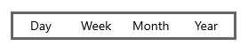
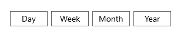
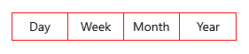
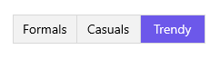
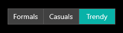

# Customization in WinUI Segmented Control

The WinUI Segmented control allows you to customize the background, text color, selection style, and much more.

## BorderThickness

The Segmented control border thickness can be customized using the `BorderThickness` property. 

N> The default value is 1.




<Window
    x:Class="GettingStarted.MainWindow"
    xmlns="http://schemas.microsoft.com/winfx/2006/xaml/presentation"
    xmlns:x="http://schemas.microsoft.com/winfx/2006/xaml"
    xmlns:local="using:GettingStarted"
    xmlns:d="http://schemas.microsoft.com/expression/blend/2008"
    xmlns:mc="http://schemas.openxmlformats.org/markup-compatibility/2006" 
    xmlns:syncfusion="using:Syncfusion.UI.Xaml.Editors" 
    mc:Ignorable="d">
    <Grid x:Name="Root_Grid">
        <Grid.DataContext>
            <local:SegmentedViewModel/>
        </Grid.DataContext>
        <syncfusion:SfSegmentedControl x:Name="segmentedControl"
                                    HorizontalAlignment="Center"
                                    VerticalAlignment="Center"
                                    BorderThickness="3"
                                    ItemBorderThickness="0"
                                    ItemsSource="{Binding Days}">                                       
            <syncfusion:SfSegmentedControl.ItemTemplate>
                <DataTemplate>
                    <Grid>
                        <TextBlock Text="{Binding Name}"
                                   HorizontalAlignment="Center"
                                   VerticalAlignment="Center"/>
                    </Grid>
                </DataTemplate>
            </syncfusion:SfSegmentedControl.ItemTemplate>
        </syncfusion:SfSegmentedControl>
    </Grid>
</Window>


 

### ItemBorderThickness 

The [SfSegmentedItem](https://help.syncfusion.com/cr/winui/Syncfusion.UI.Xaml.Editors.SfSegmentedItem.html) border thickness can be customized using the [ItemBorderThickness](https://help.syncfusion.com/cr/winui/Syncfusion.UI.Xaml.Editors.SfSegmentedControl.html#Syncfusion_UI_Xaml_Editors_SfSegmentedControl_ItemBorderThickness) property. You can set item margin using the [ItemContainerStyle](https://help.syncfusion.com/cr/winui/Syncfusion.UI.Xaml.Editors.SfSegmentedControl.html#Syncfusion_UI_Xaml_Editors_SfSegmentedControl_ItemContainerStyle) property to avoid thick border when both control border thickness and segment item border thickness is used simultaneously.

N> The default value is 0,0,1,0.




<Window
    x:Class="GettingStarted.MainWindow"
    xmlns="http://schemas.microsoft.com/winfx/2006/xaml/presentation"
    xmlns:x="http://schemas.microsoft.com/winfx/2006/xaml"
    xmlns:local="using:GettingStarted"
    xmlns:d="http://schemas.microsoft.com/expression/blend/2008"
    xmlns:mc="http://schemas.openxmlformats.org/markup-compatibility/2006" 
    xmlns:syncfusion="using:Syncfusion.UI.Xaml.Editors" 
    mc:Ignorable="d">
    <Grid x:Name="Root_Grid">
        <Grid.DataContext>
            <local:SegmentedViewModel/>
        </Grid.DataContext>
        <syncfusion:SfSegmentedControl x:Name="segmentedControl"
                                    HorizontalAlignment="Center"
                                    VerticalAlignment="Center"
                                    BorderThickness="0"
                                    ItemBorderThickness="1"
                                    ItemsSource="{Binding Days}">
            <syncfusion:SfSegmentedControl.ItemContainerStyle>
                
            </syncfusion:SfSegmentedControl.ItemContainerStyle>                                            
            <syncfusion:SfSegmentedControl.ItemTemplate>
                <DataTemplate>
                    <Grid>
                        <TextBlock Text="{Binding Name}"
                                   HorizontalAlignment="Center"
                                   VerticalAlignment="Center"/>
                    </Grid>
                </DataTemplate>
            </syncfusion:SfSegmentedControl.ItemTemplate>
        </syncfusion:SfSegmentedControl>
    </Grid>
</Window>


 

## CornerRadius

The Segmented control corner radius can be customized using the `CornerRadius` property. Also, by setting the [ItemContainerStyle](https://help.syncfusion.com/cr/winui/Syncfusion.UI.Xaml.Editors.SfSegmentedControl.html#Syncfusion_UI_Xaml_Editors_SfSegmentedControl_ItemContainerStyle) property of Segmented control, you can change the corner radius of segment item using the `CornerRadius` property in [SfSegmentedItem](https://help.syncfusion.com/cr/winui/Syncfusion.UI.Xaml.Editors.SfSegmentedItem.html). 

N> The default value is 0.




<Window
    x:Class="GettingStarted.MainWindow"
    xmlns="http://schemas.microsoft.com/winfx/2006/xaml/presentation"
    xmlns:x="http://schemas.microsoft.com/winfx/2006/xaml"
    xmlns:local="using:GettingStarted"
    xmlns:d="http://schemas.microsoft.com/expression/blend/2008"
    xmlns:mc="http://schemas.openxmlformats.org/markup-compatibility/2006" 
    xmlns:syncfusion="using:Syncfusion.UI.Xaml.Editors" 
    mc:Ignorable="d">
    <Grid x:Name="Root_Grid">
        <Grid.DataContext>
            <local:SegmentedViewModel/>
        </Grid.DataContext>
        <syncfusion:SfSegmentedControl x:Name="segmentedControl"
                                    HorizontalAlignment="Center"
                                    VerticalAlignment="Center"
                                    CornerRadius="5"
                                    ItemsSource="{Binding Days}">                                          
            <syncfusion:SfSegmentedControl.ItemTemplate>
                <DataTemplate>
                    <Grid>
                        <TextBlock Text="{Binding Name}"
                                   HorizontalAlignment="Center"
                                   VerticalAlignment="Center"/>
                    </Grid>
                </DataTemplate>
            </syncfusion:SfSegmentedControl.ItemTemplate>
        </syncfusion:SfSegmentedControl>
    </Grid>
</Window>


 

## Border color

The Segmented control border color can be customized using the `BorderBrush` property. Also, by setting the [ItemContainerStyle](https://help.syncfusion.com/cr/winui/Syncfusion.UI.Xaml.Editors.SfSegmentedControl.html#Syncfusion_UI_Xaml_Editors_SfSegmentedControl_ItemContainerStyle) property of Segmented control, you can change the border color of segment item using the `BorderBrush` property in [SfSegmentedItem](https://help.syncfusion.com/cr/winui/Syncfusion.UI.Xaml.Editors.SfSegmentedItem.html).




<Window
    x:Class="GettingStarted.MainWindow"
    xmlns="http://schemas.microsoft.com/winfx/2006/xaml/presentation"
    xmlns:x="http://schemas.microsoft.com/winfx/2006/xaml"
    xmlns:local="using:GettingStarted"
    xmlns:d="http://schemas.microsoft.com/expression/blend/2008"
    xmlns:mc="http://schemas.openxmlformats.org/markup-compatibility/2006" 
    xmlns:syncfusion="using:Syncfusion.UI.Xaml.Editors" 
    mc:Ignorable="d">
    <Grid x:Name="Root_Grid">
        <Grid.DataContext>
            <local:SegmentedViewModel/>
        </Grid.DataContext>
        <syncfusion:SfSegmentedControl x:Name="segmentedControl"
                                    HorizontalAlignment="Center"
                                    VerticalAlignment="Center"
                                    BorderBrush="Red"
                                    ItemsSource="{Binding Days}">                     
            <syncfusion:SfSegmentedControl.ItemContainerStyle>
                
            </syncfusion:SfSegmentedControl.ItemContainerStyle>                                        
            <syncfusion:SfSegmentedControl.ItemTemplate>
                <DataTemplate>
                    <Grid>
                        <TextBlock Text="{Binding Name}"
                                   HorizontalAlignment="Center"
                                   VerticalAlignment="Center"/>
                    </Grid>
                </DataTemplate>
            </syncfusion:SfSegmentedControl.ItemTemplate>
        </syncfusion:SfSegmentedControl>
    </Grid>
</Window>


 

## Customization using keys

The Segmented control can be customized using the theme keys for following interactions.

* Hover.
* Selection.
* Selected hover.
* Disable.

<table>
<tr>
<th>Key</th>
<th>Description</th>
</tr>
<tr>
<td>
SyncfusionSegmentedControlBackground
</td>
<td>
Used to set the background color of the segmented control.
</td>
</tr>
<tr>
<td>
SyncfusionSegmentedItemBackground
</td>
<td>
Used to set the background control of the segmented item.
</td>
</tr>
<tr>
<td>
SyncfusionSegmentedItemHoverBackground
</td>
<td>
Used to set the hover background color of the segmented item.
</td>
</tr>
<tr>
<td>
SyncfusionSegmentedItemSelectedHoverBackground
</td>
<td>
Used to set the selected hover background color of the segmented item.
</td>
</tr>
<tr>
<td>
SyncfusionSegmentedItemSelectedBackground
</td>
<td>
Used to set the selected background color of the segmented item.
</td>
</tr>
<tr>
<td>
SyncfusionSegmentedItemForeground
</td>
<td>
Used to set the foreground color of the segmented item.
</td>
</tr>
<tr>
<td>
SyncfusionSegmentedItemHoverForeground
</td>
<td>
Used to set the hover foreground color of the segmented item.
</td>
</tr>
<tr>
<td>
SyncfusionSegmentedItemSelectedHoverForeground
</td>
<td>
Used to set the selected hover foreground color of the segmented item.
</td>
</tr>
<tr>
<td>
SyncfusionSegmentedItemSelectedForeground
</td>
<td>
Used to set the selected foreground color of the segmented item.
</td>
</tr>
<tr>
<td>
SyncfusionSegmentedControlBorderBrush
</td>
<td>
Used to set the border color of the segmented control.
</td>
</tr>
<tr>
<td>
SyncfusionSegmentedItemDisabledBackground
</td>
<td>
Used to set the background color of the disabled item.
</td>
</tr>
<tr>
<td>
SyncfusionSegmentedItemDisabledForeground
</td>
<td>
Used to set the foreground color of the disabled item.
</td>
</tr>
</table>

The following code example illustrates how to customize the segmented control using keys.




<Window
    x:Class="GettingStarted.MainWindow"
    xmlns="http://schemas.microsoft.com/winfx/2006/xaml/presentation"
    xmlns:x="http://schemas.microsoft.com/winfx/2006/xaml"
    xmlns:local="using:GettingStarted"
    xmlns:d="http://schemas.microsoft.com/expression/blend/2008"
    xmlns:mc="http://schemas.openxmlformats.org/markup-compatibility/2006" 
    xmlns:syncfusion="using:Syncfusion.UI.Xaml.Editors" 
    mc:Ignorable="d">
    <Grid x:Name="Root_Grid">
        <Grid.DataContext>
            <local:SegmentedViewModel/>
        </Grid.DataContext>
        <Grid.Resources>
            <ResourceDictionary>
                <ResourceDictionary.ThemeDictionaries>
                    <ResourceDictionary x:Key="Light">
                        <SolidColorBrush x:Key="SelectedBackground" Color="#6C58EA"/>
                    </ResourceDictionary>
                    <ResourceDictionary x:Key="Dark">
                        <SolidColorBrush x:Key="SelectedBackground" Color="#08B2A8"/>
                    </ResourceDictionary>
                </ResourceDictionary.ThemeDictionaries>
                
            </ResourceDictionary>
        </Grid.Resources>
        <syncfusion:SfSegmentedControl x:Name="segmentedControl"
                                    Height="40"   
                                    HorizontalAlignment="Center"
                                    VerticalAlignment="Center"
                                    SelectedIndex="2"
                                    CornerRadius="4"
                                    BorderThickness="2"
                                    ItemBorderThickness="0"
                                    SelectedSegmentStyle="{StaticResource shirtModelStyle}"
                                    ItemsSource="{Binding ShirtModels}">
            <syncfusion:SfSegmentedControl.Resources>
                <ResourceDictionary>
                    <ResourceDictionary.ThemeDictionaries>
                        <ResourceDictionary x:Key="Light">
                            <SolidColorBrush x:Key="SyncfusionSegmentedControlBackground" Color="#F2F2F2"/>
                            <SolidColorBrush x:Key="SyncfusionSegmentedItemBackground" Color="#F2F2F2"/>
                            <SolidColorBrush x:Key="SyncfusionSegmentedItemSelectedBackground" Color="#6C58EA"/>
                            <SolidColorBrush x:Key="SyncfusionSegmentedItemHoverBackground" Color="#E8E4FF"/>
                            <SolidColorBrush x:Key="SyncfusionSegmentedItemSelectedHoverBackground" Color="#E8E4FF"/>
                            <SolidColorBrush x:Key="SyncfusionSegmentedItemForeground" Color="Black"/>
                            <SolidColorBrush x:Key="SyncfusionSegmentedItemHoverForeground" Color="Black"/>
                            <SolidColorBrush x:Key="SyncfusionSegmentedItemSelectedHoverForeground" Color="Black"/>
                            <SolidColorBrush x:Key="SyncfusionSegmentedItemSelectedForeground" Color="White"/>
                            <SolidColorBrush x:Key="SyncfusionSegmentedControlBorderBrush" Color="#D9D9D9"/>
                        </ResourceDictionary>
                        <ResourceDictionary x:Key="Dark">
                            <SolidColorBrush x:Key="SyncfusionSegmentedControlBackground" Color="#414141"/>
                            <SolidColorBrush x:Key="SyncfusionSegmentedItemBackground" Color="#414141"/>
                            <SolidColorBrush x:Key="SyncfusionSegmentedItemSelectedBackground" Color="#08B2A8"/>
                            <SolidColorBrush x:Key="SyncfusionSegmentedItemHoverBackground" Color="#365856"/>
                            <SolidColorBrush x:Key="SyncfusionSegmentedItemSelectedHoverBackground" Color="#365856"/>
                            <SolidColorBrush x:Key="SyncfusionSegmentedItemForeground" Color="White"/>
                            <SolidColorBrush x:Key="SyncfusionSegmentedItemHoverForeground" Color="White"/>
                            <SolidColorBrush x:Key="SyncfusionSegmentedItemSelectedHoverForeground" Color="White"/>
                            <SolidColorBrush x:Key="SyncfusionSegmentedItemSelectedForeground" Color="White"/>
                            <SolidColorBrush x:Key="SyncfusionSegmentedControlBorderBrush" Color="#5F5E5E"/>
                        </ResourceDictionary>
                    </ResourceDictionary.ThemeDictionaries>
                </ResourceDictionary>
            </syncfusion:SfSegmentedControl.Resources>
            <syncfusion:SfSegmentedControl.ItemContainerStyle>
                
            </syncfusion:SfSegmentedControl.ItemContainerStyle>                   
            <syncfusion:SfSegmentedControl.ItemTemplate>
                <DataTemplate>
                    <Grid>
                        <TextBlock Text="{Binding Name}"
                                   HorizontalAlignment="Center"
                                   VerticalAlignment="Center"/>
                    </Grid>
                </DataTemplate>
            </syncfusion:SfSegmentedControl.ItemTemplate>
        </syncfusion:SfSegmentedControl>
    </Grid>
</Window>


 

**Light Theme**

**Dark Theme**

N> [View sample in GitHub](https://github.com/SyncfusionExamples/syncfusion-winui-segmentedcontrol-examples/tree/main/Samples/UI-Customization)
