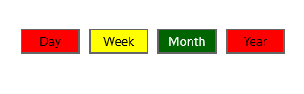

# Customization in WinUI Segmented Control

The WinUI Segmented Control allows you to customize the background, text color, selection style, and much more.

## Customizing the border thickness

The Segmented Control border thickness can be customized using the [BorderThickness](https://docs.microsoft.com/en-us/windows/winui/api/microsoft.ui.xaml.controls.control.borderthickness?view=winui-3.0) property. 

N> The default value is 1.




<Window
    x:Class="GettingStarted.MainWindow"
    xmlns="http://schemas.microsoft.com/winfx/2006/xaml/presentation"
    xmlns:x="http://schemas.microsoft.com/winfx/2006/xaml"
    xmlns:local="using:GettingStarted"
    xmlns:d="http://schemas.microsoft.com/expression/blend/2008"
    xmlns:mc="http://schemas.openxmlformats.org/markup-compatibility/2006" 
    xmlns:syncfusion="using:Syncfusion.UI.Xaml.Editors" 
    mc:Ignorable="d">
    <Grid>
        <Grid.DataContext>
            <local:SegmentedViewModel/>
        </Grid.DataContext>
        <syncfusion:SfSegmentedControl x:Name="segmentedControl"
                                    HorizontalAlignment="Center"
                                    VerticalAlignment="Center"
                                    BorderThickness="3"
                                    ItemBorderThickness="0"
                                    DisplayMemberPath="Name"    
                                    ItemsSource="{Binding Days}">
        </syncfusion:SfSegmentedControl>
    </Grid>
</Window>


 

## Customizing the item border thickness 

The [SfSegmentedItem](https://help.syncfusion.com/cr/winui/Syncfusion.UI.Xaml.Editors.SfSegmentedItem.html) border thickness can be customized using the [ItemBorderThickness](https://help.syncfusion.com/cr/winui/Syncfusion.UI.Xaml.Editors.SfSegmentedControl.html#Syncfusion_UI_Xaml_Editors_SfSegmentedControl_ItemBorderThickness) property. You can set item margin using the [ItemContainerStyle](https://help.syncfusion.com/cr/winui/Syncfusion.UI.Xaml.Editors.SfSegmentedControl.html#Syncfusion_UI_Xaml_Editors_SfSegmentedControl_ItemContainerStyle) property to avoid thick border when both control border thickness and segment item border thickness is used simultaneously.

N> The default value is 0,0,1,0.




<Window
    x:Class="GettingStarted.MainWindow"
    xmlns="http://schemas.microsoft.com/winfx/2006/xaml/presentation"
    xmlns:x="http://schemas.microsoft.com/winfx/2006/xaml"
    xmlns:local="using:GettingStarted"
    xmlns:d="http://schemas.microsoft.com/expression/blend/2008"
    xmlns:mc="http://schemas.openxmlformats.org/markup-compatibility/2006" 
    xmlns:syncfusion="using:Syncfusion.UI.Xaml.Editors" 
    mc:Ignorable="d">
    <Grid>
        <Grid.DataContext>
            <local:SegmentedViewModel/>
        </Grid.DataContext>
        <syncfusion:SfSegmentedControl x:Name="segmentedControl"
                                    HorizontalAlignment="Center"
                                    VerticalAlignment="Center"
                                    BorderThickness="0"
                                    ItemBorderThickness="1"
                                    DisplayMemberPath="Name" 
                                    SelectionAnimationType="None"      
                                    ItemsSource="{Binding Days}">
            <syncfusion:SfSegmentedControl.ItemContainerStyle>
                
            </syncfusion:SfSegmentedControl.ItemContainerStyle>
        </syncfusion:SfSegmentedControl>
    </Grid>
</Window>


 

## Customizing the corner radius

The Segmented Control corner radius can be customized using the [CornerRadius](https://docs.microsoft.com/en-us/windows/winui/api/microsoft.ui.xaml.controls.control.cornerradius?view=winui-3.0) property. Also, by setting the [ItemContainerStyle](https://help.syncfusion.com/cr/winui/Syncfusion.UI.Xaml.Editors.SfSegmentedControl.html#Syncfusion_UI_Xaml_Editors_SfSegmentedControl_ItemContainerStyle) property of Segmented Control, you can change the corner radius of segment item using the [CornerRadius](https://docs.microsoft.com/en-us/windows/winui/api/microsoft.ui.xaml.controls.control.cornerradius?view=winui-3.0) property in [SfSegmentedItem](https://help.syncfusion.com/cr/winui/Syncfusion.UI.Xaml.Editors.SfSegmentedItem.html). 

N> The default value is 0.




<Window
    x:Class="GettingStarted.MainWindow"
    xmlns="http://schemas.microsoft.com/winfx/2006/xaml/presentation"
    xmlns:x="http://schemas.microsoft.com/winfx/2006/xaml"
    xmlns:local="using:GettingStarted"
    xmlns:d="http://schemas.microsoft.com/expression/blend/2008"
    xmlns:mc="http://schemas.openxmlformats.org/markup-compatibility/2006" 
    xmlns:syncfusion="using:Syncfusion.UI.Xaml.Editors" 
    mc:Ignorable="d">
    <Grid>
        <Grid.DataContext>
            <local:SegmentedViewModel/>
        </Grid.DataContext>
        <syncfusion:SfSegmentedControl x:Name="segmentedControl"
                                    HorizontalAlignment="Center"
                                    VerticalAlignment="Center"
                                    CornerRadius="5"
                                    DisplayMemberPath="Name"    
                                    ItemsSource="{Binding Days}">
        </syncfusion:SfSegmentedControl>
    </Grid>
</Window>


 

## Customizing the border color

The Segmented Control border color can be customized using the [BorderBrush](https://docs.microsoft.com/en-us/windows/winui/api/microsoft.ui.xaml.controls.control.borderbrush?view=winui-3.0) property. Also, by setting the [ItemContainerStyle](https://help.syncfusion.com/cr/winui/Syncfusion.UI.Xaml.Editors.SfSegmentedControl.html#Syncfusion_UI_Xaml_Editors_SfSegmentedControl_ItemContainerStyle) property of Segmented Control, you can change the border color of segment item using the [BorderBrush](https://docs.microsoft.com/en-us/windows/winui/api/microsoft.ui.xaml.controls.control.borderbrush?view=winui-3.0) property in [SfSegmentedItem](https://help.syncfusion.com/cr/winui/Syncfusion.UI.Xaml.Editors.SfSegmentedItem.html).




<Window
    x:Class="GettingStarted.MainWindow"
    xmlns="http://schemas.microsoft.com/winfx/2006/xaml/presentation"
    xmlns:x="http://schemas.microsoft.com/winfx/2006/xaml"
    xmlns:local="using:GettingStarted"
    xmlns:d="http://schemas.microsoft.com/expression/blend/2008"
    xmlns:mc="http://schemas.openxmlformats.org/markup-compatibility/2006" 
    xmlns:syncfusion="using:Syncfusion.UI.Xaml.Editors" 
    mc:Ignorable="d">
    <Grid>
        <Grid.DataContext>
            <local:SegmentedViewModel/>
        </Grid.DataContext>
        <syncfusion:SfSegmentedControl x:Name="segmentedControl"
                                    HorizontalAlignment="Center"
                                    VerticalAlignment="Center"
                                    BorderBrush="Red"
                                    DisplayMemberPath="Name"    
                                    ItemsSource="{Binding Days}">                     
            <syncfusion:SfSegmentedControl.ItemContainerStyle>
                
            </syncfusion:SfSegmentedControl.ItemContainerStyle>
        </syncfusion:SfSegmentedControl>
    </Grid>
</Window>


 

## Switching segment item templates 

The Segmented Control allows the custom logic for choosing a template used to display each item by using the [ItemTemplateSelector](https://help.syncfusion.com/cr/winui/Syncfusion.UI.Xaml.Editors.SfSegmentedControl.html#Syncfusion_UI_Xaml_Editors_SfSegmentedControl_ItemTemplateSelector) property.




<Window
    x:Class="UI_Customization.MainWindow"
    xmlns="http://schemas.microsoft.com/winfx/2006/xaml/presentation"
    xmlns:x="http://schemas.microsoft.com/winfx/2006/xaml"
    xmlns:local="using:UI_Customization"
    xmlns:d="http://schemas.microsoft.com/expression/blend/2008"
    xmlns:mc="http://schemas.openxmlformats.org/markup-compatibility/2006" 
    xmlns:syncfusion="using:Syncfusion.UI.Xaml.Editors"
    mc:Ignorable="d">
    <Grid>
        <Grid.DataContext>
            <local:SegmentedViewModel/>
        </Grid.DataContext>
        <Grid.Resources>
            <DataTemplate x:Key="selectedTemplate">
                <StackPanel Orientation="Horizontal">
                    <Path Data="{Binding Icon}" Stretch="Uniform" 
                                  Fill="{Binding Background}" 
                                  Width="16" Height="16" 
                                  RenderTransformOrigin="0.5,0.5">
                        <Path.RenderTransform>
                            <TransformGroup>
                                <TransformGroup.Children>
                                    <RotateTransform Angle="0" />
                                    <ScaleTransform ScaleX="1" ScaleY="1" />
                                </TransformGroup.Children>
                            </TransformGroup>
                        </Path.RenderTransform>
                    </Path>
                    <TextBlock Text="{Binding Name}" 
                                       Margin="6,0,0,0"/>
                </StackPanel>
            </DataTemplate>
            <DataTemplate x:Key="defaultTemplate">
                <StackPanel Orientation = "Horizontal" >
                    <TextBlock Margin="5"
                              VerticalAlignment="Center"
                              Text="{Binding Name}" />
                </StackPanel>
            </DataTemplate>
            <local:ItemTemplateSelector x:Key="templateSelector" 
                                       SelectedTemplate="{StaticResource selectedTemplate}" 
                                       DefaultTemplate="{StaticResource defaultTemplate}"/>
        </Grid.Resources>

        <syncfusion:SfSegmentedControl Name="segmentedControl" 
                            ItemsSource="{Binding Items}"
                            VerticalAlignment="Center"
                            HorizontalAlignment="Center"
                            ItemTemplateSelector="{StaticResource templateSelector}" />

    </Grid>
</Window>




public class SegmentedViewModel
{
    public SegmentedViewModel()
    {
        Items = new List<SegmentedModel>();
        Items.Add(new SegmentedModel() { Name = "Word", Icon = UpdateIcons("Word"), Background = new SolidColorBrush(Microsoft.UI.Colors.Brown) });
        Items.Add(new SegmentedModel() { Name = "PDF", Icon = UpdateIcons("PDF"), Background = new SolidColorBrush(Microsoft.UI.Colors.OrangeRed) });
        Items.Add(new SegmentedModel() { Name = "PPT", Icon = UpdateIcons("PPT"), Background = new SolidColorBrush(Microsoft.UI.Colors.Red) });
        Items.Add(new SegmentedModel() { Name = "EXE", Icon = UpdateIcons("EXE"), Background = new SolidColorBrush(Microsoft.UI.Colors.DarkGray) });
        Items.Add(new SegmentedModel() { Name = "Zip", Icon = UpdateIcons("Zip"), Background = new SolidColorBrush(Microsoft.UI.Colors.DarkOrange) });
    }
    public List<SegmentedModel> Items
    {
        get; set;
    }

    private string UpdateIcons(string name)
    {
        if (name == "Word")
        {
            return "M14.799988,9.800001L12.700012,9.999998 11.400024,17.900005 9.7000122,10.300001 7.7000122,10.300001 6.2000122,17.600002 5.0999756,10.499998 3.4000244,10.499998 5.2000122,20.499996 7.2000122,20.600002 8.7000122,13.499998 10.400024,20.799999 12.5,20.799999z M19.099976,3.4999994L31.599976,3.4999994C31.799988,3.4999994,32,3.7000116,32,3.9000086L32,26.700008C32,26.900005,31.799988,27.100002,31.599976,27.100002L19.099976,27.100002 19.099976,23.999996 29,23.999996 29,22.700008 19.099976,22.700008 19.099976,20.799999 29,20.799999 29,19.499996 19.099976,19.499996 19.099976,17.600002 29,17.600002 29,16.300001 19.099976,16.300001 19.099976,14.400007 29,14.400007 29,12.999998 19.099976,12.999998 19.099976,11.100004 29,11.100004 29,9.800001 19.099976,9.800001 19.099976,7.9000076 29,7.9000076 29,6.600005 19.099976,6.600005z M18.5,0L18.5,30.6 0,27.400005 0,3.1000055z";
        }
        else if (name == "PDF")
        {
            return "M6.2708873,25.179424C4.1949042,25.839416 2.6769034,27.512413 2.1488899,28.156406 2.1548714,28.031406 1.9328871,28.431406 1.9328869,28.431406 1.9328871,28.431406 2.0179089,28.317409 2.1488899,28.156406 2.1468758,28.20541 2.1128792,28.326404 2.0138806,28.588403 1.6579245,29.536396 2.7608875,29.511402 2.7608875,29.511402 5.8899068,29.002403 6.2708873,25.179424 6.2708873,25.179424z M24.193808,21.957441C23.612817,21.957441 23.253808,21.994436 23.253808,21.994436 26.583815,24.909422 29.680793,24.230425 29.680793,24.230425 30.947818,24.060426 29.013802,22.886436 29.013802,22.886436 27.225842,22.093441 25.303851,21.957441 24.193808,21.957441z M12.815851,14.086479C12.815851,14.086479,11.61389,20.34445,10.110903,22.201435L18.443826,20.869442C18.443826,20.869442,14.290883,16.87046,12.815851,14.086479z M13.008843,2.5275399C12.998895,2.5265364 12.987847,2.5275397 12.977898,2.5285394 12.884882,2.5405363 12.788874,2.6505362 12.695856,2.9115369 12.695856,2.9115366 12.246883,5.2215225 13.370842,9.0605037 13.370842,9.0605037 14.328847,6.0145213 13.60784,3.6825325 13.60784,3.6825325 13.32885,2.5585377 13.008843,2.5275399z M11.959896,0.00055218116C12.846857,-0.036450189 13.645865,1.7985433 13.645865,1.798543 16.131881,7.5085132 13.781852,11.156493 13.781852,11.156493 16.242843,17.393461 21.175874,20.724445 21.175874,20.724445 25.969804,20.447447 29.465827,21.749441 29.465827,21.749441 32.216794,23.304434 31.295838,24.757421 31.295838,24.757421 28.412852,28.213405 19.945834,22.823433 19.945834,22.823433L9.031865,24.80042C7.4549045,30.599394 2.1839241,31.962387 2.1839241,31.962387 -0.32809262,32.355383 0.01590053,29.539402 0.015900303,29.539402 1.9768933,24.902425 6.9068717,23.83543 6.9068717,23.83543 8.8498591,21.605438 12.023861,11.122493 12.023861,11.122493 8.8169002,3.375535 11.069884,0.7985484 11.069884,0.79854828 11.358885,0.23254943 11.663876,0.012549346 11.959896,0.00055218116z";
        }
        else if (name == "PPT")
        {
            return "M8.4000244,11.999999L9,11.999999C10.700012,11.999999 10.599976,13.699995 10.599976,13.699995 10.5,15.599989 8.4000244,15.300001 8.4000244,15.300001z M6.7000122,10.300002L6.7000122,20.499998 8.2999878,20.499998 8.2999878,16.999998C8.2999878,16.999998 12.599976,17.699995 12.599976,13.300002 12.599976,13.300002 12.700012,10.300002 10,10.300002z M21.200012,8.999999L21.200012,12.999999 25.200012,12.999999C25.200012,10.800002,23.400024,8.999999,21.200012,8.999999z M19.200012,7.8999929L29.024994,7.8999929C29.024994,7.8999929 29.026556,7.8999929 29.02968,7.8999929 29.032804,7.8999929 29.037491,7.8999929 29.043739,7.8999929 29.049988,7.8999929 29.057798,7.8999929 29.067171,7.8999929 29.076544,7.8999929 29.087479,7.8999929 29.099976,7.8999929 29.200012,7.8999929 29.900024,7.8999929 29.900024,8.8999929L29.900024,23.999998C29.900024,23.999998,30.099976,24.699995,29,24.800001L19.200012,24.800001 19.200012,22.999998 26.400024,22.999998 26.400024,21.699995 19.200012,21.699995 19.200012,20.300001 26.400024,20.300001 26.400024,18.899992 19.200012,18.899992 19.200012,17.399992C19.599976,17.599989 20.099976,17.599989 20.599976,17.599989 22.799988,17.599989 24.599976,15.800001 24.599976,13.599989L20.599976,13.599989 20.599976,9.5999898C20.099976,9.5999898,19.599976,9.6999959,19.200012,9.800002z M19.200012,5.5999903L31.099976,5.5999903C31.900024,5.5999903,32,6.3999933,32,6.3999933L32,20.499998C32,21.199995,31.599976,21.199995,31.599976,21.199995L30.799988,21.199995 30.799988,7.1999964 19.200012,7.1999964z M18.599976,0L18.599976,30.799999 0,27.599987 0,3.0999903z";
        }
        else if (name == "EXE")
        {
            return "M3.3169894,18.909973L3.3169894,20.480957 14.341993,20.480957 14.341993,18.909973z M3.3169894,12.10199L3.3169894,13.672974 19.114001,13.672974 19.114001,12.10199z M16.406999,1.1129761L21.374013,6.3989868 17.453996,6.3989868C16.875993,6.3989868,16.406999,5.9299927,16.406999,5.3519897z M2.2689838,0L14.893996,0 14.893996,5.6429443C14.893996,6.8959961,15.910995,7.9119873,17.163987,7.9119873L22.457999,7.9119873 22.457999,29.730957C22.457999,30.983948,21.442006,32,20.189015,32L2.2689838,32C1.0159922,32,4.4543413E-08,30.983948,0,29.730957L0,2.2689819C4.4543413E-08,1.0159912,1.0159922,0,2.2689838,0z";
        }
        else if (name == "Zip")
        {
            return "M15.417986,25.649994C16.055986,25.649994 16.446977,25.951004 16.446977,26.513992 16.446977,27.108002 16.025987,27.445999 15.334978,27.445999 15.14699,27.445999 14.996966,27.438004 14.88399,27.408005L14.88399,25.694992C14.981981,25.673004,15.161974,25.649994,15.417986,25.649994z M11.79598,24.981995L11.79598,30.044998 12.71999,30.044998 12.71999,24.981995z M7.2489869,24.981003L7.2489869,25.748001 9.6079933,25.748001 9.6079933,25.770004 7.0159852,29.533997 7.0159852,30.044998 10.846976,30.044998 10.846976,29.278 8.2549974,29.278 8.2549974,29.248001 10.808981,25.522995 10.808981,24.981003z M15.379992,24.944C14.756976,24.944,14.298969,24.988998,13.967975,25.048996L13.967975,30.044998 14.88399,30.044998 14.88399,28.136993C15.004992,28.158997 15.161974,28.166992 15.334978,28.166992 15.98897,28.166992 16.566972,27.994003 16.934983,27.625992 17.219957,27.354996 17.370958,26.957001 17.370958,26.475998 17.370958,26.002991 17.17595,25.604996 16.874986,25.358002 16.551988,25.08699 16.055986,24.944 15.379992,24.944z M8.7809984,17.639999C8.1209948,17.639999 7.5879757,18.173996 7.5879757,18.832993 7.5879757,19.490997 8.1209948,20.026001 8.7809984,20.026001 9.439994,20.026001 9.9729835,19.490997 9.9729835,18.832993 9.9729835,18.173996 9.439994,17.639999 8.7809984,17.639999z M8.5529711,11.636002L8.854973,11.638C9.4999916,11.703003,9.741996,12.072998,10.351981,14.084L11.684987,18.748001C11.684987,20.35199 10.384971,21.653 8.7809984,21.653 7.1769959,21.653 5.876002,20.35199 5.876002,18.748001L7.045984,14.216995C7.6649715,12.543991,7.5879757,11.636002,8.5529711,11.636002z M6.5589849,9.2610016L10.771994,9.2610016 10.771994,10.470993 6.5589849,10.470993z M6.5589849,6.8619995L10.771994,6.8619995 10.771994,8.072998 6.5589849,8.072998z M6.5589849,4.4649963L10.771994,4.4649963 10.771994,5.6759949 6.5589849,5.6759949z M2.2839941,2.4179993L2.2839941,22.778 22.124982,22.778 22.124982,8.5029907 15.837969,8.5029907 15.837969,2.4179993z M0,0L15.837969,0 17.129991,0 24.408,7.125 24.408,32 0,32z";
        }
         return null;
    }  
}

public class SegmentedModel : INotifyPropertyChanged
{
    private string name;

    public string Name
    {
        get { return name; }
        set { name = value; OnPropertyChanged("Name"); }
    }

    private string icon;

    public string Icon
    {
        get { return icon; }
         set { icon = value; OnPropertyChanged("Icon"); }
    }

    private Brush background;

    public Brush Background
    {
        get { return background; }
        set { background = value; OnPropertyChanged("Background"); }
    }

    public event PropertyChangedEventHandler PropertyChanged;

    private void OnPropertyChanged(string parameter)
    {
        PropertyChanged?.Invoke(this, new PropertyChangedEventArgs(parameter));
    }
}

public class ItemTemplateSelector : DataTemplateSelector
{
    public DataTemplate SelectedTemplate { get; set; }
    public DataTemplate DefaultTemplate { get; set; }
    protected override DataTemplate SelectTemplateCore(object item, DependencyObject container)
    {
        if (container == null)
            return null;
        if ((container as SfSegmentedItem).IsSelected)
            return SelectedTemplate;
        else
            return DefaultTemplate;
    }
}


 

N> [View sample in GitHub](https://github.com/SyncfusionExamples/syncfusion-winui-segmentedcontrol-examples/tree/main/Samples/ItemTemplateSelector)

##  Switching various segment item container styles

The  [ItemContainerStyleSelector](https://help.syncfusion.com/cr/winui/Syncfusion.UI.Xaml.Editors.SfSegmentedControl.html#Syncfusion_UI_Xaml_Editors_SfSegmentedControl_ItemContainerStyleSelector) property is used to specify custom style selection logic for each generated container [SfSegmentedItem](https://help.syncfusion.com/cr/winui/Syncfusion.UI.Xaml.Editors.SfSegmentedItem.html) in the SegmentedControl.




<Window
    x:Class="UI_Customization.MainWindow"
    xmlns="http://schemas.microsoft.com/winfx/2006/xaml/presentation"
    xmlns:x="http://schemas.microsoft.com/winfx/2006/xaml"
    xmlns:local="using:UI_Customization"
    xmlns:d="http://schemas.microsoft.com/expression/blend/2008"
    xmlns:mc="http://schemas.openxmlformats.org/markup-compatibility/2006" 
    xmlns:syncfusion="using:Syncfusion.UI.Xaml.Editors" xmlns:local1="using:SelectionStyle"
    mc:Ignorable="d">
    <Grid>
        <Grid.DataContext>
            <local1:SegmentedViewModel/>
        </Grid.DataContext>
        <Grid.Resources>
            
            
            
            <local:RatingStyleSelector x:Key="ratingStyleSelector" 
                        AverageRatingStyle="{StaticResource averageRatingStyle}"
                        DefaultStyle="{StaticResource defaultStyle}"/>
        </Grid.Resources>

        <syncfusion:SfSegmentedControl
            x:Name="segmentedcontrol"
            SelectedIndex="2"
            SelectionAnimationType="None"
            HorizontalAlignment="Center" 
            VerticalAlignment="Center"
            ItemBorderThickness="2"
            BorderThickness="0"
            DisplayMemberPath="Name" 
            ItemsSource="{Binding Days}" 
            ItemContainerStyleSelector="{StaticResource ratingStyleSelector}"
            SelectedSegmentStyle="{StaticResource ellipse}">
            <syncfusion:SfSegmentedControl.Resources>
                <ResourceDictionary>
                    <ResourceDictionary.ThemeDictionaries>
                        <ResourceDictionary x:Key="Light">
                            <SolidColorBrush x:Key="SyncfusionSegmentedItemBackground" Color="DarkSeaGreen"/>
                            <SolidColorBrush x:Key="SyncfusionSegmentedItemHoverBackground" Color="Olive"/>
                            <SolidColorBrush x:Key="SyncfusionSegmentedItemPressedBackground" Color="Olive"/>
                            <SolidColorBrush x:Key="SyncfusionSegmentedItemSelectedHoverBackground" Color="Olive"/>
                        </ResourceDictionary>
                        <ResourceDictionary x:Key="Dark">
                            <SolidColorBrush x:Key="SyncfusionSegmentedItemBackground" Color="DarkSeaGreen"/>
                            <SolidColorBrush x:Key="SyncfusionSegmentedItemHoverBackground" Color="Olive"/>
                            <SolidColorBrush x:Key="SyncfusionSegmentedItemPressedBackground" Color="Olive"/>
                            <SolidColorBrush x:Key="SyncfusionSegmentedItemSelectedHoverBackground" Color="Olive"/>
                        </ResourceDictionary>
                    </ResourceDictionary.ThemeDictionaries>
                </ResourceDictionary>
            </syncfusion:SfSegmentedControl.Resources>
        </syncfusion:SfSegmentedControl>
    </Grid>
</Window>


 

public class SegmentedViewModel
{
    public SegmentedViewModel()
    {
        Days = new List<SegmentedModel>();
        Days.Add(new SegmentedModel() { Name = "Day",Rating="Poor" });
        Days.Add(new SegmentedModel() { Name = "Week" , Rating = "Avarage" });
        Days.Add(new SegmentedModel() { Name = "Month", Rating = "Good" });
        Days.Add(new SegmentedModel() { Name = "Year", Rating = "Poor" });
    }

    public List<SegmentedModel> Days
    {
        get; set;
    }
}

public class SegmentedModel : INotifyPropertyChanged
{
    private string name;

    public string Name
    {
        get { return name; }
        set { name = value; OnPropertyChanged("Name"); }
    }

    private string rating;

    public string Rating
    {
        get { return rating; }
        set { rating = value; OnPropertyChanged("Rating"); }
    }

    public event PropertyChangedEventHandler PropertyChanged;

    private void OnPropertyChanged(string parameter)
    {
        PropertyChanged?.Invoke(this, new PropertyChangedEventArgs(parameter));
    }
}

public class RatingStyleSelector : StyleSelector
{
    public Style AverageRatingStyle { get; set; }
    public Style DefaultStyle { get; set; }
    protected override Style SelectStyleCore(object item, DependencyObject container)
    {
        if (item == null)
            return null;
        if ((item as SegmentedModel).Rating == "Poor")
            return AverageRatingStyle;
        else
            return DefaultStyle;
    }
}


 

N> [View sample in GitHub](https://github.com/SyncfusionExamples/syncfusion-winui-segmentedcontrol-examples/tree/main/Samples/ItemContainerStyleSelector)

## Custom Templates in WinUI Segmented Control

### Ellipse style

Users can achieve the ellipse style, by changing corner radius of the segmented item using the [ItemContainerStyle](https://help.syncfusion.com/cr/winui/Syncfusion.UI.Xaml.Editors.SfSegmentedControl.html#Syncfusion_UI_Xaml_Editors_SfSegmentedControl_ItemContainerStyle) property and changing [CornerRadius](https://docs.microsoft.com/en-us/windows/winui/api/microsoft.ui.xaml.controls.control.cornerradius?view=winui-3.0) property in the [SelectedSegmentStyle](https://help.syncfusion.com/cr/winui/Syncfusion.UI.Xaml.Editors.SfSegmentedControl.html#Syncfusion_UI_Xaml_Editors_SfSegmentedControl_SelectedSegmentStyle) style property.

The following code example illustrates how to customize the ellipse style.




<Window
    x:Class="GettingStarted.MainWindow"
    xmlns="http://schemas.microsoft.com/winfx/2006/xaml/presentation"
    xmlns:x="http://schemas.microsoft.com/winfx/2006/xaml"
    xmlns:local="using:GettingStarted"
    xmlns:d="http://schemas.microsoft.com/expression/blend/2008"
    xmlns:mc="http://schemas.openxmlformats.org/markup-compatibility/2006" 
    xmlns:syncfusion="using:Syncfusion.UI.Xaml.Editors" 
    mc:Ignorable="d">
    <Grid>
        <Grid.DataContext>
            <local:SegmentedViewModel/>
        </Grid.DataContext>
         <Grid.Resources>
            
        </Grid.Resources>
        <syncfusion:SfSegmentedControl x:Name="segmentedControl"
                            Height="50"
                            HorizontalAlignment="Center"
                            VerticalAlignment="Center"
                            CornerRadius="25"
                            ItemBorderThickness="0"
                            SelectedIndex="0"
                            DisplayMemberPath="Name" 
                            SelectedSegmentStyle="{StaticResource backlightStyle}"
                            ItemsSource="{Binding Items}">
            <syncfusion:SfSegmentedControl.Resources>
                <ResourceDictionary>
                    <ResourceDictionary.ThemeDictionaries>
                        <ResourceDictionary x:Key="Light">
                            <SolidColorBrush x:Key="SyncfusionSegmentedControlBackground" Color="#464646"/>
                            <SolidColorBrush x:Key="SyncfusionSegmentedItemBackground" Color="#464646"/>
                            <SolidColorBrush x:Key="SyncfusionSegmentedItemHoverBackground" Color="#464646"/>
                            <SolidColorBrush x:Key="SyncfusionSegmentedItemSelectedHoverBackground" Color="#ffe521"/>
                            <SolidColorBrush x:Key="SyncfusionSegmentedItemForeground" Color="White"/>
                            <SolidColorBrush x:Key="SyncfusionSegmentedItemHoverForeground" Color="White"/>
                            <SolidColorBrush x:Key="SyncfusionSegmentedItemSelectedForeground" Color="#464646"/>
                            <SolidColorBrush x:Key="SyncfusionSegmentedItemSelectedHoverForeground" Color="#464646"/>
                            <SolidColorBrush x:Key="SyncfusionSegmentedControlBorderBrush" Color="#464646"/>
                        </ResourceDictionary>
                    </ResourceDictionary.ThemeDictionaries>
                </ResourceDictionary>
            </syncfusion:SfSegmentedControl.Resources>
            <syncfusion:SfSegmentedControl.ItemContainerStyle>
                
            </syncfusion:SfSegmentedControl.ItemContainerStyle>
         </syncfusion:SfSegmentedControl>
    </Grid>
</Window>


 

N> [View sample in GitHub](https://github.com/SyncfusionExamples/syncfusion-winui-segmentedcontrol-examples/tree/main/Samples/Ellipse-Style)

### Circle style

Users can achieve the circle style, by changing [CornerRadius](https://docs.microsoft.com/en-us/windows/winui/api/microsoft.ui.xaml.controls.control.cornerradius?view=winui-3.0) and [Margin](https://docs.microsoft.com/en-us/windows/winui/api/microsoft.ui.xaml.frameworkelement.margin?view=winui-3.0) of the segmented item using the [ItemContainerStyle](https://help.syncfusion.com/cr/winui/Syncfusion.UI.Xaml.Editors.SfSegmentedControl.html#Syncfusion_UI_Xaml_Editors_SfSegmentedControl_ItemContainerStyle) property and changing similar properties in the [SelectedSegmentStyle](https://help.syncfusion.com/cr/winui/Syncfusion.UI.Xaml.Editors.SfSegmentedControl.html#Syncfusion_UI_Xaml_Editors_SfSegmentedControl_SelectedSegmentStyle).

The following code example illustrates how to customize the circle style.




<Window
    x:Class="GettingStarted.MainWindow"
    xmlns="http://schemas.microsoft.com/winfx/2006/xaml/presentation"
    xmlns:x="http://schemas.microsoft.com/winfx/2006/xaml"
    xmlns:local="using:GettingStarted"
    xmlns:d="http://schemas.microsoft.com/expression/blend/2008"
    xmlns:mc="http://schemas.openxmlformats.org/markup-compatibility/2006" 
    xmlns:syncfusion="using:Syncfusion.UI.Xaml.Editors" 
    mc:Ignorable="d">
    <Grid>
        <Grid.DataContext>
            <local:SegmentedViewModel/>
        </Grid.DataContext>
       <Grid.Resources>
            
        </Grid.Resources>
        <syncfusion:SfSegmentedControl x:Name="segmentedControl"
                            HorizontalAlignment="Center"
                            VerticalAlignment="Center" 
                            BorderThickness="0" 
                            SelectedIndex="2"
                            ItemBorderThickness="0" 
                            SelectionAnimationType="None"
                            SelectedSegmentStyle="{StaticResource circleStyle}"
                            ItemsSource="{Binding Colors}" >
            <syncfusion:SfSegmentedControl.ItemContainerStyle>
                
            </syncfusion:SfSegmentedControl.ItemContainerStyle>
            <syncfusion:SfSegmentedControl.ItemTemplate>
                <DataTemplate>
                    <Border Width="40" Height="40" Background="{Binding Background}" CornerRadius="20"/>
                </DataTemplate>
            </syncfusion:SfSegmentedControl.ItemTemplate>
        </syncfusion:SfSegmentedControl>
    </Grid>
</Window>


 

N> [View sample in GitHub](https://github.com/SyncfusionExamples/syncfusion-winui-segmentedcontrol-examples/tree/main/Samples/Circle-Style)

### Image with text style

Users can create an image with text style, by adding the image and content to the [ItemTemplate](https://help.syncfusion.com/cr/winui/Syncfusion.UI.Xaml.Editors.SfSegmentedControl.html#Syncfusion_UI_Xaml_Editors_SfSegmentedControl_ItemTemplate).

The following code example illustrates how to customize the image with text style.




<Window
    x:Class="GettingStarted.MainWindow"
    xmlns="http://schemas.microsoft.com/winfx/2006/xaml/presentation"
    xmlns:x="http://schemas.microsoft.com/winfx/2006/xaml"
    xmlns:local="using:GettingStarted"
    xmlns:d="http://schemas.microsoft.com/expression/blend/2008"
    xmlns:mc="http://schemas.openxmlformats.org/markup-compatibility/2006" 
    xmlns:syncfusion="using:Syncfusion.UI.Xaml.Editors" 
    mc:Ignorable="d">
    <Grid>
        <Grid.DataContext>
            <local:SegmentedViewModel/>
        </Grid.DataContext>
        <syncfusion:SfSegmentedControl x:Name="segmentedControl"
                            HorizontalAlignment="Center"
                            VerticalAlignment="Center" 
                            SelectedIndex="2" 
                            ItemsSource="{Binding Items}">
                <syncfusion:SfSegmentedControl.ItemTemplate>
                    <DataTemplate>
                        <StackPanel Height="50">
                            <Path Data="{Binding Icon}" Stretch="Uniform" 
                                  Fill="{Binding Background}" 
                                  Width="16" Height="16" 
                                  Margin="0,8,0,0" RenderTransformOrigin="0.5,0.5">
                                <Path.RenderTransform>
                                    <TransformGroup>
                                        <TransformGroup.Children>
                                            <RotateTransform Angle="0" />
                                            <ScaleTransform ScaleX="1" ScaleY="1" />
                                        </TransformGroup.Children>
                                    </TransformGroup>
                                </Path.RenderTransform>
                            </Path>
                            <TextBlock Text="{Binding Name}" 
                                       Margin="0,6,0,0"/>
                        </StackPanel>
                    </DataTemplate>
                </syncfusion:SfSegmentedControl.ItemTemplate>
         </syncfusion:SfSegmentedControl>
    </Grid>
</Window>


 

N> [View sample in GitHub](https://github.com/SyncfusionExamples/syncfusion-winui-segmentedcontrol-examples/tree/main/Samples/Image-with-text)

### Top indicator style

By using the [ItemBorderThickness](https://help.syncfusion.com/cr/winui/Syncfusion.UI.Xaml.Editors.SfSegmentedControl.html#Syncfusion_UI_Xaml_Editors_SfSegmentedControl_ItemBorderThickness) property and handling [BorderThickness](https://docs.microsoft.com/en-us/windows/winui/api/microsoft.ui.xaml.controls.control.borderthickness?view=winui-3.0) in the [SelectedSegmentStyle](https://help.syncfusion.com/cr/winui/Syncfusion.UI.Xaml.Editors.SfSegmentedControl.html#Syncfusion_UI_Xaml_Editors_SfSegmentedControl_SelectedSegmentStyle) property helps users to achieve the top indicator style.

The following code example illustrates how to customize the top indicator style.




<Window
    x:Class="GettingStarted.MainWindow"
    xmlns="http://schemas.microsoft.com/winfx/2006/xaml/presentation"
    xmlns:x="http://schemas.microsoft.com/winfx/2006/xaml"
    xmlns:local="using:GettingStarted"
    xmlns:d="http://schemas.microsoft.com/expression/blend/2008"
    xmlns:mc="http://schemas.openxmlformats.org/markup-compatibility/2006" 
    xmlns:syncfusion="using:Syncfusion.UI.Xaml.Editors" 
    mc:Ignorable="d">
    <Grid>
        <Grid.DataContext>
            <local:SegmentedViewModel/>
        </Grid.DataContext>
        <Grid.Resources>
            <ResourceDictionary>
                <ResourceDictionary.ThemeDictionaries>
                    <ResourceDictionary x:Key="Light">
                        <SolidColorBrush x:Key="SelectedBorderBrush" Color="DarkBlue"/>
                    </ResourceDictionary>
                    <ResourceDictionary x:Key="Dark">
                        <SolidColorBrush x:Key="SelectedBorderBrush" Color="Red"/>
                    </ResourceDictionary>
                </ResourceDictionary.ThemeDictionaries>
                
            </ResourceDictionary>
        </Grid.Resources>
        <syncfusion:SfSegmentedControl x:Name="segmentedControl"
                            HorizontalAlignment="Center"
                            VerticalAlignment="Center" 
                            SelectedIndex="2" 
                            BorderThickness="0"
                            ItemBorderThickness="0,4,0,0"
                            SelectedSegmentStyle="{StaticResource topBorderStyle}"
                            ItemsSource="{Binding Days}">
            <syncfusion:SfSegmentedControl.Resources>
                <ResourceDictionary>
                    <ResourceDictionary.ThemeDictionaries>
                        <ResourceDictionary x:Key="Light">
                            <SolidColorBrush x:Key="SyncfusionSegmentedItemHoverBackground" Color="#7995f2"/>
                            <SolidColorBrush x:Key="SyncfusionSegmentedItemHoverForeground" Color="White"/>
                            <SolidColorBrush x:Key="SyncfusionSegmentedItemSelectedHoverBackground" Color="#7995f2"/>
                            <SolidColorBrush x:Key="SyncfusionSegmentedItemSelectedHoverForeground" Color="White"/>
                            <SolidColorBrush x:Key="SyncfusionSegmentedItemSelectedForeground" Color="Black"/>
                        </ResourceDictionary>
                        <ResourceDictionary x:Key="Dark">
                            <SolidColorBrush x:Key="SyncfusionSegmentedItemHoverBackground" Color="#f78b8b"/>
                            <SolidColorBrush x:Key="SyncfusionSegmentedItemHoverForeground" Color="White"/>
                            <SolidColorBrush x:Key="SyncfusionSegmentedItemSelectedHoverBackground" Color="#f78b8b"/>
                            <SolidColorBrush x:Key="SyncfusionSegmentedItemSelectedHoverForeground" Color="White"/>
                            <SolidColorBrush x:Key="SyncfusionSegmentedItemSelectedForeground" Color="White"/>
                        </ResourceDictionary>
                    </ResourceDictionary.ThemeDictionaries>
                </ResourceDictionary>
            </syncfusion:SfSegmentedControl.Resources>
            <syncfusion:SfSegmentedControl.ItemContainerStyle>
                
            </syncfusion:SfSegmentedControl.ItemContainerStyle>
            <syncfusion:SfSegmentedControl.ItemTemplate>
                <DataTemplate>
                    <StackPanel Orientation="Horizontal">
                        <Path Data="{Binding Icon}" Stretch="Uniform" 
                                              Fill="{Binding RelativeSource={RelativeSource Mode=TemplatedParent}, Path=Foreground}" 
                                              Width="16" Height="16" 
                                              RenderTransformOrigin="0.5,0.5">
                            <Path.RenderTransform>
                                <TransformGroup>
                                    <TransformGroup.Children>
                                        <RotateTransform Angle="0" />
                                        <ScaleTransform ScaleX="1" ScaleY="1" />
                                    </TransformGroup.Children>
                                </TransformGroup>
                            </Path.RenderTransform>
                        </Path>
                        <TextBlock Text="{Binding Name}" Margin="6,0,0,0"
                                   VerticalAlignment="Center" 
                                   HorizontalAlignment="Center"/>
                    </StackPanel>
                </DataTemplate>
            </syncfusion:SfSegmentedControl.ItemTemplate>
        </syncfusion:SfSegmentedControl>
    </Grid>
</Window>


 

**Light Theme**

**Dark Theme**

N> [View sample in GitHub](https://github.com/SyncfusionExamples/syncfusion-winui-segmentedcontrol-examples/tree/main/Samples/Top-Indicator-Style)

